  
  # 
  
  **Transform your GitHub repositories into beautiful documentation, engaging videos, and immersive podcasts using AI**
  
  [](https://github.com/deep2universe/VibeDoc)
  [](LICENSE)
  [](https://www.typescriptlang.org/)
  [](https://reactjs.org/)
  [](https://tailwindcss.com/)
  
  [🚀 Live Demo](https://vibedoc.netlify.app) • [📖 Documentation](https://github.com/deep2universe/VibeDoc) • [🎥 YouTube Channel](https://www.youtube.com/@Vibe_Doc)


---

## ✨ What is VibeDoc?

VibeDoc is an AI-powered platform that revolutionizes how developers share and understand code. Simply provide a GitHub repository URL, and watch as our intelligent system transforms your codebase into:

- 📚 **Beautiful Documentation** - Auto-generated, interactive guides with diagrams
- 🎧 **Engaging Podcasts** - Conversational explanations of your code architecture  
- 🎥 **Educational Videos** - Visual walkthroughs of complex systems
- 🔍 **Interactive Tutorials** - Step-by-step learning experiences

## 🎯 Why VibeDoc?

### The Problem
- Complex codebases are hard to understand and onboard new developers
- Traditional documentation is often outdated or incomplete
- Learning new technologies requires hours of reading dry documentation
- Knowledge transfer between team members is inefficient

### The Solution
VibeDoc uses advanced AI to analyze your repository and create multiple learning formats that cater to different learning styles:

- **Visual Learners** → Interactive documentation with diagrams
- **Auditory Learners** → Podcast-style explanations
- **Kinesthetic Learners** → Hands-on tutorials and examples

## 🚀 Features

### 🤖 AI-Powered Analysis
- **Code Understanding**: Deep analysis of your repository structure and patterns
- **Context Awareness**: Understands relationships between files and components
- **Smart Summarization**: Extracts key concepts and architectural decisions

### 📖 Beautiful Documentation
- **Interactive Markdown**: Rich formatting with syntax highlighting
- **Mermaid Diagrams**: Auto-generated flowcharts, sequence diagrams, and more
- **Responsive Design**: Perfect viewing on any device
- **Dark/Light Mode**: Comfortable reading in any environment

### 🎧 Podcast Generation
- **Natural Conversations**: AI hosts discuss your code like real developers
- **Multiple Perspectives**: Different viewpoints and expertise levels
- **Engaging Format**: Makes complex topics accessible and entertaining
- **Audio Export**: Download MP3 files for offline listening

### 🎥 Video Creation
- **Visual Storytelling**: Animated explanations of code concepts
- **Screen Recordings**: Walkthrough of actual code implementation
- **Professional Quality**: Broadcast-ready content for sharing

### 🛠️ Developer Experience
- **Zero Setup**: Works entirely in your browser
- **Real-time Editing**: Modify generated content on the fly
- **Export Options**: Download in multiple formats
- **Version Control**: Track changes and improvements

## 🎬 See It In Action

Check out our featured video podcasts showcasing real repositories:

| Repository | Video | Description |
|------------|-------|-------------|
| [bolt.new](https://github.com/stackblitz/bolt.new) | [🎥 Watch](https://youtu.be/WGJO4RWKHi4) | Revolutionary AI-Powered Development Environment |
| [Prompt Engineering](https://github.com/NirDiamant/Prompt_Engineering) | [🎥 Watch](https://youtu.be/xDoCJF7-lcI) | Advanced Prompt Engineering Techniques |
| [IONOSCTL](https://github.com/ionos-cloud/ionosctl) | [🎥 Watch](https://youtu.be/JPoZYhjmbSs) | Cloud Infrastructure Management Tool |
| [Vibe Coding](https://github.com/cpjet64/vibecoding) | [🎥 Watch](https://youtu.be/fEjkG5_hWJE) | The Future of Intuitive Development |
| [ElevenLabs Python](https://github.com/elevenlabs/elevenlabs-python) | [🎥 Watch](https://youtu.be/GAUdYjCV3Mc) | Official Python Library for ElevenLabs API |

## 🛠️ Quick Start

### Prerequisites

Before you begin, you'll need API keys from our AI partners:

- **[Anthropic Claude](https://www.anthropic.com/claude)** - For intelligent code analysis and content generation
- **[ElevenLabs](https://elevenlabs.io)** - For high-quality voice synthesis and audio generation

### Installation

1. **Clone the repository**
   ```bash
   git clone https://github.com/deep2universe/VibeDoc.git
   cd VibeDoc
   ```

2. **Install dependencies**
   ```bash
   npm install
   ```

3. **Set up environment variables**
   ```bash
   cp .env.example .env
   ```
   
   Edit `.env` and add your API keys:
   ```env
   VITE_ANTHROPIC_API_KEY=your_anthropic_api_key_here
   VITE_ELEVENLABS_API_KEY=your_elevenlabs_api_key_here
   ```

4. **Start the development server**
   ```bash
   npm run dev
   ```

5. **Open your browser**
   Navigate to `http://localhost:5173` and start exploring!

### Getting API Keys

#### Anthropic Claude API Key
1. Visit [Anthropic Console](https://console.anthropic.com/)
2. Sign up or log in to your account
3. Navigate to API Keys section
4. Create a new API key
5. Copy the key to your `.env` file

#### ElevenLabs API Key
1. Visit [ElevenLabs](https://elevenlabs.io)
2. Sign up or log in to your account
3. Go to your Profile Settings
4. Find the API Key section
5. Copy the key to your `.env` file

## 📖 Usage

### Basic Usage

1. **Enter a Repository URL**
   - Paste any public GitHub repository URL
   - Click "Analyze" or press Enter

2. **Explore the Documentation**
   - Browse auto-generated chapters
   - View interactive diagrams
   - Switch between HTML and Markdown views

3. **Create Media Content**
   - Click "Create Podcast Script" to generate conversational content
   - Use "Review/Start Media Pipeline" to create videos and audio

### Advanced Features

#### Custom Prompts
Customize how VibeDoc analyzes your repository:
```javascript
// Example custom prompt
"Focus on the authentication system and explain it for junior developers"
```

#### Editing Generated Content
- Click the edit icon on any dialogue bubble
- Use AI assistance to improve content
- Apply quick actions like "Make more casual" or "Add technical detail"

#### Exporting Content
- Download Markdown files
- Export podcast scripts as JSON
- Generate audio files (MP3)
- Create video content (MP4)

## 🏗️ How It Works

VibeDoc uses a sophisticated AI pipeline to transform your code into learning materials:

```mermaid
flowchart TD
    A[📁 Your Repository] --> B[🤖 AI Analysis]
    B --> C[📝 Content Generation]
    C --> D[🔍 Quality Validation]
    D --> E[👥 Human Review]
    E --> F[📦 Multi-Format Output]
    
    F --> G[📚 Documentation]
    F --> H[🎧 Podcast MP3]
    F --> I[🎥 Video MP4]
```



### The Process

1. **Repository Analysis** - AI examines your codebase structure, dependencies, and patterns
2. **Content Generation** - Creates explanatory content, dialogues, and visualizations
3. **Quality Validation** - Automatically checks and fixes generated content
4. **Human Review** - Optional manual review and editing capabilities
5. **Multi-Format Export** - Outputs documentation, audio, and video files

## 🎨 Customization

### Themes
VibeDoc supports both light and dark themes with automatic system detection.

### Fonts
Uses JetBrains Mono for optimal code readability and a professional developer experience.

### Responsive Design
Fully responsive design that works perfectly on:
- 📱 Mobile devices
- 💻 Tablets
- 🖥️ Desktop computers
- 📺 Large displays

## 🤝 Contributing

We welcome contributions from the community! Here's how you can help:

### Ways to Contribute
- 🐛 **Bug Reports** - Found an issue? Let us know!
- 💡 **Feature Requests** - Have an idea? We'd love to hear it!
- 📝 **Documentation** - Help improve our guides and examples
- 🔧 **Code Contributions** - Submit pull requests for new features or fixes

### Development Setup
1. Fork the repository
2. Create a feature branch: `git checkout -b feature/amazing-feature`
3. Make your changes and test thoroughly
4. Commit your changes: `git commit -m 'Add amazing feature'`
5. Push to the branch: `git push origin feature/amazing-feature`
6. Open a Pull Request

### Code Style
- Use TypeScript for type safety
- Follow the existing code formatting
- Add tests for new features
- Update documentation as needed

## 📊 Project Statistics

- **Languages**: TypeScript, React, Tailwind CSS
- **AI Models**: Claude Sonnet, ElevenLabs TTS
- **Supported Formats**: Markdown, JSON, MP3, MP4
- **Repository Support**: Any public GitHub repository
- **Browser Support**: Chrome, Firefox, Safari, Edge

## 🔧 Technical Stack

### Frontend
- **React 18** - Modern React with hooks and concurrent features
- **TypeScript** - Type-safe development
- **Tailwind CSS** - Utility-first CSS framework
- **Vite** - Fast build tool and development server
- **Zustand** - Lightweight state management

### AI Integration
- **Anthropic Claude** - Advanced language model for code analysis
- **ElevenLabs** - High-quality text-to-speech synthesis
- **Mermaid** - Diagram generation and rendering

### Libraries
- **React Router** - Client-side routing
- **React Markdown** - Markdown rendering with syntax highlighting
- **Framer Motion** - Smooth animations and transitions
- **Lucide React** - Beautiful icon library

## 📄 License

This project is licensed under the MIT License - see the [LICENSE](LICENSE) file for details.

## 🙏 Acknowledgments

- **[Anthropic](https://www.anthropic.com/)** - For providing the Claude AI model
- **[ElevenLabs](https://elevenlabs.io/)** - For high-quality voice synthesis
- **[StackBlitz](https://stackblitz.com/)** - For inspiration from bolt.new
- **Open Source Community** - For the amazing tools and libraries

## 📞 Support & Community

- 🐛 **Issues**: [GitHub Issues](https://github.com/deep2universe/VibeDoc/issues)
- 💬 **Discussions**: [GitHub Discussions](https://github.com/deep2universe/VibeDoc/discussions)
- 🎥 **YouTube**: [@Vibe_Doc](https://www.youtube.com/@Vibe_Doc)
- 📧 **Email**: support@vibedoc.com

## 🚀 What's Next?

We're constantly improving VibeDoc! Here's what's coming:

- 🔄 **Real-time Collaboration** - Work on documentation with your team
- 🌍 **Multi-language Support** - Generate content in multiple languages
- 🔌 **API Access** - Integrate VibeDoc into your CI/CD pipeline
- 📱 **Mobile App** - Native mobile experience
- 🎯 **Custom Templates** - Industry-specific documentation templates

---

<div align="center">
  <p>Made with ❤️ by the VibeDoc team</p>
  <p>
    <a href="https://github.com/deep2universe/VibeDoc">⭐ Star us on GitHub</a> •
    <a href="https://www.youtube.com/@Vibe_Doc">🎥 Subscribe on YouTube</a> •
    <a href="https://vibedoc.netlify.app">🚀 Try VibeDoc</a>
  </p>
</div>