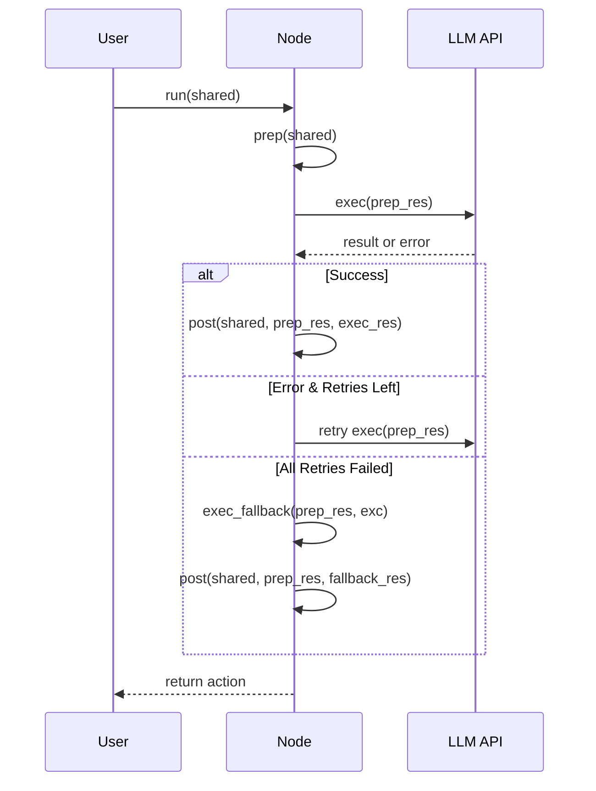

# Chapter 1: Node

Welcome to PocketFlow! In this chapter, we'll explore the most fundamental building block of the entire framework: the **Node**. By the end of this chapter, you'll understand what a Node is, how it works, and how to create your own.

## What is a Node and Why Do We Need It?

Imagine you're building a robot assistant that helps you summarize text documents. This robot needs to:
1. Read the document
2. Process and understand the content
3. Write a summary and decide what to do next

This workflow represents exactly what a **Node** does in PocketFlow. A Node is like a single-purpose worker that performs one specific task in your workflow.

Let's use text summarization as our example throughout this chapter. We want to create a program that can take a chunk of text and generate a concise summary of it.

## Understanding the Node Lifecycle

Every Node in PocketFlow follows a simple 3-step lifecycle:


1. **prep**: Read and prepare data
2. **exec**: Process the data (do the actual work)
3. **post**: Save results and decide what happens next

Think of it like baking a cake:
- **prep**: Gather all ingredients from the kitchen (read data)
- **exec**: Mix and bake the cake (process data)
- **post**: Put the cake on the table and decide if you'll make another dish (write data and determine next action)

## Creating Your First Node

Let's create a simple text summarization Node. We'll build it step-by-step:

### Step 1: Define Your Node Class

```python
from pocketflow import Node

class SummarizeText(Node):
    """A Node that summarizes text in 10 words or less."""
    # We'll fill this in next
```

This creates a new Node class called `SummarizeText` that inherits from the base `Node` class in PocketFlow.

### Step 2: Implement the `prep` Method

```python
def prep(self, shared):
    """Prepare by getting the text from shared storage."""
    text = shared.get("data", "")
    return text
```

The `prep` method reads data from the `shared` storage (a dictionary-like object that stores data across your workflow). It returns the text that needs to be summarized.

### Step 3: Implement the `exec` Method

```python
def exec(self, prep_res):
    """Summarize the text using an LLM."""
    if not prep_res:
        return "No text provided."
    
    # This is where you'd call your LLM API
    summary = call_llm(f"Summarize this in 10 words: {prep_res}")
    return summary
```

The `exec` method takes the result from `prep` and performs the actual work - in this case, calling an LLM (Large Language Model) to summarize the text. It returns the summary.

### Step 4: Implement the `post` Method

```python
def post(self, shared, prep_res, exec_res):
    """Save the summary to shared storage."""
    shared["summary"] = exec_res
    # No return means it defaults to "default" action
```

The `post` method takes the result from `exec` and saves it back to the `shared` storage. It can also return an action name (a string) to determine what happens next in your workflow.

## Handling Errors Gracefully

What if your LLM API fails? PocketFlow Nodes have built-in retry and fallback mechanisms:

```python
def exec_fallback(self, prep_res, exc):
    """Provide a fallback response if summarization fails."""
    return "Sorry, I couldn't summarize that text."
```

This method is called if `exec` fails after all retry attempts. It provides a graceful fallback instead of crashing your application.

## Using Your Node

Once you've built your Node, you can use it like this:

```python
# Create the Node with retry settings
summarize_node = SummarizeText(max_retries=3, wait=2)

# Initialize shared storage with input data
shared = {"data": "PocketFlow is a minimalist LLM framework..."}

# Run the Node
summarize_node.run(shared)

# Get the result
print(shared["summary"])  # Outputs the summary
```

This creates a Node that will retry up to 3 times if it fails, with a 2-second wait between attempts.

## How Does a Node Work Internally?

When you call `run()` on a Node, here's what happens behind the scenes:



1. When you call `run()`, the Node first calls `prep()` to read data
2. Then it calls `exec()` to process that data
3. If `exec()` succeeds, it calls `post()` with the results
4. If `exec()` fails, it retries until success or until retries are exhausted
5. If all retries fail, it calls `exec_fallback()` and then `post()`
6. Finally, it returns the action string (or "default" if none is specified)

## Complete Example

Let's put it all together in a complete, working example:

```python
from pocketflow import Node
from utils import call_llm  # Simplified for this example

class SummarizeText(Node):
    def prep(self, shared):
        return shared.get("data", "")
    
    def exec(self, prep_res):
        if not prep_res:
            return "No text provided."
        return call_llm(f"Summarize this in 10 words: {prep_res}")
    
    def exec_fallback(self, prep_res, exc):
        return "Failed to summarize: " + str(exc)
    
    def post(self, shared, prep_res, exec_res):
        shared["summary"] = exec_res
```

## Why This Design Matters

The 3-step lifecycle (prep → exec → post) has several key benefits:

1. **Separation of Concerns**: Each method has a clear, specific responsibility
2. **Retry Safety**: Only the `exec` method is retried, which avoids side effects
3. **Fault Tolerance**: The fallback mechanism allows graceful error handling
4. **Composability**: Nodes can be connected together to form complex workflows

This design makes it easier to build reliable, maintainable systems, especially when working with unpredictable components like LLMs.

## Conclusion

In this chapter, we've learned that:

- A **Node** is the fundamental building block in PocketFlow
- Each Node follows a 3-step lifecycle: **prep**, **exec**, and **post**
- Nodes provide built-in retry and fallback mechanisms for reliability
- A Node reads from and writes to a shared storage to communicate with other components

Now that you understand Nodes, you're ready to learn how to connect them together to build more complex workflows in the next chapter: [Flow](02_flow_.md).

