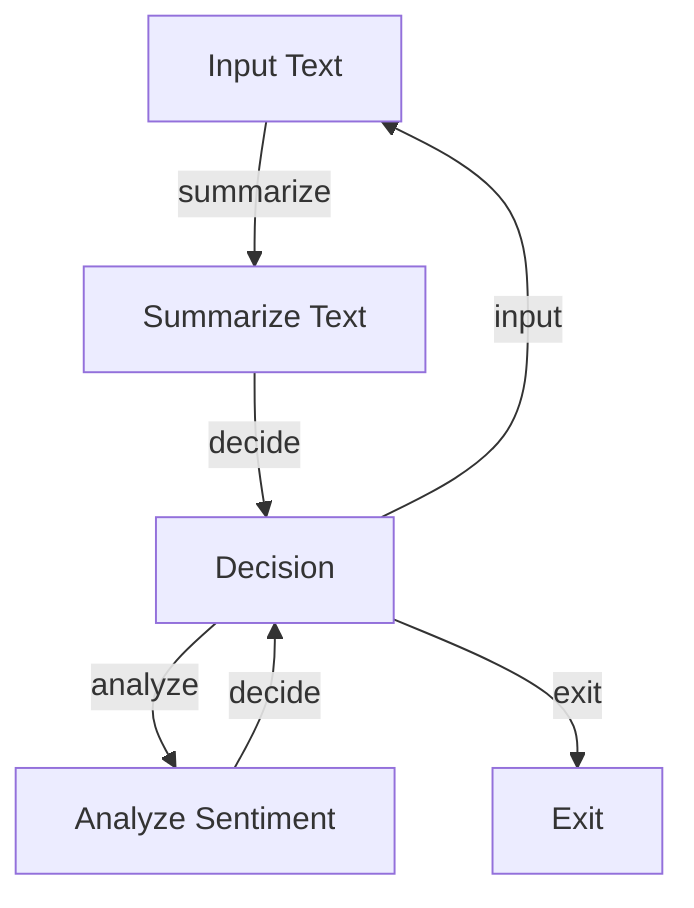
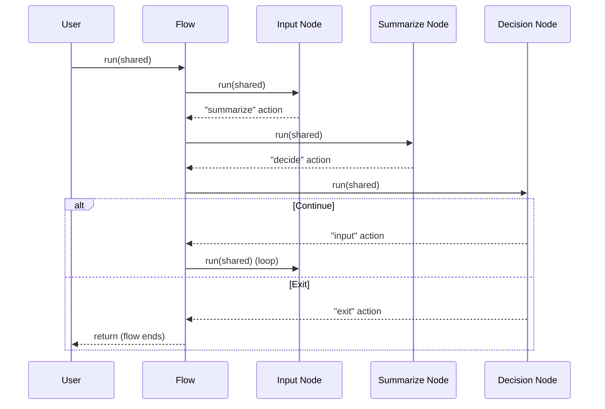

# Chapter 2: Flow

In [Chapter 1: Node](01_node_.md), we learned about the fundamental building block of PocketFlow - the Node. While Nodes are powerful on their own, their true potential is unlocked when we connect them together. This is where **Flow** comes in!

## What is a Flow and Why Do We Need It?

Imagine you're giving instructions to a friend for baking a cake. You wouldn't just hand them a list of random tasks - you'd organize those tasks in a specific order, with decision points along the way:

1. Mix the ingredients
2. If the batter is too thick, add more milk
3. Pour into a pan and bake
4. If a toothpick comes out clean, it's done; otherwise, bake longer

This organized sequence with decision points is exactly what a **Flow** represents in PocketFlow. A Flow connects multiple Nodes in a directed graph, creating paths between them based on the actions each Node returns.

Let's continue with our text summarization example from Chapter 1, but now we'll expand it into a complete workflow that:
1. Takes user input
2. Summarizes the text
3. Asks if the user wants to summarize another text or exit

## Understanding Action-Based Transitions

The key to Flow is understanding how Nodes connect to each other through **actions**. Remember how a Node's `post()` method can return an action string? This action determines which Node to execute next.

Here's how transitions work:

```python
# Basic transition: if node_a returns "default", go to node_b
node_a >> node_b

# Named action transition: if node_a returns "summarize", go to node_c
node_a - "summarize" >> node_c
```

This simple syntax allows us to create powerful workflows with branches and loops.

## Creating Your First Flow

Let's build a simple text summarization workflow with three Nodes:

1. `InputNode`: Collects text from the user
2. `SummarizeNode`: Summarizes the text (from Chapter 1)
3. `DecisionNode`: Asks if the user wants to continue or exit

### Step 1: Define Your Nodes

First, let's create our input node:

```python
from pocketflow import Node, Flow

class InputNode(Node):
    def exec(self, prep_res):
        text = input("Enter text to summarize: ")
        return text
    
    def post(self, shared, prep_res, exec_res):
        shared["text"] = exec_res
        return "summarize"
```

This node asks the user for text, stores it in the shared data, and returns the "summarize" action.

Next, we'll reuse our `SummarizeText` Node from Chapter 1:

```python
class SummarizeText(Node):
    def prep(self, shared):
        return shared.get("text", "")
    
    def exec(self, prep_res):
        # Simplified summarization for this example
        return f"Summary: {prep_res[:50]}..."
    
    def post(self, shared, prep_res, exec_res):
        shared["summary"] = exec_res
        print(exec_res)
        return "decide"
```

Finally, let's create our decision node:

```python
class DecisionNode(Node):
    def exec(self, prep_res):
        choice = input("Summarize another text? (y/n): ")
        return choice.lower() == 'y'
    
    def post(self, shared, prep_res, exec_res):
        return "input" if exec_res else "exit"
```

This node asks if the user wants to continue, and returns either "input" (to loop back) or "exit".

### Step 2: Connect the Nodes

Now, let's connect our nodes into a Flow:

```python
# Create instances of our nodes
input_node = InputNode()
summarize_node = SummarizeText()
decision_node = DecisionNode()

# Define the transitions
input_node - "summarize" >> summarize_node
summarize_node - "decide" >> decision_node
decision_node - "input" >> input_node

# Create the Flow with input_node as the starting point
flow = Flow(start=input_node)
```

This creates a workflow where the nodes are connected based on their returned actions.

### Step 3: Run the Flow

To run our flow, we simply call the `run()` method with a shared data object:

```python
shared = {}  # Initialize empty shared storage
flow.run(shared)  # Start the flow
```

When we run this, the flow will:
1. Start at `input_node` to get text from the user
2. Follow the "summarize" action to `summarize_node`
3. Follow the "decide" action to `decision_node`
4. Either loop back to `input_node` or end the flow based on user choice

## Branching and Looping

One of the most powerful features of Flow is the ability to create complex paths through your Nodes. Let's look at a slightly more complex example:



This flow adds an option to analyze the sentiment of the text instead of just summarizing it.

Here's how you would define such a flow:

```python
input_node - "summarize" >> summarize_node
summarize_node - "decide" >> decision_node
decision_node - "input" >> input_node
decision_node - "analyze" >> analyze_node
analyze_node - "decide" >> decision_node
```

In this setup, the `decision_node` could return three different actions: "input", "analyze", or "exit".

## Nested Flows

For more complex applications, you can even nest Flows within each other. A Flow itself can be treated as a Node within another Flow.

For example, you could create a text processing flow:

```python
# Create a text processing sub-flow
input_node >> summarize_node >> output_node
text_flow = Flow(start=input_node)

# Use it within a larger application flow
login_node >> text_flow >> logout_node
app_flow = Flow(start=login_node)
```

This allows you to build modular, reusable components for your application.

## How Does a Flow Work Internally?

When you run a Flow, it follows this process:



1. The Flow starts with its designated start node
2. When a node completes, it returns an action
3. The Flow looks up which node is connected to that action
4. If a matching connection exists, the Flow runs the next node
5. If no matching connection exists, the Flow ends
6. This process continues until there's no next node to run

The key class in the PocketFlow implementation is the `Flow` class, which maintains a directed graph of nodes and their connections:

```python
class Flow(Node):
    def __init__(self, start=None):
        super().__init__()
        self.start = start
        self.graph = {}  # Stores node connections
        
    def run(self, shared):
        current = self.start
        while current:
            # Run the current node
            action = current.run(shared)
            # Find the next node based on the action
            current = self.graph.get((current, action))
```

This simplified implementation shows how a Flow executes nodes one after another based on the returned actions. The actual code includes more features like error handling and nested flow support.

## Example: A Complete Text Processing Flow

Let's put everything together in a complete text processing example:

```python
# Define our nodes
input_node = InputNode()
summarize_node = SummarizeText()
decision_node = DecisionNode()

# Connect the nodes
input_node - "summarize" >> summarize_node
summarize_node - "decide" >> decision_node
decision_node - "input" >> input_node

# Create and run the flow
flow = Flow(start=input_node)
flow.run({})
```

When you run this flow, you'll get an interactive text summarization tool that:
1. Asks for text input
2. Summarizes the text
3. Asks if you want to continue
4. Either loops back for more text or exits

## Conclusion

In this chapter, we've learned that:

- A **Flow** connects multiple Nodes into a directed graph
- Nodes are connected based on the **actions** they return
- Flows can include branching, looping, and even nested sub-flows
- This structure allows you to build complex, interactive workflows

The Flow abstraction makes it easy to visualize and design your application's logic as a series of steps with decision points, similar to a flowchart. This declarative approach helps you focus on what each step does, rather than how they're connected.

Now that you understand how to create workflows with multiple nodes, we'll explore how these nodes can communicate and share data in the next chapter: [Communication (Shared Store)](03_communication__shared_store__.md).

