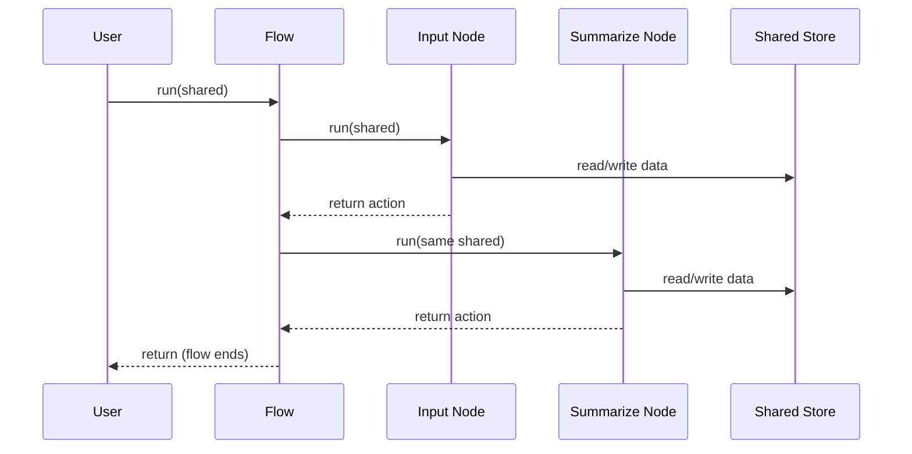

# Chapter 3: Communication (Shared Store)

In [Chapter 2: Flow](02_flow_.md), we learned how to connect Nodes together to create workflows. But how do these Nodes actually share data with each other? That's where the **Shared Store** comes in!

## What is a Shared Store and Why Do We Need It?

Imagine a team of people working together on a project. They need a way to share information - maybe a whiteboard in the office where anyone can write notes, read what others have written, and update information as needed. In PocketFlow, the **Shared Store** serves exactly this purpose - it's a common space where all Nodes can share data.

Without the Shared Store, our Nodes would be isolated workers with no way to communicate. The input Node might collect some text, but how would the summarization Node know what text to summarize? How would our application remember the summary to display it later?

Let's continue with our text summarization example to understand how the Shared Store helps solve these problems.

## Understanding the Shared Store

The Shared Store in PocketFlow is simply a Python dictionary that gets passed from one Node to another as your Flow runs. Each Node can:

1. **Read data** from the store in its `prep()` method
2. **Write data** to the store in its `post()` method

Here's what the Shared Store looks like conceptually:

```mermaid
flowchart LR
    A[Input Node] -->|writes "text"| S[(Shared Store)]
    S -->|reads "text"| B[Summarize Node]
    B -->|writes "summary"| S
    S -->|reads "summary"| C[Output Node]
```

The Shared Store acts as a central hub for all your Nodes to exchange information.

## Creating and Using a Shared Store

### Step 1: Initialize the Shared Store

The Shared Store is just a dictionary. You initialize it before running your Flow:

```python
# Create an empty shared store
shared = {}

# Or pre-populate it with initial values
shared = {
    "config": {"max_length": 100},
    "results": []
}
```

This dictionary will be passed to each Node in your Flow, allowing them to read and write data.

### Step 2: Reading from the Shared Store

Nodes typically read from the Shared Store in their `prep()` method:

```python
def prep(self, shared):
    # Read the text from the shared store
    text = shared.get("text", "")  # get with default value if key doesn't exist
    return text
```

This code gets the "text" value from the shared store, or returns an empty string if the key doesn't exist.

### Step 3: Writing to the Shared Store

Nodes typically write to the Shared Store in their `post()` method:

```python
def post(self, shared, prep_res, exec_res):
    # Write the summary to the shared store
    shared["summary"] = exec_res
    return "default"
```

This code saves the result of the `exec()` method (the summary) to the shared store with the key "summary".

## A Complete Example

Let's see how all three of our nodes from [Chapter 2: Flow](02_flow_.md) use the Shared Store:

```python
class InputNode(Node):
    def exec(self, prep_res):
        text = input("Enter text to summarize: ")
        return text
    
    def post(self, shared, prep_res, exec_res):
        # Save the user's input to the shared store
        shared["text"] = exec_res
        return "summarize"
```

This Node asks the user for input and saves it to the shared store with the key "text".

```python
class SummarizeNode(Node):
    def prep(self, shared):
        # Get the text from the shared store
        return shared.get("text", "")
    
    def exec(self, prep_res):
        # Create a simple summary (in real apps, you'd use an LLM)
        summary = f"Summary: {prep_res[:50]}..."
        return summary
    
    def post(self, shared, prep_res, exec_res):
        # Save the summary to the shared store
        shared["summary"] = exec_res
        print(exec_res)
        return "decide"
```

This Node reads the text from the shared store, summarizes it, and saves the summary back to the shared store.

```python
class DecisionNode(Node):
    def exec(self, prep_res):
        # We could use the shared store here too if needed
        choice = input("Summarize another text? (y/n): ")
        return choice.lower() == 'y'
    
    def post(self, shared, prep_res, exec_res):
        # We could update the shared store here if needed
        return "input" if exec_res else "exit"
```

This Node doesn't need to use the shared store in this example, but it could if needed.

## Best Practices for Shared Store

### 1. Organize Your Data

For larger applications, it's a good idea to organize your shared store with nested dictionaries:

```python
shared = {
    "input": {
        "text": "Original text here",
        "language": "English"
    },
    "output": {
        "summary": "Summary here",
        "translation": "Translation here"
    },
    "config": {
        "max_length": 100
    }
}
```

This organization makes it easier to manage your data as your application grows.

### 2. Use Default Values

When reading from the shared store, always provide default values to handle cases where the key doesn't exist:

```python
# Good: Provides a default value
text = shared.get("text", "")

# Risky: Will raise a KeyError if "text" doesn't exist
text = shared["text"]  # Not recommended!
```

This makes your code more robust and prevents crashes.

### 3. Document Your Shared Store Structure

For team projects, document the structure of your shared store so everyone knows what keys to use:

```python
# Shared Store Documentation
# - text: The original text to summarize (str)
# - summary: The generated summary (str)
# - count: Number of texts processed (int)
```

This helps prevent naming conflicts and confusion.

## Tracking Statistics Across Multiple Runs

The shared store can also maintain state across multiple runs of a Node. This is useful for tracking statistics or accumulating results:

```python
class StatisticsNode(Node):
    def prep(self, shared):
        # Initialize statistics if they don't exist
        if "stats" not in shared:
            shared["stats"] = {
                "count": 0,
                "total_words": 0
            }
        return shared.get("text", "")
    
    def exec(self, prep_res):
        # Count words in the text
        word_count = len(prep_res.split())
        return word_count
    
    def post(self, shared, prep_res, exec_res):
        # Update statistics
        shared["stats"]["count"] += 1
        shared["stats"]["total_words"] += exec_res
        shared["stats"]["avg_words"] = shared["stats"]["total_words"] / shared["stats"]["count"]
        return "default"
```

This Node keeps track of how many texts have been processed and the average word count across all texts.

## How Does the Shared Store Work Internally?

When you run a Flow, the shared store is passed from Node to Node:



1. You create a shared dictionary and pass it to the Flow's `run()` method
2. The Flow passes this same dictionary to each Node's `run()` method
3. Each Node can read from and write to this dictionary
4. The changes to the dictionary persist as it's passed from Node to Node
5. When the Flow ends, the dictionary contains all the data collected and generated

In the PocketFlow implementation, this is handled by passing the same dictionary reference to each Node:

```python
class Flow(Node):
    def run(self, shared):
        current = self.start
        while current:
            # Pass the same shared dictionary to each Node
            action = current.run(shared)
            current = self.graph.get((current, action))
        return "default"
```

Since dictionaries in Python are mutable and passed by reference, any changes made by one Node are visible to all subsequent Nodes.

## Example: Word Counter with Statistics

Let's create a practical example that demonstrates the power of the Shared Store - a word counter that keeps track of statistics across multiple inputs:

```python
from pocketflow import Node, Flow

class TextInputNode(Node):
    def exec(self, prep_res):
        text = input("Enter some text (or 'q' to quit): ")
        return text
    
    def post(self, shared, prep_res, exec_res):
        if exec_res.lower() == 'q':
            return "exit"
        
        shared["text"] = exec_res
        
        # Initialize stats if first run
        if "stats" not in shared:
            shared["stats"] = {"count": 0, "total_words": 0}
            
        return "count"
```

This Node gets text from the user and initializes statistics if they don't exist yet.

```python
class WordCounterNode(Node):
    def prep(self, shared):
        return shared["text"]
    
    def exec(self, prep_res):
        words = prep_res.split()
        return len(words)
    
    def post(self, shared, prep_res, exec_res):
        # Update statistics
        shared["stats"]["count"] += 1
        shared["stats"]["total_words"] += exec_res
        shared["stats"]["avg_words"] = shared["stats"]["total_words"] / shared["stats"]["count"]
        shared["current_count"] = exec_res
        return "show"
```

This Node counts words in the text and updates the statistics.

```python
class ShowStatsNode(Node):
    def prep(self, shared):
        return {
            "current": shared["current_count"],
            "stats": shared["stats"]
        }
    
    def exec(self, prep_res):
        print(f"Words in this text: {prep_res['current']}")
        print(f"Total texts processed: {prep_res['stats']['count']}")
        print(f"Average words per text: {prep_res['stats']['avg_words']:.1f}")
        return None
    
    def post(self, shared, prep_res, exec_res):
        return "input"
```

This Node displays the current word count and overall statistics.

```python
# Connect the nodes
input_node = TextInputNode()
counter_node = WordCounterNode()
stats_node = ShowStatsNode()

input_node - "count" >> counter_node
counter_node - "show" >> stats_node
stats_node - "input" >> input_node

# Create and run the flow
flow = Flow(start=input_node)
flow.run({})  # Start with an empty shared store
```

When you run this flow, you can enter multiple texts and see statistics that persist across runs:

```
Enter some text (or 'q' to quit): Hello world
Words in this text: 2
Total texts processed: 1
Average words per text: 2.0

Enter some text (or 'q' to quit): The quick brown fox
Words in this text: 4
Total texts processed: 2
Average words per text: 3.0

Enter some text (or 'q' to quit): q
```

## Conclusion

In this chapter, we've learned that:

- The **Shared Store** is a central dictionary-like structure that enables communication between Nodes
- Nodes can read from the Shared Store in their `prep()` method and write to it in their `post()` method
- The Shared Store persists throughout the entire Flow execution, allowing data to be passed between Nodes
- The Shared Store can maintain state across multiple runs, making it useful for tracking statistics
- Organizing your Shared Store with nested dictionaries can help manage complex data structures

The Shared Store is a simple but powerful concept that forms the backbone of communication in PocketFlow. By providing a central place for data sharing, it allows Nodes to work together to solve complex problems.

Now that you understand how Nodes communicate with each other, let's explore how to process multiple items efficiently in the next chapter: [Batch Processing](04_batch_processing_.md).

