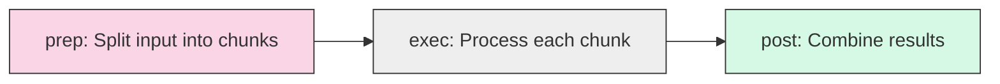
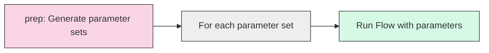
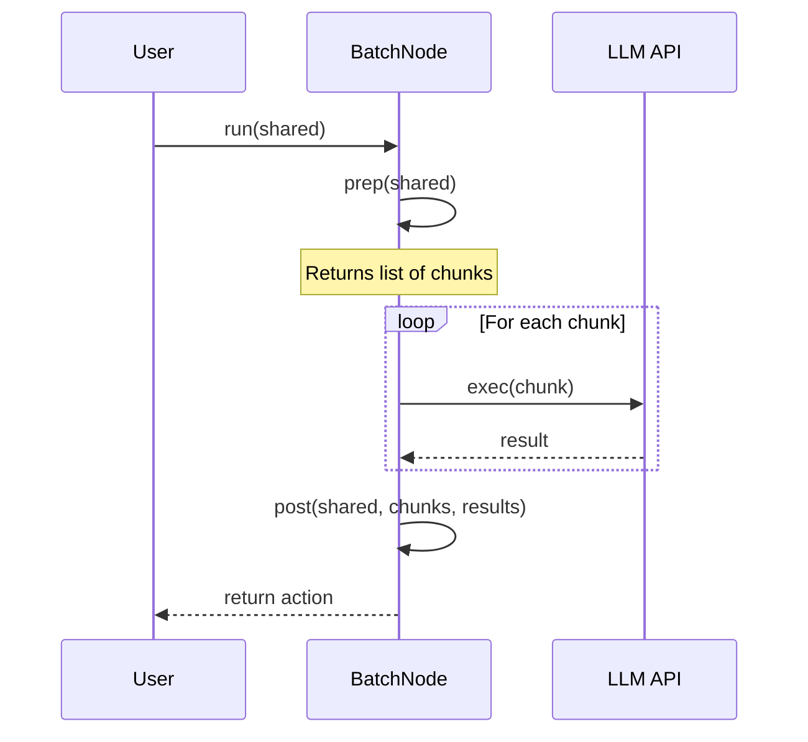
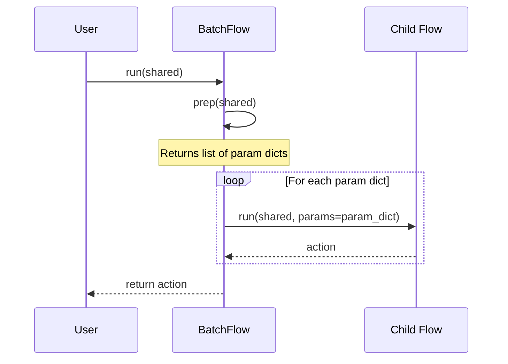

# Chapter 4: Batch Processing

In [Chapter 3: Communication (Shared Store)](03_communication__shared_store__.md), we learned how Nodes can share data with each other. Now, let's tackle a common challenge: how do we handle really large inputs or run the same workflow multiple times with different settings?

## What is Batch Processing and Why Do We Need It?

Imagine you have a giant book that needs to be summarized. Instead of trying to summarize the entire book at once (which would be overwhelming), you might split it into chapters and summarize each chapter separately. Then, you'd combine all those chapter summaries into a final book summary.

This is exactly what **Batch Processing** does in PocketFlow. It helps us handle large inputs by breaking them into manageable chunks, or run the same process multiple times with different inputs.

PocketFlow offers two ways to do batch processing:

1. **BatchNode**: Splits a large input into chunks, processes each chunk, and combines the results
2. **BatchFlow**: Runs the same Flow multiple times with different parameters

Let's explore both approaches using practical examples.

## BatchNode: Processing Large Inputs in Chunks

### Understanding BatchNode

A **BatchNode** is a special type of Node that follows a modified lifecycle:



The key difference from a regular Node is:

1. `prep()`: Returns a list (or any iterable) of chunks
2. `exec()`: Gets called once for each chunk
3. `post()`: Receives a list of all results from all the `exec()` calls

### Example: Summarizing a Large Document

Let's say we want to summarize a large document that's too big for our LLM to process at once. We can use a BatchNode to split it into paragraphs, summarize each paragraph, and then combine the results:

```python
from pocketflow import BatchNode

class ChunkSummarizer(BatchNode):
    def prep(self, shared):
        # Split the document into paragraphs
        document = shared.get("document", "")
        paragraphs = document.split("\n\n")
        return paragraphs
```

In the `prep` method, we get the document from the shared store and split it into paragraphs. We return the list of paragraphs, which will be processed one by one.

```python
    def exec(self, paragraph):
        # Summarize a single paragraph
        if not paragraph.strip():
            return ""
        
        # Call an LLM to summarize the paragraph
        summary = call_llm(f"Summarize this paragraph: {paragraph}")
        return summary
```

The `exec` method is called once for each paragraph. It takes a single paragraph as input and returns its summary.

```python
    def post(self, shared, prep_res, exec_res_list):
        # Combine all paragraph summaries
        full_summary = "\n".join(exec_res_list)
        shared["summary"] = full_summary
        return "default"
```

The `post` method receives a list of all summaries (one for each paragraph) and combines them into a full document summary.

### Using Our BatchNode

```python
# Create the node
chunk_summarizer = ChunkSummarizer()

# Create shared storage with a document
shared = {
    "document": "This is paragraph 1...\n\nThis is paragraph 2...\n\nThis is paragraph 3..."
}

# Run the node
chunk_summarizer.run(shared)

# Get the result
print(shared["summary"])
```

When we run this node, it:
1. Splits the document into paragraphs
2. Summarizes each paragraph individually
3. Combines all summaries into a full document summary

## BatchFlow: Running a Flow Multiple Times

While BatchNode processes chunks of a single input, **BatchFlow** runs an entire Flow multiple times with different parameters.

### Understanding BatchFlow

A BatchFlow works like this:



The key points about BatchFlow:

1. It's a special type of Flow that runs another Flow multiple times
2. Its `prep()` method returns a list of parameter dictionaries
3. Each parameter dictionary is passed to a separate run of the child Flow
4. Child Nodes access these parameters via `self.params`, not from the shared store

### Example: Translating a Document to Multiple Languages

Let's create a BatchFlow that translates a document to multiple languages:

```python
from pocketflow import BatchFlow, Node, Flow

class TranslateToLanguages(BatchFlow):
    def prep(self, shared):
        # List of languages to translate to
        languages = ["Spanish", "French", "German", "Japanese"]
        return [{"language": lang} for lang in languages]
```

The `prep` method returns a list of parameter dictionaries, one for each language. Each dictionary has a "language" key with the language name.

Now, let's create the Nodes for our translation Flow:

```python
class TranslateNode(Node):
    def prep(self, shared):
        # Get the document and target language
        document = shared.get("document", "")
        language = self.params["language"]  # Access from params, not shared!
        return {"text": document, "language": language}
```

Notice that the Node accesses the language from `self.params`, not from the shared store. This is a key difference between BatchFlow and BatchNode.

```python
    def exec(self, prep_res):
        text = prep_res["text"]
        language = prep_res["language"]
        
        # Call an LLM to translate the text
        translation = call_llm(f"Translate to {language}: {text}")
        return {"language": language, "translation": translation}
```

The `exec` method translates the document to the specified language.

```python
    def post(self, shared, prep_res, exec_res):
        # Store the translation in shared storage
        language = exec_res["language"]
        translation = exec_res["translation"]
        
        if "translations" not in shared:
            shared["translations"] = {}
        
        shared["translations"][language] = translation
        return "default"
```

The `post` method stores the translation in a dictionary in the shared store.

### Using Our BatchFlow

```python
# Create the translation node and flow
translate_node = TranslateNode()
translation_flow = Flow(start=translate_node)

# Create the batch flow that runs the translation flow for each language
batch_translator = TranslateToLanguages(start=translation_flow)

# Create shared storage with a document
shared = {
    "document": "Hello, world! This is a test document."
}

# Run the batch flow
batch_translator.run(shared)

# Get the results
for language, translation in shared["translations"].items():
    print(f"{language}: {translation}")
```

When we run this BatchFlow, it:
1. Creates parameter dictionaries for each language
2. Runs the translation flow once for each language
3. Stores all translations in the shared store

## Key Differences Between BatchNode and BatchFlow

It's important to understand when to use each approach:

| BatchNode | BatchFlow |
|-----------|-----------|
| Splits a single input into chunks | Runs a Flow multiple times with different parameters |
| Processes chunks within one Node | Processes each parameter set with an entire Flow |
| Results are combined in the `post` method | Results from each run are independent |
| Best for: Large inputs that need to be processed in pieces | Best for: Processing multiple similar items with the same workflow |

## How Does Batch Processing Work Internally?

Let's look at how BatchNode works behind the scenes:



1. The `prep` method returns a list of chunks
2. The `exec` method is called once for each chunk
3. All results are collected into a list
4. The `post` method receives this list of results

And here's how BatchFlow works:



1. The `prep` method returns a list of parameter dictionaries
2. For each dictionary, the child Flow is run with those parameters
3. The child Flow's Nodes access parameters via `self.params`

## Practical Example: Batch Translation

Let's look at a real-world example of using a BatchNode to translate a document to multiple languages simultaneously:

```python
class TranslateTextNode(BatchNode):
    def prep(self, shared):
        text = shared.get("text", "")
        languages = ["Spanish", "French", "German", "Japanese"]
        
        # Create batches for each language translation
        return [(text, lang) for lang in languages]
```

This `prep` method creates tuples of (text, language) for each language we want to translate to.

```python
    def exec(self, data_tuple):
        text, language = data_tuple
        
        prompt = f"Translate to {language}: {text}"
        translation = call_llm(prompt)
        
        return {"language": language, "translation": translation}
```

The `exec` method processes each tuple, translating the text to the specified language.

```python
    def post(self, shared, prep_res, exec_res_list):
        # Store all translations in shared storage
        shared["translations"] = {}
        
        for result in exec_res_list:
            language = result["language"]
            translation = result["translation"]
            shared["translations"][language] = translation
            
        return "default"
```

The `post` method collects all translations and stores them in the shared storage.

## Conclusion

In this chapter, we've learned that:

- **Batch Processing** helps us handle large inputs or run the same process multiple times
- **BatchNode** splits a large input into chunks, processes each chunk, and combines the results
- **BatchFlow** runs a Flow multiple times with different parameter sets
- The key difference is that BatchNode works within a single Node, while BatchFlow runs an entire Flow multiple times

Batch Processing is especially useful when working with LLMs, as it helps us handle inputs that are too large for a single processing step or when we need to apply the same workflow to multiple items.

Now that you understand how to process multiple items efficiently, let's explore how to handle operations that take a long time to complete in the next chapter: [Async Processing](05_async_processing_.md).

