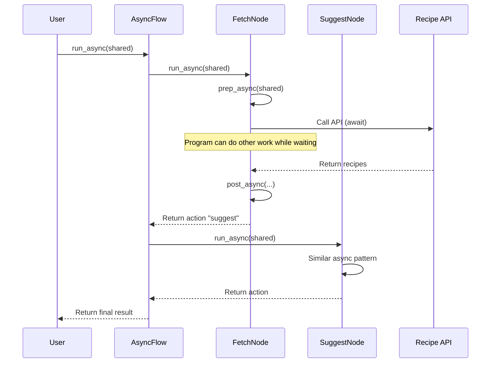

# Chapter 5: Async Processing

In [Chapter 4: Batch Processing](04_batch_processing_.md), we learned how to handle multiple items efficiently. But what happens when our operations take a long time to complete? This is where **Async Processing** comes in!

## What is Async Processing and Why Do We Need It?

Imagine you're a chef making dinner. When you put water on the stove to boil, do you just stand there watching it? Of course not! You use that time to chop vegetables or prepare the sauce. You're being *asynchronous* - starting one task and moving on to others while waiting for the first to complete.

This is exactly what **Async Processing** does in PocketFlow. Instead of waiting idle while something slow happens (like an API call or database query), your program can do other useful work in the meantime.

Without async processing, your workflow would be like a chef who refuses to do anything else until the water boils - inefficient and wasteful!

## When to Use Async Processing

Async processing is perfect for:

1. **API calls**: Waiting for external services to respond
2. **File operations**: Reading or writing large files
3. **Database queries**: Waiting for database results
4. **User input**: Waiting for users to respond
5. **LLM calls**: Large Language Model calls that can take seconds to complete

In PocketFlow, we have two special classes to handle async operations:

- **AsyncNode**: A special Node that can perform operations asynchronously
- **AsyncFlow**: A special Flow that can run AsyncNodes

Let's see how to use them!

## Understanding AsyncNode

An **AsyncNode** is similar to a regular Node, but its methods are asynchronous (using `async` and `await`). The lifecycle is:


Let's create a simple AsyncNode that fetches recipe data from an API:

```python
from pocketflow import AsyncNode

class FetchRecipes(AsyncNode):
    async def prep_async(self, shared):
        ingredient = shared.get("ingredient", "chicken")
        return ingredient
```

The `prep_async` method is similar to a regular `prep` method, but with the `async` keyword. It gets the ingredient from shared storage.

```python
    async def exec_async(self, ingredient):
        # Simulate API call with a delay
        await asyncio.sleep(2)  # This would be a real API call
        recipes = [f"{ingredient} pasta", f"grilled {ingredient}", 
                  f"{ingredient} soup"]
        return recipes
```

The `exec_async` method simulates an API call to get recipes. The `await` keyword lets other operations happen during the 2-second delay.

```python
    async def post_async(self, shared, prep_res, exec_res):
        shared["recipes"] = exec_res
        return "suggest"
```

The `post_async` method saves the recipes to the shared store and returns an action.

## Understanding AsyncFlow

An **AsyncFlow** is used to run AsyncNodes. It's similar to a regular Flow, but it uses `run_async` instead of `run`:

```python
from pocketflow import AsyncFlow

# Create nodes
fetch_node = FetchRecipes()
suggest_node = SuggestRecipe()  # We'll define this next

# Connect nodes
fetch_node - "suggest" >> suggest_node

# Create flow
recipe_flow = AsyncFlow(start=fetch_node)
```

This creates an AsyncFlow that fetches recipes and then suggests the best one.

## A Complete Example: Recipe Recommender

Let's build a complete recipe recommender that:

1. Fetches recipes from an API (async operation)
2. Uses an LLM to suggest the best recipe (async operation)
3. Gets user approval (async operation)

### Step 1: Create the Suggestion Node

```python
class SuggestRecipe(AsyncNode):
    async def exec_async(self, recipes):
        # Simulate LLM call with a delay
        await asyncio.sleep(1.5)  # This would be a real LLM call
        return f"How about: {random.choice(recipes)}"
```

This node takes the list of recipes and suggests one (simulating an LLM call).

### Step 2: Create the Approval Node

```python
class GetApproval(AsyncNode):
    async def exec_async(self, suggestion):
        # Actually get user input asynchronously
        print(suggestion)
        user_input = await get_user_input("Accept this recipe? (y/n): ")
        return user_input.lower() == "y"
```

This node shows the suggestion and waits for user input. The `get_user_input` function would be an async function that gets user input without blocking.

```python
    async def post_async(self, shared, prep_res, exec_res):
        if exec_res:  # If user approved
            return "accept"
        return "retry"  # If user rejected, try another recipe
```

The `post_async` method returns "accept" if the user approved, or "retry" if they rejected.

### Step 3: Create the Flow

```python
# Create nodes
fetch_node = FetchRecipes()
suggest_node = SuggestRecipe()
approval_node = GetApproval()
final_node = FinalizeRecipe()  # A node that shows the final recipe

# Connect nodes with actions
fetch_node - "suggest" >> suggest_node
suggest_node >> approval_node
approval_node - "accept" >> final_node
approval_node - "retry" >> suggest_node  # Loop back for another suggestion

# Create flow
recipe_flow = AsyncFlow(start=fetch_node)
```

This flow creates a loop: fetch recipes → suggest one → get approval → if rejected, suggest another.

### Step 4: Run the Flow

```python
import asyncio

async def main():
    shared = {"ingredient": "chicken"}
    await recipe_flow.run_async(shared)

# Run the async function
asyncio.run(main())
```

This runs our async flow with an initial ingredient of "chicken".

## How Async Processing Works Internally

Let's understand what happens behind the scenes:



The key point is that during `await` calls, the program can do other work instead of just waiting. This is handled by Python's `asyncio` library, which manages an event loop that juggles multiple tasks.

In the PocketFlow implementation, the AsyncNode and AsyncFlow classes use the `async/await` pattern:

```python
class AsyncNode(Node):
    async def run_async(self, shared):
        # Run the async lifecycle
        prep_res = await self.prep_async(shared)
        exec_res = await self.exec_async(prep_res)
        action = await self.post_async(shared, prep_res, exec_res)
        return action
```

The `run_async` method awaits each lifecycle step, allowing other operations to happen during waiting periods.

## Practical Example: Web Scraper

Let's create a practical example - a web scraper that fetches content from multiple websites simultaneously:

```python
class WebScraper(AsyncNode):
    async def prep_async(self, shared):
        # Get list of URLs to scrape
        return shared.get("urls", [])
    
    async def exec_async(self, urls):
        # Create tasks for all URLs
        tasks = [self.fetch_url(url) for url in urls]
        # Run all tasks concurrently
        results = await asyncio.gather(*tasks)
        return dict(zip(urls, results))
```

This creates separate tasks for each URL and runs them all concurrently with `asyncio.gather()`.

```python
    async def fetch_url(self, url):
        # Simulate fetching a URL
        await asyncio.sleep(random.uniform(0.5, 2))
        return f"Content from {url}"
    
    async def post_async(self, shared, prep_res, exec_res):
        shared["content"] = exec_res
        return "analyze"
```

The important part is that all URLs are fetched concurrently - if you have 10 URLs that each take 2 seconds, the total time is still around 2 seconds, not 20 seconds!

## When to Choose Async vs. Batch vs. Regular Nodes

Here's a simple guide:

- **Regular Node**: Use for quick operations where waiting is not an issue
- **BatchNode**: Use for processing multiple similar items (like chunks of a document)
- **AsyncNode**: Use for operations with waiting periods (API calls, file I/O, user input)

You can even combine them! For example, a BatchNode that processes chunks asynchronously.

## Best Practices for Async Processing

1. **Don't overuse async**: Only use async for operations that actually wait for external resources
2. **Handle errors properly**: Async operations can fail - always have proper error handling
3. **Avoid blocking operations**: In async code, never use operations that block the event loop
4. **Test thoroughly**: Async code can be trickier to debug - test different scenarios

## Conclusion

In this chapter, we've learned that:

- **Async Processing** allows your program to do other work while waiting for slow operations
- **AsyncNode** provides async versions of the Node lifecycle methods (`prep_async`, `exec_async`, `post_async`)
- **AsyncFlow** connects AsyncNodes together and runs them asynchronously
- Async is perfect for API calls, file operations, user input, and other I/O-bound tasks

By using async processing, you can make your PocketFlow applications much more efficient, especially when dealing with external services or user interactions.

Now that you understand how to handle operations that involve waiting, let's explore how to run multiple operations at the same time in the next chapter: [Parallel Processing](06_parallel_processing_.md).

