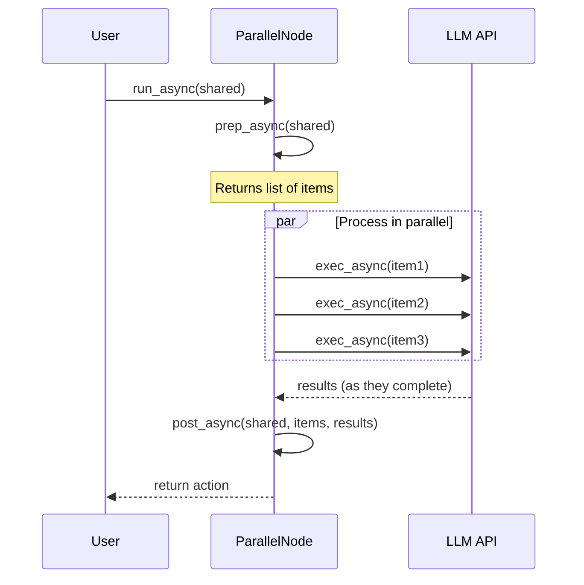

# Chapter 6: Parallel Processing

In [Chapter 5: Async Processing](05_async_processing_.md), we learned how to handle operations that take time without blocking our program. Now, let's take it a step further and explore how we can run multiple operations simultaneously using **Parallel Processing**.

## What is Parallel Processing and Why Do We Need It?

Imagine you're making breakfast for your family. You need to prepare toast, coffee, and eggs. If you make each item one at a time (toast → coffee → eggs), breakfast will take a long time. Instead, you might start the toast in the toaster, begin brewing coffee, and cook the eggs all at the same time - that's parallel processing!

In programming, **Parallel Processing** lets us run multiple operations concurrently rather than one after another. This can dramatically speed up our programs, especially when dealing with:

- Multiple API calls (like calling an LLM multiple times)
- Processing several files
- Handling multiple user requests
- Any task that can be split into independent parts

## Parallel vs. Async: What's the Difference?

You might be wondering, "Didn't we already learn about this in async processing?" While they're related, there's an important difference:

- **Async Processing**: Allows your program to do other work while waiting for a single operation to complete (like cooking eggs while waiting for toast)
- **Parallel Processing**: Runs multiple operations simultaneously (like having three chefs each making one breakfast item)

## Parallel Processing in PocketFlow

PocketFlow provides two main classes for parallel processing:

1. **AsyncParallelBatchNode**: Processes multiple items in parallel within a single Node
2. **AsyncParallelBatchFlow**: Runs multiple instances of a Flow in parallel with different parameters

Let's explore each one with simple examples.

### AsyncParallelBatchNode: Processing Multiple Items in Parallel

Remember the BatchNode from [Chapter 4: Batch Processing](04_batch_processing_.md)? AsyncParallelBatchNode is similar, but it processes all items in parallel:

```python
from pocketflow import AsyncParallelBatchNode, AsyncFlow

class ParallelSummarizer(AsyncParallelBatchNode):
    async def prep_async(self, shared):
        # Get list of texts to summarize
        return shared.get("texts", [])
```

The `prep_async` method returns a list of items to process in parallel. Each item will be passed to `exec_async` separately.

```python
    async def exec_async(self, text):
        # Summarize a single text
        summary = await call_llm_async(f"Summarize: {text}")
        return summary
```

The `exec_async` method processes a single item. The magic happens because PocketFlow runs this method for all items in parallel!

```python
    async def post_async(self, shared, prep_res, exec_res_list):
        # Collect all summaries
        shared["summaries"] = exec_res_list
        return "default"
```

The `post_async` method receives a list of all results and can combine or process them as needed.

### Using Our Parallel Summarizer

```python
# Create node and flow
summarizer = ParallelSummarizer()
flow = AsyncFlow(start=summarizer)

# Prepare data
shared = {
    "texts": ["Text about history...", "Text about science...", "Text about art..."]
}

# Run with asyncio
import asyncio
asyncio.run(flow.run_async(shared))

# Results will be in shared["summaries"]
```

When we run this flow, all three texts are summarized simultaneously, not one after another!

## A Real-World Example: Multi-Language Translation

Let's create a practical example - translating a document into multiple languages simultaneously:

```python
class ParallelTranslator(AsyncParallelBatchNode):
    async def prep_async(self, shared):
        text = shared.get("text", "")
        languages = ["Spanish", "French", "German", "Japanese"]
        return [(text, lang) for lang in languages]
```

This creates a list of (text, language) pairs to process in parallel.

```python
    async def exec_async(self, data_tuple):
        text, language = data_tuple
        translation = await call_llm_async(f"Translate to {language}: {text}")
        return {"language": language, "translation": translation}
```

Each translation happens in parallel - we're not waiting for the Spanish translation to finish before starting the French one.

```python
    async def post_async(self, shared, prep_res, exec_res_list):
        # Store translations by language
        shared["translations"] = {}
        for result in exec_res_list:
            lang = result["language"]
            translation = result["translation"]
            shared["translations"][lang] = translation
        return "default"
```

After all translations complete, we organize them by language in the shared store.

## Performance Benefits of Parallel Processing

Let's see the performance difference with a simple comparison:

```python
# Sequential processing time (hypothetical)
# Spanish: 2s + French: 2s + German: 2s + Japanese: 2s = 8 seconds

# Parallel processing time (hypothetical)
# All languages simultaneously = ~2 seconds (plus small overhead)
```

Parallel processing can provide a nearly linear speedup based on the number of items being processed!

## When to Use AsyncParallelBatchFlow

For more complex scenarios, we can use **AsyncParallelBatchFlow** to run entire workflows in parallel:

```python
from pocketflow import AsyncParallelBatchFlow

class ProcessMultipleDocuments(AsyncParallelBatchFlow):
    async def prep_async(self, shared):
        # Return a list of parameter dictionaries
        return [{"filename": f} for f in shared.get("files", [])]
```

This creates parameter dictionaries for each file we want to process.

```python
# Create a flow to process a single document
document_flow = AsyncFlow(start=ProcessDocument())

# Create a parallel flow to process multiple documents
parallel_flow = ProcessMultipleDocuments(start=document_flow)
```

When we run this, the entire `document_flow` runs in parallel for each file!

## How Parallel Processing Works Internally

Let's look at what happens when we run an AsyncParallelBatchNode:



The key difference from a regular AsyncBatchNode is in the implementation of `run_async`:

```python
async def run_async(self, shared):
    # Get items to process
    items = await self.prep_async(shared)
    
    # Create tasks for each item
    tasks = [self.exec_async(item) for item in items]
    
    # Run all tasks concurrently and collect results
    results = await asyncio.gather(*tasks)
    
    # Process results
    action = await self.post_async(shared, items, results)
    return action
```

The magic happens with `asyncio.gather()`, which runs all the tasks concurrently and waits for all of them to complete.

## Python's GIL and Parallel Processing

It's important to note that Python has what's called the Global Interpreter Lock (GIL), which can limit true parallelism for CPU-intensive tasks. However, for I/O-bound tasks like API calls, file operations, or database queries, parallel processing is very effective because the GIL is released during I/O operations.

Since LLM calls are I/O-bound (we're waiting for an external API to respond), parallel processing works great for them!

## Rate Limiting Considerations

One challenge with parallel processing is that you might hit rate limits when making many API calls at once. Here's a simple way to handle that:

```python
import asyncio
from asyncio import Semaphore

class RateLimitedParallelNode(AsyncParallelBatchNode):
    async def run_async(self, shared):
        items = await self.prep_async(shared)
        
        # Limit to 5 concurrent tasks
        semaphore = Semaphore(5)
        
        async def limited_exec(item):
            async with semaphore:
                return await self.exec_async(item)
        
        tasks = [limited_exec(item) for item in items]
        results = await asyncio.gather(*tasks)
        
        return await self.post_async(shared, items, results)
```

This ensures that no more than 5 API calls happen at once, preventing rate limit errors.

## Practical Example: Multi-Language Document Translation

Let's put everything together in a complete example that translates a document to multiple languages and saves each translation to a file:

```python
class DocumentTranslator(AsyncParallelBatchNode):
    async def prep_async(self, shared):
        # Get document and languages
        doc = shared.get("document", "")
        languages = shared.get("languages", ["Spanish", "French"])
        return [(doc, lang) for lang in languages]
```

This creates a batch of (document, language) pairs to process in parallel.

```python
    async def exec_async(self, data_tuple):
        doc, language = data_tuple
        print(f"Translating to {language}...")
        translation = await call_llm_async(f"Translate to {language}: {doc}")
        return {"language": language, "translation": translation}
```

Each translation happens in parallel, with a print statement to show progress.

```python
    async def post_async(self, shared, prep_res, exec_res_list):
        # Save each translation to a file
        for result in exec_res_list:
            lang = result["language"]
            translation = result["translation"]
            filename = f"translation_{lang.lower()}.txt"
            
            # Use async file writing
            async with aiofiles.open(filename, "w") as f:
                await f.write(translation)
            print(f"Saved {lang} translation to {filename}")
            
        return "default"
```

We save each translation to a separate file, also using async file I/O for maximum efficiency.

## Conclusion

In this chapter, we've learned that:

- **Parallel Processing** lets us run multiple operations simultaneously
- **AsyncParallelBatchNode** processes multiple items in parallel within a single Node
- **AsyncParallelBatchFlow** runs multiple instances of a Flow in parallel
- Parallel processing is great for I/O-bound tasks like API calls
- We need to consider rate limits when making many parallel API calls

Parallel processing is especially powerful when working with LLMs, as it lets us make multiple API calls simultaneously, significantly reducing the overall time needed for batch operations.

Now that you understand how to run operations in parallel, let's explore how to structure more complex workflows in the next chapter: [Workflow Pattern](07_workflow_pattern_.md).

