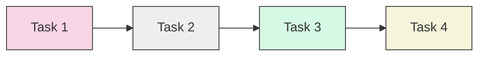
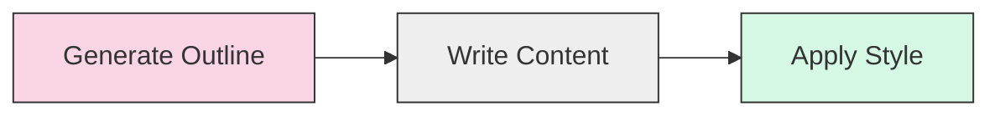
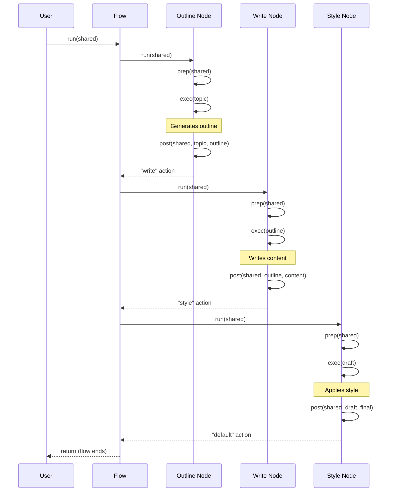

# Chapter 7: Workflow Pattern

In [Chapter 6: Parallel Processing](06_parallel_processing_.md), we explored how to run multiple operations simultaneously. Now, let's learn about a powerful design pattern that will help you tackle complex tasks by breaking them into manageable pieces: the **Workflow Pattern**.

## What is the Workflow Pattern and Why Do We Need It?

Imagine you're following a recipe to bake a cake. The recipe doesn't just say "make a cake" - it breaks down the process into clear steps: measure ingredients, mix the batter, preheat the oven, bake for a specific time, and so on.

This is exactly what the **Workflow Pattern** does in PocketFlow. It helps us break down complex tasks into a sequence of simpler ones, with each step (Node) focusing on one specific part of the overall process.

Without the Workflow Pattern, we'd have to try solving complex problems with a single Node - like trying to bake a cake in one step! This approach often fails because:

1. The task might be too complex for a single LLM call
2. The context window of the LLM might be too small for all the necessary information
3. Different parts of the task might require different approaches

## Understanding the Workflow Pattern

The Workflow Pattern is essentially about task decomposition - breaking a complex task into a sequence of simpler tasks that flow one after another:



Each task is handled by a specialized Node that:

1. Takes input from the previous Node
2. Performs its specific part of the overall task
3. Passes its output to the next Node

## A Real-World Example: Article Writing Workflow

Let's use a practical example: writing an article about AI Safety. This is a complex task that would be difficult to complete with a single LLM call. Using the Workflow Pattern, we can break it down into three main steps:

1. Generate an outline (structure of the article)
2. Write content for each section
3. Apply a conversational style to the final article



## Implementing the Workflow Pattern

Let's implement our article writing workflow step-by-step.

### Step 1: Create the Outline Generation Node

```python
class GenerateOutline(Node):
    def prep(self, shared):
        return shared["topic"]
    
    def exec(self, topic):
        prompt = f"Create a simple outline with 3 main sections for {topic}"
        return call_llm(prompt)
    
    def post(self, shared, prep_res, exec_res):
        shared["outline"] = exec_res
        return "write"
```

This Node takes a topic from the shared store, generates an outline using an LLM, and saves the outline back to the shared store.

### Step 2: Create the Content Writing Node

```python
class WriteContent(Node):
    def prep(self, shared):
        return shared["outline"]
    
    def exec(self, outline):
        prompt = f"Write content based on this outline:\n{outline}"
        return call_llm(prompt)
    
    def post(self, shared, prep_res, exec_res):
        shared["draft"] = exec_res
        return "style"
```

This Node takes the outline from the shared store, generates content based on that outline, and saves the draft to the shared store.

### Step 3: Create the Style Application Node

```python
class ApplyStyle(Node):
    def prep(self, shared):
        return shared["draft"]
    
    def exec(self, draft):
        prompt = "Rewrite this in a conversational, engaging style:\n" + draft
        return call_llm(prompt)
    
    def post(self, shared, prep_res, exec_res):
        shared["final_article"] = exec_res
        return "default"
```

This Node takes the draft content, rewrites it in a conversational style, and saves the final article to the shared store.

### Step 4: Connect the Nodes into a Flow

```python
# Create the nodes
outline_node = GenerateOutline()
write_node = WriteContent()
style_node = ApplyStyle()

# Connect the nodes with actions
outline_node - "write" >> write_node
write_node - "style" >> style_node

# Create the flow
article_flow = Flow(start=outline_node)
```

This creates a workflow where each Node is connected to the next one based on the action it returns.

### Step 5: Run the Workflow

```python
# Initialize shared data with the topic
shared = {"topic": "AI Safety"}

# Run the workflow
article_flow.run(shared)

# The final article is now in shared["final_article"]
print(shared["final_article"])
```

When you run this workflow, it will:
1. Generate an outline for an article about AI Safety
2. Write content based on that outline
3. Apply a conversational style to the content
4. Store the final article in the shared store

## How Does the Workflow Pattern Work Internally?

Let's look at what happens when our article workflow runs:



The workflow is managed by the [Flow](02_flow_.md) class, which:

1. Starts with the first Node (outline generation)
2. Runs that Node, which returns an action ("write")
3. Follows that action to the next Node (content writing)
4. Runs that Node, which returns an action ("style")
5. Follows that action to the next Node (style application)
6. Runs that Node, which returns an action ("default")
7. Since there's no node connected to the "default" action, the flow ends

The real power lies in how each Node specializes in one specific task, while the [Shared Store](03_communication__shared_store__.md) passes data between them.

## Finding the Right Granularity

A key challenge when using the Workflow Pattern is deciding how to split your task. As the provided documentation mentions:

> - You don't want to make each task **too coarse**, because it may be *too complex for one LLM call*.
> - You don't want to make each task **too granular**, because then *the LLM call doesn't have enough context* and results are *not consistent across nodes*.

Finding the right balance usually requires experimentation. Here are some guidelines:

### Signs a task is too coarse:
- The LLM frequently gives incomplete or confused responses
- You're cramming multiple distinct steps into one prompt
- The task requires more context than the LLM's window allows

### Signs a task is too granular:
- Nodes lack necessary context to make good decisions
- You see inconsistencies between steps
- You're writing a lot of code to manage transitions between steps

## Real-World Example: Extended Article Workflow

Let's see a more detailed example of the article writing workflow from the provided code:

```python
# Step 1: Generate outline with YAML structure
class GenerateOutline(Node):
    def exec(self, topic):
        prompt = f"Create an outline with 3 sections about {topic} in YAML format"
        return call_llm(prompt)
```

This node creates a structured outline in YAML format, which is easier to parse in the next steps.

```python
# Step 2: Write content for each section
class WriteContent(BatchNode):
    def prep(self, shared):
        # Parse YAML outline into sections
        sections = parse_yaml(shared["outline"])
        return sections
```

Here we use a [BatchNode](04_batch_processing_.md) to process each section of the outline separately - this is another layer of task decomposition!

```python
# Step 3: Apply conversational style
class ApplyStyle(Node):
    def exec(self, draft):
        prompt = "Rewrite this in a friendly, conversational tone:" + draft
        return call_llm(prompt)
```

The final node applies a consistent style to make the article engaging and conversational.

## Advantages of the Workflow Pattern

Using the Workflow Pattern offers several benefits:

1. **Simplicity**: Each Node has a clear, focused responsibility
2. **Reliability**: If one step fails, you can retry just that step
3. **Flexibility**: Easy to modify, add, or remove steps
4. **Clarity**: The flow of data and processing is explicit and easy to understand
5. **Quality**: Each step can be optimized independently

## When to Use the Workflow Pattern

The Workflow Pattern is ideal for:

- Complex tasks that are too big for a single LLM call
- Tasks with clear sequential steps
- Processes where each step builds on the results of previous steps
- Tasks where different steps need different prompting strategies

However, if your task requires dynamic decision-making or has many branching paths, you might need the [Agent Pattern](08_agent_pattern_.md) instead, which we'll explore in the next chapter.

## Conclusion

In this chapter, we've learned that:

- The **Workflow Pattern** helps us break down complex tasks into sequences of simpler ones
- Each Node in the workflow specializes in one specific part of the overall task
- Data flows between Nodes using the [Shared Store](03_communication__shared_store__.md)
- Finding the right level of granularity is key to effective workflows
- The Workflow Pattern makes complex tasks more manageable, reliable, and flexible

The Workflow Pattern is perfect for tasks with clear sequential steps, but what about tasks that require more dynamic decision-making? In the next chapter, we'll explore the [Agent Pattern](08_agent_pattern_.md), which adds reasoning and planning capabilities to our workflows.

