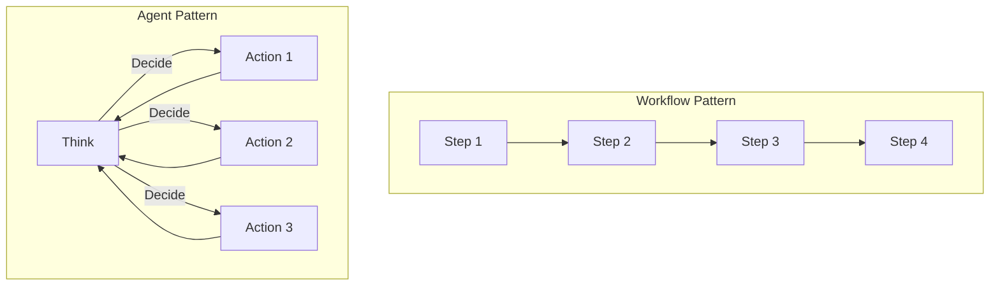
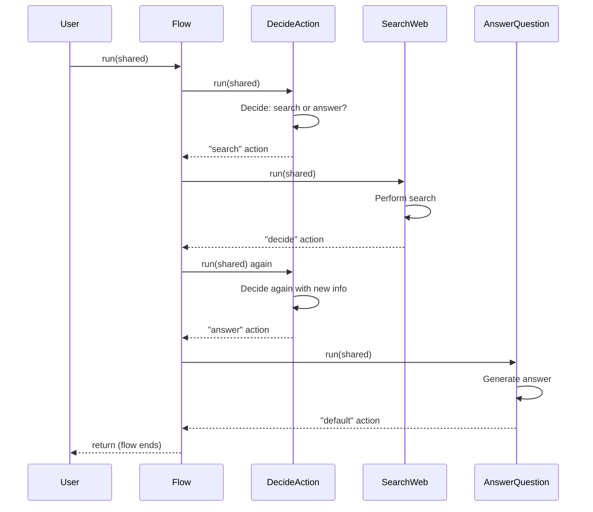

# Chapter 8: Agent Pattern

In [Chapter 7: Workflow Pattern](07_workflow_pattern_.md), we learned how to break complex tasks into sequential steps. But what happens when we need our program to make decisions dynamically, like a personal assistant figuring out what to do next based on the situation? This is where the **Agent Pattern** comes in!

## What is the Agent Pattern and Why Do We Need It?

Imagine you ask a friend to research a topic for you. Instead of giving them step-by-step instructions ("first check Wikipedia, then search Google, then write notes..."), you simply explain what you need and trust them to figure out the steps themselves. Your friend might:

1. Think about what information they need
2. Decide to search Google first
3. Read some articles
4. Decide they need more specific information
5. Search again with a refined query
6. Finally organize what they've learned into an answer

This is exactly what the **Agent Pattern** does in PocketFlow - it creates a system that can think for itself, decide what actions to take, and execute those actions to accomplish a goal.

## Agent Pattern vs. Workflow Pattern

Let's understand the key difference:

- **Workflow Pattern**: A fixed sequence of steps (like following a recipe)
- **Agent Pattern**: A dynamic system that decides its own steps (like a chef creating a meal)



The Workflow Pattern follows a predetermined path, while the Agent Pattern loops through a "think-act" cycle, deciding what to do at each step.

## Building Blocks of an Agent

A PocketFlow agent has three essential components:

1. **Decision Node**: The "brain" that decides what to do next
2. **Action Nodes**: The "hands" that perform different tasks
3. **Context Management**: The "memory" that keeps track of what's happened

Let's see how these work together with a simple example: a research agent that can search the web and answer questions.

## Creating a Simple Research Agent

Our research agent will:
1. Decide whether to search for more information or answer the question
2. If it chooses to search, it will look up information on the web
3. If it chooses to answer, it will generate a response based on what it found

### Step 1: Create the Decision Node

```python
class DecideAction(Node):
    def prep(self, shared):
        # Get question and any previous search results
        question = shared["question"]
        previous_results = shared.get("search_results", [])
        return question, previous_results
```

This `prep` method gathers the question and any previous search results from shared storage.

```python
    def exec(self, inputs):
        question, previous_results = inputs
        # Ask LLM to decide the next action
        prompt = f"""
        Question: {question}
        Previous searches: {previous_results}
        
        Should I:
        1. Search for more information (action: "search")
        2. Answer the question now (action: "answer")
        
        Respond with: {{"action": "search/answer", "reason": "why", "search_term": "if searching"}}
        """
        response = call_llm(prompt)
        return json.loads(response)
```

This `exec` method asks the LLM to decide whether to search or answer, and returns a structured response.

```python
    def post(self, shared, prep_res, exec_res):
        # If searching, save the search term
        if exec_res["action"] == "search":
            shared["search_term"] = exec_res["search_term"]
        # Return the chosen action
        return exec_res["action"]
```

This `post` method saves the search term (if applicable) and returns the chosen action name.

### Step 2: Create the Search Node

```python
class SearchWeb(Node):
    def prep(self, shared):
        return shared["search_term"]
        
    def exec(self, search_term):
        # In a real application, this would call a search API
        print(f"🔍 Searching for: {search_term}")
        results = f"Example results for '{search_term}'"
        return results
```

This node takes the search term and performs a web search (simplified in this example).

```python
    def post(self, shared, prep_res, exec_res):
        # Save search results to shared storage
        if "search_results" not in shared:
            shared["search_results"] = []
        shared["search_results"].append({
            "term": shared["search_term"],
            "results": exec_res
        })
        return "decide"  # Go back to decision node
```

After searching, it saves the results and returns "decide" to go back to the decision node.

### Step 3: Create the Answer Node

```python
class AnswerQuestion(Node):
    def prep(self, shared):
        # Get the question and all search results
        question = shared["question"]
        search_results = shared.get("search_results", [])
        return question, search_results
        
    def exec(self, inputs):
        question, search_results = inputs
        # Generate an answer based on the search results
        prompt = f"""
        Question: {question}
        Information: {search_results}
        
        Provide a comprehensive answer based on the information.
        """
        return call_llm(prompt)
```

This node generates an answer based on the question and all search results.

```python
    def post(self, shared, prep_res, exec_res):
        # Save the answer to shared storage
        shared["answer"] = exec_res
        return "default"  # End the flow
```

It saves the answer and returns "default" to end the flow.

### Step 4: Connect the Nodes into a Flow

```python
# Create the nodes
decide_node = DecideAction()
search_node = SearchWeb()
answer_node = AnswerQuestion()

# Connect the nodes with actions
decide_node - "search" >> search_node
decide_node - "answer" >> answer_node
search_node - "decide" >> decide_node  # Create a loop

# Create the flow
agent_flow = Flow(start=decide_node)
```

This creates a flow where:
1. The decision node decides whether to search or answer
2. If it chooses "search", it goes to the search node
3. After searching, it loops back to the decision node
4. If it chooses "answer", it goes to the answer node and ends

### Step 5: Run the Agent

```python
# Initialize with a question
shared = {"question": "Who won the Nobel Prize in Physics 2023?"}

# Run the agent
agent_flow.run(shared)

# Get the answer
print(shared["answer"])
```

When you run this agent, it will:
1. Start by deciding whether to search or answer
2. If it chooses to search, it will:
   a. Perform the search
   b. Save the results
   c. Go back to deciding whether to search again or answer
3. When it eventually chooses to answer, it will:
   a. Generate an answer based on all search results
   b. End the flow

## How Does the Agent Pattern Work Internally?

Let's visualize what happens when our research agent runs:



The key to the Agent Pattern is the loop created between the decision node and action nodes. This allows the agent to:

1. Take an action
2. Observe the results
3. Decide what to do next
4. Repeat until the goal is achieved

## Best Practices for Building Effective Agents

### 1. Provide Clear Action Spaces

Give your agent a well-defined set of actions to choose from:

```python
"""
Available Actions:
[1] search
  Description: Search the web for information
  Parameters:
    - query (str): What to search for

[2] answer
  Description: Generate final answer
  Parameters:
    - none
"""
```

This helps the LLM understand exactly what options it has.

### 2. Include Reasoning in Decisions

Ask the agent to explain its thinking:

```python
"""
Return your response in this format:
```yaml
thinking: |
    <your step-by-step reasoning process>
action: <action_name>
parameters:
    <parameter_name>: <parameter_value>
```
"""
```

This makes the agent's decisions more transparent and helps with debugging.

### 3. Manage Context Effectively

Only provide relevant information to avoid overwhelming the LLM:

```python
# Instead of passing all previous searches
all_results = shared.get("search_results", [])
# Pass only the most relevant ones
relevant_results = select_most_relevant(all_results, question)
```

Remember that even with large context windows, LLMs can struggle with too much information.

## Practical Example: A Web Research Agent

Let's put everything together into a practical web research agent that can answer questions by searching the web:

```python
def create_agent_flow():
    # Create nodes
    decide_node = DecideAction()
    search_node = SearchWeb()
    answer_node = AnswerQuestion()
    
    # Connect nodes with actions
    decide_node - "search" >> search_node
    decide_node - "answer" >> answer_node
    search_node - "decide" >> decide_node  # Create a loop
    
    # Create and return the flow
    return Flow(start=decide_node)
```

This function creates and returns our agent flow. You can use it like this:

```python
# Create the agent
agent = create_agent_flow()

# Ask a question
shared = {"question": "What is quantum computing?"}
agent.run(shared)

# Get the answer
print(shared["answer"])
```

When you run this code, the agent will:
1. Decide to search for information about quantum computing
2. Perform the search and save the results
3. Decide whether to search again with a more specific query
4. Keep searching until it has enough information
5. Generate a comprehensive answer based on all search results

## Conclusion

In this chapter, we've learned that:

- The **Agent Pattern** creates autonomous systems that can make decisions and take actions
- Unlike the [Workflow Pattern](07_workflow_pattern_.md), agents dynamically decide their own steps
- Agents use a "think-act" loop to accomplish tasks
- Three key components are: decision nodes, action nodes, and context management
- Effective agents need clear action spaces, reasoning capabilities, and good context management

The Agent Pattern is powerful for building systems that can handle complex, open-ended tasks where the exact steps aren't known in advance. By combining the reasoning capabilities of LLMs with the ability to take actions in the world, agents can solve problems that would be difficult to address with fixed workflows.

In the next chapter, we'll explore [RAG (Retrieval Augmented Generation)](09_rag__retrieval_augmented_generation__.md), a technique that can significantly enhance our agents by giving them access to external knowledge.

