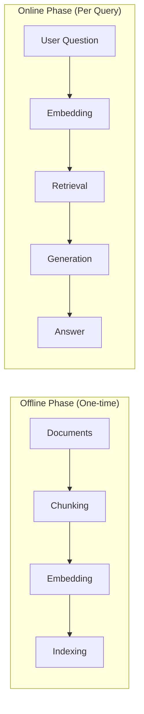
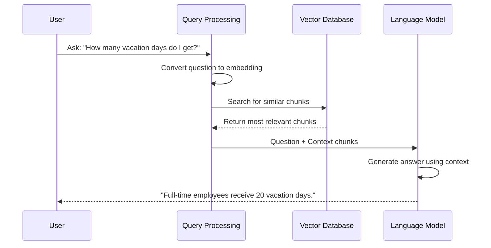

# Chapter 9: RAG (Retrieval Augmented Generation)

In [Chapter 8: Agent Pattern](08_agent_pattern_.md), we explored how to create systems that can make decisions and take actions autonomously. Now, let's tackle a common challenge: how can we make our LLMs give answers that are accurate, factual, and based on specific information? This is where **RAG (Retrieval Augmented Generation)** comes in!

## What is RAG and Why Do We Need It?

Imagine you're writing a research paper about climate change. You wouldn't just write from memory - you'd first gather relevant books and articles, find the most useful information, and then write your paper based on those sources.

This is exactly what **RAG** does for Large Language Models. Without RAG, LLMs can only answer based on what they learned during training, which might be:
- Outdated (training cutoff date)
- General rather than specific
- Potentially inaccurate or made-up (hallucinations)

RAG solves these problems by following a two-step process:
1. **Retrieval**: Find relevant information from a knowledge base
2. **Generation**: Use that information to generate an accurate answer

Let's explore this with a practical example: creating a system that can answer questions about our company's policies.

## Understanding the RAG Architecture

A RAG system consists of two main phases:



### Offline Phase (Document Processing)

This phase happens once, before any questions are asked:

1. **Collect Documents**: Gather your knowledge sources (policies, manuals, etc.)
2. **Chunk Documents**: Split them into smaller, manageable pieces
3. **Create Embeddings**: Convert text chunks into numerical vectors
4. **Build an Index**: Store these vectors in a searchable database

### Online Phase (Question Answering)

This phase happens each time a user asks a question:

1. **Embed the Question**: Convert the question into the same vector space
2. **Retrieve Relevant Chunks**: Find documents similar to the question
3. **Generate an Answer**: Send the question + retrieved context to the LLM

Let's implement each phase step by step!

## Building a RAG System in PocketFlow

### Step 1: Document Processing (Offline Phase)

First, let's create a node to split our documents into chunks:

```python
from pocketflow import Node, BatchNode, Flow

class ChunkDocumentsNode(BatchNode):
    def prep(self, shared):
        return shared.get("texts", [])
    
    def exec(self, text):
        # Split text into chunks of ~200 characters
        chunks = []
        chunk_size = 200
        for i in range(0, len(text), chunk_size):
            chunks.append(text[i:i+chunk_size])
        return chunks
```

This node takes a list of documents and splits each one into smaller chunks. We use a [BatchNode](04_batch_processing_.md) because we're processing multiple documents.

Next, let's create a node to convert these chunks into embeddings:

```python
class EmbedDocumentsNode(BatchNode):
    def prep(self, shared):
        # Flatten all chunks into a single list
        all_chunks = []
        for chunk_list in shared.get("chunks", []):
            all_chunks.extend(chunk_list)
        shared["all_chunks"] = all_chunks
        return all_chunks
```

This prep method flattens the nested list of chunks (one list per document) into a single list.

```python
    def exec(self, chunk):
        from utils import get_embedding
        # Convert chunk to embedding vector
        return get_embedding(chunk)
    
    def post(self, shared, prep_res, exec_res_list):
        shared["embeddings"] = exec_res_list
        print(f"✅ Created {len(exec_res_list)} document embeddings")
```

The exec method converts each chunk into an embedding vector, and the post method stores all embeddings in the shared store.

Finally, let's create a node to build a searchable index:

```python
class CreateIndexNode(Node):
    def prep(self, shared):
        return shared["embeddings"]
        
    def exec(self, embeddings):
        print("🔍 Creating search index...")
        from utils import create_index
        index = create_index(embeddings)
        return index
```

This node takes all the embeddings and creates a searchable index (we'll use FAISS, a popular vector search library).

### Step 2: Question Answering (Online Phase)

First, let's create a node to embed the user's question:

```python
class EmbedQueryNode(Node):
    def prep(self, shared):
        return shared["query"]
        
    def exec(self, query):
        print(f"🔍 Embedding query: {query}")
        from utils import get_embedding
        return get_embedding(query)
```

This node converts the user's question into the same vector space as our document chunks.

Next, let's create a node to retrieve relevant documents:

```python
class RetrieveDocumentNode(Node):
    def prep(self, shared):
        return {
            "query_embedding": shared["query_embedding"],
            "index": shared["index"],
            "chunks": shared["all_chunks"]
        }
```

The prep method gathers everything we need: the query embedding, the document index, and the original chunks.

```python
    def exec(self, data):
        print("🔎 Searching for relevant documents...")
        from utils import search_index
        # Find most similar document
        doc_id, distance = search_index(data["index"], 
                                      data["query_embedding"])
        return {
            "chunk": data["chunks"][doc_id],
            "id": doc_id,
            "distance": distance
        }
```

The exec method searches for the most similar document chunk based on vector similarity.

```python
    def post(self, shared, prep_res, exec_res):
        chunk = exec_res["chunk"]
        print(f"📄 Retrieved document (index: {exec_res['id']}, "
              f"distance: {exec_res['distance']:.4f})")
        print(f"📄 Most relevant text: \"{chunk}\"")
        shared["retrieved_document"] = chunk
        return "default"
```

The post method stores the retrieved document and prints information about it.

Finally, let's create a node to generate an answer using the retrieved context:

```python
class GenerateAnswerNode(Node):
    def prep(self, shared):
        return {
            "query": shared["query"],
            "context": shared["retrieved_document"]
        }
        
    def exec(self, data):
        from utils import call_llm
        prompt = f"""
        Answer the question based ONLY on the context provided.
        Question: {data['query']}
        Context: {data['context']}
        Answer: 
        """
        return call_llm(prompt)
```

This node sends both the question and the retrieved context to the LLM.

### Step 3: Connecting the Flows

Now let's connect these nodes into two flows - one for offline processing and one for online processing:

```python
# Offline flow (document processing)
chunk_node = ChunkDocumentsNode()
embed_node = EmbedDocumentsNode()
index_node = CreateIndexNode()

chunk_node >> embed_node >> index_node
offline_flow = Flow(start=chunk_node)

# Online flow (question answering)
query_node = EmbedQueryNode()
retrieve_node = RetrieveDocumentNode()
generate_node = GenerateAnswerNode()

query_node >> retrieve_node >> generate_node
online_flow = Flow(start=query_node)
```

The offline flow processes documents and builds the index, while the online flow answers questions using that index.

### Step 4: Running the RAG System

Let's see how to use our RAG system:

```python
# Sample company policies
documents = [
    "Employee vacation policy: All full-time employees receive 20 days...",
    "Remote work policy: Employees may work from home twice per week...",
    "Health benefits: Our company provides comprehensive health insurance..."
]

# Initialize shared storage
shared = {
    "texts": documents,
    "query": "How many vacation days do I get?"
}

# Run the offline flow to process documents
offline_flow.run(shared)

# Run the online flow to answer the question
online_flow.run(shared)

# Print the answer
print("🤖 Generated Answer:")
print(shared["generated_answer"])
```

This code first processes our company policies and builds an index, then uses that index to answer a specific question about vacation days.

## How RAG Works Internally

Let's look at what happens when a user asks a question:



Let's examine the key parts of the implementation:

1. **Vector Embeddings**: We convert text to numbers that capture meaning

```python
# Simplified version of get_embedding function
def get_embedding(text):
    # Call OpenAI's embedding API
    response = openai.Embedding.create(
        input=text,
        model="text-embedding-ada-002"
    )
    return response['data'][0]['embedding']
```

2. **Vector Search**: We find similar documents using vector similarity

```python
# Simplified version of search_index function
def search_index(index, query_embedding, top_k=1):
    # Search the FAISS index for similar vectors
    D, I = index.search(np.array([query_embedding]), top_k)
    return I[0][0], D[0][0]  # Return ID and distance
```

3. **Prompt Construction**: We provide context to the LLM

```python
# Simplified prompt template
prompt = f"""
Answer the question based ONLY on the context provided.
Question: {question}
Context: {context}
Answer: 
"""
```

## Improving Your RAG System

Here are some ways to enhance your RAG system:

### 1. Better Chunking Strategies

Instead of splitting by character count, consider more sophisticated approaches:

```python
def chunk_by_paragraph(text):
    return text.split("\n\n")

def chunk_by_sentence(text):
    import re
    return re.split(r'(?<=[.!?])\s+', text)
```

Different content types benefit from different chunking strategies.

### 2. Retrieving Multiple Chunks

Retrieve several relevant chunks instead of just one:

```python
def search_index(index, query_embedding, top_k=3):
    # Return top 3 most similar chunks
    D, I = index.search(np.array([query_embedding]), top_k)
    return list(zip(I[0], D[0]))
```

This provides more context to the LLM for better answers.

### 3. Reranking Results

After vector search, use a second model to refine the results:

```python
def rerank_results(query, chunks):
    # Score each chunk based on relevance to query
    scores = []
    for chunk in chunks:
        relevance = compute_relevance(query, chunk)
        scores.append(relevance)
    # Return chunks sorted by relevance
    return [c for _, c in sorted(zip(scores, chunks), reverse=True)]
```

This helps prioritize the most useful chunks.

## Conclusion

In this chapter, we've learned:

- **RAG** enhances LLM responses by retrieving relevant information
- The **offline phase** processes documents and builds a searchable index
- The **online phase** retrieves relevant information and generates answers
- RAG makes LLM responses more accurate, factual, and specific
- Simple implementation steps: chunking, embedding, indexing, retrieving, generating

RAG is one of the most powerful patterns for building practical LLM applications. By combining the factual accuracy of retrieval with the generative capabilities of LLMs, you can create systems that provide high-quality, factual, and contextually relevant responses.

In the next chapter, we'll explore another powerful pattern for processing large amounts of data: the [Map-Reduce Pattern](10_map_reduce_pattern_.md).

