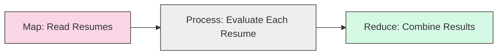
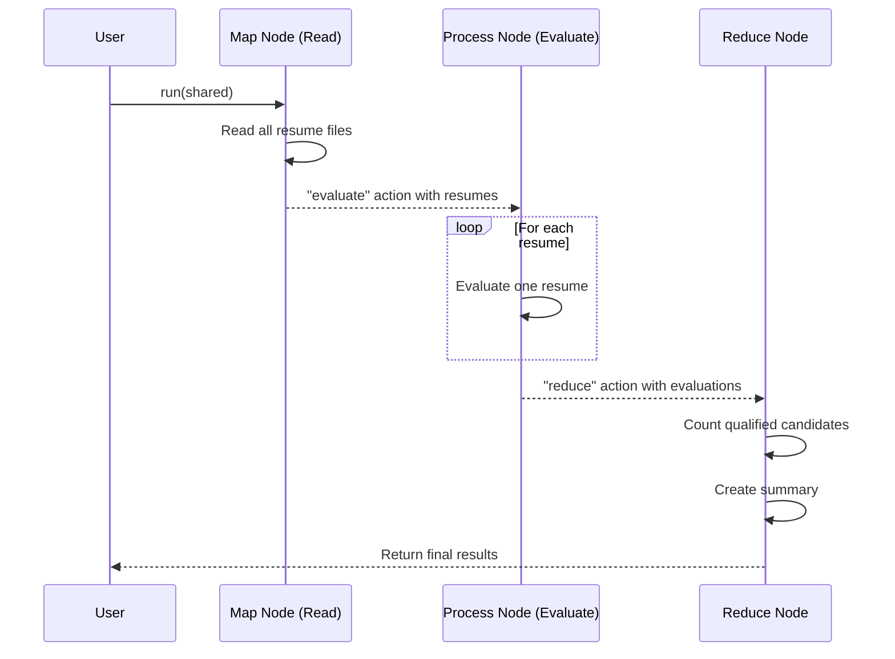

# Chapter 10: Map-Reduce Pattern

In [Chapter 9: RAG (Retrieval Augmented Generation)](09_rag__retrieval_augmented_generation__.md), we learned how to enhance LLM responses by retrieving relevant information. Now, let's explore a powerful pattern for processing large amounts of data: the **Map-Reduce Pattern**.

## What is the Map-Reduce Pattern and Why Do We Need It?

Imagine you're a teacher who needs to grade 100 essays. Instead of doing it all yourself, you might:
1. **Split the work**: Divide the essays among 5 teaching assistants
2. **Process independently**: Each assistant grades their 20 essays
3. **Combine results**: Collect all the grades and calculate the class average

This is exactly what the **Map-Reduce Pattern** does in PocketFlow! It helps us process large datasets by:
1. **Map**: Breaking a big task into smaller, parallel subtasks
2. **Reduce**: Combining the results into a final output

Without Map-Reduce, processing large amounts of data would be slow and inefficient - like trying to grade all 100 essays by yourself.

## Understanding Map-Reduce with a Real Example

Let's use a practical example: imagine you're a hiring manager with 50 resumes to review. You want to quickly identify which candidates qualify for a technical role.

Here's how we can use Map-Reduce:



## The Map Phase: Breaking Down the Problem

The first step in Map-Reduce is to break down our large problem into smaller pieces. Let's create a node that reads all resume files:

```python
class ReadResumesNode(Node):
    def exec(self, prep_res):
        # Read all resume files from a directory
        resume_files = {}
        for filename in os.listdir("data"):
            with open(f"data/{filename}", "r") as f:
                resume_files[filename] = f.read()
        return resume_files
```

This node reads all resume files from a directory and returns them as a dictionary. This is our "map" phase - we're collecting all the items we need to process.

```python
    def post(self, shared, prep_res, exec_res):
        # Store all resumes in shared data
        shared["resumes"] = exec_res
        return "evaluate"
```

We store the resumes in the shared data store and proceed to the "evaluate" action.

## The Process Phase: Working on Individual Items

Next, we need to process each resume independently. This is where [Batch Processing](04_batch_processing_.md) comes in handy:

```python
class EvaluateResumesNode(BatchNode):
    def prep(self, shared):
        # Get all resumes and prepare them as (filename, content) tuples
        resumes = shared.get("resumes", {})
        return list(resumes.items())
```

The `prep` method returns a list of (filename, content) tuples, which will be processed one by one.

```python
    def exec(self, resume_tuple):
        filename, content = resume_tuple
        # Use LLM to evaluate the resume
        prompt = f"Evaluate if this resume qualifies for a tech role:\n{content}"
        evaluation = call_llm(prompt)
        return filename, evaluation
```

The `exec` method processes a single resume and returns the filename with its evaluation.

```python
    def post(self, shared, prep_res, exec_res_list):
        # Store individual evaluations
        shared["evaluations"] = dict(exec_res_list)
        return "reduce"
```

We store all evaluations in the shared data and proceed to the "reduce" action.

## The Reduce Phase: Combining Results

Finally, we combine all the individual evaluations into a final result:

```python
class ReduceResultsNode(Node):
    def prep(self, shared):
        # Get all evaluations
        return shared.get("evaluations", {})
```

The `prep` method gets all evaluations from the shared data.

```python
    def exec(self, evaluations):
        # Count qualified candidates
        qualified = [f for f, e in evaluations.items() 
                    if "qualified: true" in e.lower()]
        
        # Create a summary
        summary = {
            "total": len(evaluations),
            "qualified": len(qualified),
            "qualified_list": qualified
        }
        return summary
```

The `exec` method counts how many candidates qualified and creates a summary.

```python
    def post(self, shared, prep_res, exec_res):
        # Store and display the summary
        shared["summary"] = exec_res
        print(f"Total candidates: {exec_res['total']}")
        print(f"Qualified candidates: {exec_res['qualified']}")
        return "default"
```

We store the summary in the shared data and display the results.

## Connecting the Flow

Now, let's connect these nodes to create our Map-Reduce flow:

```python
def create_resume_processing_flow():
    # Create nodes
    read_node = ReadResumesNode()
    evaluate_node = EvaluateResumesNode()
    reduce_node = ReduceResultsNode()
    
    # Connect nodes
    read_node - "evaluate" >> evaluate_node
    evaluate_node - "reduce" >> reduce_node
    
    # Create and return flow
    return Flow(start=read_node)
```

This function creates a flow that connects our three nodes in sequence.

## Using Parallel Processing for Better Performance

One of the great benefits of Map-Reduce is that the "map" phase can be parallelized. Instead of using a regular [BatchNode](04_batch_processing_.md), we can use an [AsyncParallelBatchNode](06_parallel_processing_.md) to process multiple resumes simultaneously:

```python
class ParallelEvaluateResumesNode(AsyncParallelBatchNode):
    async def prep_async(self, shared):
        resumes = shared.get("resumes", {})
        return list(resumes.items())
```

```python
    async def exec_async(self, resume_tuple):
        filename, content = resume_tuple
        evaluation = await call_llm_async(f"Evaluate resume:\n{content}")
        return filename, evaluation
```

By using an AsyncParallelBatchNode, we can evaluate multiple resumes at the same time, making our processing much faster - like having multiple assistants grading papers simultaneously!

## How Map-Reduce Works Internally

Let's visualize what happens when our resume processing flow runs:



The internal implementation makes this pattern possible by using the [BatchNode](04_batch_processing_.md) class for the processing phase:

```python
# Simplified internal implementation of BatchNode
class BatchNode(Node):
    def run(self, shared):
        # Map phase: get list of items
        items = self.prep(shared)
        
        # Process phase: execute for each item
        results = []
        for item in items:
            result = self.exec(item)
            results.append(result)
        
        # Return action for next node
        return self.post(shared, items, results)
```

This design allows us to process each item independently, and we can easily replace it with [AsyncParallelBatchNode](06_parallel_processing_.md) for parallel processing.

## Practical Example: Document Summarization

Let's look at another example: summarizing a collection of documents. This is a common task when working with large amounts of text:

```python
class SummarizeAllFiles(BatchNode):
    def prep(self, shared):
        files_dict = shared["files"]  # e.g. 10 files
        return list(files_dict.items())
```

This node prepares all files for processing.

```python
    def exec(self, one_file):
        filename, file_content = one_file
        summary = call_llm(f"Summarize this file:\n{file_content}")
        return (filename, summary)
```

For each file, we generate a summary using an LLM.

```python
    def post(self, shared, prep_res, exec_res_list):
        shared["file_summaries"] = dict(exec_res_list)
        return "combine"
```

After processing all files, we store the individual summaries and proceed to combine them.

```python
class CombineSummaries(Node):
    def prep(self, shared):
        return shared["file_summaries"]
    
    def exec(self, file_summaries):
        # Format individual summaries
        text_list = [f"{fname}: {summ}" for fname, summ in file_summaries.items()]
        all_summaries = "\n---\n".join(text_list)
        
        # Generate final summary
        return call_llm(f"Combine these summaries:\n{all_summaries}")
```

The reduce node combines all individual summaries into a final, comprehensive summary.

## When to Use Map-Reduce

The Map-Reduce pattern is ideal for:

1. **Large datasets**: When you have too much data for a single process
2. **Independent subtasks**: When tasks can be processed independently
3. **Aggregation needs**: When you need to combine results into a final output

Examples include:
- Processing multiple documents
- Analyzing large datasets
- Generating reports from multiple sources
- Evaluating multiple candidates/items

## Conclusion

In this chapter, we've learned that:

- The **Map-Reduce Pattern** helps us process large datasets efficiently
- It involves three phases: map (split), process (transform), and reduce (combine)
- The pattern is perfectly implemented in PocketFlow using [BatchNode](04_batch_processing_.md) and regular Nodes
- We can improve performance using [Parallel Processing](06_parallel_processing_.md)
- This pattern is ideal for any task that can be broken down into independent subtasks

The Map-Reduce pattern is one of the most powerful approaches for handling large-scale data processing tasks. By breaking big problems into smaller ones and processing them independently, we can build scalable and efficient workflows even with limited resources.

Throughout this tutorial series, we've explored the fundamental building blocks of PocketFlow - from [Nodes](01_node_.md) and [Flows](02_flow_.md) to advanced patterns like [RAG](09_rag__retrieval_augmented_generation__.md) and Map-Reduce. You now have the knowledge to build sophisticated, production-ready LLM applications that can handle complex tasks efficiently.

