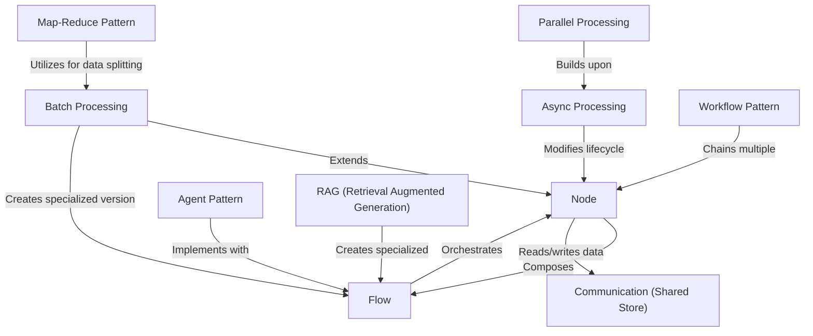

# Tutorial: PocketFlow

**PocketFlow** is a minimalist framework for building LLM-powered applications through a structured approach. Its foundation is the **Node** abstraction which processes data through a 3-step lifecycle (prep, exec, post). **Flows** connect these Nodes into directed graphs to create complex workflows. The framework supports *data sharing* through a Shared Store and offers advanced capabilities like *Batch Processing* for handling large inputs, *Async/Parallel Processing* for efficiency, and specialized patterns like *Agents*, *RAG*, and *Map-Reduce* for building sophisticated AI applications.

**Source Repository:** [https://github.com/The-Pocket/PocketFlow](https://github.com/The-Pocket/PocketFlow)

## Chapters

1. [Node
](01_node_.md)
2. [Flow
](02_flow_.md)
3. [Communication (Shared Store)
](03_communication__shared_store__.md)
4. [Batch Processing
](04_batch_processing_.md)
5. [Async Processing
](05_async_processing_.md)
6. [Parallel Processing
](06_parallel_processing_.md)
7. [Workflow Pattern
](07_workflow_pattern_.md)
8. [Agent Pattern
](08_agent_pattern_.md)
9. [RAG (Retrieval Augmented Generation)
](09_rag__retrieval_augmented_generation__.md)
10. [Map-Reduce Pattern
](10_map_reduce_pattern_.md)
