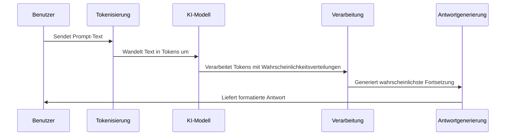

# Chapter 1: Prompt-Engineering


## Einführung

Stellen Sie sich vor, Sie möchten einem Koch ein Gericht zubereiten lassen, haben aber keine Möglichkeit, mit ihm zu sprechen. Alles, was Sie tun können, ist ein Rezept zu schreiben. Wie detailliert und präzise müsste dieses Rezept sein, damit genau das Gericht entsteht, das Sie sich vorstellen? Genau darum geht es beim Prompt-Engineering.

Künstliche Intelligenz und insbesondere große Sprachmodelle (Large Language Models, LLMs) wie GPT-4 sind leistungsstarke Werkzeuge, die uns bei zahlreichen Aufgaben unterstützen können. Aber wie kommunizieren wir effektiv mit ihnen? Wie erklären wir ihnen genau, was wir brauchen? Die Antwort liegt im Prompt-Engineering – der Kunst und Wissenschaft, Anfragen so zu formulieren, dass wir die gewünschten Ergebnisse erhalten.

## Was ist ein Prompt?

Ein "Prompt" ist einfach gesagt die Eingabe, die wir an ein KI-Modell senden. Es kann eine Frage, eine Anweisung oder eine Aufforderung sein. Zum Beispiel:

- "Was ist die Hauptstadt von Frankreich?"
- "Schreibe ein Gedicht über den Frühling."
- "Erkläre den Unterschied zwischen Relativitätstheorie und Quantenmechanik für einen 10-Jährigen."

Diese einfachen Beispiele sind Prompts. Aber das wahre Potenzial liegt in der Art und Weise, wie wir diese Prompts gestalten können, um genau die Antworten zu erhalten, die wir benötigen.

## Die Grundlagen des Prompt-Engineerings

### Klarheit und Präzision

Ein guter Prompt ist klar und präzise. Vergleichen wir diese beiden Prompts:

Prompt 1: "Erzähle mir etwas über Bäume."

Prompt 2: "Erkläre in 3-5 Sätzen, wie Bäume zur Bekämpfung des Klimawandels beitragen."

Der zweite Prompt wird wahrscheinlich eine fokussiertere und nützlichere Antwort liefern, weil er genau spezifiziert, was wir wissen möchten und in welchem Format.

### Ein praktisches Beispiel

Lassen Sie uns ein einfaches Python-Beispiel betrachten, wie wir einen Prompt an eine KI senden können:

```python
import openai

# API-Schlüssel festlegen
openai.api_key = "Ihr-API-Schlüssel"

# Einen einfachen Prompt senden
antwort = openai.ChatCompletion.create(
  model="gpt-4",
  messages=[{"role": "user", "content": "Was sind die Vorteile erneuerbarer Energien?"}]
)

print(antwort.choices[0].message.content)
```

Dieser Code sendet einen einfachen Prompt an das GPT-4-Modell und gibt die Antwort aus. Die Antwort könnte allgemein sein und verschiedene erneuerbare Energiequellen erwähnen.

### Verbesserung des Prompts

Nun verbessern wir unseren Prompt, um spezifischere Informationen zu erhalten:

```python
verbesserter_prompt = """
Bitte erstelle eine kurze Übersicht über die Vorteile von Solarenergie im Vergleich zu Windenergie. 
Berücksichtige dabei folgende Aspekte:
1. Kosten
2. Umweltauswirkungen
3. Verfügbarkeit

Format: Stichpunktliste mit maximal 2 Punkten pro Aspekt.
"""

antwort = openai.ChatCompletion.create(
  model="gpt-4",
  messages=[{"role": "user", "content": verbesserter_prompt}]
)
```

Dieser verbesserte Prompt enthält mehrere Elemente des guten Prompt-Engineerings:
- Klare Anweisung, was erstellt werden soll
- Spezifische Aspekte, die behandelt werden sollen
- Ein gewünschtes Format für die Antwort

## Techniken des Prompt-Engineerings

### 1. Rolle zuweisen

Sie können dem KI-Modell eine bestimmte Rolle zuweisen, um den Kontext zu setzen:

```python
rollen_prompt = """
Du bist ein erfahrener Klimawissenschaftler. 
Erkläre einem Grundschüler, warum es wichtig ist, Energie zu sparen.
"""
```

Diese Technik hilft dem Modell zu verstehen, aus welcher Perspektive und auf welchem Niveau es antworten soll.

### 2. Schrittweise Anleitung

```python
schrittweiser_prompt = """
Ich möchte einen Apfelkuchen backen. 
1. Liste zuerst alle Zutaten auf.
2. Erkläre dann die Zubereitung in einfachen Schritten.
3. Gib zum Schluss einen Tipp für ein besonders gutes Gelingen.
"""
```

Durch die Nummerierung der Schritte geben Sie dem Modell eine klare Struktur vor, wie die Antwort aufgebaut sein soll.

### 3. Beispiele geben (Few-Shot Learning)

```python
beispiel_prompt = """
Wandle diese Sätze in positive Aussagen um:

Eingabe: Ich mag keine Mathematik.
Ausgabe: Ich finde andere Fächer interessanter als Mathematik.

Eingabe: Das Wetter ist heute schrecklich.
Ausgabe: Das Wetter bietet heute eine gute Gelegenheit, es sich drinnen gemütlich zu machen.

Eingabe: Dieser Film war eine Zeitverschwendung.
Ausgabe:
"""
```

Hier zeigen wir dem Modell durch Beispiele, was wir erwarten, bevor wir unsere eigentliche Aufgabe stellen.

## Wie funktioniert Prompt-Engineering intern?

Wenn wir einen Prompt an ein Sprachmodell senden, durchläuft dieser mehrere Verarbeitungsschritte:



1. **Tokenisierung**: Der Text wird in kleine Einheiten (Tokens) zerlegt, die das Modell verarbeiten kann.
2. **Verarbeitung**: Das Modell berechnet, basierend auf seinem Training, welche Tokens wahrscheinlich als Nächstes folgen sollten.
3. **Generierung**: Es werden Schritt für Schritt neue Tokens generiert, die zusammen die Antwort bilden.

## Analogien zum besseren Verständnis

### Die Rezept-Analogie

Prompt-Engineering ist wie das Schreiben eines Rezepts für einen Koch, der noch nie Ihr Lieblingsgericht zubereitet hat. Je detaillierter und präziser Ihr Rezept ist, desto wahrscheinlicher ist es, dass das Ergebnis Ihren Erwartungen entspricht.

### Die Reiseführer-Analogie

Stellen Sie sich vor, Sie geben einem Reisenden Anweisungen, um einen bestimmten Ort in einer ihm unbekannten Stadt zu finden. Vage Anweisungen wie "gehe nach Norden und dann irgendwo links" werden wahrscheinlich nicht zum Ziel führen. Genaue Anweisungen mit Straßennamen, Landmarken und Entfernungen erhöhen die Chancen, dass der Reisende sein Ziel erreicht.

## Häufige Herausforderungen und Lösungen

### Zu vage Prompts

**Problem**: "Erzähle mir etwas Interessantes."

**Lösung**: "Erzähle mir einen überraschenden Fakt über Tiefseekreaturen, den die meisten Menschen nicht kennen."

### Übermäßig komplexe Prompts

**Problem**: Ein sehr langer Prompt mit zu vielen Anforderungen und Einschränkungen.

**Lösung**: Teilen Sie komplexe Aufgaben in mehrere einfachere Prompts auf.

### Missverständnisse

**Problem**: Die KI interpretiert Ihren Prompt anders als beabsichtigt.

**Lösung**: Geben Sie Beispiele für die Art von Antwort, die Sie erwarten (Few-Shot Learning).

## Schlussfolgerung

Prompt-Engineering ist eine Schlüsselfähigkeit im Umgang mit KI-Sprachmodellen. Durch die Gestaltung klarer, präziser und gut strukturierter Prompts können wir die Leistungsfähigkeit dieser Modelle besser nutzen und genauere, relevantere Antworten erhalten.

Die Kunst des Prompt-Engineerings entwickelt sich ständig weiter, und mit etwas Übung werden Sie in der Lage sein, Prompts zu erstellen, die genau die Informationen liefern, die Sie benötigen.

Im nächsten Kapitel werden wir uns mit [Prompt-Strukturen](02_prompt_strukturen_.md) befassen und lernen, wie wir verschiedene Strukturen für unterschiedliche Anwendungsfälle entwickeln können.

---

