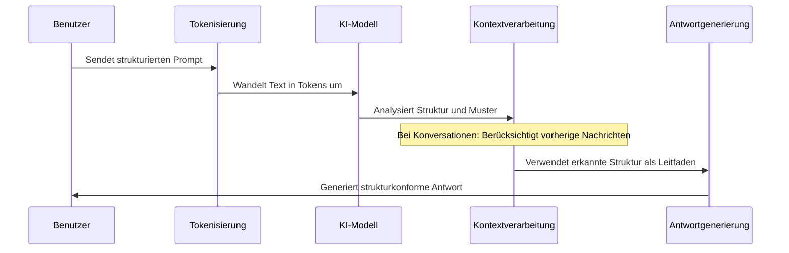

# Chapter 2: Prompt-Strukturen


Im vorherigen Kapitel [Prompt-Engineering](01_prompt_engineering_.md) haben wir gelernt, dass die Art und Weise, wie wir unsere Anfragen an KI-Modelle formulieren, entscheidend für die Qualität der Antworten ist. Nun werden wir uns mit den verschiedenen Strukturen beschäftigen, die wir für unsere Prompts verwenden können.

## Warum sind Prompt-Strukturen wichtig?

Stellen Sie sich vor, Sie möchten ein Gespräch mit einem Freund führen. Je nach Situation könnten Sie einen kurzen Austausch per Textnachricht, ein strukturiertes Telefonat oder ein ausführliches persönliches Gespräch bevorzugen. Bei der Kommunikation mit KI-Modellen ist es ähnlich – verschiedene Prompt-Strukturen eignen sich für unterschiedliche Anwendungsfälle.

Nehmen wir als Beispiel an, Sie möchten von einer KI Informationen über den Klimawandel erhalten. Die Struktur Ihres Prompts wird maßgeblich beeinflussen, welche Art von Antwort Sie erhalten.

## Grundlegende Prompt-Strukturen

### 1. Einzel-Prompts (Single-Turn)

Einzel-Prompts sind einfache, einmalige Anfragen an das KI-Modell. Sie stellen eine Frage oder geben eine Anweisung und erhalten eine einzelne Antwort.

```python
import openai

antwort = openai.ChatCompletion.create(
  model="gpt-4",
  messages=[{"role": "user", "content": "Was sind die Hauptursachen des Klimawandels?"}]
)

print(antwort.choices[0].message.content)
```

Dieser Code sendet einen einfachen Prompt an das Modell und gibt die Antwort aus. Solche Prompts eignen sich gut für klare, abgegrenzte Fragen, bei denen kein weiterer Kontext erforderlich ist.

### 2. Mehrteilige Prompts (Multi-Turn)

Mehrteilige Prompts oder Konversationen ermöglichen einen fortlaufenden Dialog mit dem KI-Modell. Das Modell behält den Kontext früherer Austausche bei, sodass ein zusammenhängendes Gespräch entsteht.

```python
import openai

nachrichten = [
  {"role": "user", "content": "Was sind die Hauptursachen des Klimawandels?"}
]

# Erste Antwort erhalten
antwort = openai.ChatCompletion.create(model="gpt-4", messages=nachrichten)
print(antwort.choices[0].message.content)

# Antwort zur Konversation hinzufügen
nachrichten.append({"role": "assistant", "content": antwort.choices[0].message.content})

# Folgeauffrage stellen
nachrichten.append({"role": "user", "content": "Wie kann ich persönlich dazu beitragen, diese Probleme zu reduzieren?"})
```

In diesem Beispiel speichern wir den Verlauf der Konversation und können so kontextbezogene Folgefragen stellen. Das Modell "erinnert" sich an die vorherige Frage und kann daher relevantere Antworten geben.

## Verschiedene Formate für Prompts

### 1. Frage-Antwort-Format (Q&A)

```python
qa_prompt = """
F: Was ist der Unterschied zwischen erneuerbaren und nicht-erneuerbaren Energien?
A:
"""

antwort = openai.ChatCompletion.create(
  model="gpt-4",
  messages=[{"role": "user", "content": qa_prompt}]
)
```

Das Frage-Antwort-Format signalisiert dem Modell, dass eine präzise, informative Antwort erwartet wird. Es eignet sich besonders gut für Wissensfragen.

### 2. Dialog-Format

```python
dialog_prompt = """
Student: Können Sie mir erklären, wie Solarzellen funktionieren?
Lehrer: Solarzellen wandeln Sonnenlicht in elektrische Energie um, indem...
Student: Und wie unterscheiden sich monokristalline von polykristallinen Solarzellen?
Lehrer:
"""

antwort = openai.ChatCompletion.create(
  model="gpt-4",
  messages=[{"role": "user", "content": dialog_prompt}]
)
```

Das Dialog-Format simuliert ein Gespräch zwischen mehreren Personen. Es eignet sich gut, um komplexe Themen schrittweise zu erkunden oder um eine bestimmte Gesprächsdynamik zu erzeugen.

### 3. Anweisungs-Format

```python
anweisungs_prompt = """
Erstelle eine kurze Zusammenfassung (maximal 3 Absätze) zum Thema Elektrofahrzeuge. 
Berücksichtige folgende Aspekte:
- Umweltauswirkungen
- Wirtschaftliche Faktoren
- Zukunftsaussichten
"""

antwort = openai.ChatCompletion.create(
  model="gpt-4",
  messages=[{"role": "user", "content": anweisungs_prompt}]
)
```

Das Anweisungs-Format gibt klare Direktiven für die gewünschte Antwort. Es ist ideal, wenn Sie eine spezifische Art von Ausgabe benötigen.

## Strukturelemente für effektivere Prompts

Die Verwendung struktureller Elemente wie Überschriften, Aufzählungen und nummerierte Listen kann die Qualität der KI-Antworten erheblich verbessern.

### Beispiel mit Überschriften

```python
uberschriften_prompt = """
Erkläre das Konzept der künstlichen Intelligenz mit folgender Struktur:

# Definition

# Geschichte

# Anwendungsbereiche
"""

antwort = openai.ChatCompletion.create(
  model="gpt-4",
  messages=[{"role": "user", "content": uberschriften_prompt}]
)
```

Durch die Vorgabe von Überschriften erhält die Antwort eine klare Gliederung und behandelt alle gewünschten Aspekte.

### Beispiel mit Aufzählungspunkten

```python
aufzahlungs_prompt = """
Liste die wichtigsten Vorteile erneuerbarer Energien auf:

• 
• 
• 
"""

antwort = openai.ChatCompletion.create(
  model="gpt-4",
  messages=[{"role": "user", "content": aufzahlungs_prompt}]
)
```

Aufzählungspunkte signalisieren dem Modell, dass eine listenförmige Antwort erwartet wird, was zu einer klareren Strukturierung führt.

## Vergleich der Wirksamkeit verschiedener Prompt-Strukturen

Lassen Sie uns sehen, wie unterschiedlich das Modell auf verschiedene Strukturen für die gleiche Grundfrage reagiert:

**Einfacher Prompt:**
"Erkläre Photosynthese."

**Strukturierter Prompt:**
```
Erkläre Photosynthese mit dieser Struktur:
1. Definition
2. Prozess
3. Bedeutung für das Ökosystem
```

**Dialog-Prompt:**
```
Schüler: Kannst du mir Photosynthese erklären?
Lehrer: Photosynthese ist ein biologischer Prozess, bei dem...
Schüler: Und warum ist das für unseren Planeten wichtig?
Lehrer:
```

Der strukturierte Prompt wird wahrscheinlich eine umfassendere, systematischere Antwort liefern, während der Dialog-Prompt eine pädagogischere, gesprächsartige Antwort generiert.

## Wie funktionieren Prompt-Strukturen intern?

Wenn wir unterschiedlich strukturierte Prompts an ein KI-Modell senden, verarbeitet dieses die Eingaben auf bestimmte Weise:



1. **Tokenisierung**: Der Prompt wird in Tokens zerlegt – Wörter oder Wortteile, die das Modell verarbeiten kann.
2. **Strukturerkennung**: Das Modell erkennt Muster wie Q&A-Formate, Dialoge oder Anweisungen.
3. **Kontextverarbeitung**: Bei mehrteiligen Prompts (Konversationen) werden frühere Austausche berücksichtigt.
4. **Strukturkonforme Antwortgenerierung**: Die Antwort folgt in der Regel der Struktur des Prompts.

## Einsatz von Prompt-Strukturen mit LangChain

Die Bibliothek LangChain bietet Tools, um mit verschiedenen Prompt-Strukturen zu arbeiten. Hier ein einfaches Beispiel für die Verwendung von Konversationsketten:

```python
from langchain_openai import ChatOpenAI
from langchain.chains import ConversationChain
from langchain.memory import ConversationBufferMemory

# Modell initialisieren
llm = ChatOpenAI(model="gpt-4")

# Konversationskette erstellen
konversation = ConversationChain(
    llm=llm,
    memory=ConversationBufferMemory()
)

# Konversation beginnen
antwort1 = konversation.predict(input="Wie funktionieren Windkraftanlagen?")
print(antwort1)

# Folgefrage stellen
antwort2 = konversation.predict(input="Welche Nachteile haben sie?")
print(antwort2)
```

Dieses Beispiel zeigt, wie man mit LangChain eine Konversation führen kann, bei der das Modell den Kontext früherer Fragen behält.

## Analogie zum besseren Verständnis

Prompt-Strukturen sind wie verschiedene Kommunikationsformen im Alltag:

- **Einzel-Prompts** sind wie eine SMS oder kurze E-Mail: schnell, direkt, aber mit begrenztem Kontext.
- **Mehrteilige Prompts** ähneln einem Telefonat oder persönlichen Gespräch: Es entsteht ein Austausch, bei dem auf frühere Punkte Bezug genommen werden kann.
- **Strukturierte Formate** sind wie Formulare oder Vorlagen: Sie geben eine klare Form vor, die ausgefüllt werden soll.

So wie Sie im Alltag das passende Kommunikationsmedium wählen, sollten Sie auch die geeignete Prompt-Struktur für Ihre Anfragen an KI-Modelle auswählen.

## Praktische Tipps zur Auswahl der richtigen Prompt-Struktur

1. **Für einfache Faktenfragen**: Verwenden Sie Einzel-Prompts im Q&A-Format.
2. **Für komplexe Themen mit Folgefragen**: Nutzen Sie mehrteilige Prompts/Konversationen.
3. **Für strukturierte Informationen**: Setzen Sie Überschriften, Aufzählungspunkte oder nummerierte Listen ein.
4. **Für kreative Aufgaben**: Das Dialog-Format kann helfen, den kreativen Prozess zu lenken.
5. **Für spezifische Ausgabeformate**: Verwenden Sie klare Anweisungen mit Beispielen des gewünschten Formats.

## Fazit

Prompt-Strukturen sind ein mächtiges Werkzeug in der Kommunikation mit KI-Modellen. Die richtige Struktur kann den Unterschied zwischen einer allgemeinen, unspezifischen Antwort und einer präzisen, nützlichen Information ausmachen. Durch die bewusste Auswahl und Gestaltung von Prompt-Strukturen können Sie die Qualität und Relevanz der KI-Antworten erheblich verbessern.

Während wir in diesem Kapitel die grundlegenden Strukturen kennengelernt haben, werden wir im nächsten Kapitel [Prompt-Vorlagen](03_prompt_vorlagen_.md) sehen, wie wir wiederverwendbare Vorlagen erstellen können, um konsistente und effiziente Interaktionen mit KI-Modellen zu gewährleisten.

---

