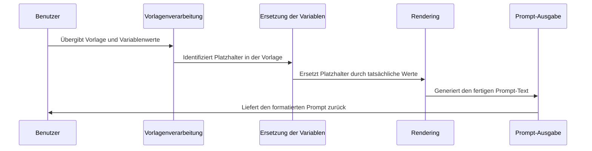

# Chapter 3: Prompt-Vorlagen

In [Kapitel 2: Prompt-Strukturen](02_prompt_strukturen_.md) haben wir gelernt, wie verschiedene Strukturen unsere Interaktionen mit KI-Modellen verbessern können. Nun werden wir einen Schritt weiter gehen und uns mit Prompt-Vorlagen beschäftigen, die uns helfen, konsistente und wiederverwendbare Prompts zu erstellen.

## Die Herausforderung: Wiederholbare Prompts

Stellen Sie sich vor, Sie arbeiten in einem Unternehmen und müssen täglich ähnliche Anfragen an ein KI-Modell stellen – vielleicht Produktbeschreibungen für verschiedene Artikel generieren oder Kundenfeedback zu unterschiedlichen Produkten analysieren. Es wäre mühsam, jedes Mal einen völlig neuen Prompt zu schreiben, besonders wenn die Struktur immer gleich bleibt und nur bestimmte Details variieren.

Genau hier kommen Prompt-Vorlagen ins Spiel. Sie sind wie Kuchenrezepte: Die Grundzutaten und Zubereitungsschritte bleiben gleich, aber Sie können verschiedene Früchte oder Gewürze hinzufügen, um unterschiedliche Geschmacksvarianten zu erzielen.

## Was sind Prompt-Vorlagen?

Prompt-Vorlagen sind wiederverwendbare Textmuster mit Platzhaltern (Variablen), die nach Bedarf durch spezifische Werte ersetzt werden können. Anstatt jedes Mal einen neuen Prompt zu schreiben, erstellen Sie eine Vorlage und füllen nur die variablen Teile aus.

Nehmen wir ein einfaches Beispiel:

Statt wiederholt zu schreiben:
- "Erkläre mir, was Photosynthese ist."
- "Erkläre mir, was Quantenphysik ist."
- "Erkläre mir, was maschinelles Lernen ist."

Können wir eine Vorlage erstellen: "Erkläre mir, was {{thema}} ist."

## Einfache Prompt-Vorlagen erstellen

Lassen Sie uns eine einfache Klasse erstellen, um mit Prompt-Vorlagen zu arbeiten. Wir verwenden dafür die Python-Bibliothek Jinja2, die leistungsstarke Templating-Funktionen bietet:

```python
from jinja2 import Template

class PromptVorlage:
    def __init__(self, vorlage, variablen):
        self.vorlage = Template(vorlage)
        self.variablen = variablen
    
    def formatieren(self, **kwargs):
        return self.vorlage.render(**kwargs)
```

Diese Klasse nimmt eine Vorlage mit Platzhaltern und eine Liste von Variablennamen entgegen. Die `formatieren`-Methode ersetzt die Platzhalter durch die tatsächlichen Werte.

## Verwendung einer einfachen Vorlage

Nun können wir unsere erste Vorlage erstellen und verwenden:

```python
# Einfache Vorlage mit einer Variable
einfache_vorlage = PromptVorlage(
    vorlage="Erkläre mir, was {{ thema }} ist.",
    variablen=["thema"]
)

# Vorlage mit verschiedenen Werten verwenden
prompt1 = einfache_vorlage.formatieren(thema="Photosynthese")
prompt2 = einfache_vorlage.formatieren(thema="Künstliche Intelligenz")
```

Durch die Änderung des Parameters `thema` können wir schnell verschiedene Prompts generieren, ohne die gesamte Struktur neu schreiben zu müssen. Der erste Prompt lautet "Erkläre mir, was Photosynthese ist." und der zweite "Erkläre mir, was Künstliche Intelligenz ist."

## Vorlagen mit mehreren Variablen

Oft benötigen wir komplexere Vorlagen mit mehreren Variablen:

```python
komplexe_vorlage = PromptVorlage(
    vorlage="Erkläre das Konzept {{ konzept }} im Bereich {{ bereich }} "
             "für ein {{ zielgruppe }}-Publikum.",
    variablen=["konzept", "bereich", "zielgruppe"]
)

prompt = komplexe_vorlage.formatieren(
    konzept="neuronale Netze",
    bereich="künstliche Intelligenz",
    zielgruppe="Anfänger"
)
```

Diese Vorlage erstellt den Prompt: "Erkläre das Konzept neuronale Netze im Bereich künstliche Intelligenz für ein Anfänger-Publikum."

## Bedingte Inhalte in Vorlagen

Eine der mächtigsten Funktionen von Vorlagen ist die Möglichkeit, bedingte Inhalte einzufügen. Das bedeutet, dass bestimmte Teile des Prompts nur erscheinen, wenn eine bestimmte Bedingung erfüllt ist:

```python
bedingte_vorlage = PromptVorlage(
    vorlage="Mein Name ist {{ name }} und ich bin {{ alter }} Jahre alt. "
             "Ich arbeite als {{ beruf }}."
             "Ich bin derzeit nicht berufstätig. "
             "Gib mir Karrieretipps.",
    variablen=["name", "alter", "beruf"]
)
```

Diese Vorlage enthält einen bedingten Abschnitt, der nur erscheint, wenn ein Beruf angegeben wird. Andernfalls wird ein alternativer Text verwendet.

## Listen in Vorlagen verarbeiten

Wir können auch Listen in unseren Vorlagen verarbeiten:

```python
listen_vorlage = PromptVorlage(
    vorlage="Analysiere folgende Elemente:\n"
             ""
             "- {{ element.strip() }}\n"
             ""
             "\nFasse die Liste zusammen und schlage Gruppierungen vor.",
    variablen=["elemente"]
)
```

Diese Vorlage nimmt eine kommagetrennte Liste von Elementen entgegen, formatiert sie als Aufzählungsliste und bittet um eine Analyse.

## Wie funktionieren Prompt-Vorlagen intern?

Wenn wir eine Prompt-Vorlage verwenden, passiert Folgendes:



1. **Vorlagendefinition**: Zunächst definieren wir eine Vorlage mit Platzhaltern wie `{{ variable }}`.
2. **Variablenidentifikation**: Die Template-Engine (in unserem Fall Jinja2) identifiziert alle Platzhalter in der Vorlage.
3. **Ersetzung**: Beim Aufruf der `formatieren`-Methode werden die Platzhalter durch die tatsächlichen Werte ersetzt.
4. **Bedingungsauswertung**: Falls die Vorlage bedingte Anweisungen enthält, werden diese ausgewertet.
5. **Schleifenverarbeitung**: Schleifen werden durchlaufen, um wiederholte Inhalte zu generieren.
6. **Rendering**: Der vollständig formatierte Prompt wird zurückgegeben.

## Einsatz von Prompt-Vorlagen in der Praxis

Um den praktischen Einsatz zu veranschaulichen, betrachten wir ein Beispiel aus dem Kundenservice:

```python
feedback_vorlage = PromptVorlage(
    vorlage="Analysiere das folgende Kundenfeedback für {{ produkt }}:\n"
             "\"{{ feedback }}\"\n\n"
             "Bewerte die Stimmung und schlage Verbesserungen vor.",
    variablen=["produkt", "feedback"]
)

# Mehrere Feedbacks analysieren
feedbacks = [
    {"produkt": "Kaffeemaschine", "feedback": "Funktioniert gut, aber laut"},
    {"produkt": "Staubsauger", "feedback": "Zu schwach für Teppiche"},
]

for item in feedbacks:
    prompt = feedback_vorlage.formatieren(**item)
    # Hier würden wir den Prompt an ein KI-Modell senden
    print(prompt)
```

Mit dieser Vorlage können wir schnell Prompts für die Analyse verschiedener Kundenfeedbacks erstellen.

## Fortgeschrittene Techniken: Dynamische Anweisungen

Für komplexere Anwendungsfälle können wir Vorlagen mit dynamischen Anweisungen erstellen:

```python
dynamische_vorlage = PromptVorlage(
    vorlage="Aufgabe: {{ aufgabe }}\n"
             "Kontext: {{ kontext }}\n"
             "Einschränkungen: {{ einschraenkungen }}\n\n"
             "Bitte eine Lösung bereitstellen.",
    variablen=["aufgabe", "kontext", "einschraenkungen"]
)
```

Diese Vorlage eignet sich für verschiedene Aufgabentypen und liefert strukturierte Anweisungen an das KI-Modell.

## Analogien zum besseren Verständnis

### Die Briefvorlage-Analogie

Prompt-Vorlagen sind wie Briefvorlagen in einem Textverarbeitungsprogramm. Sie erstellen einmal eine Struktur mit Platzhaltern für Datum, Empfänger und spezifische Details. Dann können Sie schnell neue Briefe erstellen, indem Sie nur diese spezifischen Informationen ändern.

### Die Kuchenteig-Analogie

Wie in der Einleitung erwähnt, ähneln Prompt-Vorlagen einem Grundteig für Kuchen. Der Bäcker bereitet einen Basisteig zu und kann dann verschiedene Zutaten hinzufügen – Schokolade für einen Schokoladenkuchen, Früchte für einen Obstkuchen – ohne jedes Mal von Grund auf beginnen zu müssen.

## Praktische Tipps für die Verwendung von Prompt-Vorlagen

1. **Identifizieren Sie wiederkehrende Muster**: Achten Sie auf Prompts, die Sie häufig in ähnlicher Form verwenden.
2. **Definieren Sie die variablen Teile**: Bestimmen Sie, welche Teile Ihrer Prompts sich ändern und welche konstant bleiben.
3. **Testen Sie Ihre Vorlagen**: Vergewissern Sie sich, dass Ihre Vorlagen mit verschiedenen Variablenwerten wie erwartet funktionieren.
4. **Erwägen Sie bedingte Logik**: Nutzen Sie bedingte Anweisungen, um flexible Vorlagen zu erstellen, die sich an verschiedene Szenarien anpassen.
5. **Dokumentieren Sie Ihre Vorlagen**: Notieren Sie, wofür jede Vorlage gedacht ist und welche Variablen sie erwartet.

## Integration mit Bibliotheken wie LangChain

Fortgeschrittene Benutzer können auch Bibliotheken wie LangChain nutzen, die integrierte Unterstützung für Prompt-Vorlagen bieten:

```python
from langchain.prompts import PromptTemplate

langchain_vorlage = PromptTemplate(
    input_variables=["thema"],
    template="Erkläre mir, was {thema} ist."
)

prompt = langchain_vorlage.format(thema="Quantencomputing")
```

Diese Bibliotheken bieten zusätzliche Funktionen wie Verkettung von Vorlagen oder Integration mit verschiedenen KI-Modellen.

## Fazit

Prompt-Vorlagen sind ein leistungsstarkes Werkzeug, um die Interaktion mit KI-Modellen effizienter und konsistenter zu gestalten. Sie ermöglichen es uns, wiederverwendbare Muster zu erstellen und nur die variablen Teile anzupassen, ähnlich wie ein Bäcker denselben Grundteig für verschiedene Kuchensorten verwendet.

Durch die Verwendung von Vorlagen sparen wir Zeit, reduzieren Fehler und können komplexere Interaktionen mit KI-Modellen aufbauen. Die Fähigkeit, bedingte Logik und Schleifen in Vorlagen zu integrieren, macht sie besonders vielseitig für verschiedene Anwendungsfälle.

Im nächsten Kapitel [Anweisungs-Engineering](04_anweisungs_engineering_.md) werden wir uns damit beschäftigen, wie wir präzise und effektive Anweisungen für KI-Modelle formulieren können, um genau die Ergebnisse zu erhalten, die wir benötigen.

---

