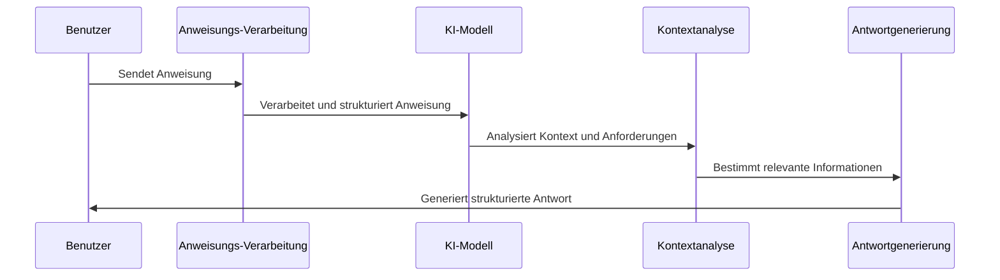

# Chapter 4: Anweisungs-Engineering


In [Kapitel 3: Prompt-Vorlagen](03_prompt_vorlagen_.md) haben wir gelernt, wie wir wiederverwendbare Vorlagen für unsere Prompts erstellen können. Nun werden wir uns mit einem weiteren grundlegenden Konzept befassen: dem Anweisungs-Engineering.

## Warum ist Anweisungs-Engineering wichtig?

Stellen Sie sich vor, Sie versuchen, einem Freund telefonisch zu erklären, wie man einen komplizierten Origami-Schwan faltet. Wenn Ihre Anweisungen unklar oder mehrdeutig sind, wird Ihr Freund wahrscheinlich frustriert sein und das Ergebnis wird nicht wie gewünscht aussehen. Genauso verhält es sich mit KI-Modellen – die Qualität Ihrer Anweisungen bestimmt direkt die Qualität der Antworten.

Betrachten wir ein konkretes Beispiel: Sie möchten eine KI bitten, eine Zusammenfassung eines wissenschaftlichen Artikels zu erstellen. Eine vage Anweisung könnte zu einer unbrauchbaren Zusammenfassung führen, während eine gut formulierte Anweisung genau die gewünschten Informationen liefert.

## Grundprinzipien des Anweisungs-Engineerings

### 1. Klarheit und Präzision

Vergleichen wir zwei unterschiedliche Anweisungen:

```python
# Vage Anweisung
vage_anweisung = "Fasse den Artikel zusammen."

# Klare, präzise Anweisung
klare_anweisung = "Fasse den Artikel über Klimawandel in 3-5 Sätzen zusammen. Hebe die wichtigsten Erkenntnisse und Schlussfolgerungen hervor."
```

Die erste Anweisung lässt zu viel Interpretationsspielraum. Die zweite Anweisung gibt klare Vorgaben zur Länge und zum Inhalt der Zusammenfassung.

### 2. Strukturierung der Anweisungen

Eine gut strukturierte Anweisung hilft dem KI-Modell, eine organisierte Antwort zu erstellen.

```python
strukturierte_anweisung = """
Analysiere den folgenden Nachrichtenartikel und:
1. Nenne das Hauptthema in einem Satz
2. Liste die drei wichtigsten Fakten auf
3. Erkläre mögliche Auswirkungen in 2-3 Sätzen
"""
```

Diese Anweisung gibt eine klare Struktur vor, der das Modell folgen kann.

### 3. Kontext bereitstellen

Kontext hilft dem Modell, relevante Informationen auszuwählen und irrelevante zu ignorieren.

```python
kontext_anweisung = """
Rolle: Du bist ein Ernährungsberater, der einem Anfänger hilft.
Hintergrund: Die Person möchte gesünder essen, hat aber wenig Zeit zum Kochen.
Aufgabe: Erstelle einen einfachen 3-Tage-Ernährungsplan mit schnellen, gesunden Mahlzeiten.
"""
```

Durch die Bereitstellung von Kontext kann das Modell eine zielgerichtetere Antwort geben.

## Anwendungsbeispiel: Wissenschaftliche Artikel zusammenfassen

Lassen Sie uns unser Hauptbeispiel umsetzen: Eine KI anweisen, wissenschaftliche Artikel effektiv zusammenzufassen.

### Schritt 1: Eine einfache Anweisung erstellen

```python
from langchain_openai import ChatOpenAI

# KI-Modell initialisieren
modell = ChatOpenAI(model="gpt-3.5-turbo")

# Einfache Anweisung
einfache_anweisung = "Fasse diesen Artikel zusammen: [Artikeltext hier]"
```

Diese einfache Anweisung könnte zu einer allgemeinen Zusammenfassung führen, die möglicherweise nicht die spezifischen Informationen enthält, die Sie benötigen.

### Schritt 2: Die Anweisung verbessern

```python
verbesserte_anweisung = """
Erstelle eine strukturierte Zusammenfassung des folgenden wissenschaftlichen Artikels:
[Artikeltext hier]

Deine Zusammenfassung sollte folgende Elemente enthalten:
1. Forschungsfrage und Ziel (1-2 Sätze)
2. Methodik (2-3 Sätze)
3. Hauptergebnisse (3-4 Sätze)
4. Schlussfolgerungen und Bedeutung (2-3 Sätze)
"""
```

Diese verbesserte Anweisung gibt dem Modell eine klare Struktur vor und spezifiziert die erwartete Länge für jeden Abschnitt.

### Schritt 3: Kontext und Zielgruppe spezifizieren

```python
def artikel_zusammenfassen(artikeltext, zielgruppe):
    """
    Erstellt eine zielgruppenspezifische Zusammenfassung eines wissenschaftlichen Artikels.
    
    Args:
        artikeltext: Der Text des zu zusammenfassenden Artikels
        zielgruppe: Für wen die Zusammenfassung gedacht ist (z.B. "Experten", "Studenten", "Laien")
    """
    anweisung = f"""
    Rolle: Du bist ein wissenschaftlicher Redakteur, der komplexe Forschung zugänglich macht.
    
    Aufgabe: Fasse den folgenden wissenschaftlichen Artikel für {zielgruppe} zusammen.
    
    Artikel: {artikeltext}
    
    Deine Zusammenfassung sollte:
    1. Die Forschungsfrage und das Ziel klar darstellen (1-2 Sätze)
    2. Die Methodik verständlich erklären (2-3 Sätze)
    3. Die wichtigsten Ergebnisse hervorheben (3-4 Sätze)
    4. Die Schlussfolgerungen und praktische Bedeutung erläutern (2-3 Sätze)
    
    Passe die Fachsprache und Erklärungstiefe an die Zielgruppe ({zielgruppe}) an.
    """
    return modell.invoke(anweisung).content
```

Diese Funktion erstellt eine maßgeschneiderte Anweisung, die nicht nur die Struktur vorgibt, sondern auch die Sprache und Erklärungstiefe an die Zielgruppe anpasst.

## Wie funktioniert Anweisungs-Engineering intern?

Wenn wir eine Anweisung an ein KI-Modell senden, läuft folgender Prozess ab:



1. **Anweisungsverarbeitung**: Das Modell zerlegt die Anweisung in verständliche Teile.
2. **Kontextanalyse**: Es identifiziert die Rolle, die Aufgabe und andere wichtige Kontextinformationen.
3. **Strukturerkennung**: Das Modell erkennt das gewünschte Format für die Antwort.
4. **Informationsauswahl**: Es wählt die relevanten Informationen aus dem bereitgestellten Inhalt aus.
5. **Antwortgenerierung**: Es erstellt eine Antwort, die der angegebenen Struktur und den Anforderungen entspricht.

## Praktische Tipps für besseres Anweisungs-Engineering

### 1. Verwenden Sie die "Rollen-Technik"

```python
rollen_anweisung = """
Du bist ein erfahrener Lehrer für Grundschulkinder.
Erkläre das Konzept der Photosynthese in einfachen Worten, 
die ein 8-jähriges Kind verstehen kann.
"""
```

Durch die Zuweisung einer Rolle geben Sie dem Modell einen klaren Kontext für die Art der erwarteten Antwort.

### 2. Spezifizieren Sie das Format

```python
format_anweisung = """
Erstelle eine Liste von 5 Übungen für Anfänger im Krafttraining.
Für jede Übung gib an:
- Name der Übung
- Zielmuskelgruppe
- Kurze Ausführungsbeschreibung (max. 2 Sätze)
- Anfängertipp
"""
```

Die Angabe eines klaren Formats hilft dem Modell, die Antwort zu strukturieren.

### 3. Geben Sie Beispiele

```python
beispiel_anweisung = """
Übersetze die folgenden englischen Sätze ins Deutsche. 
Behalte den Ton und Stil bei.

Beispiel:
Englisch: "The weather is beautiful today."
Deutsch: "Das Wetter ist heute wunderschön."

Nun übersetze:
Englisch: "I can't wait to try the new restaurant downtown."
"""
```

Beispiele helfen dem Modell, genau zu verstehen, was Sie erwarten.

## Analogien zum besseren Verständnis

### Die Kochrezept-Analogie

Anweisungs-Engineering ist wie das Schreiben eines Kochrezepts. Ein vages Rezept wie "Backe einen Kuchen" führt zu unvorhersehbaren Ergebnissen. Ein detailliertes Rezept mit genauen Mengenangaben, Zubereitungsschritten und Backzeiten führt hingegen zu einem konsistenten und leckeren Ergebnis.

### Die Reiseführer-Analogie

Stellen Sie sich vor, Sie geben einem Freund Anweisungen, wie er zu einem versteckten Strand kommt. Vage Anweisungen wie "Fahre an der Küste entlang und suche nach einem kleinen Pfad" werden wahrscheinlich dazu führen, dass er sich verirrt. Klare Anweisungen mit präzisen Wegbeschreibungen, Landmarken und Entfernungen werden ihm hingegen helfen, sein Ziel zu erreichen.

## Häufige Herausforderungen und Lösungen

### Problem: Zu vage Anweisungen

**Beispiel**: "Schreibe etwas über Hunde."

**Lösung**: "Schreibe einen 300-400 Wörter langen Artikel über die 3 beliebtesten Hunderassen für Familien mit kleinen Kindern. Hebe ihre Temperamente, Pflegebedürfnisse und typischen Gesundheitsprobleme hervor."

### Problem: Zu komplexe Anweisungen

**Beispiel**: Eine lange, unstrukturierte Anweisung mit vielen verschiedenen Anforderungen.

**Lösung**: Teilen Sie komplexe Aufgaben in mehrere einfachere Anweisungen auf oder strukturieren Sie sie klar mit nummerierten Punkten.

### Problem: Widersprüchliche Anforderungen

**Beispiel**: "Schreibe einen detaillierten, aber kurzen Bericht."

**Lösung**: Klären Sie Prioritäten und geben Sie spezifische Grenzen an, z.B. "Schreibe einen kurzen Bericht (max. 500 Wörter) mit Fokus auf die 3 wichtigsten Aspekte des Themas."

## Zusammenfassung

Anweisungs-Engineering ist eine zentrale Fähigkeit im Umgang mit KI-Modellen. Durch klare, strukturierte und kontextreiche Anweisungen können wir die Qualität der KI-Antworten erheblich verbessern. Die wichtigsten Prinzipien sind:

1. Klarheit und Präzision in der Formulierung
2. Strukturierung der gewünschten Antwort
3. Bereitstellung von relevanten Kontext
4. Anpassung an die Zielgruppe
5. Verwendung von Rollen und Beispielen

Mit diesen Techniken können Sie das volle Potenzial von KI-Modellen ausschöpfen und genau die Ergebnisse erhalten, die Sie benötigen.

Im nächsten Kapitel [Zero-Shot-Prompting](05_zero_shot_prompting_.md) werden wir lernen, wie wir KI-Modelle dazu bringen können, Aufgaben ohne vorherige Beispiele zu lösen – eine leistungsstarke Technik, die auf den Grundlagen des Anweisungs-Engineerings aufbaut.

---

