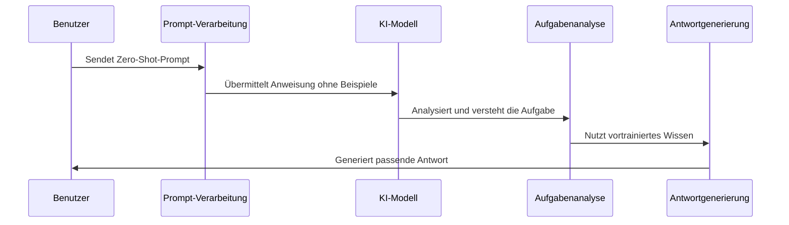

# Chapter 5: Zero-Shot-Prompting


Im vorherigen Kapitel [Anweisungs-Engineering](04_anweisungs_engineering_.md) haben wir gelernt, wie man präzise und effektive Anweisungen für KI-Modelle formuliert. Nun werden wir uns mit einer besonders leistungsfähigen Technik beschäftigen: dem Zero-Shot-Prompting.

## Was ist Zero-Shot-Prompting?

Stellen Sie sich vor, Sie möchten einer Person beibringen, Fahrrad zu fahren – aber ohne ihr jemals zu zeigen, wie es geht. Sie können nur erklären, was zu tun ist, und hoffen, dass die Person es beim ersten Versuch schafft. Genau darum geht es beim Zero-Shot-Prompting.

Zero-Shot-Prompting bedeutet, einer KI eine Aufgabe zu stellen, ohne ihr vorher Beispiele für die gewünschte Ausgabe zu geben. Das Modell muss allein aufgrund der Anweisung verstehen, was zu tun ist, und eine angemessene Antwort generieren.

Nehmen wir ein konkretes Beispiel: Sie möchten, dass eine KI den Ton eines Textes als "positiv", "negativ" oder "neutral" klassifiziert, haben aber keine Zeit, Beispiele vorzubereiten. Mit Zero-Shot-Prompting können Sie diese Aufgabe lösen, indem Sie einfach eine klare Anweisung geben.

## Grundprinzipien des Zero-Shot-Prompting

### 1. Klare Aufgabenbeschreibung

Bei Zero-Shot-Prompting ist eine präzise Beschreibung der Aufgabe entscheidend:

```python
zero_shot_prompt = """Klassifiziere den Ton des folgenden Textes als positiv, negativ oder neutral.
Gib nur die Klassifikation ohne Erklärung an.

Text: "Das neue Restaurant bietet fantastisches Essen zu angemessenen Preisen."

Ton:"""
```

Diese Anweisung definiert klar, was das Modell tun soll, ohne Beispiele zu geben.

### 2. Formatvorgaben

Um eine strukturierte Antwort zu erhalten, können Sie das gewünschte Format angeben:

```python
format_prompt = """Schreibe eine kurze Nachricht zum Thema 'Klimaschutz'.
Strukturiere deine Antwort wie folgt:

Überschrift: [Eine prägnante Überschrift]
Einleitung: [Ein kurzer einleitender Absatz]
Hauptteil: [1-2 kurze Absätze]
Fazit: [Ein abschließender Satz]"""
```

Durch die Vorgabe einer Struktur erhält das Modell einen Rahmen für seine Antwort.

## Zero-Shot-Prompting in der Praxis

Lassen Sie uns sehen, wie wir Zero-Shot-Prompting mit der LangChain-Bibliothek umsetzen können:

```python
from langchain_openai import ChatOpenAI
from langchain.prompts import PromptTemplate

# Modell initialisieren
llm = ChatOpenAI(model="gpt-3.5-turbo")

# Prompt-Vorlage erstellen
template = "Übersetze den folgenden Satz ins {sprache}: '{text}'"
prompt = PromptTemplate.from_template(template)

# Kette erstellen und ausführen
kette = prompt | llm
```

In diesem Beispiel erstellen wir eine einfache Kette, die einen Text in eine angegebene Sprache übersetzt. Beachten Sie, dass wir keine Beispielübersetzungen angeben – das Modell nutzt sein vortrainiertes Wissen, um die Aufgabe zu erledigen.

### Anwendungsbeispiel: Textklassifikation

Betrachten wir ein praktisches Beispiel für die Klassifikation von Kundenrezensionen:

```python
def klassifiziere_stimmung(text):
    prompt = f"""Klassifiziere die Stimmung der folgenden Kundenrezension als POSITIV, 
    NEGATIV oder NEUTRAL. Antworte nur mit einem dieser drei Begriffe.
    
    Rezension: {text}
    
    Stimmung:"""
    
    return llm.invoke(prompt).content

# Beispielanwendung
rezension = "Das Produkt kam beschädigt an und der Kundenservice war unhöflich."
ergebnis = klassifiziere_stimmung(rezension)
print(f"Stimmung: {ergebnis}")  # Gibt "NEGATIV" aus
```

Diese Funktion analysiert die Stimmung einer Kundenrezension, ohne dass wir Beispiele für positive, negative oder neutrale Rezensionen bereitstellen müssen.

## Wie funktioniert Zero-Shot-Prompting intern?

Wenn wir einen Zero-Shot-Prompt an ein KI-Modell senden, läuft folgender Prozess ab:



1. **Prompt-Verarbeitung**: Der Zero-Shot-Prompt wird an das Modell gesendet.
2. **Aufgabenanalyse**: Das Modell analysiert die Anweisung und identifiziert die zu lösende Aufgabe.
3. **Wissensanwendung**: Es nutzt sein während des Trainings erworbenes Wissen, um die Aufgabe zu verstehen.
4. **Antwortgenerierung**: Das Modell generiert eine Antwort, die der gestellten Aufgabe entspricht, ohne auf explizite Beispiele zurückzugreifen.

## Fortgeschrittene Techniken des Zero-Shot-Prompting

### 1. Rollen-Prompting

Durch die Zuweisung einer spezifischen Rolle können Sie das Verhalten des Modells steuern:

```python
rollen_prompt = """Du bist ein Experte für Computersicherheit.
Erkläre in einfachen Worten, wie man ein sicheres Passwort erstellt."""
```

Diese Technik hilft dem Modell, einen bestimmten Blickwinkel einzunehmen.

### 2. Mehrschrittiges Denken

Bei komplexen Aufgaben können Sie das Modell anleiten, schrittweise zu denken:

```python
schrittweiser_prompt = """Analysiere das folgende Problem in Schritten:
1. Identifiziere die Hauptfaktoren
2. Bewerte mögliche Lösungsansätze
3. Empfehle die beste Lösung

Problem: Ein Unternehmen hat hohe Mitarbeiterfluktuation."""
```

Diese Struktur hilft dem Modell, komplexe Probleme systematisch anzugehen.

## Analogien zum besseren Verständnis

### Die Navigations-Analogie

Zero-Shot-Prompting ist wie das Navigieren in einer unbekannten Stadt nur mit einer Beschreibung des Ziels. Stellen Sie sich vor, Sie sagen jemandem: "Finde das höchste Gebäude in der Stadt." Die Person hat keine Karte oder Beispiele für hohe Gebäude, muss aber ihr allgemeines Wissen darüber nutzen, wie hohe Gebäude aussehen, um die Aufgabe zu lösen.

### Die Musikinstrument-Analogie

Es ist, als würde man einem geübten Musiker ein neues Lied beschreiben, ohne es vorzuspielen. Ein erfahrener Pianist kann ein Stück basierend auf einer Beschreibung wie "spiele eine melancholische Melodie in d-Moll mit langsamen Tempi" interpretieren, obwohl er das spezifische Stück noch nie gehört hat.

## Praktische Tipps für erfolgreiches Zero-Shot-Prompting

1. **Seien Sie präzise**: Je klarer Ihre Anweisung, desto besser wird das Ergebnis.
2. **Formatieren Sie Ihre Anfrage**: Geben Sie ein gewünschtes Antwortformat vor.
3. **Nutzen Sie Rollen**: Weisen Sie dem Modell eine relevante Rolle zu.
4. **Beschränken Sie den Umfang**: Komplexe Aufgaben in kleinere Teile zerlegen.
5. **Testen und iterieren**: Verfeinern Sie Ihre Prompts basierend auf den Ergebnissen.

## Beispiel: Textzusammenfassung ohne Beispiele

```python
def zusammenfassen(text, max_laenge=100):
    prompt = f"""Fasse den folgenden Text in maximal {max_laenge} Wörtern zusammen.
    Bewahre die wichtigsten Informationen und den Ton des Originals.
    
    Text: {text}
    
    Zusammenfassung:"""
    
    return llm.invoke(prompt).content
```

Diese Funktion fasst einen Text zusammen, ohne dass wir Beispiele für gute Zusammenfassungen bereitstellen müssen.

## Wann Zero-Shot-Prompting verwenden?

Zero-Shot-Prompting eignet sich besonders gut für:

1. **Einfache Klassifikationsaufgaben**: Sentiment-Analyse, Kategorisierung von Texten
2. **Formatierungsaufgaben**: Umwandlung von Daten in bestimmte Formate
3. **Kreative Aufgaben**: Texterstellung, Ideengeneration
4. **Schnelle Prototypen**: Wenn keine Zeit für die Erstellung von Beispielen ist
5. **Allgemeine Wissensfragen**: Fragen, die allgemeines Wissen erfordern

Für komplexere oder sehr spezifische Aufgaben kann jedoch [Few-Shot-Learning](06_few_shot_learning_.md) bessere Ergebnisse liefern.

## Fazit

Zero-Shot-Prompting ist eine mächtige Technik, die es uns ermöglicht, KI-Modelle für verschiedene Aufgaben zu nutzen, ohne explizite Beispiele bereitzustellen. Wie ein talentierter Musiker, der ein Stück ohne vorheriges Üben spielen kann, kann ein gut trainiertes KI-Modell Aufgaben basierend auf klaren Anweisungen ausführen.

Die Schlüssel zum Erfolg sind präzise Formulierungen, klare Formatvorgaben und ein Verständnis dafür, wie das Modell Ihre Anweisungen interpretiert. Mit etwas Übung können Sie Zero-Shot-Prompting für eine Vielzahl von Anwendungen nutzen, von einfachen Klassifikationsaufgaben bis hin zu kreativen Projekten.

Im nächsten Kapitel [Few-Shot-Learning](06_few_shot_learning_.md) werden wir sehen, wie wir die Leistung von KI-Modellen durch die Bereitstellung einiger weniger Beispiele noch weiter verbessern können – eine Technik, die besonders nützlich ist, wenn Zero-Shot-Prompting nicht die gewünschten Ergebnisse liefert.

---

