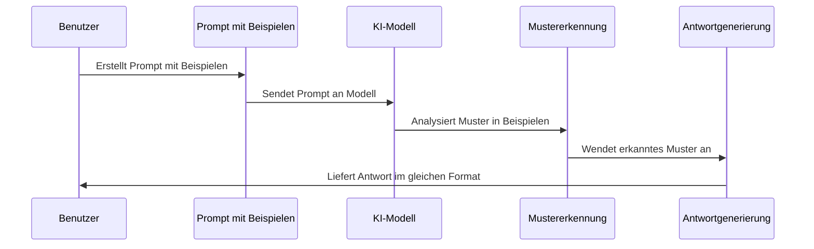

# Chapter 6: Few-Shot-Learning


Im vorherigen Kapitel [Zero-Shot-Prompting](05_zero_shot_prompting_.md) haben wir gelernt, wie KI-Modelle Aufgaben ohne Beispiele lösen können. Nun werden wir uns mit einem Ansatz beschäftigen, der durch einige wenige Beispiele die Leistung von KI-Modellen erheblich steigern kann: Few-Shot-Learning.

## Einführung: Lernen durch Beispiele

Stellen Sie sich vor, Sie möchten einem Kind beibringen, Äpfel von Birnen zu unterscheiden. Anstatt nur zu sagen "Finde die Äpfel", zeigen Sie dem Kind einige Beispiele: "Das ist ein Apfel, das ist eine Birne, das ist auch ein Apfel..." Nach nur wenigen Beispielen kann das Kind das Muster erkennen und selbstständig weitere Früchte korrekt identifizieren.

Genau so funktioniert Few-Shot-Learning bei KI-Modellen. Wir geben dem Modell einige wenige Beispiele (typischerweise 2-5), um ein Muster zu demonstrieren, und bitten es dann, dieses Muster auf einen neuen Fall anzuwenden.

## Ein praktisches Beispiel: Stimmungsanalyse

Nehmen wir an, wir möchten Kundenbewertungen automatisch als positiv, negativ oder neutral klassifizieren. Mit Few-Shot-Learning können wir das so umsetzen:

```python
from langchain_openai import ChatOpenAI

llm = ChatOpenAI(model="gpt-3.5-turbo")

prompt = """
Klassifiziere die Stimmung des Textes als positiv, negativ oder neutral.

Text: "Dieses Produkt ist fantastisch!"
Stimmung: Positiv

Text: "Die Lieferung war verspätet und der Artikel beschädigt."
Stimmung: Negativ

Text: "Das Paket kam pünktlich an."
Stimmung: Neutral

Text: "Die Qualität übertrifft alle meine Erwartungen."
Stimmung:
"""

antwort = llm.invoke(prompt).content
print(antwort)  # Gibt "Positiv" aus
```

In diesem Beispiel haben wir dem Modell drei Beispiele gegeben: einen positiven, einen negativen und einen neutralen Text. Das Modell erkennt das Muster und kann nun die Stimmung des vierten Textes korrekt als "positiv" klassifizieren.

## Warum Few-Shot-Learning funktioniert

Few-Shot-Learning nutzt die Fähigkeit großer Sprachmodelle, Muster zu erkennen und zu verallgemeinern. Durch die Bereitstellung einiger Beispiele:

1. **Verdeutlichen wir die Aufgabe**: Das Modell versteht genauer, was wir erwarten
2. **Zeigen wir das gewünschte Format**: Die Beispiele demonstrieren, wie die Antwort strukturiert sein sollte
3. **Reduzieren wir Mehrdeutigkeit**: Wir minimieren unterschiedliche Interpretationsmöglichkeiten

## Strukturierung von Few-Shot-Prompts

Ein effektiver Few-Shot-Prompt folgt typischerweise dieser Struktur:

1. **Aufgabenbeschreibung**: Eine klare Erklärung der zu lösenden Aufgabe
2. **Beispiele**: 2-5 Beispiele mit Eingabe und erwarteter Ausgabe
3. **Neue Eingabe**: Der tatsächliche Fall, den das Modell bearbeiten soll

```python
def few_shot_prompt(neue_eingabe, beispiele):
    prompt = "Aufgabe: Übersetze deutsche Wörter ins Englische.\n\n"
    
    # Beispiele hinzufügen
    for bsp in beispiele:
        prompt += f"Deutsch: {bsp['deutsch']}\n"
        prompt += f"Englisch: {bsp['englisch']}\n\n"
    
    # Neue Eingabe hinzufügen
    prompt += f"Deutsch: {neue_eingabe}\nEnglisch:"
    
    return prompt
```

Diese Funktion erstellt einen Few-Shot-Prompt für Übersetzungen. Sie nimmt eine neue Eingabe und eine Liste von Beispielen entgegen und formatiert daraus einen vollständigen Prompt.

## Anwendungsbeispiel: Textklassifikation

Lassen Sie uns ein komplexeres Beispiel betrachten: die Klassifikation von Nachrichtenartikeln nach Kategorien.

```python
beispiele = [
    {"text": "Die Aktienmärkte verzeichneten gestern starke Verluste.", 
     "kategorie": "Wirtschaft"},
    {"text": "Das Nationalteam gewinnt das Finale mit 2:1.", 
     "kategorie": "Sport"},
    {"text": "Neue Studie zeigt Zusammenhang zwischen Ernährung und Schlaf.", 
     "kategorie": "Gesundheit"}
]

neuer_artikel = "Der Dax stieg um 1,5 Prozent auf ein neues Rekordhoch."

prompt = "Klassifiziere den Nachrichtenartikel in eine Kategorie.\n\n"
```

Um den Prompt zu vervollständigen, fügen wir die Beispiele hinzu:

```python
for bsp in beispiele:
    prompt += f"Artikel: {bsp['text']}\n"
    prompt += f"Kategorie: {bsp['kategorie']}\n\n"

prompt += f"Artikel: {neuer_artikel}\nKategorie:"

antwort = llm.invoke(prompt).content
print(antwort)  # Gibt "Wirtschaft" aus
```

Das Modell hat anhand der Beispiele gelernt, Artikel zu klassifizieren, und ordnet den neuen Artikel korrekt der Kategorie "Wirtschaft" zu.

## Wie funktioniert Few-Shot-Learning intern?

Wenn wir einen Few-Shot-Prompt an ein KI-Modell senden, passiert Folgendes:



1. **Tokenisierung**: Der Prompt wird in Tokens (Wörter oder Teilwörter) zerlegt
2. **Musteranalyse**: Das Modell erkennt das gemeinsame Muster in den Beispielen
3. **Analogieschluss**: Es wendet das erkannte Muster auf den neuen Fall an
4. **Antwortgenerierung**: Es generiert eine Antwort, die dem Format der Beispiele folgt

## Praktische Tipps für effektives Few-Shot-Learning

### 1. Beispielauswahl

Die Qualität der Beispiele ist entscheidend für den Erfolg:

```python
# Gute Beispielauswahl für Stimmungsklassifikation
gute_beispiele = [
    {"text": "Das Essen war köstlich!", "stimmung": "positiv"},
    {"text": "Der Service war schrecklich und das Essen kalt.", "stimmung": "negativ"},
    {"text": "Das Restaurant war okay, nichts Besonderes.", "stimmung": "neutral"}
]

# Schlechte Beispielauswahl (alle ähnlich)
schlechte_beispiele = [
    {"text": "Das Essen war gut.", "stimmung": "positiv"},
    {"text": "Der Service war gut.", "stimmung": "positiv"},
    {"text": "Die Atmosphäre war gut.", "stimmung": "positiv"}
]
```

Verwenden Sie vielfältige Beispiele, die verschiedene Aspekte der Aufgabe abdecken.

### 2. Reihenfolge der Beispiele

Die Reihenfolge kann das Ergebnis beeinflussen:

```python
# Reihenfolge-Effekt demonstrieren
def teste_reihenfolge(beispiele, neue_eingabe):
    # Normale Reihenfolge
    prompt1 = erstelle_prompt(beispiele, neue_eingabe)
    # Umgekehrte Reihenfolge
    prompt2 = erstelle_prompt(list(reversed(beispiele)), neue_eingabe)
    
    return llm.invoke(prompt1).content, llm.invoke(prompt2).content
```

Um Reihenfolge-Effekte zu minimieren, verwenden Sie eine konsistente Struktur und ausgewogene Beispiele.

### 3. Anzahl der Beispiele

In der Regel reichen 3-5 Beispiele aus. Zu viele Beispiele können das Modell verwirren oder den Kontext sprengen:

```python
def few_shot_mit_n_beispielen(n, alle_beispiele, neue_eingabe):
    """Verwendet n zufällige Beispiele aus allen verfügbaren Beispielen"""
    import random
    ausgewählte = random.sample(alle_beispiele, min(n, len(alle_beispiele)))
    return erstelle_prompt(ausgewählte, neue_eingabe)
```

## Analogie: Der Lehrer-Schüler-Ansatz

Few-Shot-Learning ähnelt dem Unterricht eines guten Lehrers. Statt abstrakte Regeln zu erklären ("So funktioniert Grammatik"), zeigt der Lehrer konkrete Beispiele ("Hier sind drei korrekte Sätze"). Nach wenigen gut ausgewählten Beispielen kann der Schüler das Muster erkennen und auf neue Fälle anwenden.

Wenn ein Kind "Ich habe einen Apfel gegessen" und "Wir sind nach Hause gegangen" als Beispiele für Vergangenheitsformen hört, kann es intuitiv verstehen, wie man "springen" in der Vergangenheit verwendet, ohne die formale Regel zu kennen.

## Vergleich: Zero-Shot vs. Few-Shot

Lassen Sie uns Zero-Shot und Few-Shot für die gleiche Aufgabe vergleichen:

```python
# Zero-Shot-Ansatz
zero_shot = "Klassifiziere diesen Text als technisch oder nicht-technisch: 'Der neue Prozessor verwendet 5nm-Technologie.'"

# Few-Shot-Ansatz
few_shot = """
Klassifiziere diese Texte als technisch oder nicht-technisch:

Text: "Der Film war spannend und emotional."
Klassifikation: Nicht-technisch

Text: "Die Blockchain nutzt kryptografische Hashing-Funktionen."
Klassifikation: Technisch

Text: "Der neue Prozessor verwendet 5nm-Technologie."
Klassifikation:
"""
```

Der Few-Shot-Ansatz führt oft zu genaueren und konsistenteren Ergebnissen, besonders bei komplexeren oder mehrdeutigen Aufgaben.

## Erweiterte Techniken: Chain-of-Thought mit Few-Shot

Für komplexere Aufgaben können wir Few-Shot mit Gedankenketten (Chain-of-Thought) kombinieren:

```python
cot_few_shot = """
Löse diese mathematischen Textaufgaben:

Aufgabe: Tim hat 5 Äpfel und isst 2. Wie viele hat er noch?
Gedankengang: Tim beginnt mit 5 Äpfeln. Er isst 2 Äpfel. 5 - 2 = 3.
Antwort: 3 Äpfel

Aufgabe: Anna hat 3 mal so viele Bücher wie Ben. Ben hat 4 Bücher. Wie viele hat Anna?
Gedankengang: Ben hat 4 Bücher. Anna hat 3 mal so viele. 3 × 4 = 12.
Antwort: 12 Bücher

Aufgabe: Max kauft 6 Stifte für je 2€. Wie viel gibt er aus?
Gedankengang:
"""
```

Durch die Demonstration des Lösungswegs in den Beispielen kann das Modell komplexere Problemlösungsfähigkeiten zeigen.

## Fazit

Few-Shot-Learning ist eine leistungsstarke Technik, die die Fähigkeiten von KI-Modellen mit nur wenigen Beispielen erheblich verbessern kann. Wie ein Kind, das durch Beispiele lernt, können KI-Modelle Muster erkennen und auf neue Situationen anwenden, ohne dass eine aufwändige Feinabstimmung erforderlich ist.

Die Schlüssel zum Erfolg sind die sorgfältige Auswahl vielfältiger, repräsentativer Beispiele und eine klare Strukturierung der Prompts. Mit etwas Übung können Sie Few-Shot-Learning für eine Vielzahl von Aufgaben einsetzen, von einfachen Klassifikationen bis hin zu komplexeren Reasonings.

Im nächsten Kapitel [Gedankenketten-Prompting](07_gedankenketten_prompting_.md) werden wir sehen, wie wir KI-Modelle dazu bringen können, ihre Denkprozesse schrittweise offenzulegen – eine Technik, die besonders für komplexe Problemlösungen und Argumentation nützlich ist.

---

