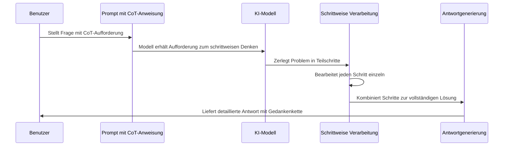

# Chapter 7: Gedankenketten-Prompting


Im vorherigen Kapitel [Few-Shot-Learning](06_few_shot_learning_.md) haben wir gelernt, wie einige wenige Beispiele die Leistung von KI-Modellen erheblich verbessern können. Nun werden wir uns mit einer Technik beschäftigen, die den Denkprozess von KI-Modellen transparenter macht: dem Gedankenketten-Prompting.

## Was ist Gedankenketten-Prompting?

Stellen Sie sich vor, Sie bitten einen Mathematiklehrer, eine komplexe Aufgabe zu lösen. Wenn er Ihnen nur die Endlösung mitteilt, verstehen Sie möglicherweise nicht, wie er zu diesem Ergebnis gekommen ist. Wenn er jedoch jeden Schritt seines Denkprozesses erklärt, können Sie seinen Gedankengang nachvollziehen und besser verstehen.

Genau das ist das Prinzip des Gedankenketten-Prompting (im Englischen "Chain of Thought Prompting"): Wir ermutigen das KI-Modell, seinen Denkprozess Schritt für Schritt offenzulegen, anstatt direkt zur Antwort zu springen.

## Warum ist Gedankenketten-Prompting wichtig?

Diese Technik bietet mehrere Vorteile:

1. **Nachvollziehbarkeit**: Sie können den Lösungsweg des Modells verstehen
2. **Fehleridentifikation**: Sie können erkennen, wo das Modell möglicherweise falsch abbiegt
3. **Genauigkeit**: Das Modell erreicht oft bessere Ergebnisse, wenn es schrittweise denkt
4. **Lernpotenzial**: Sie können selbst aus dem Denkprozess des Modells lernen

## Ein einfaches Beispiel

Vergleichen wir einen normalen Prompt mit einem Gedankenketten-Prompt:

```python
# Normaler Prompt
normaler_prompt = "Was ist das Ergebnis von 17 × 24?"

# Gedankenketten-Prompt
cot_prompt = """Was ist das Ergebnis von 17 × 24? 
Denke Schritt für Schritt."""
```

Der zweite Prompt fordert das Modell explizit auf, seinen Denkprozess zu zeigen, statt nur die Antwort zu geben.

### Die Antworten im Vergleich

**Antwort auf normalen Prompt:**
"Das Ergebnis von 17 × 24 ist 408."

**Antwort auf Gedankenketten-Prompt:**
"Um 17 × 24 zu berechnen, gehe ich schrittweise vor:
1. Ich multipliziere 17 × 4 = 68
2. Ich multipliziere 17 × 20 = 340
3. Ich addiere die Teilergebnisse: 68 + 340 = 408
Das Ergebnis von 17 × 24 ist also 408."

Wie Sie sehen können, zeigt das Modell im zweiten Fall seinen gesamten Gedankengang, was die Antwort nachvollziehbarer macht.

## Anwendung bei komplexeren Problemen

Gedankenketten-Prompting ist besonders nützlich bei komplexeren Aufgaben. Betrachten wir ein Beispiel mit einer Textaufgabe:

```python
from langchain_openai import ChatOpenAI

llm = ChatOpenAI(model="gpt-4")

textaufgabe = """
Peter hat 5 Äpfel. Er gibt Marie 2 Äpfel und bekommt von Thomas 3 Äpfel. 
Wie viele Äpfel hat Peter am Ende?
"""

cot_prompt = f"{textaufgabe}\nLöse diese Aufgabe Schritt für Schritt."
```

Dieser Prompt fordert das Modell auf, die Textaufgabe schrittweise zu lösen.

## Die Antwort analysieren

Die Antwort des Modells könnte so aussehen:

```
Schritt 1: Peter beginnt mit 5 Äpfeln.
Schritt 2: Er gibt Marie 2 Äpfel ab. Jetzt hat er 5 - 2 = 3 Äpfel.
Schritt 3: Er bekommt von Thomas 3 Äpfel. Jetzt hat er 3 + 3 = 6 Äpfel.
Antwort: Peter hat am Ende 6 Äpfel.
```

Durch die schrittweise Lösung können wir den Gedankengang des Modells verfolgen und sicherstellen, dass die Lösung korrekt ist.

## Gedankenketten für komplexeres Reasoning

Bei komplexeren Problemen, wie logischen Aufgaben oder Mathematikproblemen, wird der Vorteil von Gedankenketten noch deutlicher. Hier ein Beispiel:

```python
komplexe_aufgabe = """
Ein Zug fährt von Berlin nach München mit einer Durchschnittsgeschwindigkeit von 
120 km/h. Die Strecke ist 600 km lang. Ein zweiter Zug startet 1 Stunde später 
und fährt mit 150 km/h. Wann und wo wird der zweite Zug den ersten überholen?
"""

cot_prompt = f"{komplexe_aufgabe}\nDenke Schritt für Schritt, um diese Aufgabe zu lösen."
```

Bei solchen mehrschrittigen Problemen hilft das Gedankenketten-Prompting dem Modell, die Aufgabe systematisch anzugehen und reduziert die Wahrscheinlichkeit von Fehlern.

## Wie funktionieren Gedankenketten intern?

Wenn wir ein KI-Modell mit Gedankenketten-Prompting nutzen, läuft folgender Prozess ab:



Der entscheidende Unterschied zu anderen Prompting-Techniken ist, dass das Modell explizit aufgefordert wird, seine Gedanken zu externalisieren und das Problem in logische Teilschritte zu zerlegen, bevor es zur endgültigen Antwort kommt.

## Kombination mit Few-Shot-Learning

Eine besonders effektive Strategie ist die Kombination von Gedankenketten-Prompting mit [Few-Shot-Learning](06_few_shot_learning_.md). Dabei zeigen wir dem Modell nicht nur Beispiele, sondern auch, wie diese Beispiele schrittweise gelöst werden:

```python
few_shot_cot = """
Frage: In einem Raum sind 5 Personen. Jede Person schüttelt jedem anderen die Hand. 
Wie viele Händeschütteln finden statt?

Gedankengang: 
- Person 1 schüttelt 4 anderen Personen die Hand
- Person 2 schüttelt 3 anderen Personen die Hand (mit Person 1 wurde bereits gezählt)
- Person 3 schüttelt 2 anderen Personen die Hand (mit Personen 1 und 2 wurde bereits gezählt)
- Person 4 schüttelt 1 anderen Person die Hand (mit Personen 1, 2 und 3 wurde bereits gezählt)
- Person 5 muss niemandem mehr die Hand schütteln (alle wurden bereits gezählt)
- Also: 4 + 3 + 2 + 1 = 10 Händeschütteln

Frage: In einer Schulklasse sind 15 Schüler. Die Lehrerin möchte Gruppen mit jeweils 
4 Schülern bilden. Wie viele vollständige Gruppen kann sie bilden und wie viele 
Schüler bleiben übrig?

Gedankengang:
"""
```

Mit dieser Kombination zeigen wir dem Modell nicht nur, was zu tun ist, sondern auch, wie es denken soll.

## Selbstkonsistenz durch mehrere Gedankenketten

Eine fortgeschrittene Technik ist die Selbstkonsistenz (Self-Consistency), bei der wir das Modell mehrere verschiedene Gedankenketten für dasselbe Problem generieren lassen und dann die häufigste Antwort auswählen:

```python
def mehrere_gedankenketten(frage, anzahl=3):
    antworten = []
    for i in range(anzahl):
        prompt = f"{frage}\nDenke Schritt für Schritt, um diese Frage zu beantworten."
        antwort = llm.invoke(prompt).content
        antworten.append(antwort)
    return antworten
```

Diese Funktion generiert mehrere Gedankenketten für dieselbe Frage, was die Zuverlässigkeit der Antwort erhöhen kann.

## Praktische Tipps für effektives Gedankenketten-Prompting

1. **Seien Sie explizit**: Fordern Sie das Modell klar auf, seine Gedanken Schritt für Schritt zu erklären
2. **Strukturieren Sie den Prompt**: Verwenden Sie Phrasen wie "Denke Schritt für Schritt" oder "Löse diese Aufgabe schrittweise"
3. **Kombinieren Sie mit Few-Shot**: Zeigen Sie Beispiele für gute Gedankenketten
4. **Prüfen Sie die Logik**: Überprüfen Sie jeden Schritt der Gedankenkette auf Fehler
5. **Iterieren Sie**: Wenn eine Gedankenkette nicht zum gewünschten Ergebnis führt, verfeinern Sie den Prompt

## Anwendungsbereiche für Gedankenketten-Prompting

Diese Technik ist besonders nützlich für:

- **Mathematische Probleme**: Schritt-für-Schritt-Lösungen von Gleichungen oder Textaufgaben
- **Logische Rätsel**: Nachvollziehbare Lösungswege für komplexe Denkaufgaben
- **Entscheidungsfindung**: Transparente Abwägung von Vor- und Nachteilen
- **Programmierung**: Erklärung des Gedankengangs bei der Algorithmenentwicklung
- **Textanalyse**: Strukturierte Analyse von Texten oder Argumenten

## Die Analogie des Wanderwegs

Stellen Sie sich Gedankenketten-Prompting wie einen detaillierten Wanderführer vor. Anstatt Ihnen nur zu sagen "Der Gipfel ist dort oben", beschreibt der Führer jeden Abzweig, jede Landmarke und jeden Höhenmeter auf dem Weg zum Gipfel. Dies ermöglicht es Ihnen nicht nur, dem Weg besser zu folgen, sondern auch, ihn später selbst zu finden oder anderen zu erklären.

## Grenzen des Gedankenketten-Prompting

Obwohl diese Technik sehr nützlich ist, hat sie auch Einschränkungen:

- **Längere Antworten**: Die detaillierten Erklärungen führen zu längeren Texten
- **Kontextlimitierungen**: Bei sehr komplexen Problemen kann der verfügbare Kontext überschritten werden
- **Mögliche Fehlschlüsse**: Auch bei schrittweisem Vorgehen kann das Modell Fehler machen
- **Keine Garantie**: Die Offenlegung des Gedankengangs garantiert nicht immer die Richtigkeit

## Fallstudie: Ein komplexes Rätsel lösen

Betrachten wir, wie Gedankenketten-Prompting bei einem logischen Rätsel helfen kann:

```python
rätsel = """
In einem Raum sind drei Personen: Anna, Ben und Clara. Eine von ihnen sagt immer 
die Wahrheit, eine lügt immer, und eine wechselt zwischen Wahrheit und Lüge.
Anna sagt: "Ben lügt immer."
Ben sagt: "Clara wechselt zwischen Wahrheit und Lüge."
Clara sagt: "Anna und ich sind beide Lügner."
Wer ist wer?
"""

cot_prompt = f"{rätsel}\nLöse dieses Rätsel Schritt für Schritt, indem du alle möglichen Fälle analysierst."
```

Bei solchen komplexen Rätseln ist die schrittweise Analyse der verschiedenen Möglichkeiten entscheidend, um zur richtigen Lösung zu gelangen.

## Fazit

Gedankenketten-Prompting ist eine leistungsstarke Technik, die KI-Modelle dazu bringt, ihren Denkprozess transparent zu machen. Ähnlich wie ein Mathematiklehrer, der nicht nur das Ergebnis, sondern den vollständigen Lösungsweg zeigt, ermöglicht diese Methode ein besseres Verständnis der KI-Antworten.

Durch die Kombination mit anderen Techniken wie [Few-Shot-Learning](06_few_shot_learning_.md) können wir die Qualität und Nachvollziehbarkeit der Antworten weiter verbessern. Besonders bei komplexen Problemen, die mehrere Denkschritte erfordern, zeigt Gedankenketten-Prompting seine Stärken.

Im nächsten Kapitel [Eingeschränkte Generierung](08_eingeschränkte_generierung_.md) werden wir uns damit beschäftigen, wie wir die Ausgaben von KI-Modellen gezielt einschränken können, um noch präzisere und kontrollierbarere Ergebnisse zu erzielen.

---

