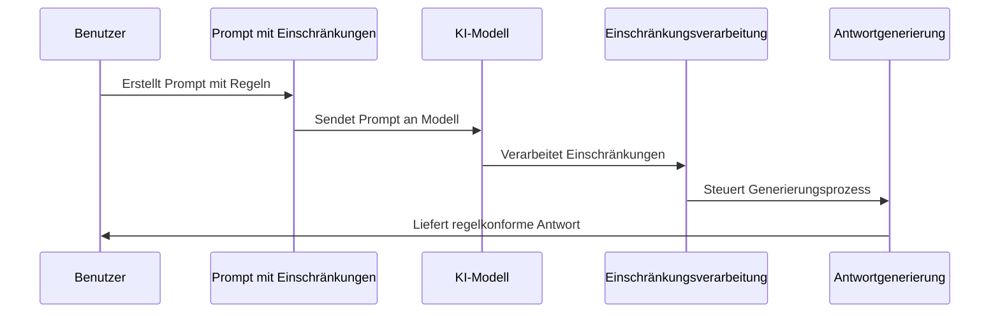

# Chapter 8: Eingeschränkte Generierung


Im vorherigen Kapitel [Gedankenketten-Prompting](07_gedankenketten_prompting_.md) haben wir gelernt, wie wir KI-Modelle dazu bringen können, ihren Denkprozess offenzulegen. Nun werden wir uns mit einer Technik beschäftigen, die uns hilft, die Ausgaben von KI-Modellen gezielt zu steuern: der eingeschränkten Generierung.

## Motivation: Grenzen setzen für präzisere Ergebnisse

Stellen Sie sich vor, Sie beauftragen einen Koch, ein Gericht zuzubereiten, müssen ihm aber mitteilen, dass einige Ihrer Gäste Allergien haben. Sie würden klare Anweisungen geben: "Bitte verwenden Sie keine Nüsse oder Meeresfrüchte." Ähnlich funktioniert die eingeschränkte Generierung bei KI-Modellen.

Bei der eingeschränkten Generierung legen wir der KI bestimmte Regeln und Grenzen für ihre Antworten auf. Dies ist besonders nützlich, wenn wir:
- Unerwünschte Inhalte vermeiden möchten
- Ein bestimmtes Format oder eine Struktur benötigen
- Die Länge der Antwort begrenzen wollen
- Spezifische Informationen ein- oder ausschließen möchten

Nehmen wir ein praktisches Beispiel: Sie möchten eine Produktbeschreibung für einen Online-Shop erstellen, aber sie muss genau 50 Wörter umfassen und darf keine technischen Details enthalten. Mit eingeschränkter Generierung können wir genau diese Anforderungen umsetzen.

## Grundlegende Konzepte der eingeschränkten Generierung

### 1. Negative Prompts

Ein negativer Prompt teilt dem Modell mit, was es vermeiden oder ausschließen soll. Dies ist wie das Setzen von Verbotsschildern für die KI.

```python
negativer_prompt = """
Schreibe eine kurze Geschichte über einen Waldspaziergang.
Wichtig: Erwähne KEINE gefährlichen Tiere oder Unfälle.
"""
```

Dieser Prompt weist das Modell an, eine Geschichte zu schreiben, aber bestimmte negative Elemente zu vermeiden. Die KI wird versuchen, eine positive, sichere Waldgeschichte zu erzeugen.

### 2. Formateinschränkungen

Formateinschränkungen legen fest, wie die Antwort strukturiert sein soll.

```python
format_prompt = """
Erstelle eine Produktbeschreibung für eine Smartwatch.
Format: 
- Überschrift (max. 5 Wörter)
- 3 Stichpunkte zu Vorteilen
- Preis
- Kurzes Fazit (1 Satz)
"""
```

Diese Art von Prompt gibt dem Modell eine klare Struktur vor, an die es sich halten soll. Die generierte Antwort wird genau diesen Aufbau befolgen.

### 3. Längeneinschränkungen

Manchmal benötigen wir Antworten einer bestimmten Länge – nicht zu lang und nicht zu kurz.

```python
längen_prompt = """
Erkläre, was künstliche Intelligenz ist.
Deine Antwort muss genau 3 Sätze umfassen.
"""
```

Dieser Prompt begrenzt die Antwortlänge auf genau drei Sätze. Die KI wird versuchen, die wichtigsten Informationen prägnant in diesen Umfang zu packen.

### 4. Inhaltliche Einschränkungen

Inhaltliche Einschränkungen definieren, welche spezifischen Informationen oder Themen behandelt werden sollen.

```python
inhalt_prompt = """
Beschreibe Venedig, aber konzentriere dich NUR auf:
- Architektur
- Kanäle
- Geschichte vor dem 18. Jahrhundert
"""
```

Dieser Prompt schränkt den Inhalt auf bestimmte Aspekte ein und schließt andere aus. Die KI wird nur über die genannten Themen sprechen.

## Anwendung der eingeschränkten Generierung

Lassen Sie uns anhand eines praktischen Beispiels sehen, wie wir die eingeschränkte Generierung umsetzen können. Stellen Sie sich vor, wir möchten eine Zusammenfassung eines Films erstellen, die bestimmten Kriterien entspricht.

```python
from langchain_openai import ChatOpenAI

# Modell initialisieren
llm = ChatOpenAI(model="gpt-3.5-turbo")

# Eingeschränkten Prompt erstellen
film_prompt = """
Fasse den Film 'Matrix' zusammen mit folgenden Einschränkungen:
1. Maximal 100 Wörter
2. Verrate nicht das Ende
3. Erwähne nur die Hauptfiguren Neo, Trinity und Morpheus
4. Verwende keine Filmzitate
"""
```

In diesem Beispiel haben wir einen Prompt erstellt, der mehrere Einschränkungen kombiniert: Längenbegrenzung, Inhaltsausschluss, Fokus auf bestimmte Charaktere und Ausschluss von Zitaten. Das Modell wird versuchen, eine kurze Zusammenfassung zu generieren, die all diese Regeln einhält.

## Implementierung mit strukturierten Prompts

Für komplexere Einschränkungen können wir strukturierte Prompts verwenden:

```python
from langchain.prompts import PromptTemplate

eingeschränkte_vorlage = PromptTemplate(
    input_variables=["thema", "wortlimit", "ausschluss"],
    template="""
    Schreibe einen kurzen Text über {thema}.
    Dein Text muss folgende Regeln einhalten:
    1. Maximal {wortlimit} Wörter
    2. Keine Erwähnung von {ausschluss}
    3. Nur faktenbasierte Informationen
    """
)
```

Diese Vorlage ermöglicht es uns, verschiedene Parameter für unsere Einschränkungen zu definieren und anzupassen. Wir können das Thema, das Wortlimit und die auszuschließenden Begriffe variieren, während die grundlegende Struktur der Einschränkungen gleich bleibt.

## Prüfen und Durchsetzen von Einschränkungen

In manchen Fällen möchten wir überprüfen, ob die Antwort unsere Einschränkungen einhält. Hier ist ein einfaches Beispiel:

```python
def prüfe_einschränkungen(text, max_wörter, verbotene_wörter):
    wörter = text.split()
    enthält_verbotene = any(wort in text.lower() for wort in verbotene_wörter)
    
    if len(wörter) > max_wörter:
        return False, "Text ist zu lang"
    if enthält_verbotene:
        return False, "Text enthält verbotene Wörter"
    return True, "Text erfüllt alle Anforderungen"
```

Diese Funktion überprüft, ob der generierte Text die Wortlimit-Einschränkung einhält und keine verbotenen Wörter enthält. So können wir sicherstellen, dass die KI-Antworten unseren Vorgaben entsprechen.

## Wie funktioniert eingeschränkte Generierung intern?

Wenn wir einen eingeschränkten Prompt an ein KI-Modell senden, läuft folgender Prozess ab:



1. **Eingabe der Einschränkungen**: Der Benutzer definiert Regeln und Grenzen im Prompt.
2. **Verarbeitung durch das Modell**: Das Modell interpretiert die Einschränkungen als Teil seiner Aufgabe.
3. **Beeinflussung der Token-Generierung**: Bei der Generierung jedes neuen Tokens berücksichtigt das Modell die gesetzten Einschränkungen.
4. **Regelkonforme Ausgabe**: Das Modell versucht, eine Antwort zu generieren, die allen definierten Regeln entspricht.

## Fortgeschrittene Techniken

### Verwendung von RegEx-Mustern

Für komplexere Formatvorgaben können wir reguläre Ausdrücke verwenden:

```python
import re

def extrahiere_format(text, muster):
    treffer = re.search(muster, text)
    if treffer:
        return treffer.groups()
    return None
```

Diese Funktion kann verwendet werden, um zu prüfen, ob die Antwort einem bestimmten Formatmuster entspricht. Reguläre Ausdrücke sind leistungsstarke Werkzeuge zur Textmusterprüfung.

### Kombination mit anderen Prompt-Techniken

Wir können die eingeschränkte Generierung mit [Gedankenketten-Prompting](07_gedankenketten_prompting_.md) kombinieren:

```python
kombinierter_prompt = """
Löse das folgende Rätsel. Denke Schritt für Schritt.
Wichtig: 
1. Verwende keine mathematischen Formeln
2. Erkläre jeden Gedankenschritt in einfacher Sprache
3. Deine Antwort darf nicht länger als 150 Wörter sein
"""
```

Diese Kombination ermöglicht es uns, sowohl den Denkprozess zu steuern als auch die Form der Antwort einzuschränken. So erhalten wir nachvollziehbare, aber dennoch kompakte Lösungen.

## Die Kochrezept-Analogie

Eingeschränkte Generierung ist wie das Kochen nach einem Rezept mit besonderen Anforderungen. Stellen Sie sich vor, Sie sind ein Koch und erhalten folgende Anweisung:

"Bereiten Sie ein Dessert zu, das:
- Keine Nüsse enthält (Ausschluss)
- Weniger als 300 Kalorien hat (Begrenzung)
- In maximal 15 Minuten zubereitet werden kann (Zeitlimit)
- Schokolade und Früchte enthält (Inhaltsvorgabe)"

Als erfahrener Koch würden Sie Ihr Wissen und Ihre Kreativität nutzen, um ein Dessert zu kreieren, das all diese Anforderungen erfüllt. Genauso arbeitet ein KI-Modell mit eingeschränkter Generierung – es versucht, eine Antwort zu erstellen, die allen gegebenen Einschränkungen entspricht.

## Praktische Anwendungsbeispiele

### 1. SEO-optimierte Produktbeschreibungen

```python
seo_prompt = """
Schreibe eine Produktbeschreibung für eine Kaffeemaschine.
Einschränkungen:
1. Genau 100 Wörter
2. Enthalte die Keywords: Kaffeegenuss, Brühtemperatur, Aromaschutz
3. Keine technischen Spezifikationen wie Watt-Angaben
4. Verwende eine positive, einladende Sprache
"""
```

Dieser Prompt erzeugt eine SEO-optimierte Beschreibung mit genauer Länge und bestimmten Keywords.

### 2. Altersgerechte Erklärungen

```python
kinder_prompt = """
Erkläre, wie Regenbogen entstehen. 
Beachte folgende Regeln:
1. Für Kinder im Alter von 6-8 Jahren verständlich
2. Keine komplexen wissenschaftlichen Begriffe
3. Maximal 5 Sätze
4. Nutze einen begeisterten, wundervollen Ton
"""
```

Dieser Prompt sorgt dafür, dass komplexe Themen kindgerecht erklärt werden.

## Praktische Tipps für die eingeschränkte Generierung

1. **Klar definierte Einschränkungen**: Je präziser Ihre Einschränkungen sind, desto besser kann das Modell sie umsetzen.
2. **Realistische Anforderungen**: Vermeiden Sie widersprüchliche Einschränkungen wie "Erkläre Quantenphysik in einem Satz".
3. **Iteratives Vorgehen**: Experimentieren Sie mit verschiedenen Einschränkungen, um optimale Ergebnisse zu erzielen.
4. **Überprüfung der Ergebnisse**: Validieren Sie, ob die generierten Antworten wirklich Ihren Einschränkungen entsprechen.
5. **Kombination mit anderen Techniken**: Verknüpfen Sie die eingeschränkte Generierung mit anderen Prompt-Engineering-Methoden.

## Beispiel: Produktbeschreibung mit strikten Vorgaben

Hier ist ein vollständiges Beispiel für eine eingeschränkte Produktbeschreibung:

```python
from langchain_openai import ChatOpenAI
from langchain.prompts import PromptTemplate

# Vorlage erstellen
produkt_vorlage = PromptTemplate(
    input_variables=["produkt", "zielgruppe", "wortlimit"],
    template="""
    Erstelle eine Produktbeschreibung für {produkt} für {zielgruppe}.
    Regeln:
    1. Genau {wortlimit} Wörter
    2. Keine technischen Spezifikationen
    3. Betone emotionale Vorteile
    4. Schließe mit einem Handlungsaufruf ab
    """
)
```

Diese Vorlage ermöglicht es uns, eingeschränkte Produktbeschreibungen zu erstellen, die genau unseren Anforderungen entsprechen. Die Parameter können wir je nach Bedarf anpassen.

## Fazit

Die eingeschränkte Generierung ist ein mächtiges Werkzeug im Prompt-Engineering, das es uns ermöglicht, die Ausgaben von KI-Modellen präzise zu steuern. Wie ein Koch, der mit bestimmten Zutaten oder Diätvorschriften arbeitet, können wir der KI spezifische Regeln und Grenzen setzen, um sicherzustellen, dass die Antworten genau unseren Anforderungen entsprechen.

Durch die Kombination verschiedener Arten von Einschränkungen – negative Prompts, Formatvorgaben, Längenbegrenzungen und inhaltliche Einschränkungen – können wir hochgradig angepasste und zielgerichtete Antworten erhalten. Die Kunst liegt darin, die richtigen Einschränkungen zu definieren, ohne die Kreativität und Leistungsfähigkeit des Modells unnötig zu beschränken.

Im nächsten Kapitel [Rollen-Prompting](09_rollen_prompting_.md) werden wir lernen, wie wir KI-Modellen spezifische Rollen zuweisen können, um ihre Antworten weiter zu personalisieren und zu kontextualisieren.

---

