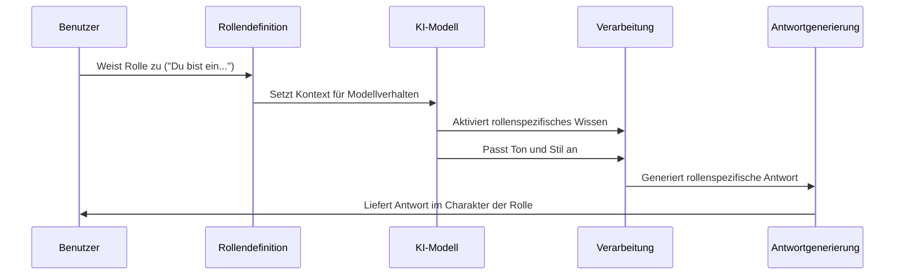

# Chapter 9: Rollen-Prompting

Im vorherigen Kapitel [Eingeschränkte Generierung](08_eingeschränkte_generierung_.md) haben wir gelernt, wie wir die Ausgaben von KI-Modellen gezielt steuern und begrenzen können. Nun werden wir uns mit einer Technik beschäftigen, die den Kommunikationsstil und die Fachexpertise von KI-Modellen formt: dem Rollen-Prompting.

## Was ist Rollen-Prompting?

Stellen Sie sich vor, Sie möchten einen Text über Sternkonstellationen schreiben. Sie könnten einen Astronomen, einen Dichter oder einen Geschichtslehrer befragen – und würden jeweils sehr unterschiedliche Antworten erhalten. Beim Rollen-Prompting geht es genau darum: Wir weisen der KI eine bestimmte Rolle oder Persona zu, um ihre Antworten in eine gewünschte Richtung zu lenken.

Rollen-Prompting ist wie das Casting für ein Theaterstück: Sie bestimmen, welche Rolle die KI spielen soll, und diese passt dann ihre Antworten, ihren Ton und ihr Fachwissen entsprechend an.

Ein einfaches Beispiel: Statt zu fragen "Erkläre mir Photosynthese", könnten wir formulieren: "Du bist ein Biologielehrer, der Grundschülern die Photosynthese erklärt." Der Unterschied in der Antwort wird sofort erkennbar sein – sie wird einfacher, anschaulicher und pädagogisch wertvoller.

## Grundlegende Rollen-Prompts erstellen

Lassen Sie uns einen einfachen Rollen-Prompt erstellen:

```python
from langchain_openai import ChatOpenAI

llm = ChatOpenAI(model="gpt-3.5-turbo")

rollen_prompt = """Du bist ein erfahrener Ernährungsberater mit 15 Jahren 
Berufserfahrung. Gib einem Anfänger Tipps für eine ausgewogene Ernährung."""

antwort = llm.invoke(rollen_prompt)
print(antwort.content)
```

In diesem Beispiel haben wir der KI die Rolle eines Ernährungsberaters zugewiesen. Der Prompt enthält drei wichtige Elemente:
1. Die Identität ("Du bist ein erfahrener Ernährungsberater")
2. Die Qualifikation ("mit 15 Jahren Berufserfahrung")
3. Die Aufgabe ("Gib einem Anfänger Tipps für eine ausgewogene Ernährung")

## Die Kunst der Rollenbeschreibung

Die Qualität der Rollenbeschreibung beeinflusst maßgeblich die Antwort des Modells. Vergleichen wir zwei unterschiedliche Beschreibungen derselben Rolle:

```python
# Einfache Rollenbeschreibung
einfache_rolle = """Du bist ein Historiker. Erkläre die Französische Revolution."""

# Detaillierte Rollenbeschreibung
detaillierte_rolle = """Du bist ein Historiker, spezialisiert auf europäische 
Geschichte des 18. Jahrhunderts mit besonderem Fokus auf soziale Bewegungen. 
Erkläre die Französische Revolution für Oberstufenschüler."""
```

Die detaillierte Rollenbeschreibung liefert dem Modell mehr Kontext und führt zu einer gezielteren und fachlich fundierteren Antwort. Sie enthält:
- Einen spezifischen Fachbereich
- Eine zeitliche oder thematische Spezialisierung
- Eine definierte Zielgruppe

## Verschiedene Arten von Rollen

Wir können verschiedene Arten von Rollen verwenden, je nach unserem Ziel:

### 1. Fachexperten

```python
experten_rolle = """Du bist ein Cybersicherheitsexperte. Erkläre in einfachen 
Worten, wie man ein sicheres Passwort erstellt."""
```

Fachexperten-Rollen sind nützlich, wenn Sie fundierte, sachliche Informationen zu einem bestimmten Thema benötigen.

### 2. Pädagogische Rollen

```python
lehrer_rolle = """Du bist ein Grundschullehrer, der Kindern im Alter von 
8 Jahren das Konzept der Schwerkraft erklärt. Verwende einfache Sprache 
und anschauliche Beispiele."""
```

Pädagogische Rollen helfen, komplexe Konzepte verständlich zu erklären und sind ideal für Lernmaterialien.

### 3. Kreative Rollen

```python
autor_rolle = """Du bist ein Science-Fiction-Autor im Stil von Isaac Asimov. 
Schreibe einen kurzen Absatz über eine Begegnung zwischen einem Menschen und 
einem Roboter."""
```

Kreative Rollen fördern originelle und stilistisch angepasste Inhalte.

## Rollen-Prompting in der Praxis

Nun wollen wir sehen, wie wir Rollen-Prompting in einer praktischen Anwendung einsetzen können. Stellen Sie sich vor, wir möchten verschiedene Perspektiven zu einem kontroversen Thema sammeln:

```python
def perspektiven_sammeln(thema):
    rollen = [
        "Umweltaktivist",
        "Wirtschaftsexperte",
        "Technologieunternehmer",
        "Ethikprofessor"
    ]
    
    perspektiven = {}
    for rolle in rollen:
        prompt = f"""Als {rolle}, wie siehst du das Thema: {thema}? 
        Gib eine kurze Stellungnahme ab (max. 3 Sätze)."""
        perspektiven[rolle] = llm.invoke(prompt).content
    
    return perspektiven
```

Diese Funktion sammelt verschiedene Perspektiven zu einem Thema, indem sie der KI nacheinander verschiedene Rollen zuweist. So erhalten wir ein vielschichtiges Bild zu komplexen Fragen.

## Die Wirkung von Rollen-Prompting verstehen

Wenn wir einen Rollen-Prompt an ein KI-Modell senden, läuft folgender Prozess ab:



1. **Rollendefinition**: Das Modell erhält Informationen über die zu übernehmende Rolle
2. **Kontextualisierung**: Es aktiviert relevantes Wissen und Ausdrucksweisen für diese Rolle
3. **Stilanpassung**: Es passt Ton, Fachsprache und Detailtiefe an die Rolle an
4. **Antwortgenerierung**: Die Antwort wird im Charakter der zugewiesenen Rolle formuliert

## Fortgeschrittene Techniken

### Kombination mit Anweisungs-Engineering

Wir können Rollen-Prompting mit [Anweisungs-Engineering](04_anweisungs_engineering_.md) kombinieren:

```python
kombinierter_prompt = """Du bist ein erfahrener Datenanalyst.

Aufgabe: Analysiere den folgenden Datensatz und identifiziere Trends.
Format: Deine Analyse sollte folgende Punkte enthalten:
1. Hauptbeobachtungen (3 Punkte)
2. Mögliche Ursachen
3. Empfehlungen für weitere Untersuchungen

Datensatz: [Daten hier einfügen]
"""
```

Diese Kombination nutzt sowohl die fachliche Ausrichtung der Rolle als auch eine klare Strukturvorgabe für die Antwort.

### Mehrere Rollen in einer Konversation

Für komplexere Szenarien können wir einen Dialog zwischen verschiedenen Rollen simulieren:

```python
dialog_prompt = """Simuliere einen Dialog zwischen einem Skeptiker und einem 
Befürworter zum Thema Künstliche Intelligenz. Jede Person soll 2 Mal sprechen.

Skeptiker: [Erste Aussage]
Befürworter: [Antwort]
Skeptiker: [Folgeargument]
Befürworter: [Abschließende Perspektive]
"""
```

Diese Technik ermöglicht es, verschiedene Standpunkte in einem einzigen Prompt zu erkunden.

## Die Theater-Analogie

Um Rollen-Prompting besser zu verstehen, können wir es mit dem Theater vergleichen:

- **Der Prompt** ist das Drehbuch mit Rollenanweisungen
- **Die Rollenbeschreibung** ist wie die Charakterisierung einer Figur
- **Die KI** ist der Schauspieler, der in die Rolle schlüpft
- **Die Antwort** ist die Darstellung des Charakters

Wie ein guter Schauspieler verändert die KI ihre "Stimme", ihr "Vokabular" und ihren "Blickwinkel" entsprechend der zugewiesenen Rolle. Ein erfahrener Schauspieler kann überzeugend einen König, einen Bettler oder einen Wissenschaftler darstellen – genauso kann die KI verschiedene Perspektiven und Fachkenntnisse simulieren.

## Praktische Tipps für effektives Rollen-Prompting

1. **Sei spezifisch**: Je detaillierter die Rollenbeschreibung, desto gezielter die Antwort
2. **Füge Qualifikationen hinzu**: Erwähne Erfahrung, Ausbildung oder Spezialisierung
3. **Definiere die Zielgruppe**: Gib an, für wen die Antwort gedacht ist
4. **Berücksichtige den Kontext**: Eine Historikerin aus dem 21. Jahrhundert hat eine andere Perspektive als eine aus dem 19. Jahrhundert
5. **Kombiniere mit anderen Techniken**: Rollen-Prompting funktioniert gut mit [Few-Shot-Learning](06_few_shot_learning_.md) oder [Gedankenketten-Prompting](07_gedankenketten_prompting_.md)

## Anwendungsbeispiele

### Technische Dokumentation

```python
tech_writer_prompt = """Du bist ein technischer Redakteur, der komplexe 
Konzepte für Anfänger verständlich macht. Erkläre das Konzept 'APIs' in 
einfachen Worten, als würdest du es jemandem ohne IT-Kenntnisse erklären."""
```

### Kreatives Schreiben

```python
kreativer_prompt = """Du bist ein Dichter im Stil der deutschen Romantik. 
Schreibe ein kurzes Gedicht (4-6 Zeilen) über einen Sonnenuntergang am See."""
```

### Beratung

```python
berater_prompt = """Du bist ein Karriereberater mit Erfahrung im Technologiesektor. 
Ein Junior-Entwickler fragt dich nach Tipps, wie er seine Fähigkeiten verbessern 
kann. Gib drei konkrete, umsetzbare Ratschläge."""
```

## Grenzen des Rollen-Prompting

Obwohl Rollen-Prompting ein mächtiges Werkzeug ist, hat es auch Einschränkungen:

- KI-Modelle haben kein echtes Fachwissen, sondern simulieren es basierend auf ihren Trainingsdaten
- Sehr spezifische oder obskure Rollen können zu Ungenauigkeiten führen
- Die KI kann Fakten erfinden, um in der Rolle zu bleiben (sogenannte "Halluzinationen")

Dennoch ist Rollen-Prompting eine der effektivsten Methoden, um die Qualität und den Fokus von KI-Antworten zu verbessern.

## Fazit

Rollen-Prompting ist eine leistungsstarke Technik, die es uns ermöglicht, die Perspektive, das Fachwissen und den Kommunikationsstil von KI-Modellen gezielt zu steuern. Wie ein Regisseur, der seinem Ensemble verschiedene Rollen zuweist, können wir die KI anleiten, aus verschiedenen Blickwinkeln zu antworten und ihr Wissen im Kontext einer spezifischen Rolle zu präsentieren.

Durch die Kombination mit anderen Techniken wie [Anweisungs-Engineering](04_anweisungs_engineering_.md) oder [Few-Shot-Learning](06_few_shot_learning_.md) können wir die Antworten weiter verfeinern und auf unsere spezifischen Bedürfnisse zuschneiden. Die Kunst liegt darin, die richtige Rolle mit der richtigen Detailtiefe zu definieren und so das volle Potenzial der KI auszuschöpfen.

Im nächsten Kapitel [Prompt-Optimierung](10_prompt_optimierung_.md) werden wir lernen, wie wir unsere Prompts systematisch verbessern können, um noch bessere Ergebnisse zu erzielen – eine natürliche Fortsetzung unserer Reise durch die Welt des Prompt-Engineerings.

---

