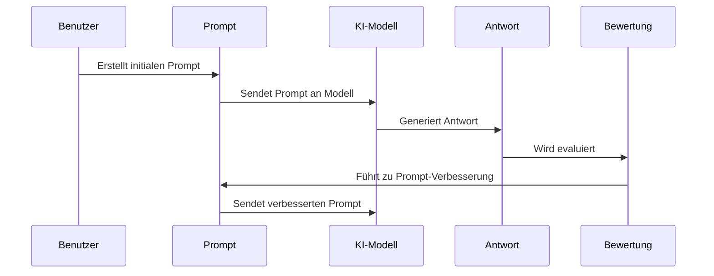

# Chapter 10: Prompt-Optimierung

Im vorherigen Kapitel [Rollen-Prompting](09_rollen_prompting_.md) haben wir gelernt, wie wir KI-Modellen spezifische Rollen zuweisen können, um ihre Antworten zu personalisieren und zu kontextualisieren. Nun werden wir uns mit einem weiteren wichtigen Aspekt des Prompt-Engineerings beschäftigen: der Prompt-Optimierung.

## Einführung: Die Kunst der kontinuierlichen Verbesserung

Stellen Sie sich vor, Sie sind ein Koch, der ein neues Rezept entwickelt. Nach dem ersten Versuch schmeckt das Gericht gut, aber nicht herausragend. Was würden Sie tun? Sie würden die Zutaten und Zubereitungsmethoden anpassen, erneut probieren und diesen Prozess wiederholen, bis das Ergebnis perfekt ist.

Genauso verhält es sich mit Prompts für KI-Modelle. Ein erster Prompt mag funktionieren, aber durch systematische Optimierung können wir deutlich bessere Ergebnisse erzielen. Prompt-Optimierung ist der Prozess, bei dem wir Prompts systematisch testen, bewerten und verbessern, um die bestmöglichen Antworten zu erhalten.

Nehmen wir ein praktisches Beispiel: Angenommen, wir möchten eine KI bitten, eine Zusammenfassung eines wissenschaftlichen Artikels zu erstellen. Unser erster Prompt könnte sein: "Fasse diesen Artikel zusammen." Diese einfache Anweisung wird zwar eine Zusammenfassung generieren, aber ist sie wirklich optimal? Durch Prompt-Optimierung können wir diesen Prompt verbessern, um eine präzisere, relevantere und nützlichere Zusammenfassung zu erhalten.

## Grundlegende Konzepte der Prompt-Optimierung

### 1. Baseline-Erstellung

Der erste Schritt bei der Prompt-Optimierung ist die Erstellung einer Baseline – eines Ausgangspunktes, mit dem wir spätere Verbesserungen vergleichen können.

```python
from langchain_openai import ChatOpenAI

# Modell initialisieren
llm = ChatOpenAI(model="gpt-3.5-turbo")

# Baseline-Prompt
baseline_prompt = "Fasse den folgenden Artikel zusammen: [Artikeltext]"

# Antwort generieren
baseline_antwort = llm.invoke(baseline_prompt).content
```

Dieser einfache Code erstellt unsere Baseline. Wir initialisieren ein Sprachmodell und verwenden einen einfachen Prompt, um eine Zusammenfassung zu erhalten. Dies ist unser Ausgangspunkt für weitere Optimierungen.

### 2. Bewertungskriterien festlegen

Um zu wissen, ob ein optimierter Prompt besser ist, müssen wir klare Bewertungskriterien festlegen.

```python
def bewerte_zusammenfassung(zusammenfassung, kriterien):
    bewertungen = {}
    for kriterium, beschreibung in kriterien.items():
        print(f"Bewerte nach {kriterium}: {beschreibung}")
        # Hier könnte eine manuelle oder automatische Bewertung erfolgen
        bewertung = float(input("Bewertung (1-10): "))
        bewertungen[kriterium] = bewertung
    return bewertungen
```

Diese Funktion ermöglicht es uns, eine Zusammenfassung nach verschiedenen Kriterien zu bewerten. In der Praxis könnten diese Kriterien sein: Genauigkeit, Vollständigkeit, Klarheit oder Relevanz. Die Bewertung könnte manuell (wie hier durch Benutzereingabe) oder automatisiert erfolgen.

## Techniken zur Prompt-Optimierung

### 1. A/B-Testing

Eine grundlegende Technik ist das A/B-Testing, bei dem wir zwei oder mehr Prompt-Varianten vergleichen.

```python
# Zwei Prompt-Varianten
prompt_a = "Fasse den folgenden Artikel zusammen: [Artikeltext]"
prompt_b = """Erstelle eine prägnante Zusammenfassung (max. 150 Wörter) 
des folgenden Artikels. Hebe die wichtigsten Erkenntnisse hervor: [Artikeltext]"""

# Antworten generieren und vergleichen
antwort_a = llm.invoke(prompt_a).content
antwort_b = llm.invoke(prompt_b).content
```

Durch den Vergleich der beiden Antworten können wir feststellen, welcher Prompt bessere Ergebnisse liefert. Prompt B ist spezifischer und gibt klare Anweisungen zur Länge und zum Fokus der Zusammenfassung.

### 2. Iterative Verbesserung

Die iterative Verbesserung ist ein schrittweiser Prozess, bei dem wir den Prompt basierend auf Feedback kontinuierlich verfeinern.

```python
def iterative_verbesserung(prompt, artikeltext, iterationen=3):
    aktueller_prompt = prompt
    
    for i in range(iterationen):
        print(f"Iteration {i+1}")
        antwort = llm.invoke(aktueller_prompt).content
        
        # Feedback einholen und Prompt verbessern
        feedback = input("Verbesserungsvorschläge: ")
        aktueller_prompt = input("Neuer Prompt: ")
    
    return aktueller_prompt
```

Diese Funktion führt einen iterativen Prozess durch, bei dem wir nach jeder Antwort Feedback sammeln und den Prompt entsprechend anpassen. Nach mehreren Iterationen erhalten wir einen optimierten Prompt.

## Automatisierte Prompt-Optimierung

Für komplexere Anwendungen können wir den Optimierungsprozess teilweise automatisieren.

```python
def automatisierte_optimierung(prompt, artikeltext, modell):
    # Antwort mit aktuellem Prompt generieren
    antwort = modell.invoke(prompt).content
    
    # Verbesserungsvorschläge vom Modell selbst erhalten
    meta_prompt = f"""Analysiere diesen Prompt und die resultierende Antwort. 
    Schlage Verbesserungen für den Prompt vor:
    
    Prompt: {prompt}
    Antwort: {antwort}
    """
    
    vorschläge = modell.invoke(meta_prompt).content
    return vorschläge
```

Diese Funktion nutzt das KI-Modell selbst, um Verbesserungsvorschläge für den Prompt zu generieren. Es ist eine Form der "Meta-Optimierung", bei der die KI dabei hilft, bessere Anweisungen für sich selbst zu erstellen.

## Wie funktioniert Prompt-Optimierung intern?

Der Prozess der Prompt-Optimierung lässt sich als Kreislauf visualisieren:



1. **Initialer Prompt**: Wir beginnen mit einem Basis-Prompt
2. **Antwortgenerierung**: Das KI-Modell generiert eine Antwort
3. **Bewertung**: Die Antwort wird anhand unserer Kriterien bewertet
4. **Anpassung**: Der Prompt wird basierend auf der Bewertung verbessert
5. **Wiederholung**: Der Prozess wird mit dem verbesserten Prompt wiederholt

## Praktisches Beispiel: Optimierung eines Zusammenfassungs-Prompts

Sehen wir uns an, wie wir einen Prompt zur Zusammenfassung eines wissenschaftlichen Artikels systematisch optimieren können:

### Schritt 1: Baseline erstellen

```python
baseline_prompt = "Fasse diesen Artikel zusammen: [Artikeltext]"
```

Dieser einfache Prompt gibt keine spezifischen Anweisungen zur Struktur, Länge oder zum Fokus der Zusammenfassung.

### Schritt 2: Erste Verbesserung - Spezifischer werden

```python
verbesserter_prompt = """
Erstelle eine strukturierte Zusammenfassung des folgenden Artikels:
[Artikeltext]

Die Zusammenfassung sollte enthalten:
1. Hauptforschungsfrage (1-2 Sätze)
2. Methodik (2-3 Sätze)
3. Wichtigste Ergebnisse (3-4 Sätze)
"""
```

Hier haben wir eine klare Struktur vorgegeben und den Umfang für jeden Abschnitt definiert.

### Schritt 3: Zielgruppe und Tonalität hinzufügen

```python
optimierter_prompt = """
Als wissenschaftlicher Redakteur, erstelle eine Zusammenfassung des folgenden 
Artikels für ein allgemeines Publikum:
[Artikeltext]

Die Zusammenfassung sollte:
1. Die Hauptfrage klar darstellen (1-2 Sätze)
2. Die Methodik verständlich erklären (2-3 Sätze)
3. Die wichtigsten Ergebnisse hervorheben (3-4 Sätze)

Verwende eine zugängliche Sprache und vermeide Fachjargon.
"""
```

Nun haben wir eine Rolle (wissenschaftlicher Redakteur), eine Zielgruppe (allgemeines Publikum) und Anweisungen zur Sprache hinzugefügt.

## Die Gärtner-Analogie

Prompt-Optimierung ist wie die Arbeit eines Gärtners, der einen Obstbaum pflegt:

1. **Pflanzen (Baseline)**: Der Gärtner pflanzt einen jungen Obstbaum. Dies entspricht unserem ersten, einfachen Prompt.

2. **Beobachten (Bewertung)**: Der Gärtner beobachtet, wie der Baum wächst und welche Früchte er trägt, ähnlich wie wir die Antworten auf unsere Prompts bewerten.

3. **Beschneiden (Anpassung)**: Basierend auf seinen Beobachtungen beschneidet der Gärtner bestimmte Äste, um das Wachstum zu lenken – genau wie wir unsere Prompts verfeinern.

4. **Düngen (Erweiterung)**: Der Gärtner fügt Nährstoffe hinzu, um bestimmte Aspekte des Wachstums zu fördern, ähnlich wie wir zusätzliche Details oder Anweisungen zu unseren Prompts hinzufügen.

5. **Wiederholung**: Über mehrere Jahreszeiten hinweg wiederholt der Gärtner diesen Prozess, und mit jeder Saison werden die Früchte besser.

## Fortgeschrittene Techniken zur Prompt-Optimierung

### Systematisches A/B-Testing mit Metriken

Für umfangreichere Optimierungen können wir ein systematisches A/B-Testing mit klaren Metriken implementieren:

```python
def systematisches_ab_testing(prompt_varianten, artikel, kriterien):
    ergebnisse = {}
    
    for name, prompt in prompt_varianten.items():
        antwort = llm.invoke(prompt.replace("[Artikeltext]", artikel)).content
        bewertungen = bewerte_zusammenfassung(antwort, kriterien)
        
        # Gesamtbewertung berechnen
        gesamtbewertung = sum(bewertungen.values()) / len(bewertungen)
        ergebnisse[name] = {"prompt": prompt, "bewertung": gesamtbewertung}
    
    return ergebnisse
```

Diese Funktion ermöglicht es uns, mehrere Prompt-Varianten systematisch zu testen und anhand verschiedener Kriterien zu vergleichen.

## Integration mit anderen Prompt-Engineering-Techniken

Die Prompt-Optimierung lässt sich hervorragend mit anderen Techniken kombinieren, die wir in früheren Kapiteln kennengelernt haben:

1. **Mit [Prompt-Strukturen](02_prompt_strukturen_.md)**: Testen Sie verschiedene Strukturen und optimieren Sie die beste.

2. **Mit [Gedankenketten-Prompting](07_gedankenketten_prompting_.md)**: Optimieren Sie die Anleitung zum schrittweisen Denken.

3. **Mit [Rollen-Prompting](09_rollen_prompting_.md)**: Experimentieren Sie mit verschiedenen Rollen und wählen Sie die effektivste.

Ein Beispiel für die Kombination mit Rollen-Prompting:

```python
rollen_varianten = {
    "Wissenschaftler": """Als Wissenschaftler, erstelle eine präzise 
    Zusammenfassung des folgenden Artikels: [Artikeltext]""",
    
    "Journalist": """Als Wissenschaftsjournalist, erstelle eine zugängliche 
    Zusammenfassung des folgenden Artikels: [Artikeltext]""",
    
    "Lehrer": """Als Lehrer, erstelle eine lehrreiche Zusammenfassung 
    des folgenden Artikels für Schüler: [Artikeltext]"""
}

# Testen, welche Rolle die besten Zusammenfassungen produziert
```

Durch das Testen verschiedener Rollen können wir herausfinden, welche Perspektive die besten Ergebnisse für unsere spezifische Aufgabe liefert.

## Fazit

Prompt-Optimierung ist wie das Feintuning eines Musikinstruments – ein iterativer Prozess, der Geduld und Fingerspitzengefühl erfordert. Durch systematisches Testen, Bewerten und Anpassen können wir die Qualität unserer Prompts und damit die Antworten von KI-Modellen erheblich verbessern.

Die wichtigsten Schritte sind:
1. Eine Baseline erstellen
2. Klare Bewertungskriterien festlegen
3. Prompt-Varianten systematisch testen (A/B-Testing)
4. Iterative Verbesserungen vornehmen
5. Den Prozess wiederholen, bis das gewünschte Ergebnis erreicht ist

Mit den in diesem Kapitel vorgestellten Techniken können Sie Ihre eigenen Prompts optimieren und so das volle Potenzial von KI-Sprachmodellen ausschöpfen. Betrachten Sie die Prompt-Optimierung als kontinuierlichen Lernprozess – ähnlich wie ein Koch, der sein Rezept immer wieder verfeinert, bis das Gericht perfekt schmeckt.

In den vorherigen Kapiteln haben wir verschiedene Aspekte des Prompt-Engineerings kennengelernt, von [Prompt-Strukturen](02_prompt_strukturen_.md) über [Anweisungs-Engineering](04_anweisungs_engineering_.md) bis hin zu [Rollen-Prompting](09_rollen_prompting_.md). Mit der Prompt-Optimierung haben wir nun einen umfassenden Werkzeugkasten für die effektive Kommunikation mit KI-Modellen kennengelernt.

Die Reise des Prompt-Engineerings endet hier nicht – mit dem raschen Fortschritt der KI-Technologie werden ständig neue Techniken und Best Practices entwickelt. Die Grundlagen, die Sie in diesem Tutorial gelernt haben, werden jedoch eine solide Basis für Ihre zukünftigen Experimente und Anwendungen bilden.

---

