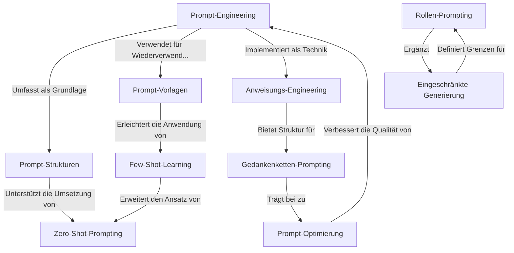

# Tutorial: Prompt_Engineering

**Prompt-Engineering** ist eine umfassende Sammlung von Techniken zur effektiven Kommunikation mit KI-Sprachmodellen. Dieses Projekt bietet *praktische Tutorials* und *Implementierungen* für verschiedene Prompt-Engineering-Methoden, von grundlegenden Strukturen bis hin zu fortgeschrittenen Strategien. Die Sammlung umfasst verschiedene Ansätze wie strukturierte Prompts, Vorlagen, Zero-Shot und Few-Shot-Lernen, Gedankenketten-Prompting und mehr, die es Nutzern ermöglichen, präzisere und nützlichere Antworten von KI-Modellen zu erhalten.

**Source Repository:** [https://github.com/NirDiamant/Prompt_Engineering](https://github.com/NirDiamant/Prompt_Engineering)

## Chapters

1. [Prompt-Engineering
](01_prompt_engineering_.md)
2. [Prompt-Strukturen
](02_prompt_strukturen_.md)
3. [Prompt-Vorlagen
](03_prompt_vorlagen_.md)
4. [Anweisungs-Engineering
](04_anweisungs_engineering_.md)
5. [Zero-Shot-Prompting
](05_zero_shot_prompting_.md)
6. [Few-Shot-Learning
](06_few_shot_learning_.md)
7. [Gedankenketten-Prompting
](07_gedankenketten_prompting_.md)
8. [Eingeschränkte Generierung
](08_eingeschraenkte_generierung_.md)
9. [Rollen-Prompting
](09_rollen_prompting_.md)
10. [Prompt-Optimierung
](10_prompt_optimierung_.md)

---

