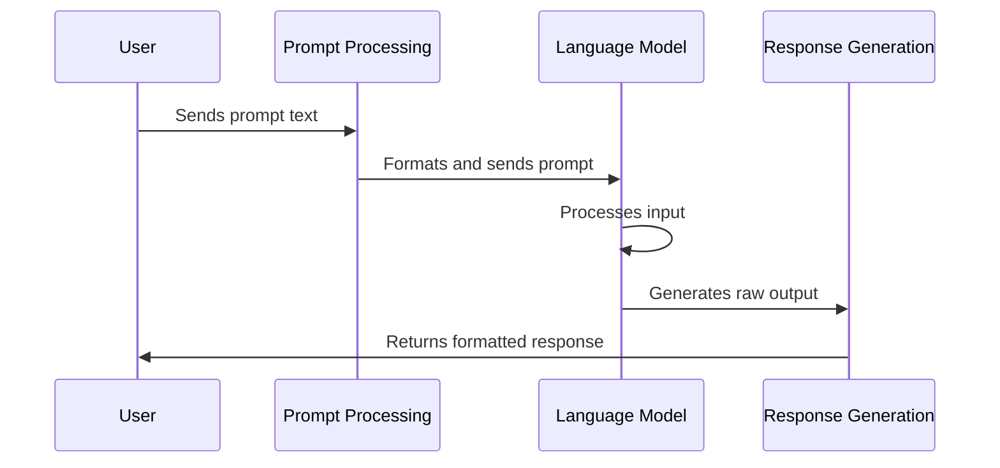

# Chapter 1: Basic Prompt Structures

Welcome to the world of prompt engineering! If you've ever asked a question to an AI assistant or chatbot, you've already created a prompt. But have you thought about how the structure of your question impacts the answer you receive? In this chapter, we'll explore the fundamental ways to structure prompts when communicating with AI language models.

## Why Prompt Structure Matters

Imagine you're at a restaurant trying to order a specific dish. You could:
- Ask a vague question: "What's good here?"
- Give a direct instruction: "Bring me the house specialty."
- Have a conversation: "I like spicy food. What would you recommend? Does it have seafood in it?"

Each approach would likely get you different results. The same principle applies when communicating with AI systems!

Let's say we want an AI to explain climate change to a 10-year-old child. How we structure this request will significantly impact the response we get.

## Basic Types of Prompt Structures

### 1. Single-turn Prompts

Single-turn prompts are one-shot interactions where you provide a single input and get a single output. These are like asking a question and getting an answer with no further context.

```python
from langchain_openai import ChatOpenAI

llm = ChatOpenAI(model="gpt-4o-mini")
single_turn_prompt = "What are the three primary colors?"
print(llm.invoke(single_turn_prompt).content)
```

This simple code sends a straightforward question to the language model and prints its response. The AI will respond with information about primary colors, but the interaction ends there.

### 2. Multi-turn Prompts (Conversations)

Multi-turn prompts involve a series of back-and-forth exchanges that build on previous context. This is more like having a conversation where each new message references earlier parts of the dialogue.

```python
from langchain.chains import ConversationChain
from langchain.memory import ConversationBufferMemory

conversation = ConversationChain(
    llm=llm, 
    memory=ConversationBufferMemory()
)

print(conversation.predict(input="Hi, I'm learning about space. Can you tell me about planets?"))
print(conversation.predict(input="What's the largest planet in our solar system?"))
```

In this example, the second question builds on the first conversation. The AI remembers that you were talking about planets, so when you ask about "the largest planet," it understands you're referring to planets in our solar system.

## Components of Effective Prompts

Regardless of whether you're using single or multi-turn prompts, effective prompts often include:

1. **Clear instruction or question**: What exactly you want the AI to do
2. **Context**: Background information that helps the AI understand the request
3. **Format specification**: How you want the response structured
4. **Examples** (optional): Demonstrations of desired outputs

Let's see how these components work together:

```python
structured_prompt = """Explain climate change to a 10-year-old child.
Use simple words, include a short analogy, and keep it under 3 paragraphs."""

print(llm.invoke(structured_prompt).content)
```

This prompt includes a clear instruction, context about the audience (a child), and format specifications (simple language, include an analogy, keep it brief).

## Comparing Different Prompt Structures

Let's see how different structures yield different results for the same request:

```python
prompts = [
    "List 3 applications of AI in healthcare.",
    "Explain how AI is revolutionizing healthcare, with 3 specific examples.",
    "You are a doctor. Describe 3 ways AI has improved your daily work in the hospital."
]

for i, prompt in enumerate(prompts, 1):
    print(f"\nPrompt {i}:")
    print(prompt)
    print("\nResponse:")
    print(llm.invoke(prompt).content[:150] + "...")  # Showing just the beginning
```

These three prompts ask for similar information but structure the request differently:
- The first is a simple list request
- The second asks for an explanation with examples
- The third uses role-playing to frame the response from a specific perspective

Each will produce noticeably different responses despite covering the same general topic.

## How Prompts Are Processed

When you send a prompt to an AI, here's what happens under the hood:



The language model doesn't actually "understand" your prompt the way a human would. Instead, it:

1. Processes your text as a sequence of tokens (words or parts of words)
2. Uses patterns it learned during training to predict what should come next
3. Generates a response based on these predictions
4. Returns the generated text to you

Your prompt structure gives the model crucial guidance about what patterns to follow in its response.

## Practical Applications

Let's explore a simple real-world application. Imagine you're researching a topic and need to fact-check some information:

```python
fact_check_prompt = """Evaluate the following statement for factual accuracy. 
If it's incorrect, provide the correct information:
Statement: The capital of France is London.
Evaluation:"""

print(llm.invoke(fact_check_prompt).content)
```

This structured prompt clearly tells the AI what to do (evaluate factual accuracy), provides the context (the statement to evaluate), and implies the format (an evaluation that corrects any errors).

You could also use prompt structures to help with problem-solving:

```python
problem_solving_prompt = """Solve the following problem step by step:
Problem: Calculate the compound interest on $1000 invested for 5 years at 5% annually.
Solution:
1)"""

print(llm.invoke(problem_solving_prompt).content[:150] + "...")
```

The numbered beginning "1)" signals to the AI that you want a step-by-step solution, encouraging it to break down the problem methodically.

## Conclusion

Basic prompt structures are the foundation of effective communication with AI systems. By understanding how to craft single-turn prompts, multi-turn conversations, and how to include critical components like clear instructions and context, you're now equipped to get more useful and relevant responses from AI.

In this chapter, we've learned:
- The difference between single-turn and multi-turn prompts
- Key components that make prompts more effective
- How different structures affect the responses you receive
- The basic process of how prompts are processed by AI systems

As you practice with these fundamental structures, you'll develop an intuition for how to best communicate with AI systems for different purposes.

In the next chapter, [Prompt Templates](02_prompt_templates_.md), we'll explore how to create reusable prompt structures that can be customized for different inputs, making your interactions with AI more efficient and consistent.

---

