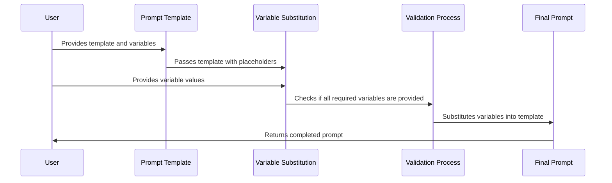

# Chapter 2: Prompt Templates

In [Basic Prompt Structures](01_basic_prompt_structures_.md), we learned how to craft effective prompts for AI models. But what if you need to create many similar prompts with different details? Typing out the same structure repeatedly would be tedious and error-prone. This is where prompt templates come in!

## Why Use Prompt Templates?

Imagine you run a small online bookstore and want to generate descriptions for 100 different books. Without templates, you'd need to write a similar prompt for each book:

```
Write a compelling description for a science fiction book titled "The Last Star" written by James Wilson, published in 2021, with 320 pages.
```

```
Write a compelling description for a mystery novel titled "Silent Witness" written by Sarah Chen, published in 2019, with 280 pages.
```

And so on for 98 more books! This approach is inefficient and could lead to inconsistent results.

## What Are Prompt Templates?

Prompt templates are reusable structures with placeholders for variables. Think of them like a form letter where you fill in specific details while keeping the overall structure the same.

Let's break this down with our bookstore example:

### Basic Prompt Template

```python
from langchain.prompts import PromptTemplate

book_template = PromptTemplate(
    input_variables=["title", "author", "genre", "year", "pages"],
    template="Write a compelling description for a {genre} book titled '{title}' written by {author}, published in {year}, with {pages} pages."
)
```

This code creates a template with five variables: `title`, `author`, `genre`, `year`, and `pages`. The template itself is a string with placeholders in curly braces `{}` that will be replaced with actual values.

### Using the Template

```python
# Create a specific prompt for our first book
book1_prompt = book_template.format(
    title="The Last Star",
    author="James Wilson",
    genre="science fiction",
    year="2021",
    pages="320"
)
print(book1_prompt)
```

When run, this code would output:
```
Write a compelling description for a science fiction book titled 'The Last Star' written by James Wilson, published in 2021, with 320 pages.
```

The template automatically substitutes our variables into the placeholders, giving us a complete prompt!

## Benefits of Using Prompt Templates

1. **Consistency**: Ensures all your prompts follow the same structure
2. **Efficiency**: Write the structure once, reuse it many times
3. **Flexibility**: Change one variable without rewriting the entire prompt
4. **Maintainability**: If you need to change the prompt structure, you only need to update it in one place

## More Complex Templates

Templates can include optional sections, formatting, and even conditional logic. Here's a slightly more advanced example:

```python
from langchain.prompts import PromptTemplate

review_template = PromptTemplate(
    input_variables=["product_name", "rating", "include_pros_cons"],
    template="""Write a review for {product_name}. Give it a rating of {rating}/5.
Include a list of pros and cons.
Keep it under 100 words."""
)
```

This template includes a conditional statement that only adds the "Include a list of pros and cons" instruction if `include_pros_cons` is True.

## How Templates Work Under the Hood

When you use a prompt template, several steps happen behind the scenes:



Let's look at the implementation details:

1. **Template Creation**: When you create a `PromptTemplate`, it stores the template string and keeps track of which variables it needs.

2. **Variable Validation**: When you use `.format()`, it first checks if you've provided all the required variables.

3. **String Formatting**: It then uses Python's string formatting to replace each `{variable_name}` with its corresponding value.

4. **Output**: The completed prompt is returned as a string, ready to be sent to an AI model.

## Practical Example: Customer Support Template

Let's see a complete example for generating customer support responses:

```python
from langchain_openai import ChatOpenAI
from langchain.prompts import PromptTemplate

# Initialize the language model
llm = ChatOpenAI(model="gpt-4o-mini")

# Create the template
support_template = PromptTemplate(
    input_variables=["customer_name", "issue", "product"],
    template="""You are a helpful customer support agent.
Write a response to {customer_name} who has the following issue:
{issue}

The issue is related to our product: {product}.
Be empathetic, professional, and provide a clear solution."""
)
```

Now we can use this template to create specific prompts:

```python
# Create a specific prompt
prompt = support_template.format(
    customer_name="Maria",
    issue="The app keeps crashing when I try to upload photos",
    product="PhotoShare mobile app"
)

# Get a response from the AI model
response = llm.invoke(prompt).content
print(response)
```

This would generate a helpful customer support response tailored to Maria's specific issue with the PhotoShare app.

## Template Libraries and Reuse

For large projects, you might want to create a library of templates that can be reused across different parts of your application:

```python
# A simple template library
template_library = {
    "customer_support": PromptTemplate(
        input_variables=["name", "issue", "product"],
        template="Help {name} with {issue} related to {product}."
    ),
    "product_description": PromptTemplate(
        input_variables=["product", "features", "price"],
        template="Describe {product} with features {features} at {price}."
    )
}

# Using a template from the library
chosen_template = template_library["customer_support"]
```

This approach helps organize your templates and makes them easy to reuse.

## Chaining Templates Together

As your applications grow more complex, you might want to combine templates to create more sophisticated workflows. This concept is explored further in [Prompt Chaining and Sequencing](06_prompt_chaining_and_sequencing_.md).

## Conclusion

Prompt templates are a powerful tool that makes working with AI models more efficient and consistent. By separating the structure of your prompts from the specific variables, you can create reusable patterns that save time and reduce errors.

In this chapter, we've learned:
- How prompt templates solve the problem of repetitive prompt creation
- The basic syntax for creating and using templates
- More advanced template features like conditional sections
- How templates work under the hood
- Practical examples of templates in action

In the next chapter, [Zero-Shot Prompting](03_zero_shot_prompting_.md), we'll explore how to get AI models to perform tasks without examples, building on the foundation of structured prompts and templates we've established here.

---

