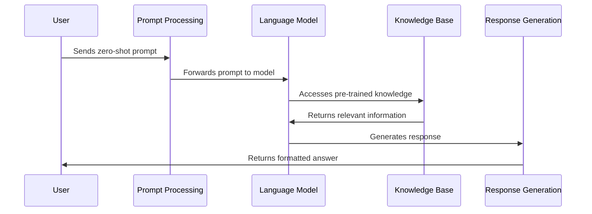

# Chapter 3: Zero-Shot Prompting

In [Prompt Templates](02_prompt_templates_.md), we learned how to create reusable structures for our prompts. Now, let's explore how we can leverage these templates—and even simple prompts—to get language models to perform tasks without providing any examples. This approach is called "zero-shot prompting."

## What is Zero-Shot Prompting?

Imagine asking a chef who has never made sushi before to prepare it for you. Despite never having made this specific dish, the chef can likely create something decent by drawing on their general cooking knowledge, understanding of ingredients, and culinary principles. 

This is exactly how zero-shot prompting works with AI models! 

Zero-shot prompting allows language models to perform tasks without being given specific examples first. The model draws on its general knowledge, acquired during pre-training, to understand and execute your request.

## Why Use Zero-Shot Prompting?

Zero-shot prompting offers several benefits:

- **Simplicity**: No need to provide examples in your prompt
- **Flexibility**: Quickly try new tasks without creating training data
- **Efficiency**: Shorter prompts save tokens and processing time
- **Versatility**: Apply to a wide range of unexpected situations

## A Simple Zero-Shot Example

Let's start with a basic example. Imagine we want our AI to classify the sentiment of a text as positive, negative, or neutral.

```python
from langchain_openai import ChatOpenAI

llm = ChatOpenAI(model="gpt-4o-mini")
sentiment_prompt = "Classify the sentiment of this text as positive, negative, or neutral: 'I really enjoyed the movie, it was fantastic!'"

print(llm.invoke(sentiment_prompt).content)
```

When you run this code, the model will likely respond with "Positive" because it understands what sentiment classification is without needing examples of positive, negative, or neutral text.

## Structuring Effective Zero-Shot Prompts

To get reliable results with zero-shot prompting, your prompt needs to be clear and specific. Let's break down the key components:

1. **Clear task definition**: Explicitly state what you want the model to do
2. **Input specification**: Clearly mark the input the model should process
3. **Output format**: Define how you want the response structured
4. **Constraints**: Add any limitations or requirements for the response

Here's an improved version of our sentiment analyzer:

```python
from langchain.prompts import PromptTemplate

sentiment_template = PromptTemplate(
    input_variables=["text"],
    template="""Task: Classify the sentiment of the text below as POSITIVE, NEGATIVE, or NEUTRAL.
    
Text: {text}
    
Sentiment:"""
)

text = "The service was okay, but the food was cold."
prompt = sentiment_template.format(text=text)
result = llm.invoke(prompt).content
print(f"Text: {text}\nClassification: {result}")
```

This improved prompt:
- Clearly defines the task (sentiment classification)
- Explicitly marks the input text
- Specifies the desired output format (just the classification)
- Lists the specific allowed classifications (POSITIVE, NEGATIVE, NEUTRAL)

## Beyond Classification: Other Zero-Shot Tasks

Zero-shot prompting works for many different tasks. Here are a few examples:

### Text Summarization

```python
summarize_template = PromptTemplate(
    input_variables=["article"],
    template="""Summarize the following article in 2-3 sentences:
    
Article: {article}
    
Summary:"""
)

article = "Long article text goes here..."
summary_prompt = summarize_template.format(article=article)
summary = llm.invoke(summary_prompt).content
```

### Language Translation

```python
translate_template = PromptTemplate(
    input_variables=["text", "language"],
    template="Translate the following text to {language}: {text}"
)

text = "Hello, how are you today?"
language = "Spanish"
translate_prompt = translate_template.format(text=text, language=language)
translation = llm.invoke(translate_prompt).content
```

### Question Answering

```python
qa_template = PromptTemplate(
    input_variables=["question"],
    template="""Answer the following question accurately and concisely:
    
Question: {question}
    
Answer:"""
)

question = "What causes rainbows to appear in the sky?"
qa_prompt = qa_template.format(question=question)
answer = llm.invoke(qa_prompt).content
```

## Advanced Zero-Shot Techniques

### Role Prompting

You can enhance zero-shot performance by assigning a specific role to the AI:

```python
role_template = PromptTemplate(
    input_variables=["role", "task"],
    template="You are a {role}. {task}"
)

prompt = role_template.format(
    role="professional financial advisor",
    task="Explain compound interest in simple terms."
)
```

This technique leverages the model's knowledge about how different professionals might approach a task, which we'll explore more in [Role Prompting](08_role_prompting_.md).

### Format Control

For more structured outputs, you can specify exactly how you want the information formatted:

```python
format_template = PromptTemplate(
    input_variables=["topic"],
    template="""Generate 3 facts about {topic} in JSON format.
Use the structure: 
[
  {{"fact": "fact 1", "source": "brief source description"}},
  {{"fact": "fact 2", "source": "brief source description"}},
  {{"fact": "fact 3", "source": "brief source description"}}
]"""
)
```

## How Zero-Shot Prompting Works

When you use zero-shot prompting, here's what happens behind the scenes:



The magic happens in the "Knowledge Base" step. During pre-training, language models are exposed to vast amounts of text data covering countless topics, tasks, and formats. This creates an internal representation of how different tasks should be performed, even if the model hasn't seen that specific task in that specific way before.

For example, even if the model hasn't been explicitly trained on sentiment classification with your exact input format, it has seen enough examples of sentiment analysis, classification tasks, and emotional language to understand what you're asking.

## Common Pitfalls and How to Avoid Them

### 1. Ambiguous Instructions

**Problem**: "Analyze this text" is too vague.

**Solution**: "Identify the main theme, key arguments, and supporting evidence in this text."

### 2. Complex Tasks Without Breakdown

**Problem**: Asking for complex analysis in a single zero-shot prompt.

**Solution**: Break down complex tasks into simpler steps using [Prompt Chaining and Sequencing](06_prompt_chaining_and_sequencing_.md).

### 3. Inconsistent Output Formats

**Problem**: Getting differently structured responses each time.

**Solution**: Explicitly specify the exact output format you want.

## When to Use Zero-Shot vs. Few-Shot Prompting

Zero-shot prompting works best when:
- The task is relatively common or simple
- You need a quick solution without creating examples
- The model likely has seen similar tasks during pre-training

For more complex or unusual tasks, you might need [Few-Shot Learning](04_few_shot_learning_.md), which we'll cover in the next chapter.

## Conclusion

Zero-shot prompting is a powerful technique that lets you leverage AI models for various tasks without providing examples. By crafting clear, specific prompts that define the task, input, and desired output format, you can get impressive results across a wide range of applications.

In this chapter, we've learned:
- What zero-shot prompting is and why it's useful
- How to structure effective zero-shot prompts
- Techniques for different types of tasks
- How zero-shot prompting works under the hood
- Common pitfalls and how to avoid them

As you practice zero-shot prompting, you'll develop an intuition for when it works well and when you might need other approaches. In the next chapter, [Few-Shot Learning](04_few_shot_learning_.md), we'll explore how to enhance model performance by including examples in your prompts when zero-shot approaches aren't enough.

---

