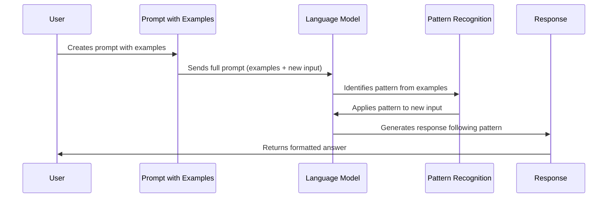

# Chapter 4: Few-Shot Learning

In [Zero-Shot Prompting](03_zero_shot_prompting_.md), we learned how to get language models to perform tasks without providing examples. But what if we could boost performance by giving the model just a few examples to learn from? That's where few-shot learning comes in!

## What is Few-Shot Learning?

Few-shot learning is a powerful technique where you include a small number of examples in your prompt to guide the model's response. It's like teaching by demonstration - showing someone how to do something a few times before asking them to try it themselves.

Imagine you're teaching someone to identify different types of emails:

```
Example 1: "Your product broke after one day." → Complaint
Example 2: "When will my order arrive?" → Inquiry
Example 3: "I love your service!" → Praise

New email: "This is the worst customer experience ever." → ?
```

By providing these examples, you're giving the model a pattern to follow, which helps it understand exactly what you're looking for.

## Why Use Few-Shot Learning?

Few-shot learning is incredibly useful when:

1. Zero-shot prompting isn't giving accurate enough results
2. You need consistent formatting in responses
3. You're asking the model to perform a specialized or unusual task
4. You want to guide the model's reasoning process

The beauty of few-shot learning is that it improves performance without requiring any model fine-tuning - you simply include examples in your prompt!

## Basic Few-Shot Prompting

Let's start with a simple example: sentiment classification. We'll provide a few examples of texts with their sentiment labels, then ask the model to classify a new text:

```python
from langchain_openai import ChatOpenAI

llm = ChatOpenAI(model="gpt-4o-mini")
few_shot_prompt = """Classify the sentiment as positive, negative, or neutral.

Text: "I love this product! It's amazing."
Sentiment: Positive

Text: "This movie was terrible. I hated it."
Sentiment: Negative

Text: "The weather today is okay."
Sentiment: Neutral

Text: "I can't believe how great this new restaurant is!"
Sentiment:"""

print(llm.invoke(few_shot_prompt).content)
```

When you run this code, the model will likely respond with "Positive" because it follows the pattern established in the examples.

## Structuring Effective Few-Shot Prompts

The structure of your few-shot prompts can significantly impact performance. Here's a template for creating effective few-shot prompts:

1. **Task description**: Clearly explain what you want the model to do
2. **Examples**: Provide 2-5 diverse examples in a consistent format
3. **New input**: Present the new case in the same format as your examples
4. **Output indicator**: Use a colon or prompt (like "Answer:") to indicate where the model should start its response

Let's apply this structure to a more complex task - converting text to a specific format:

```python
from langchain.prompts import PromptTemplate

format_template = PromptTemplate(
    input_variables=["input_text"],
    template="""Convert the input text to bullet points highlighting key information.

Input: "Apple Inc. reported Q1 revenue of $123.9 billion, with iPhone sales reaching $71.6 billion."
Output:
• Apple reported Q1 revenue of $123.9 billion
• iPhone sales reached $71.6 billion

Input: {input_text}
Output:"""
)

business_news = "Tesla delivered 936,172 vehicles in 2021, with a revenue of $53.8 billion."
prompt = format_template.format(input_text=business_news)
```

This prompt clearly shows the model the expected input and output format, making it more likely to follow that pattern with the new input.

## Few-Shot Learning for Different Tasks

Few-shot learning works for a wide variety of tasks. Here are a few examples:

### Text Classification

```python
classification_prompt = """Classify each news headline by topic: Politics, Sports, Technology, or Entertainment.

Headline: "Senate passes new climate bill"
Topic: Politics

Headline: "New smartphone features holographic display"
Topic: Technology

Headline: {headline}
Topic:"""
```

### Language Translation

```python
translation_prompt = """Translate the English text to French.

English: "Hello, how are you?"
French: "Bonjour, comment allez-vous?"

English: "I would like a cup of coffee."
French: "Je voudrais une tasse de café."

English: {english_text}
French:"""
```

### Question Answering

```python
qa_prompt = """Answer the question based on the context.

Context: Rome is the capital of Italy. It was founded in 753 BC.
Question: What is the capital of Italy?
Answer: Rome

Context: {context}
Question: {question}
Answer:"""
```

## How Few-Shot Learning Works Under the Hood

When you provide examples in a prompt, here's what happens behind the scenes:



The language model doesn't explicitly "learn" in the traditional sense. Instead, it:

1. Processes the entire prompt (examples and new input) as a single context
2. Recognizes patterns in how inputs map to outputs in your examples
3. Applies those patterns to the new input
4. Generates a response that follows the established pattern

This is often called "in-context learning" because the model learns from the context provided in the prompt itself, not from updating its parameters.

## Advanced Few-Shot Techniques

### 1. Chain-of-Thought Few-Shot Learning

For complex reasoning tasks, you can combine few-shot learning with [Chain of Thought (CoT) Prompting](05_chain_of_thought__cot__prompting_.md) by showing examples that include reasoning steps:

```python
cot_few_shot = """Solve the math problem by breaking it down into steps.

Problem: If John has 5 apples and eats 2, how many does he have left?
Thinking: John starts with 5 apples. He eats 2 apples. So 5 - 2 = 3 apples.
Answer: 3 apples

Problem: {problem}
Thinking:"""
```

### 2. Using Diverse Examples

For better generalization, include diverse examples that cover different cases:

```python
diverse_examples = """Classify the email intent as Question, Complaint, or Request.

Email: "Why hasn't my order arrived yet?"
Intent: Question

Email: "Your product is defective and I want a refund."
Intent: Complaint

Email: "Could you please send me the updated catalog?"
Intent: Request

Email: {email}
Intent:"""
```

## Best Practices for Few-Shot Learning

1. **Use consistent formatting**: Keep the format identical across all examples
2. **Select representative examples**: Choose examples that represent the range of inputs you expect
3. **Start simple**: Begin with 2-3 examples and add more only if needed
4. **Order matters**: In some cases, the order of examples can affect performance
5. **Balance the examples**: For classification tasks, include a similar number of examples for each class
6. **Be explicit about the task**: Clearly state what you want the model to do
7. **Test different approaches**: Try variations of your few-shot prompt to see what works best

## Practical Example: Creating a Customer Service Classifier

Let's put everything together in a practical example - a system that classifies customer service messages:

```python
from langchain_openai import ChatOpenAI
from langchain.prompts import PromptTemplate

llm = ChatOpenAI(model="gpt-4o-mini")
customer_service_template = PromptTemplate(
    input_variables=["message"],
    template="""Classify the customer service message into one of these categories:
- Question: Customer is asking for information
- Complaint: Customer is unhappy about something
- Request: Customer wants something to be done
- Praise: Customer is expressing satisfaction

Examples:
Message: "When will my order #12345 arrive?"
Category: Question

Message: "Your website is constantly crashing and I can't complete my purchase."
Category: Complaint

Message: "Please cancel my subscription and refund the last payment."
Category: Request

Message: "The customer service rep was so helpful and solved my problem quickly!"
Category: Praise

Message: {message}
Category:"""
)

# Test with a new message
test_message = "I've been waiting for 3 weeks and my order still hasn't shipped. This is ridiculous!"
prompt = customer_service_template.format(message=test_message)
response = llm.invoke(prompt).content
print(f"Message: {test_message}")
print(f"Classified as: {response}")
```

This code would likely classify the test message as a "Complaint" based on the examples provided in the prompt.

## Conclusion

Few-shot learning is a powerful technique that bridges the gap between zero-shot prompting and full model fine-tuning. By including just a handful of examples in your prompts, you can dramatically improve the model's performance on specialized tasks, guide its response format, and help it understand exactly what you're looking for.

As you practice with few-shot learning, you'll develop an intuition for when to use it, how many examples to include, and how to structure your prompts for the best results. Remember that the quality and diversity of your examples matter just as much as the quantity.

In the next chapter, [Chain of Thought (CoT) Prompting](05_chain_of_thought__cot__prompting_.md), we'll explore how to guide language models through complex reasoning processes, building on the few-shot learning techniques we've covered here.

---

