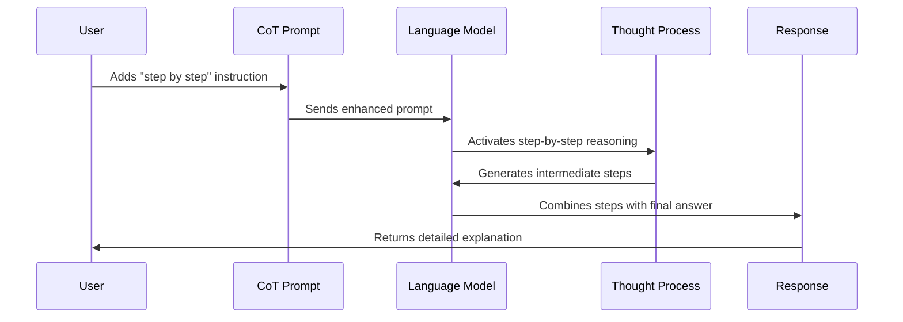

# Chapter 5: Chain of Thought (CoT) Prompting

In [Few-Shot Learning](04_few_shot_learning_.md), we learned how to enhance model performance by including examples in our prompts. Now, let's explore a technique that helps AI models tackle complex problems by breaking them down into smaller, manageable steps: Chain of Thought prompting.

## Why Do We Need Chain of Thought Prompting?

Have you ever tried to solve a difficult math problem? If so, you probably didn't just write down the final answer. Instead, you likely worked through it step by step, writing out your calculations and reasoning along the way.

This step-by-step approach is exactly what Chain of Thought (CoT) prompting encourages AI models to do. Instead of jumping straight to an answer, the model shows its "work" - just like we were taught in school!

Let's see the difference with a simple example:

**Standard prompt:**
```
What is 17 × 28?
```

**Chain of Thought prompt:**
```
What is 17 × 28? Let's work through this step by step.
```

The first prompt might give you just the answer: "476." But the second prompt encourages the model to explain its thinking:

```
To calculate 17 × 28, I'll break it down:
1. First, I'll multiply 17 × 20 = 340
2. Then, I'll multiply 17 × 8 = 136
3. Finally, I'll add these products: 340 + 136 = 476

Therefore, 17 × 28 = 476
```

## When to Use Chain of Thought Prompting

CoT prompting is particularly useful for:

1. **Complex math problems**: When calculations involve multiple steps
2. **Logical reasoning**: For puzzles, deductions, or inferences
3. **Multi-step decision making**: When considering multiple factors
4. **Troubleshooting**: For identifying and solving problems systematically
5. **Teaching concepts**: When explaining something thoroughly

## Basic Implementation of CoT Prompting

Let's start with a simple implementation of Chain of Thought prompting:

```python
from langchain_openai import ChatOpenAI

llm = ChatOpenAI(model="gpt-4o-mini")
math_problem = "If a train travels at 60 km/h for 2.5 hours, how far will it go?"

cot_prompt = f"Solve this problem step by step: {math_problem}"
response = llm.invoke(cot_prompt).content
print(response)
```

This code prompts the model to solve the problem step by step. The response might look like:

```
Step 1: Identify the formula for distance when given speed and time.
Distance = Speed × Time

Step 2: Substitute the values we know.
Distance = 60 km/h × 2.5 hours

Step 3: Calculate the distance.
Distance = 150 km

Therefore, the train will travel 150 kilometers.
```

## Zero-Shot Chain of Thought

The example above uses what's called "zero-shot" CoT - we didn't show the model any examples of step-by-step reasoning. We just asked it to solve the problem step by step.

Researchers have found that certain phrases work especially well for triggering CoT reasoning:

```python
zero_shot_cot_prompt = f"{math_problem}\n\nLet's think about this step by step."
response = llm.invoke(zero_shot_cot_prompt).content
```

The simple phrase "Let's think about this step by step" is surprisingly effective at encouraging detailed reasoning!

## Few-Shot Chain of Thought

We can combine [Few-Shot Learning](04_few_shot_learning_.md) with CoT to create even more powerful prompts:

```python
from langchain.prompts import PromptTemplate

few_shot_cot_template = """Solve each problem step by step.

Problem: If a shirt costs $15 and is on sale for 20% off, how much does it cost?
Solution: 
Step 1: Calculate the discount amount.
20% of $15 = 0.20 × $15 = $3
Step 2: Subtract the discount from the original price.
$15 - $3 = $12
Therefore, the shirt costs $12.

Problem: {problem}
Solution:"""
```

This template shows the model an example of the step-by-step reasoning we want it to follow. We can use it like this:

```python
discount_problem = "If a laptop costs $800 and is on sale for 25% off, how much do I pay?"
prompt = few_shot_cot_template.format(problem=discount_problem)
response = llm.invoke(prompt).content
```

## Comparing Standard vs. Chain of Thought Prompting

Let's see the difference CoT makes on a more complex problem:

```python
from langchain_openai import ChatOpenAI

llm = ChatOpenAI(model="gpt-4o-mini")
problem = """
A cylindrical water tank has a radius of 3 meters and a height of 6 meters.
If it is currently half full, how many more liters of water can it hold?
(Use π = 3.14 and remember that 1 cubic meter = 1000 liters)
"""

# Standard prompt
standard_response = llm.invoke(f"Answer this question: {problem}").content

# Chain of Thought prompt
cot_response = llm.invoke(f"Solve this problem step by step: {problem}").content
```

The standard response might give just the answer, while the CoT response would break down the calculation in detail, making it easier to verify and understand.

## Chain of Thought for Complex Reasoning

CoT really shines with complex reasoning tasks. Consider this logical puzzle:

```python
logical_problem = """
In a room, there are 3 boxes. One contains apples, one contains oranges,
and one contains both apples and oranges. Each box is labeled, but all 
labels are incorrect. You can open one box and look inside. Which box 
should you open to determine the contents of all three boxes?
"""

cot_prompt = f"Solve the following logical puzzle step by step: {logical_problem}"
```

For this type of complex reasoning problem, seeing the model's thought process is invaluable!

## Self-Consistency with Chain of Thought

An advanced technique called "self-consistency" involves generating multiple reasoning paths and then taking the most consistent answer:

```python
def get_multiple_solutions(problem, num_paths=3):
    responses = []
    for i in range(num_paths):
        prompt = f"Solve this step by step: {problem}"
        response = llm.invoke(prompt).content
        responses.append(response)
    return responses
```

This approach, demonstrated in the `self-consistency.ipynb` notebook, can significantly improve accuracy for difficult problems by having the model try multiple reasoning approaches.

## How Chain of Thought Works Under the Hood

When you use Chain of Thought prompting, here's what happens behind the scenes:



Large language models have been trained on millions of examples of human reasoning, including step-by-step explanations in textbooks, tutorials, and educational content. When you prompt the model to "think step by step," you're activating its learned patterns of breaking down problems - similar to how human experts approach complex tasks.

This is why CoT works even though the model isn't actually "thinking" in the human sense - it's reproducing patterns of reasoning it's seen during training.

## Best Practices for Chain of Thought Prompting

To get the most out of CoT prompting:

1. **Be explicit**: Clearly ask for step-by-step reasoning
2. **Use trigger phrases**: "Let's think step by step" works remarkably well
3. **Provide space**: Give the model room to work through its reasoning
4. **Start simple**: For few-shot examples, use problems that are easier than your target problem
5. **Check intermediate steps**: Verify each step of the reasoning to catch errors early

## Practical Example: Solving a Business Problem

Let's see how CoT can help with a business decision:

```python
business_problem = """
A company sells two products: Basic ($30 profit per unit) and Premium ($50 profit per unit).
Manufacturing Basic takes 2 hours, while Premium takes 4 hours.
The factory has 40 hours of production time available.
How many of each product should be made to maximize profit?
"""

cot_prompt = f"Solve this business optimization problem step by step: {business_problem}"
```

The step-by-step approach helps break down this optimization problem into manageable parts, making the solution process clear and verifiable.

## Conclusion

Chain of Thought prompting is a powerful technique that improves the accuracy and transparency of AI-generated responses. By encouraging models to "show their work," we get more reliable answers and gain insight into the reasoning process.

In this chapter, we've learned:
- What Chain of Thought prompting is and why it's valuable
- How to implement zero-shot and few-shot CoT approaches
- When CoT is most effective and best practices for using it
- How CoT works under the hood

As you practice with Chain of Thought prompting, you'll find it becomes an essential tool in your prompt engineering toolkit, especially for complex reasoning tasks.

In the next chapter, [Prompt Chaining and Sequencing](06_prompt_chaining_and_sequencing_.md), we'll learn how to connect multiple prompts together to solve even more complex problems that require multiple stages of reasoning.

---

