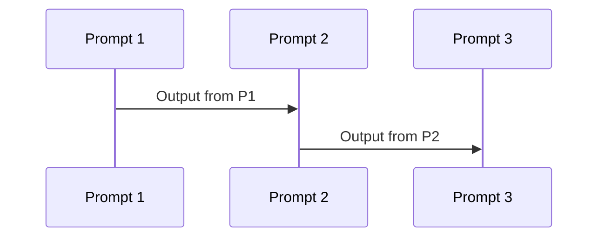
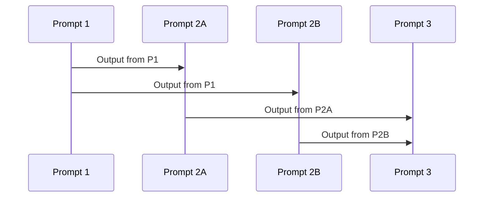
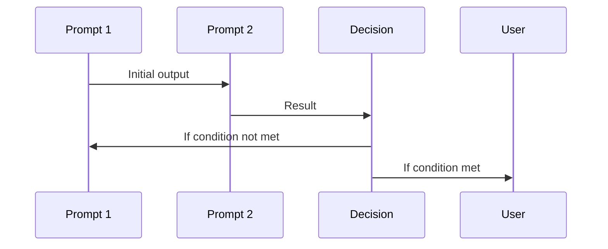
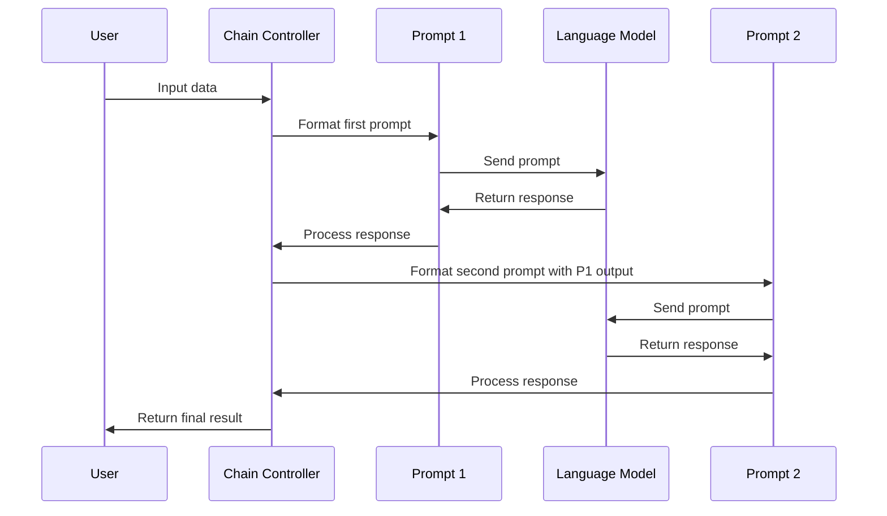

# Chapter 6: Prompt Chaining and Sequencing

In [Chain of Thought (CoT) Prompting](05_chain_of_thought__cot__prompting_.md), we learned how to encourage AI models to show their reasoning process step by step. Now, let's explore how we can connect multiple prompts together to solve even more complex problems through a technique called prompt chaining.

## What is Prompt Chaining?

Imagine you're baking a complex cake. Rather than trying to do everything at once, you follow a recipe that breaks down the process into manageable steps: first prepare the batter, then bake the layers, then make the frosting, and finally assemble and decorate. Each step builds on the previous one, with the output of one step becoming the input to the next.

This is exactly how prompt chaining works with AI models! Instead of trying to solve a complex problem with a single prompt, we break it down into smaller subtasks, each handled by a separate prompt, with the output of one prompt feeding into the input of the next.

## Why Use Prompt Chaining?

Prompt chaining offers several key benefits:

1. **Handles complexity**: Breaks down complex tasks into manageable pieces
2. **Improves accuracy**: Allows for focused, specialized handling of each subtask
3. **Provides control**: Gives you more control over the overall process
4. **Enhances transparency**: Makes it easier to understand and debug each step

## A Simple Example: Story Generation and Analysis

Let's start with a simple example: generating a short story and then analyzing its theme.

```python
from langchain_openai import ChatOpenAI
from langchain.prompts import PromptTemplate

# Initialize the language model
llm = ChatOpenAI(model="gpt-4o-mini")

# First prompt to generate a story
story_prompt = PromptTemplate(
    input_variables=["genre"],
    template="Write a short {genre} story in 3-4 sentences."
)
```

This first prompt template takes a genre as input and asks the model to write a short story in that genre. Now, let's create a second prompt that will analyze the theme of the story:

```python
# Second prompt to analyze the theme
theme_prompt = PromptTemplate(
    input_variables=["story"],
    template="Identify the main theme of the following story:\n{story}"
)
```

This second prompt takes a story as input and asks the model to identify its main theme. Now, let's chain them together:

```python
# Chain the prompts together
def story_chain(genre):
    # Generate the story
    story = (story_prompt | llm).invoke({"genre": genre}).content
    
    # Analyze the theme
    theme = (theme_prompt | llm).invoke({"story": story}).content
    
    return {"story": story, "theme": theme}
```

In this function, we first generate a story based on the provided genre, then pass that story to the theme analysis prompt. The output of the first prompt (the story) becomes the input to the second prompt.

Let's see the result:

```python
result = story_chain("mystery")
print(f"Story: {result['story']}\n\nTheme: {result['theme']}")
```

This would output the generated mystery story followed by the AI's analysis of its main theme. The beauty of this approach is that each prompt is focused on a specific task, making the overall process more manageable and accurate.

## Building More Complex Chains

Now that we understand the basics, let's explore a more complex example: a financial analysis chain that breaks down a company's health into multiple aspects.

```python
def analyze_profitability(revenue, net_income):
    prompt = """
    Analyze the company's profitability based on:
    - Revenue: ${revenue} million
    - Net Income: ${net_income} million
    Calculate the profit margin and provide a brief analysis.
    """
    return llm.invoke(prompt.format(revenue=revenue, net_income=net_income)).content
```

This function handles just one aspect of financial analysis: profitability. We'll create similar functions for other aspects:

```python
def analyze_liquidity(assets, liabilities):
    prompt = """
    Analyze the company's liquidity based on:
    - Total Assets: ${assets} million
    - Total Liabilities: ${liabilities} million
    Calculate relevant ratios and provide a brief analysis.
    """
    return llm.invoke(prompt.format(assets=assets, liabilities=liabilities)).content
```

Now, let's create an integration function that combines these analyses:

```python
def integrate_results(profitability, liquidity):
    prompt = """
    Based on the following analyses, provide an overall assessment:
    
    Profitability Analysis:
    {profitability}
    
    Liquidity Analysis:
    {liquidity}
    
    Summarize key points and evaluate the financial position.
    """
    return llm.invoke(prompt.format(
        profitability=profitability, 
        liquidity=liquidity
    )).content
```

Finally, let's chain everything together:

```python
def financial_health_chain(revenue, net_income, assets, liabilities):
    # Step 1: Analyze profitability
    profitability = analyze_profitability(revenue, net_income)
    
    # Step 2: Analyze liquidity
    liquidity = analyze_liquidity(assets, liabilities)
    
    # Step 3: Integrate results
    overall_analysis = integrate_results(profitability, liquidity)
    
    return overall_analysis
```

This chain breaks down a complex financial analysis into three manageable steps: profitability analysis, liquidity analysis, and integration of results. Each step focuses on a specific aspect of the problem, making the overall analysis more thorough and accurate.

## Common Prompt Chaining Patterns

There are several common patterns in prompt chaining:

### 1. Linear Chains

The simplest pattern is a linear chain, where prompts flow in a straight line from one to the next:



Our story and theme example follows this pattern.

### 2. Branching Chains

In branching chains, the output from one prompt feeds into multiple subsequent prompts:



Our financial analysis example follows this pattern, with the company data feeding into separate analysis prompts before being combined.

### 3. Iterative Chains

Iterative chains involve repeating a prompt or sequence of prompts until a condition is met:



## Dynamic Prompt Generation

One powerful aspect of prompt chaining is that we can dynamically generate new prompts based on previous outputs. Let's look at a simple example with a Q&A system that generates follow-up questions:

```python
def dynamic_qa(initial_question, num_follow_ups=2):
    qa_chain = []
    current_question = initial_question
    
    for i in range(num_follow_ups + 1):
        # Get answer to current question
        answer = llm.invoke(f"Answer this question: {current_question}").content
        qa_chain.append({"question": current_question, "answer": answer})
        
        if i < num_follow_ups:
            # Generate a follow-up question based on the answer
            prompt = f"""
            Based on this Q&A:
            Q: {current_question}
            A: {answer}
            
            Generate a relevant follow-up question.
            """
            current_question = llm.invoke(prompt).content
    
    return qa_chain
```

This function creates a chain of questions and answers, where each new question is generated dynamically based on the previous answer.

## How Prompt Chaining Works Under the Hood

When you implement prompt chaining, here's what happens behind the scenes:



The key components are:

1. **Chain Controller**: Orchestrates the flow of data between prompts
2. **Prompt Templates**: Define the structure of each prompt
3. **Language Model**: Processes each prompt and generates responses
4. **Data Processing**: Optional transformations between prompts

In the LangChain library, which is commonly used for prompt chaining, the Chain class handles the orchestration of this flow. It manages the passing of outputs from one component to inputs of another, allowing for complex chains to be built from simple building blocks.

## Best Practices for Prompt Chaining

To get the most out of prompt chaining:

1. **Start simple**: Begin with a clear understanding of each subtask
2. **Design for failure**: Include error handling between chain steps
3. **Consider validation**: Add validation steps to ensure outputs meet expectations
4. **Document the flow**: Make your chain's structure clear to others (and your future self)
5. **Test each component**: Verify that each prompt works correctly on its own before chaining

## Practical Example: Text Analysis Pipeline

Let's create a practical text analysis pipeline that:
1. Extracts key topics from a text
2. Researches each topic in more detail
3. Integrates the findings into a comprehensive analysis

```python
def extract_topics(text):
    prompt = f"Identify the 3 main topics discussed in this text:\n{text}"
    return llm.invoke(prompt).content

def research_topic(topic):
    prompt = f"Provide key information about: {topic}"
    return llm.invoke(prompt).content
```

These functions handle the first two steps of our pipeline. Now, let's create the integration function:

```python
def integrate_research(text, topics, research_results):
    prompt = f"""
    Based on the original text and research on key topics:
    
    Original text: {text}
    
    Research findings:
    {research_results}
    
    Provide a comprehensive analysis connecting these elements.
    """
    return llm.invoke(prompt).content
```

Finally, let's chain everything together:

```python
def analysis_pipeline(text):
    # Step 1: Extract topics
    topics_text = extract_topics(text)
    topics = topics_text.split('\n')
    
    # Step 2: Research each topic
    research_results = ""
    for topic in topics:
        if topic:  # Skip empty lines
            research = research_topic(topic)
            research_results += f"Topic: {topic}\n{research}\n\n"
    
    # Step 3: Integrate findings
    analysis = integrate_research(text, topics_text, research_results)
    
    return analysis
```

This pipeline demonstrates how prompt chaining can break down a complex task (comprehensive text analysis) into manageable subtasks (topic extraction, research, and integration).

## Conclusion

Prompt chaining is a powerful technique that allows us to tackle complex problems by breaking them down into smaller, more manageable pieces. By connecting multiple prompts together, with each prompt focusing on a specific subtask, we can create sophisticated AI pipelines that deliver more accurate and useful results.

In this chapter, we've learned:
- What prompt chaining is and why it's useful
- How to implement simple chains and more complex patterns
- Common patterns like linear, branching, and iterative chains
- How to dynamically generate prompts based on previous outputs
- How prompt chaining works under the hood
- Best practices for designing effective prompt chains

As you continue your prompt engineering journey, you'll find that prompt chaining becomes an essential tool for building more sophisticated AI applications.

In the next chapter, [Constrained and Guided Generation](07_constrained_and_guided_generation_.md), we'll explore how to control and direct the outputs of language models more precisely, which complements perfectly with the chaining techniques we've covered here.

---

