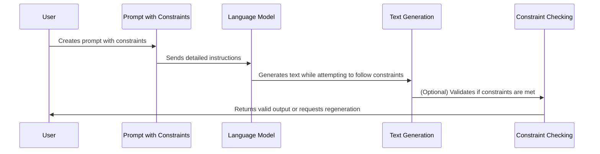

# Chapter 7: Constrained and Guided Generation

In [Prompt Chaining and Sequencing](06_prompt_chaining_and_sequencing_.md), we learned how to connect multiple prompts together to solve complex problems. Now, let's explore how to set specific boundaries for AI outputs using constrained and guided generation.

## What is Constrained and Guided Generation?

Have you ever given a child coloring instructions like "stay within the lines and only use blue and green"? This is exactly what constrained generation does with AI models! 

Instead of asking an AI to "write a product description," which could result in any format, length, or style, constrained generation lets you specify exactly what you want:

"Write a product description for a smart water bottle that:
- Is exactly 3 paragraphs long
- Includes 5 bullet points for features
- Contains no technical jargon
- Ends with a call to action"

By setting these boundaries, you gain much more control over what the AI produces, making the output more predictable and useful for specific purposes.

## When to Use Constrained Generation

Constrained generation is particularly helpful when you need:

1. **Specific formats**: For creating structured data like JSON, tables, or forms
2. **Consistent styles**: When outputs need to follow brand guidelines or tone requirements
3. **Limited scope**: When you want the AI to focus only on certain aspects of a topic
4. **Avoidance of topics**: When certain content should be excluded for safety or relevance
5. **Length control**: When you need outputs of specific lengths (not too short, not too long)

## Basic Constrained Generation

Let's start with a simple example of constrained generation:

```python
from langchain_openai import ChatOpenAI
from langchain.prompts import PromptTemplate

llm = ChatOpenAI(model="gpt-4o-mini")
template = """Write a tweet about {topic} that:
1. Is exactly 280 characters
2. Includes exactly 2 hashtags
3. Contains no URLs
4. Has an emoji at the beginning and end

Tweet:"""
```

This prompt template clearly defines the constraints for our tweet. The model knows exactly what we expect.

Let's use this template to generate a constrained tweet:

```python
tweet_prompt = PromptTemplate(
    input_variables=["topic"],
    template=template
)

topic = "artificial intelligence"
result = llm.invoke(tweet_prompt.format(topic=topic))
print(result.content)
```

The output will be a tweet that follows all our specified constraints - exactly 280 characters, with 2 hashtags, no URLs, and emojis at the beginning and end.

## Format Constraints

One of the most common uses of constrained generation is to get AI outputs in specific formats. Let's create a constrained prompt for generating a product review in a specific format:

```python
review_template = """Write a product review for {product} that includes:
1. A rating from 1-5 stars
2. Three pros (in bullet points)
3. Two cons (in bullet points)
4. A one-sentence recommendation

Format it EXACTLY like this:
RATING: [X stars]
PROS:
• [Pro 1]
• [Pro 2]
• [Pro 3]
CONS:
• [Con 1]
• [Con 2]
RECOMMENDATION: [Your recommendation]"""
```

This template not only specifies what content to include but also exactly how to format it.

## Content Constraints and Exclusions

Sometimes, you need to specify what NOT to include. This is called "negative prompting":

```python
exclude_template = """Write a brief explanation of {topic} for a general audience.
DO NOT include any of the following:
- Technical jargon or complex terminology
- Historical dates or statistics
- Controversial opinions or debates
- References to specific people

Keep your explanation under 100 words."""
```

This prompt constrains the model to avoid certain types of content while explaining the topic.

## Length Constraints

Controlling the length of AI outputs is crucial for many applications:

```python
length_template = """Summarize the following article in exactly {word_count} words.
Do not use more or fewer words.

Article: {article}

Summary:"""
```

By specifying an exact word count, you can get summaries that fit precisely into your desired space.

## Advanced Constraints with Structured Outputs

For more complex constraints, you might want outputs in structured formats like JSON:

```python
json_template = """Create a JSON object for a {object_type} with the following attributes:
{attributes}

Format it as valid JSON with proper indentation.
The JSON MUST be valid and parseable."""
```

Let's use this template to create a constrained JSON output:

```python
attributes = "name, age, email, subscription_status (active/inactive), join_date"
object_type = "user profile"

json_prompt = PromptTemplate(
    input_variables=["object_type", "attributes"],
    template=json_template
)

result = llm.invoke(json_prompt.format(
    object_type=object_type,
    attributes=attributes
))
print(result.content)
```

This will generate a properly formatted JSON object following our constraints.

## Validating Constrained Outputs

Sometimes, the AI might not perfectly follow all constraints. For important applications, you may want to validate outputs:

```python
import re

def validate_tweet(tweet):
    """Validate that a tweet meets our constraints."""
    constraints = {
        "length": len(tweet) <= 280,
        "hashtags": len(re.findall(r'#\w+', tweet)) == 2,
        "no_urls": len(re.findall(r'http[s]?://(?:[a-zA-Z]|[0-9]|[$-_@.&+]|[!*\\(\\),]|(?:%[0-9a-fA-F][0-9a-fA-F]))+', tweet)) == 0,
        "emojis": len(re.findall(r'[\U0001F600-\U0001F64F\U0001F300-\U0001F5FF\U0001F680-\U0001F6FF\U0001F700-\U0001F77F\U0001F780-\U0001F7FF\U0001F800-\U0001F8FF\U0001F900-\U0001F9FF\U0001FA00-\U0001FA6F\U0001FA70-\U0001FAFF\U00002702-\U000027B0\U000024C2-\U0001F251]', tweet)) >= 2
    }
    return constraints
```

This function checks if a generated tweet meets all our specified constraints.

## How Constrained Generation Works Under the Hood

When you use constrained generation, here's what happens:



The key to effective constrained generation is clarity in your constraints. The language model tries to follow instructions, but it doesn't have a perfect understanding of all constraints. It's making its best attempt to follow your guidelines based on patterns it learned during training.

## Best Practices for Constrained Generation

1. **Be explicit and specific**: Clearly state all constraints
2. **Use formatting examples**: Show exactly how you want the output formatted
3. **Prioritize constraints**: List the most important constraints first
4. **Validate when necessary**: For critical applications, verify that outputs meet constraints
5. **Iterate and refine**: If constraints aren't being followed, try rephrasing them

## Real-World Examples

### Example 1: Generating Product Descriptions

```python
product_template = """Create a product description for {product_name} with these constraints:
- Exactly 3 paragraphs
- Paragraph 1: Overview and main value proposition (3-4 sentences)
- Paragraph 2: Features and benefits (4-5 bullet points)
- Paragraph 3: Call to action and guarantee (2-3 sentences)
- Tone: {tone}
- Target audience: {audience}
- Avoid: Technical jargon, hyperbole, price mentions"""
```

This template ensures consistent product descriptions that follow marketing guidelines.

### Example 2: Generating SQL Queries

```python
sql_template = """Generate a valid SQL query to {task} with these constraints:
- Use only these tables: {tables}
- Query must include proper SELECT, FROM, and WHERE clauses
- Include comments explaining each part
- Do not use any unstated tables or columns
- Format with proper indentation and line breaks"""
```

This template helps generate SQL queries that follow database best practices.

## Conclusion

Constrained and guided generation is a powerful technique that gives you more control over AI outputs. By setting clear boundaries and formatting requirements, you can ensure that generated content meets your specific needs and follows necessary guidelines.

We've learned:
- What constrained generation is and when to use it
- How to create prompts with specific format constraints
- How to exclude unwanted content
- How to control output length and structure
- How constrained generation works under the hood
- Best practices for effective constraint design

In the next chapter, [Role Prompting](08_role_prompting_.md), we'll explore how assigning specific roles to AI models can further enhance their performance for specialized tasks.

---

