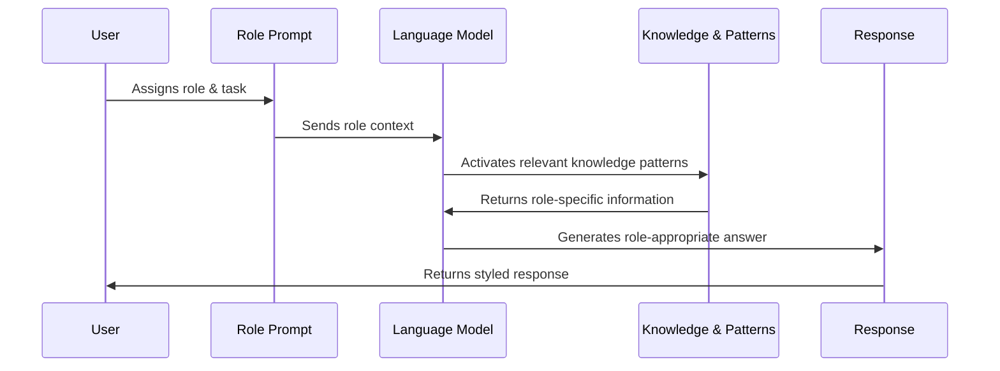

# Chapter 8: Role Prompting

In [Constrained and Guided Generation](07_constrained_and_guided_generation_.md), we learned how to set specific boundaries for AI outputs. Now, let's explore a powerful technique that shapes how AI responds by giving it a specific persona or character to embody: Role Prompting.

## What is Role Prompting?

Have you ever played pretend as a child? Maybe you were a doctor one day and an astronaut the next. Each role came with its own way of speaking, knowledge, and problem-solving approach. Role prompting works the same way with AI!

Role prompting is like telling the AI model: "For this conversation, you're going to be a pediatrician" or "Respond as if you're a poet from the 1800s." By assigning a specific role, you guide the model to draw on relevant knowledge and adopt an appropriate tone and perspective.

Let's see a simple example:

**Standard prompt:**
```
Explain photosynthesis.
```

**Role prompt:**
```
You are a kindergarten teacher explaining science to 5-year-olds. 
Explain photosynthesis.
```

The difference in responses would be dramatic! The second prompt would likely result in a simpler explanation using child-friendly language and analogies.

## When to Use Role Prompting

Role prompting is particularly useful when you need:

1. **Specialized knowledge**: When you want responses that reflect expertise in a specific field
2. **Particular writing style**: When you need content written in a distinct voice or style
3. **Simplified explanations**: When you want complex topics made accessible to certain audiences
4. **Creative content**: When you want to generate content from a unique perspective
5. **Consistent tone**: When you need responses to maintain a specific professional or creative tone

## Basic Implementation of Role Prompting

Let's start with a simple implementation using LangChain:

```python
from langchain_openai import ChatOpenAI
from langchain.prompts import PromptTemplate

llm = ChatOpenAI(model="gpt-4o-mini")
role_prompt = "You are a {role}. {task}"
```

This creates a template we can use for different roles. The `{role}` placeholder will be replaced with our chosen role, and `{task}` with what we want the AI to do.

Let's see how we can use this template:

```python
template = PromptTemplate(
    input_variables=["role", "task"],
    template=role_prompt
)

doctor_prompt = template.format(
    role="medical doctor specializing in cardiology",
    task="Explain how the heart works in simple terms."
)

response = llm.invoke(doctor_prompt)
print(response.content)
```

In this example, we're asking the AI to act as a cardiologist explaining how the heart works. The model will draw on medical knowledge and terminology while keeping the explanation simple as requested.

## Crafting Effective Role Descriptions

The way you describe the role significantly impacts the AI's response. Compare these two role descriptions:

```python
basic_role = "You are a chef."
detailed_role = """You are a professional chef with 20 years of 
experience in Italian cuisine, trained in Florence, and known 
for your simple yet flavorful pasta dishes."""
```

The second description provides much more context for the AI to work with, resulting in more specialized and authentic responses. Let's see this in action:

```python
chef_prompt = PromptTemplate(
    input_variables=["chef_description", "dish"],
    template="You are {chef_description}. Share a quick recipe for {dish}."
)

response = llm.invoke(chef_prompt.format(
    chef_description=detailed_role,
    dish="spaghetti carbonara"
))
```

This prompt will likely produce a more authentic Italian carbonara recipe compared to using just the basic role description.

## Role Components for Maximum Effect

An effective role prompt often includes these components:

1. **Identity**: Who the AI is pretending to be
2. **Expertise/Background**: Relevant experience and knowledge
3. **Style/Tone**: How they communicate
4. **Values/Approach**: What they prioritize or how they solve problems

Here's how we can incorporate all these elements:

```python
comprehensive_role = PromptTemplate(
    input_variables=["identity", "expertise", "style", "values", "task"],
    template="""You are a {identity} with {expertise}.
You communicate in a {style} manner and prioritize {values}.
{task}"""
)
```

This template gives us fine-grained control over how the AI responds. We can use it like this:

```python
financial_advisor = comprehensive_role.format(
    identity="financial advisor",
    expertise="15 years of experience in personal investing",
    style="clear, jargon-free",
    values="long-term growth and risk management",
    task="Provide advice on starting a retirement fund with $5000."
)
```

## Comparing Different Roles

Let's see how different roles produce different responses for the same task:

```python
roles = [
    "elementary school teacher",
    "quantum physicist",
    "social media influencer"
]

task = "Explain what gravity is."
results = []

for role in roles:
    prompt = f"You are a {role}. {task}"
    response = llm.invoke(prompt)
    results.append((role, response.content[:100] + "..."))
```

This code would show how explanations of gravity vary dramatically depending on the assigned role - from simple, accessible language to technical jargon to casual, engaging content.

## How Role Prompting Works Under the Hood

When you use role prompting, here's what happens behind the scenes:



Language models like GPT have been trained on vast amounts of text from different fields, professions, and writing styles. When you specify a role, you're essentially telling the model which subset of its knowledge to draw from and which patterns of language to emulate.

The model doesn't actually "become" a doctor or chef - it doesn't have true expertise or credentials. Instead, it's retrieving patterns of how these professionals typically communicate based on what it's seen in its training data.

## Best Practices for Role Prompting

To get the most out of role prompting:

1. **Be specific**: "Doctor" is good, but "pediatric neurologist with 15 years of experience" is better
2. **Include context**: Add relevant background or constraints for the role
3. **Define the audience**: Specify who the role is communicating with
4. **Set the tone**: Indicate how formal, casual, or technical the response should be
5. **Avoid stereotypes**: Be mindful not to reinforce harmful stereotypes in role descriptions

## Advanced Role Prompting Techniques

### 1. Multi-Role Conversations

You can create more dynamic interactions by assigning different roles to the model in a conversation:

```python
facilitator_prompt = """You are a meeting facilitator for a product design team.
First, summarize the following project brief as a product manager would.
Then, identify three potential challenges an engineer might raise.
Finally, suggest two creative solutions as a designer would."""
```

### 2. Evolving Roles

You can also evolve a role throughout a conversation:

```python
evolving_teacher = """You are a math teacher helping a student understand fractions.
Begin by explaining fractions at a 3rd-grade level.
If the student asks a follow-up question, elevate your explanation to a 5th-grade level.
If they ask another follow-up, explain at a middle school level."""
```

## Practical Example: Technical Writing Assistant

Let's put everything together in a practical example:

```python
tech_writer_prompt = PromptTemplate(
    input_variables=["topic", "audience"],
    template="""You are a technical writer with expertise in making complex topics 
accessible without sacrificing accuracy. You write in a clear, concise style with 
well-structured paragraphs and helpful examples.

Write documentation for {topic} aimed at {audience}. Include:
1. A brief overview
2. Key concepts
3. A simple example"""
)

response = llm.invoke(tech_writer_prompt.format(
    topic="API authentication",
    audience="junior developers with basic web knowledge"
))
```

This prompt creates a technical writing assistant that can produce beginner-friendly documentation on complex topics.

## Conclusion

Role prompting is a powerful technique that allows you to shape AI responses by assigning specific personas and expertise. By carefully crafting role descriptions, you can guide the model to produce responses with the right tone, knowledge level, and perspective for your needs.

We've learned:
- What role prompting is and when to use it
- How to implement basic and advanced role prompts
- The components of effective role descriptions
- How role prompting works under the hood
- Best practices for crafting role prompts

As you practice with role prompting, you'll develop an intuition for which roles work best for different scenarios. This technique becomes especially powerful when combined with other prompt engineering methods we've covered.

In the next chapter, [Prompt Optimization Techniques](09_prompt_optimization_techniques_.md), we'll explore how to refine and improve your prompts to achieve even better results.

---

