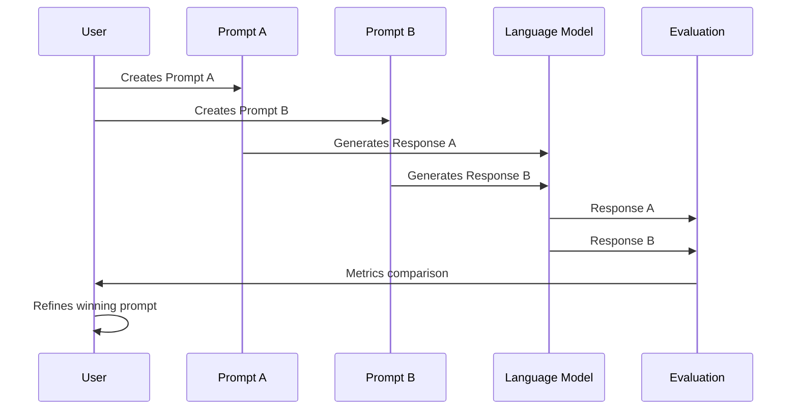

# Chapter 9: Prompt Optimization Techniques

In [Role Prompting](08_role_prompting_.md), we learned how to enhance AI responses by assigning specific personas to the model. Now, let's explore how to systematically improve our prompts through testing and refinement.

## Why Optimize Your Prompts?

Have you ever baked cookies using a recipe, then tweaked the ingredients slightly each time until you found the perfect combination? Prompt optimization works in a similar way. Instead of accepting the first response from an AI model, we can methodically refine our prompts to get better, more reliable results.

Imagine you're creating a customer service chatbot for an online store. Your initial prompt might be:

```
Answer the customer's question about our return policy.
```

But this basic prompt might lead to vague or inconsistent responses. Through optimization, you could transform it into something much more effective.

## Understanding Prompt Optimization

Prompt optimization is the process of systematically improving your prompts to get better AI responses. It involves three key components:

1. **Testing different prompt variations** (A/B testing)
2. **Measuring performance** using defined metrics
3. **Iterative refinement** based on results

Let's explore each of these components.

## A/B Testing Prompts

A/B testing involves comparing two or more versions of a prompt to see which performs better. It's like having a taste test between different cookie recipes to find out which one people prefer.

Here's a simple way to implement A/B testing:

```python
from langchain_openai import ChatOpenAI

llm = ChatOpenAI(model="gpt-4o-mini")

# Define prompt variations
prompt_a = "Explain climate change in simple terms."
prompt_b = "Explain climate change as if talking to a 10-year-old."

# Generate responses
response_a = llm.invoke(prompt_a).content
response_b = llm.invoke(prompt_b).content
```

This code creates two different prompts for the same task and generates responses for each. The next step would be to evaluate which response better meets your needs.

## Measuring Prompt Performance

To determine which prompt works better, we need specific metrics. These could include:

1. **Relevance**: How well does the response address the core question?
2. **Clarity**: Is the response easy to understand?
3. **Accuracy**: Does the response contain factual errors?
4. **Completeness**: Does the response cover all necessary aspects?

Here's a simple function to evaluate responses based on these criteria:

```python
def evaluate_response(response, criteria):
    """Manually score a response on a scale of 1-10 for each criterion."""
    scores = {}
    print(f"Response: {response[:100]}...\n")  # Show first 100 chars
    for criterion in criteria:
        score = int(input(f"Score for {criterion} (1-10): "))
        scores[criterion] = score
    return scores, sum(scores.values()) / len(scores)
```

This function lets you manually score responses based on your criteria. For more automated evaluation, you could use another AI to rate the responses:

```python
def ai_evaluate(response, criterion):
    prompt = f"""Rate this response on {criterion} from 1-10:
    "{response}"
    Score:"""
    result = llm.invoke(prompt).content
    # Extract numeric score with simple parsing
    return int(result.strip().split()[0])
```

This function uses an AI to evaluate another AI's response, which can be more scalable for testing many variations.

## Iterative Refinement

Once you've tested and measured different prompts, you can use the insights to refine your approach. This iterative process is at the heart of prompt optimization.

Here's a simple iterative refinement workflow:

```python
def refine_prompt(initial_prompt, iterations=3):
    current_prompt = initial_prompt
    for i in range(iterations):
        response = llm.invoke(current_prompt).content
        
        # Ask for improvements to the prompt
        improve_prompt = f"""Based on this response:
        "{response[:200]}..."
        
        How can I improve this prompt?
        Current prompt: {current_prompt}"""
        
        suggestions = llm.invoke(improve_prompt).content
        print(f"Iteration {i+1} suggestions: {suggestions}\n")
        
        # Update the prompt based on suggestions
        current_prompt = input("Enter refined prompt: ")
    return current_prompt
```

This function demonstrates an interactive refinement process where you get suggestions for improvement and manually update the prompt for several iterations.

## Real-World Example: Optimizing a Product Description Generator

Let's apply these techniques to our initial example - creating product descriptions for an online store:

```python
initial_prompt = "Write a product description for a coffee maker."

# Define evaluation criteria
criteria = ["Persuasiveness", "Detail", "Tone", "Call to action"]

# Generate and evaluate first response
response = llm.invoke(initial_prompt).content
scores, avg_score = evaluate_response(response, criteria)
print(f"Initial prompt score: {avg_score:.1f}/10\n")
```

After evaluation, we might refine our prompt:

```python
refined_prompt = """Write a product description for a premium coffee maker. 
Include:
- Key features and benefits
- Technical specifications
- Why the customer needs it
- A clear call to action
Use an enthusiastic, premium tone."""

response = llm.invoke(refined_prompt).content
scores, new_avg = evaluate_response(response, criteria)
print(f"Refined prompt score: {new_avg:.1f}/10")
```

By continuing this process of testing, measuring, and refining, we can systematically improve our prompts to achieve better results.

## How Prompt Optimization Works Under the Hood

Let's visualize the prompt optimization process:



This diagram shows the basic A/B testing workflow where two prompt variations are compared, and the results inform further refinement.

For more complex optimization, you might use a systematic approach:

1. **Divergent phase**: Create multiple prompt variations
2. **Evaluation phase**: Test each variation against your metrics
3. **Convergent phase**: Combine the best elements from top performers
4. **Refinement phase**: Make small adjustments to optimize further

## Advanced Optimization Techniques

### 1. Prompt Length Optimization

Sometimes shorter prompts work better; other times, detailed prompts produce superior results. Testing different lengths can reveal the optimal verbosity:

```python
short_prompt = "Summarize climate change."
medium_prompt = "Summarize climate change in 3-5 sentences."
long_prompt = """Provide a comprehensive summary of climate change, including:
- Basic definition
- Key causes
- Major effects
- Current scientific consensus
Aim for clarity and accuracy."""
```

### 2. Specificity Tuning

Adding specific instructions can dramatically improve responses:

```python
vague = "Write about electric cars."
specific = "Compare Tesla Model 3 and Nissan Leaf on price, range, and features."
```

### 3. Format Control

Testing different formatting instructions:

```python
prose = "Explain the benefits of exercise."
bulleted = "List the benefits of exercise as bullet points."
numbered = "Provide the top 5 benefits of exercise as a numbered list."
```

## Implementation in Practice

Let's look at a more complete implementation of prompt optimization using a technique called "evolutionary optimization":

```python
def evolutionary_optimize(seed_prompt, generations=3, population=3):
    current_gen = [seed_prompt]
    
    for gen in range(generations):
        # Create variations for this generation
        variations = current_gen.copy()
        for prompt in current_gen:
            mutation_prompt = f"Create {population-1} variations of this prompt: '{prompt}'"
            mutations = llm.invoke(mutation_prompt).content.split("\n\n")[:population-1]
            variations.extend(mutations)
        
        # Evaluate all variations
        scores = []
        for prompt in variations:
            response = llm.invoke(prompt).content
            eval_score = ai_evaluate(response, "overall quality")
            scores.append((prompt, eval_score))
        
        # Select top performers for next generation
        scores.sort(key=lambda x: x[1], reverse=True)
        current_gen = [p for p, s in scores[:population]]
        
        print(f"Generation {gen+1} best prompt: {current_gen[0]}")
    
    return current_gen[0]  # Return the best prompt
```

This function mimics an evolutionary process where:
1. We start with a "seed" prompt
2. Create variations (mutations) of the best prompts
3. Evaluate all variations
4. Select the top performers to "breed" the next generation
5. Repeat until we've refined our prompt over several generations

## Conclusion

Prompt optimization is a powerful approach to systematically improve your AI interactions. By treating prompt creation as an iterative process rather than a one-time task, you can achieve significantly better results.

Remember these key principles:
- Test different variations of your prompts
- Measure performance using consistent metrics
- Refine based on what works best
- Repeat the process to continuously improve

The best prompt engineers don't just write good prompts—they systematically optimize them through testing and refinement.

In the next chapter, [Prompt Security and Ethics](10_prompt_security_and_ethics_.md), we'll explore important considerations around the responsible use of AI, including how to safeguard against prompt injections and ensure ethical use of these technologies.

---

