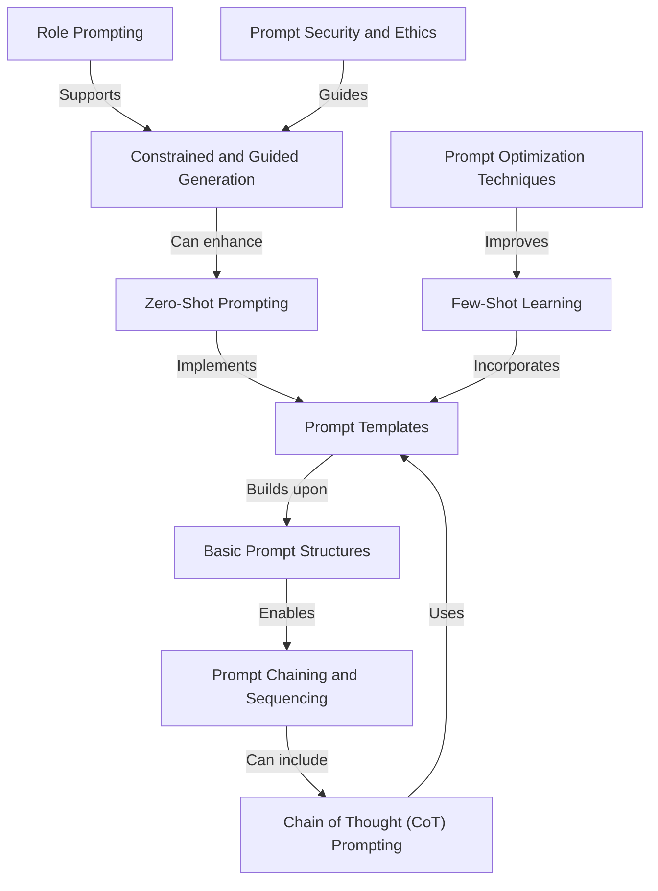

# Tutorial: Prompt_Engineering

This project focuses on **prompt engineering techniques** for working effectively with large language models. It covers various approaches from basic templates to advanced methods like *Chain of Thought*, *Few-Shot Learning*, and *Role Prompting*. The collection provides practical tools and strategies for designing prompts that produce more reliable, accurate, and controlled AI responses. With implementations using OpenAI's models and LangChain, it serves as a comprehensive resource for developers looking to master the art of communicating with and guiding AI models.

**Source Repository:** [https://github.com/NirDiamant/Prompt_Engineering](https://github.com/NirDiamant/Prompt_Engineering)

## Chapters

1. [Basic Prompt Structures
](01_basic_prompt_structures_.md)
2. [Prompt Templates
](02_prompt_templates_.md)
3. [Zero-Shot Prompting
](03_zero_shot_prompting_.md)
4. [Few-Shot Learning
](04_few_shot_learning_.md)
5. [Chain of Thought (CoT) Prompting
](05_chain_of_thought__cot__prompting_.md)
6. [Prompt Chaining and Sequencing
](06_prompt_chaining_and_sequencing_.md)
7. [Constrained and Guided Generation
](07_constrained_and_guided_generation_.md)
8. [Role Prompting
](08_role_prompting_.md)
9. [Prompt Optimization Techniques
](09_prompt_optimization_techniques_.md)
10. [Prompt Security and Ethics
](10_prompt_security_and_ethics_.md)

---

