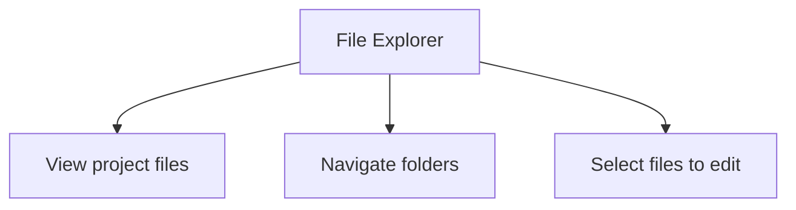
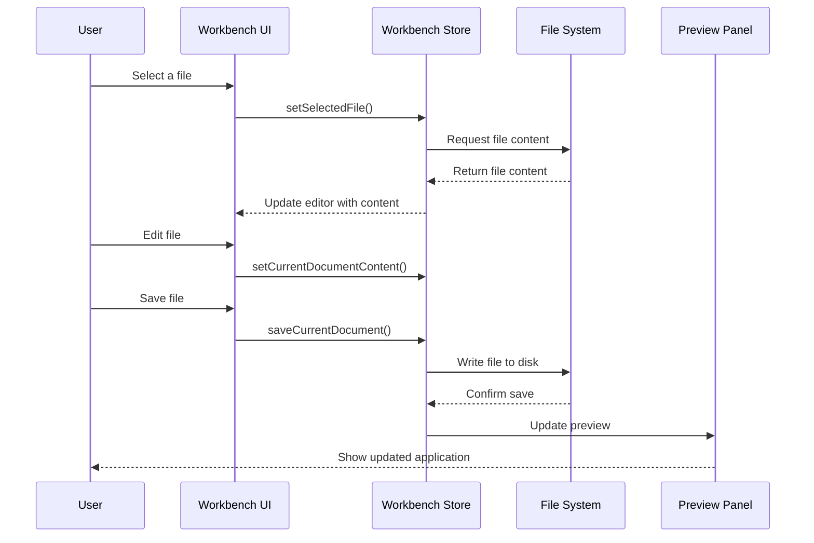

# Chapter 1: Workbench

Welcome to bolt.new! In this first chapter, we'll explore the Workbench - the foundation of your development experience in bolt.new.

## What is the Workbench?

Imagine you're a carpenter. When you work, you need a space where all your tools are within reach - your saw, hammer, measuring tape, and the piece of wood you're crafting. This organized workspace is your workbench.

In bolt.new, the Workbench serves the same purpose for coding. It's a complete development environment that lives right in your browser tab. No need to switch between different applications or set up complex development environments on your computer!

## Why Do We Need a Workbench?

Let's say you want to build a simple web application. Traditionally, you would need:

1. A code editor (like VS Code) to write your code
2. A file explorer to navigate your project files
3. A terminal to run commands
4. A browser to preview your application

Switching between all these tools can be disruptive to your workflow. The Workbench solves this by bringing everything together in one unified interface.

## The Workbench Components

The Workbench consists of four main components:

### 1. File Explorer



The File Explorer shows you all the files in your project in a tree structure. You can browse folders, select files to edit, and see which files have unsaved changes.

### 2. Code Editor

This is where you write and edit your code. It includes features like syntax highlighting, auto-indentation, and more to make coding easier.

### 3. Terminal

The Terminal allows you to run commands, just like you would in a command prompt or terminal on your computer. You can start servers, install packages, and run scripts.

### 4. Preview Panel

The Preview Panel shows you how your application looks and works in real-time. As you make changes to your code, you can instantly see the results.

## Using the Workbench

Let's walk through a simple example of how you might use the Workbench:

1. **Select a file to edit**: Click on a file in the File Explorer to open it in the Code Editor.

2. **Edit your code**: Make changes to the file in the Code Editor.

```javascript
// Before: A simple heading
const heading = document.createElement('h1');
heading.textContent = 'Hello World';

// After: Adding some style
const heading = document.createElement('h1');
heading.textContent = 'Hello World';
heading.style.color = 'blue';
```

3. **Save your changes**: Use the save button or keyboard shortcut (Ctrl+S or Cmd+S).

4. **Run your application**: Use the Terminal to start your application.

```bash
# Start a development server
npm run dev
```

5. **See your changes**: The Preview Panel will show your application with the changes you made.

## Switching Between Views

The Workbench allows you to easily switch between the Code view and Preview view:

```
[Code] [Preview]
```

This slider at the top of the Workbench lets you focus on either writing code or seeing the result.

## Under the Hood

How does the Workbench work behind the scenes? Let's take a look:



The Workbench is powered by a state management system called the `workbenchStore`. This store keeps track of:

- Which files are open
- The content of those files
- Which file is currently selected
- Whether the terminal is visible
- What's being displayed in the preview panel

Here's a simplified version of how the workbench store works:

```javascript
class WorkbenchStore {
  // Keep track of the UI state
  showWorkbench = atom(false);
  currentView = atom('code'); // 'code' or 'preview'
  
  // Keep track of files
  files = {...}
  selectedFile = atom(undefined);
  
  // Functions to update the state
  setSelectedFile(filePath) {
    this.selectedFile.set(filePath);
  }
  
  setCurrentDocumentContent(newContent) {
    // Update the content of the current file
  }
  
  saveCurrentDocument() {
    // Save the current document to the file system
  }
}
```

When you interact with the Workbench UI, it calls methods on this store, which then updates the state and triggers the appropriate actions.

## Workbench Layout

The layout of the Workbench is designed to be flexible and user-friendly:

```
+------------------------------------------------------+
|                      Header                          |
+------------------------------------------------------+
|         |                             |              |
|         |                             |              |
| File    |                             |              |
| Explorer|        Code Editor          |   Preview    |
|         |                             |              |
|         |                             |              |
|         |                             |              |
+------------------------------------------------------+
|                     Terminal                         |
+------------------------------------------------------+
```

You can resize the panels by dragging the dividers between them, allowing you to customize the layout to fit your needs.

## Conclusion

The Workbench is the central hub of your development experience in bolt.new. It brings together all the tools you need to build web applications in one cohesive interface, right in your browser.

By understanding how to use the Workbench, you've taken the first step towards becoming productive with bolt.new. In the next chapter, we'll explore the [Chat System](02_chat_system_.md), which allows you to interact with an AI assistant to help you with your coding tasks.

---

