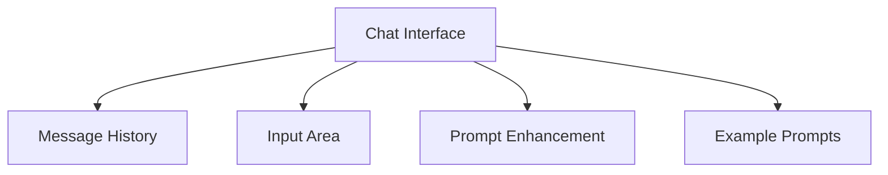
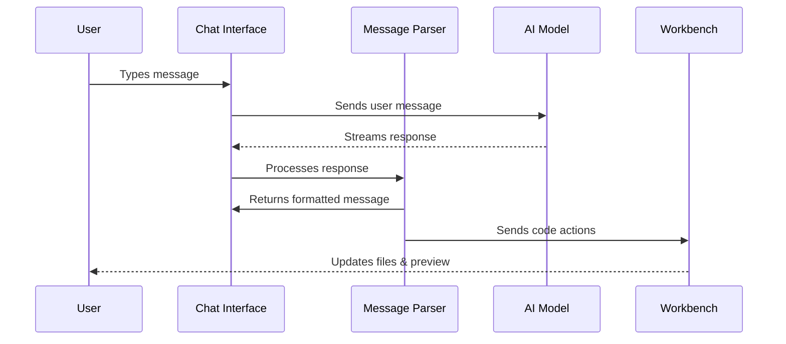

# Chapter 2: Chat System

In [Chapter 1: Workbench](01_workbench_.md), we explored the foundation of your development experience in bolt.new. Now let's dive into how you'll actually interact with the AI assistant through the Chat System.

## What is the Chat System?

Imagine you're working with a really helpful programming buddy who sits next to you while you code. You can ask this buddy questions, describe what you want to build, and get immediate help. The Chat System in bolt.new is exactly that - except your buddy is an AI assistant who can not only talk to you but also write code directly in your [Workbench](01_workbench_.md).

Think of the Chat System like texting with a friend who happens to be an expert coder. You send messages back and forth, but with a special twist - your AI friend can actually create and modify code in your project as you chat!

## Why Do We Need a Chat System?

Traditional coding typically involves:
1. Figuring out what you want to build
2. Searching online for how to build it
3. Reading documentation and tutorials
4. Writing code piece by piece
5. Debugging when things go wrong

This process can be time-consuming and frustrating, especially for beginners.

The Chat System transforms this experience by letting you simply describe what you want in plain English, and then watching as the AI not only explains concepts but actually writes, modifies, and runs code for you in the [Workbench](01_workbench_.md).

It's like having a coding teacher, documentation reader, and code writer all in one friendly chat interface.

## The Chat Interface

Let's look at the main components of the Chat interface:



### Message History

This is where you see all the messages between you and the AI. Your messages typically appear on one side, and the AI's responses on the other - just like in messaging apps you use every day.

The message history keeps track of your entire conversation, so you can always scroll back to see previous explanations or code snippets.

### Input Area

This is where you type your questions or instructions for the AI. It works just like the text input in any messaging app:

- Type your message in the text box
- Press Enter or click the send button to send it
- Use Shift+Enter if you want to add a new line within your message

### Prompt Enhancement

Sometimes you might struggle to explain exactly what you want. The prompt enhancement feature is like having an editor who helps improve your writing:

1. You write a basic request
2. You click the enhance button (star icon)
3. The AI rewrites your request to be more detailed and specific
4. You review the enhanced version and send it if you like it

### Example Prompts

When you're starting fresh, the Chat System shows you some example questions you can ask, like:
- "Build a todo app in React using Tailwind"
- "Create a cookie consent form using Material UI"
- "How do I center a div?"

Just click on any of these examples to start your conversation with a pre-written prompt.

## Using the Chat System

Let's walk through a simple example of how you might use the Chat System:

1. **Start a new conversation**: When you first open bolt.new, you'll see the Chat interface with some example prompts.

2. **Type a question or request**: Let's say you want to build a simple to-do app.

```
How can I build a simple to-do app with React?
```

3. **Send your message**: Press Enter or click the send button to submit your question to the AI.

4. **Receive a response**: The AI will respond with an explanation and start writing code for you.

```
I'll help you build a simple React to-do app! Let's start by creating 
the basic components:

First, let's create a new file called TodoApp.jsx:
```

5. **Watch the code appear in your Workbench**: As the AI explains the solution, it will also create and modify files in the [Workbench](01_workbench_.md).

6. **Continue the conversation**: You can ask follow-up questions or request changes.

```
Can you add the ability to mark tasks as completed?
```

7. **See your app come to life**: The AI will update the code, and you can see the changes reflected in the Preview Panel of your [Workbench](01_workbench_.md).

## Enhancing Your Prompts

The prompt enhancement feature is like having a writing assistant who helps you express your ideas more clearly. Here's how to use it:

1. **Type your initial question**: Maybe something simple like:

```
Make a website
```

2. **Click the enhance button**: It's the star icon at the bottom of the input area.

3. **Wait for enhancement**: The system will analyze your question and suggest a more detailed version.

4. **Review and send**: The enhanced prompt might look like:

```
Create a simple website with HTML, CSS, and JavaScript that includes
a homepage with a header, main content section, and footer. The website
should be responsive and have a clean, modern design.
```

This more detailed prompt will help the AI understand exactly what you're looking for.

## How Messages Are Rendered

The Chat System doesn't just display plain text - it intelligently formats different types of content:

- **Text explanations** are rendered as normal paragraphs
- **Code snippets** appear in special boxes with syntax highlighting
- **Actions** (like creating files or running commands) are shown with special formatting

This makes the conversation more readable and helps you understand what the AI is doing.

## Under the Hood

How does the Chat System work behind the scenes? Let's take a look:



When you send a message through the Chat System:

1. Your message is sent to the AI model
2. The AI generates a response and streams it back (so you see it appear gradually)
3. As the response comes in, a special parser looks for code-related commands
4. These commands are sent to the [Workbench](01_workbench_.md) to create or modify files
5. The formatted response is displayed in the chat

Let's look at some simplified code to understand this better:

```javascript
// This is the main Chat component that handles the conversation
export function Chat() {
  const { messages, isLoading, input, handleInputChange, send } = useChat({
    api: '/api/chat',
  });
  
  return (
    <div className="chat-container">
      <Messages messages={messages} isLoading={isLoading} />
      <InputArea value={input} onChange={handleInputChange} onSend={send} />
    </div>
  );
}
```

This code shows the basic structure of the Chat component. It uses a custom hook called `useChat` to manage the conversation state and handle communication with the AI.

The message parser is another important piece:

```javascript
const messageParser = new StreamingMessageParser({
  callbacks: {
    onArtifactOpen: (data) => {
      // Show the workbench when a file is created
      workbenchStore.showWorkbench.set(true);
      workbenchStore.addArtifact(data);
    },
    onActionOpen: (data) => {
      // Handle actions like creating a file
      workbenchStore.addAction(data);
    },
    onActionClose: (data) => {
      // Execute the action when it's complete
      workbenchStore.runAction(data);
    },
  },
});
```

This parser scans the AI's responses for special patterns that indicate code actions. When it finds one, it triggers the appropriate function to update the [Workbench](01_workbench_.md).

## Chat System State Management

The Chat System keeps track of its state using a simple store:

```javascript
// A simplified version of the chat store
export const chatStore = map({
  started: false,     // Has the conversation started?
  aborted: false,     // Was the last response stopped early?
  showChat: true,     // Is the chat interface visible?
});
```

This store is like the Chat System's memory. It remembers:
- Whether a conversation has started
- If you stopped the AI in the middle of a response
- Whether the chat panel should be visible

## Real-world Example: Building a Counter App

Let's see how all these pieces work together in a typical interaction:

1. **You type a message**: "Create a simple counter app with React"

2. **The message is sent to the AI**: Your request is transmitted to the AI model.

3. **The AI generates a response**: The model starts streaming back text that includes explanations and code.

4. **The message parser processes the response**: As each chunk of the response arrives, the parser looks for special markers that indicate code blocks or actions.

5. **The workbench is updated**: When the parser finds a code action like "create a file named Counter.jsx", it sends that instruction to the [Workbench](01_workbench_.md).

6. **You see the results in real-time**: 
   - The explanation appears in the Chat interface
   - New files appear in the [File Explorer](01_workbench_.md)
   - Code appears in the [Code Editor](03_code_editor_.md)
   - The counter app appears in the Preview Panel

7. **You can ask follow-up questions**: Maybe you want to add a reset button or change the styling.

This entire process happens seamlessly, making it feel like you're having a natural conversation that magically produces working code.

## Conclusion

The Chat System is your main way of interacting with bolt.new. It transforms the coding experience from writing line-by-line instructions into having a conversation about what you want to build. By simply describing your ideas in plain English, you can watch as they come to life in the [Workbench](01_workbench_.md).

The tight integration between the Chat System and other components means that your conversations directly translate into working code, bridging the gap between idea and implementation.

In the next chapter, we'll explore the [Code Editor](03_code_editor_.md), which allows you to view and modify the code that was generated through your chat conversations. While the Chat System is where you describe what you want to build, the Code Editor is where you can dive in and make detailed adjustments to your code.

---

