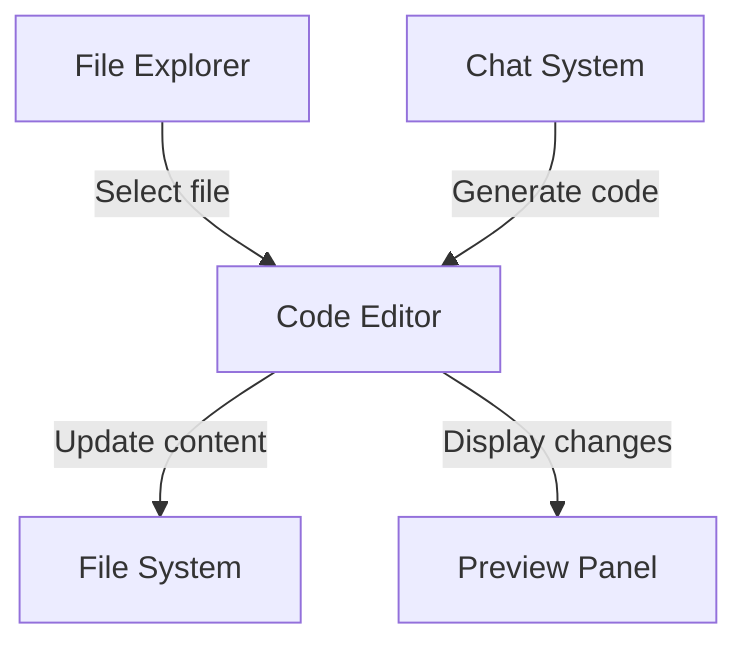
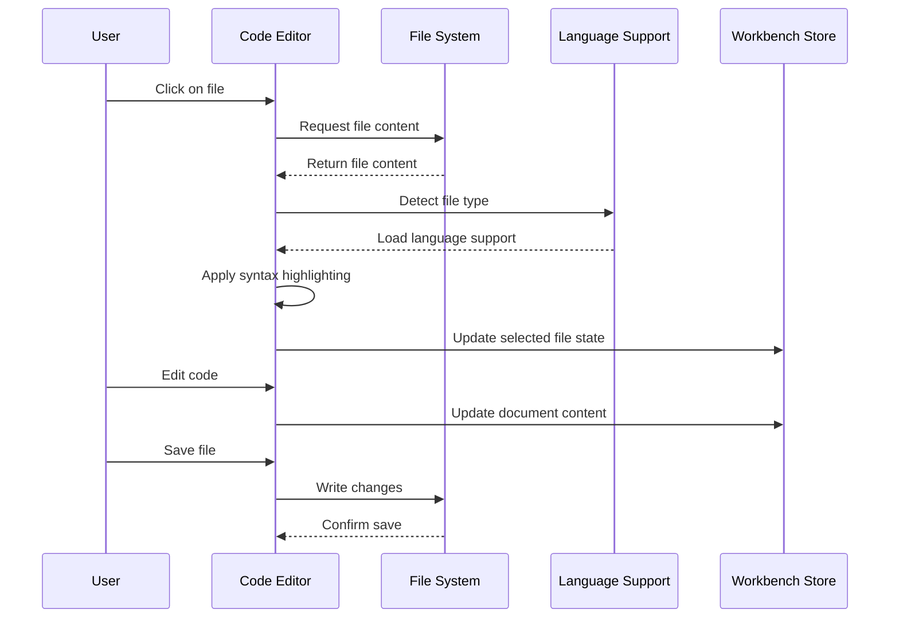

# Chapter 3: Code Editor

In [Chapter 2: Chat System](02_chat_system_.md), we explored how to interact with the AI assistant. Now, let's dive into where the actual coding happens: the Code Editor.

## What is the Code Editor?

Imagine you're writing a letter. You'd use a word processor like Microsoft Word or Google Docs to help you format your text, check your spelling, and organize your thoughts.

A Code Editor is similar, but specially designed for writing code instead of letters or essays. It's like a word processor with superpowers for programmers!

In bolt.new, the Code Editor is where you'll spend much of your time writing, editing, and reviewing code. It's the central part of the [Workbench](01_workbench_.md) where your ideas come to life as actual code.

## Why Do We Need a Special Editor for Code?

Let's think about why we can't just use a regular text editor for coding:

```javascript
function calculateTotal(items) {
  let total = 0;
  for (let i = 0; i < items.length; i++) {
    total += items[i].price;
  }
  return total;
}
```

In a regular text editor, this would just look like plain text. But in a Code Editor:

1. Different parts of the code get colored differently (syntax highlighting)
2. Line numbers help you find your place
3. When you type an opening bracket `{`, the editor automatically adds the closing `}`
4. The editor helps you indent your code to keep it organized

These features make coding much easier and help prevent mistakes!

## Key Features of the Code Editor

### Syntax Highlighting

```javascript
// Keywords like 'function' and 'return' appear in one color
function greet(name) {
  // Strings like 'Hello' appear in another color
  return "Hello, " + name + "!";
}
```

Syntax highlighting colors different parts of your code based on their role. This makes code easier to read and understand at a glance.

### Line Numbers and Cursor Position

```
1| function multiply(a, b) {
2|   return a * b;
3| }
```

Line numbers help you navigate large files and make it easier to discuss specific parts of code with others (like "check line 27").

### Auto-Indentation

When you press Enter after typing an opening bracket, the editor automatically indents the next line for you:

```javascript
function example() {
  // This line is automatically indented
  console.log("Properly indented!");
}
```

This helps keep your code neat and consistent, which is important for readability.

### Bracket Matching

```javascript
function complexFunction() {
  if (condition) {
    // When your cursor is near this bracket...
  } // ...the editor highlights its matching pair
}
```

The editor helps you keep track of opening and closing brackets, which prevents a common source of coding errors.

## Using the Code Editor in bolt.new

Let's walk through a typical workflow with the Code Editor:

### 1. Opening a File

When you click on a file in the File Explorer section of the [Workbench](01_workbench_.md), it opens in the Code Editor. The editor loads the file content and applies the appropriate syntax highlighting based on the file type.

### 2. Editing Your Code

Let's say you want to edit an HTML file to add a button:

```html
<!-- Before -->
<div class="container">
  <h1>My App</h1>
</div>

<!-- After adding a button -->
<div class="container">
  <h1>My App</h1>
  <button class="primary-btn">Click Me</button>
</div>
```

As you type, you'll notice the editor helps you by:
- Highlighting HTML tags in different colors
- Auto-closing tags when you type `<button>`
- Maintaining proper indentation

### 3. Saving Your Changes

When you make changes to a file, the editor marks it as "unsaved" (usually with a dot next to the filename in the File Explorer). You can save your changes by:

- Using the keyboard shortcut `Ctrl+S` (or `Cmd+S` on Mac)
- Clicking the save button in the editor toolbar

### 4. Working with Multiple Files

The Code Editor keeps track of all the files you've opened and remembers your scroll position in each file. This means you can:

1. Open `index.html` and scroll to line 50
2. Switch to `styles.css` to make some changes
3. Switch back to `index.html` and you'll still be at line 50

This is super helpful when you're working on a project with multiple related files!

## Code Editor Integration with the Workbench

The Code Editor is deeply integrated with other parts of the [Workbench](01_workbench_.md):



When you:
1. Select a file in the File Explorer, it opens in the Code Editor
2. Make changes in the Code Editor, they can be immediately reflected in the Preview Panel
3. Use the [Chat System](02_chat_system_.md) to generate code, it appears in the Code Editor

## Under the Hood

How does the Code Editor actually work? Let's peek behind the curtain:



### CodeMirror: The Engine Behind the Editor

The bolt.new Code Editor is built on top of a popular editor library called CodeMirror. This provides all the advanced editing features while allowing the bolt.new team to customize it for their specific needs.

Let's look at some simplified examples of how this works:

#### Language Support

The editor needs to know how to highlight different programming languages:

```typescript
// This code detects the language based on file extension
export const supportedLanguages = [
  LanguageDescription.of({
    name: 'JS',
    extensions: ['js', 'mjs', 'cjs'],
    async load() {
      return import('@codemirror/lang-javascript').then((module) => module.javascript());
    },
  }),
  // Other languages like HTML, CSS, Python, etc.
];
```

This code creates a list of supported languages. When you open a file, the editor checks its extension (like `.js` or `.html`) and loads the appropriate language support.

#### Editor Configuration

The editor is set up with various features:

```typescript
// A simplified version of the editor configuration
const editorExtensions = [
  lineNumbers(),         // Shows line numbers
  history(),             // Enables undo/redo
  bracketMatching(),     // Highlights matching brackets
  autocompletion(),      // Suggests code completions
  indentOnInput(),       // Automatically indents code
  // Many more features...
];
```

Each of these extensions adds a specific feature to the editor. They work together to create the complete editing experience.

#### State Management

The editor keeps track of all open documents:

```typescript
// Simplified version of how documents are tracked
class EditorStore {
  selectedFile = atom<string | undefined>();
  documents = map({});
  
  updateFile(filePath, newContent) {
    // Update the content of a file
    this.documents.setKey(filePath, {
      ...this.documents.get()[filePath],
      value: newContent
    });
  }
  
  updateScrollPosition(filePath, position) {
    // Remember scroll position for each file
    this.documents.setKey(filePath, {
      ...this.documents.get()[filePath],
      scroll: position
    });
  }
}
```

This code helps the editor remember which files you have open, their content, and even your scroll position in each file.

## A Real-World Example: Building a To-Do App

Let's see how the Code Editor would help you build a simple to-do app:

1. You open `TodoApp.jsx` in the editor
2. The editor automatically applies React/JSX syntax highlighting
3. You start typing your component:

```jsx
function TodoApp() {
  const [todos, setTodos] = useState([]);
  const [input, setInput] = useState("");
  
  function addTodo() {
    // Add new todo to the list
    setTodos([...todos, input]);
    setInput("");  // Clear input field
  }
  
  // More code follows...
}
```

As you type:
- The editor colors keywords like `function` and `const`
- When you type `(` after `useState`, it automatically adds the closing `)`
- When you start a new line inside a function, it automatically indents
- If you forget to close a bracket, the editor will highlight the mismatch

All these features help you write code faster and with fewer errors!

## Working with Different File Types

The Code Editor in bolt.new supports many different file types:

- JavaScript/TypeScript (`.js`, `.ts`, `.jsx`, `.tsx`)
- HTML (`.html`)
- CSS/SCSS (`.css`, `.scss`)
- JSON (`.json`)
- Markdown (`.md`)
- And many more!

Each file type gets its own specific syntax highlighting and language features. For example, in HTML files, the editor helps with tag completion, while in CSS files, it might suggest property names.

## Conclusion

The Code Editor is your primary tool for writing and modifying code in bolt.new. It provides all the features professional developers expect from a modern code editor, right in your browser.

By understanding how to use the Code Editor effectively, you'll be able to write code more efficiently and with fewer errors. The editor's integration with the rest of the [Workbench](01_workbench_.md) creates a seamless development experience, letting you focus on your ideas rather than wrestling with tools.

In the next chapter, we'll explore the [WebContainer](04_webcontainer_.md), which is the environment that actually runs your code and makes it come to life. While the Code Editor is where you write your code, the WebContainer is where your code runs.

---

