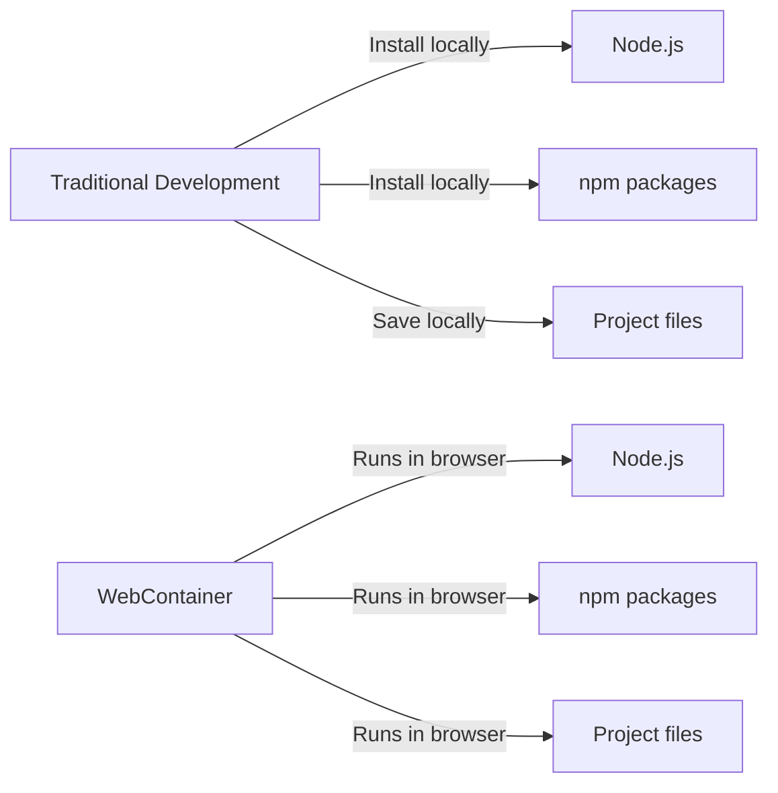
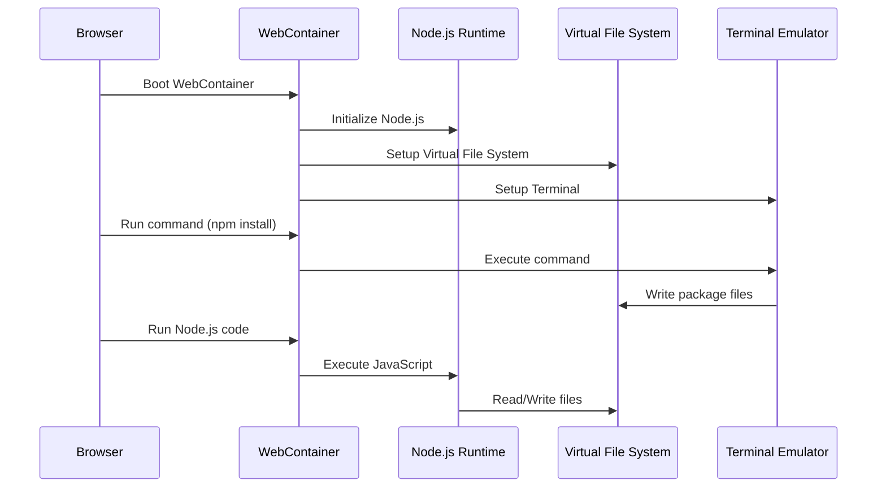
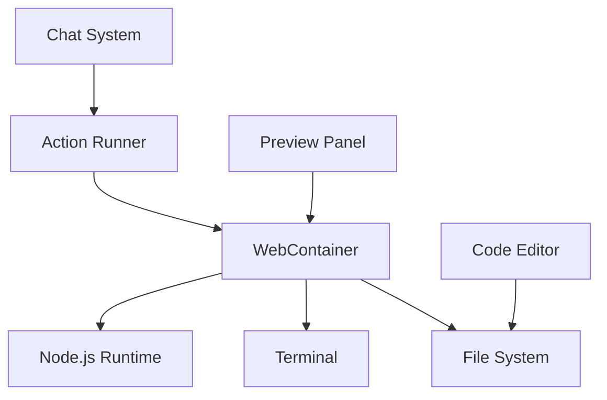

# Chapter 4: WebContainer

In [Chapter 3: Code Editor](03_code_editor_.md), we explored where we write and edit our code. Now, let's discover what makes that code actually run: the WebContainer.

## What is a WebContainer?

Imagine you're building a model airplane. You need a workspace with all your tools, materials, and the ability to test if your airplane can fly. In traditional web development, this workspace would be your computer - you'd install tools, save files, and run programs on your physical machine.

WebContainer brings that entire workspace right into your web browser! It's like having a mini-computer that runs inside your browser tab.

Let's think about why this is amazing:



With WebContainer, you don't need to install anything on your computer. Everything you need to develop, test, and run your application lives right in your browser tab!

## Why Do We Need WebContainer?

Let's think about the traditional web development process:

1. Install Node.js on your computer
2. Set up a project folder
3. Install dependencies with npm
4. Write code using a code editor
5. Run your code with commands like `node app.js` or `npm start`
6. Test your application in a browser

This can be challenging for beginners because:
- Installation can be tricky on different operating systems
- You need to understand command-line tools
- Setting up development environments takes time

WebContainer solves these problems by providing a complete development environment that:
- Requires zero installation
- Works the same way on all computers
- Runs instantly in your browser
- Includes Node.js, npm, and a file system

## How WebContainer Works

At its core, WebContainer provides three main capabilities:

### 1. Running Node.js Code

WebContainer includes a complete Node.js environment that runs in your browser. This means you can execute JavaScript just like you would on a server:

```javascript
// This code runs in the WebContainer
function calculateSum(a, b) {
  return a + b;
}

console.log(calculateSum(5, 10)); // Outputs: 15
```

When you run this code, it's not sending anything to a remote server - it's executing right in your browser tab!

### 2. File System Access

WebContainer includes a virtual file system that works just like the one on your computer:

```javascript
// Creating a new file in WebContainer
await webcontainer.fs.writeFile('hello.txt', 'Hello, World!');

// Reading a file from WebContainer
const content = await webcontainer.fs.readFile('hello.txt', 'utf-8');
console.log(content); // Outputs: Hello, World!
```

This means you can create, read, update, and delete files just like you would on your local computer.

### 3. Terminal Commands

WebContainer lets you run terminal commands as if you were using a command prompt:

```javascript
// Running an npm command in WebContainer
const process = await webcontainer.spawn('npm', ['install', 'express']);

// Capture the output
process.output.pipeTo(new WritableStream({
  write(data) {
    console.log(data); // Shows the npm install output
  }
}));
```

This allows you to install packages, start servers, and run any command you'd normally run in a terminal.

## WebContainer in Action: Building a Simple Web Server

Let's see how WebContainer powers a real development workflow by building a small web server:

### Step 1: Set Up the Project

First, we need to create our project files:

```javascript
// Create a package.json file
await webcontainer.fs.writeFile('package.json', JSON.stringify({
  "name": "my-server",
  "version": "1.0.0",
  "main": "index.js"
}));
```

This creates a basic `package.json` file in our WebContainer's file system.

### Step 2: Install Dependencies

Next, we'll install Express (a popular web framework):

```javascript
// Install Express package
const installProcess = await webcontainer.spawn('npm', 
  ['install', 'express']);

// Wait for the installation to complete
await installProcess.exit;
```

This runs the `npm install express` command in our WebContainer, just like you would in a terminal.

### Step 3: Create Server Code

Now, let's create a simple web server:

```javascript
// Create index.js with a basic Express server
const serverCode = `
  const express = require('express');
  const app = express();
  
  app.get('/', (req, res) => {
    res.send('Hello from WebContainer!');
  });
  
  app.listen(3000);
`;

await webcontainer.fs.writeFile('index.js', serverCode);
```

This creates an `index.js` file with code for a basic web server.

### Step 4: Start the Server

Finally, let's start our server:

```javascript
// Start the Express server
const serverProcess = await webcontainer.spawn('node', ['index.js']);

// The server is now running at port 3000 in the WebContainer!
```

And just like that, we have a web server running inside our browser! The WebContainer executes the Node.js code, hosts the server, and makes it accessible through the browser.

## Under the Hood: How WebContainer Works

Let's take a look at how WebContainer actually works behind the scenes:



When you use WebContainer in bolt.new:

1. The WebContainer is booted when the page loads
2. A virtual file system is created in your browser's memory
3. A Node.js runtime is initialized within the browser
4. When you run commands, they're executed in this contained environment
5. Files are stored in the browser's memory, not on your actual computer
6. The output of commands and code execution is captured and displayed in the [Workbench](01_workbench_.md)

## The WebContainer Lifecycle

Let's look at how WebContainer is initialized in bolt.new:

```javascript
// From app/lib/webcontainer/index.ts
export let webcontainer = Promise.resolve()
  .then(() => {
    return WebContainer.boot({ workdirName: WORK_DIR_NAME });
  })
  .then((webcontainer) => {
    webcontainerContext.loaded = true;
    return webcontainer;
  });
```

This code:
1. Creates a promise that will resolve to a WebContainer instance
2. Calls `WebContainer.boot()` to start the WebContainer
3. Passes a `workdirName` parameter to set up the main project directory
4. Marks the WebContainer as loaded once it's ready

The WebContainer only needs to be booted once per page load, and then it's available for all the different operations in bolt.new.

## Working with Files in WebContainer

Let's look at how bolt.new uses WebContainer to work with files:

```javascript
// From app/lib/runtime/action-runner.ts
async #runFileAction(action) {
  // Get the WebContainer instance
  const webcontainer = await this.#webcontainer;
  
  // Get the folder path
  let folder = nodePath.dirname(action.filePath);
  
  // Create the folder if needed
  if (folder !== '.') {
    await webcontainer.fs.mkdir(folder, { recursive: true });
  }
  
  // Write the file
  await webcontainer.fs.writeFile(action.filePath, action.content);
}
```

This code:
1. Gets a reference to the WebContainer
2. Extracts the folder path from the file path
3. Creates any necessary folders using `mkdir` (with `recursive: true` to create nested folders)
4. Writes the file content to the specified path

This allows bolt.new to create and modify files in the virtual file system, which you can then edit in the [Code Editor](03_code_editor_.md).

## Running Commands in WebContainer

Let's see how bolt.new uses WebContainer to run terminal commands:

```javascript
// From app/utils/shell.ts
export async function newShellProcess(webcontainer, terminal) {
  // Start a new shell process
  const process = await webcontainer.spawn('/bin/jsh', ['--osc'], {
    terminal: {
      cols: terminal.cols ?? 80,
      rows: terminal.rows ?? 15,
    },
  });
  
  // Connect the process input/output to the terminal
  const input = process.input.getWriter();
  const output = process.output;
  
  // Pipe the output to the terminal
  output.pipeTo(
    new WritableStream({
      write(data) {
        terminal.write(data);
      },
    })
  );
  
  return process;
}
```

This code:
1. Spawns a new shell process in the WebContainer
2. Sets up the terminal dimensions
3. Connects the process input and output streams
4. Pipes the command output to the terminal display

This is how bolt.new lets you run terminal commands right in your browser, with the output showing up in the terminal panel of the [Workbench](01_workbench_.md).

## Connecting WebContainer to the Rest of bolt.new

The WebContainer doesn't work in isolation - it's connected to many other parts of bolt.new:



- The [Code Editor](03_code_editor_.md) reads and writes files through the WebContainer's file system
- The [Chat System](02_chat_system_.md) can trigger actions that run in the WebContainer
- The Terminal panel displays output from commands run in the WebContainer
- The Preview panel shows the result of web applications running in the WebContainer

This integration creates a seamless experience where your entire development workflow happens in one browser tab.

## Limitations of WebContainer

While WebContainer is powerful, it's important to understand its limitations:

1. **Storage**: Since everything runs in your browser's memory, there's a limit to how large your projects can be.

2. **Performance**: Complex applications might run slower than they would on your local machine.

3. **Browser Support**: WebContainer requires modern browsers with support for certain web technologies.

4. **Persistence**: By default, everything in the WebContainer is lost when you close your browser tab (though bolt.new has ways to save your work using the [Persistence System](09_persistence_system_.md)).

## Conclusion

WebContainer is what makes the magic of bolt.new possible - it brings a complete development environment right into your browser. It provides the foundation for running code, managing files, and executing commands without requiring you to install anything on your computer.

This technology transforms web development by eliminating setup hurdles and providing an instant, consistent environment for coding. By understanding how WebContainer works, you now have insight into the core technology that powers your development experience in bolt.new.

In the next chapter, we'll explore the [File System](05_file_system_.md), which builds on top of WebContainer to provide a familiar way to organize and manage your project files.

---

