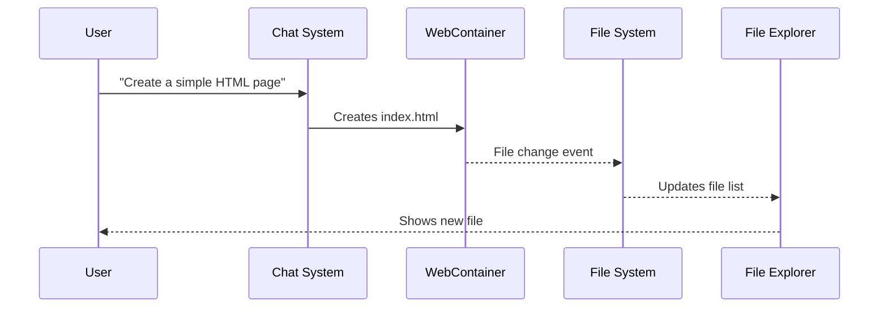
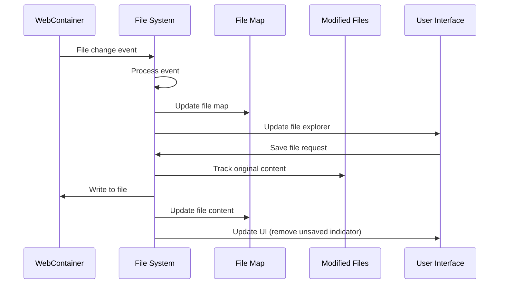
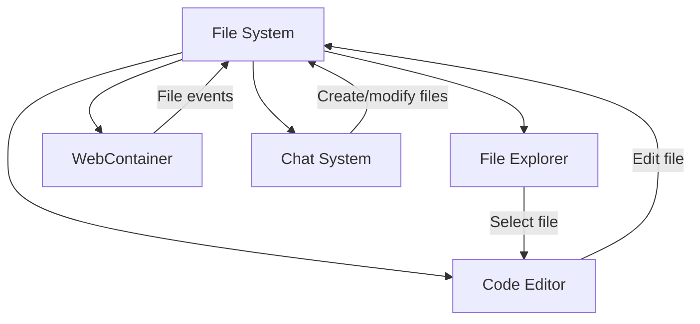

# Chapter 5: File System

In [Chapter 4: WebContainer](04_webcontainer_.md), we explored how bolt.new runs your code inside the browser. Now, let's discover how your project files are managed with the File System.

## What is the File System?

Imagine you have a filing cabinet in your office. You store documents in folders, organize them by category, and when you need to change a document, you take it out, make your edits, and put it back. Sometimes you might notice that a document has been changed since you last looked at it.

In bolt.new, the File System works just like that filing cabinet, but for your code files. It keeps track of all your project files, knows when they've been created, modified, or deleted, and remembers which files have unsaved changes.

Let's see why this is important with a simple example:

```javascript
// You edit a file in the Code Editor
function sayHello() {
  console.log("Hello, World!");
}
```

When you make this change, several things need to happen:
1. The file needs to be marked as "unsaved" with a dot in the File Explorer
2. When you save, the changes need to be written to the [WebContainer](04_webcontainer_.md)'s file system
3. Other components (like the Preview Panel) need to know the file has changed

The File System handles all of this automatically!

## Why Do We Need a File System?

You might wonder: "Doesn't the [WebContainer](04_webcontainer_.md) already handle files?" It does, but the File System acts as a bridge between the WebContainer's raw file operations and the user interface you interact with.

Here are some key reasons we need the File System:

### 1. Real-time Updates

When you create a file using the terminal:

```bash
echo "console.log('New file')" > newfile.js
```

The File System notices this change immediately and updates the File Explorer so you can see the new file.

### 2. Tracking Unsaved Changes

When you modify a file in the [Code Editor](03_code_editor_.md):

```javascript
// Change from "Hello" to "Hello, Friend"
function sayHello() {
  console.log("Hello, Friend!");
}
```

The File System keeps track of the fact that this file has unsaved changes, so you know you need to save it.

### 3. File History for the AI

When you ask the AI to help with your code using the [Chat System](02_chat_system_.md), the File System keeps track of what files have changed so the AI can understand what you've been working on.

## The File System in Action

Let's walk through a simple example of how the File System works behind the scenes:

### Creating a New File

1. You use the [Chat System](02_chat_system_.md) to ask: "Create a simple HTML page"
2. The AI generates code and creates a file called `index.html`
3. The File System detects this new file and updates the File Explorer
4. You can now see and click on `index.html` in the File Explorer



### Editing a File

1. You open `index.html` in the [Code Editor](03_code_editor_.md)
2. You add a new paragraph to the HTML
3. The File System marks the file as having unsaved changes
4. You save the file
5. The File System writes the changes to the WebContainer

```javascript
// You edit index.html, adding a new paragraph
<p>This is a new paragraph I just added!</p>
```

When you make this change, the File System doesn't immediately save it to the WebContainer. Instead, it:
1. Updates its internal representation of the file
2. Marks the file as "unsaved" (showing a dot in the File Explorer)
3. Only writes to the WebContainer when you save

## Key Concepts in the File System

Let's break down the most important concepts in the File System:

### 1. The File Map

The File Map is like an index of all the files in your project. It keeps track of:
- What files exist
- Whether each item is a file or a folder
- The content of each file
- Whether files are binary (like images) or text

```javascript
// A simplified view of the File Map
fileMap = {
  "/index.html": { type: "file", content: "<html>...</html>" },
  "/styles.css": { type: "file", content: "body { color: blue; }" },
  "/images": { type: "folder" }
}
```

This map allows the File System to quickly answer questions like "What's in this file?" or "What files are in this folder?"

### 2. File Modifications Tracking

The File System keeps track of which files have been modified since the last time you communicated with the AI. This helps the AI understand what you've changed.

```javascript
// Internal tracking of modified files
modifiedFiles = new Map([
  ["/index.html", "<original content before you changed it>"]
]);
```

This tracking allows the AI to see exactly what you've changed, which is much more efficient than sending the entire project every time.

### 3. File Watchers

File watchers monitor the [WebContainer](04_webcontainer_.md) for changes. When files are created, modified, or deleted in the WebContainer, the watchers notify the File System so it can update its File Map.

```javascript
// Setting up a file watcher
webcontainer.internal.watchPaths(
  { include: ["/**"], exclude: ["**/node_modules"] },
  handleFileChanges
);
```

This way, whether you create files through the [Chat System](02_chat_system_.md), the [Code Editor](03_code_editor_.md), or terminal commands, the File System stays in sync.

## Under the Hood: How the File System Works

Let's take a deeper look at how the File System actually works:



The File System is constantly listening for events from the WebContainer and user interface, keeping everything in sync.

### The FilesStore Class

The heart of the File System is a class called `FilesStore`. Here's a simplified version:

```javascript
class FilesStore {
  files = map({});  // The file map
  #modifiedFiles = new Map();  // Tracks file modifications
  
  constructor(webcontainer) {
    this.#webcontainer = webcontainer;
    this.#initializeWatchers();
  }
  
  async saveFile(filePath, content) {
    // Save the original content if this is first modification
    if (!this.#modifiedFiles.has(filePath)) {
      this.#modifiedFiles.set(filePath, originalContent);
    }
    
    // Write to WebContainer
    await this.#webcontainer.fs.writeFile(filePath, content);
  }
}
```

This class maintains the file map, tracks modifications, and handles saving files to the WebContainer.

### Processing File Events

When files change in the WebContainer, the File System processes these events:

```javascript
#processEventBuffer(events) {
  for (const { type, path, buffer } of events) {
    switch (type) {
      case 'add_file':
        // Add new file to the map
        this.files.setKey(path, { 
          type: 'file', 
          content: decodeContent(buffer) 
        });
        break;
      case 'remove_file':
        // Remove file from the map
        this.files.setKey(path, undefined);
        break;
      // Other cases for folders, etc.
    }
  }
}
```

This code processes events from the WebContainer and updates the file map accordingly.

### File Modifications for the AI

When the AI needs to know what files you've changed, the File System can generate a summary:

```javascript
getFileModifications() {
  const modifications = {};
  
  for (const [filePath, originalContent] of this.#modifiedFiles) {
    const currentContent = this.files.get()[filePath].content;
    
    // Calculate the difference between original and current
    modifications[filePath] = generateDiff(
      originalContent, 
      currentContent
    );
  }
  
  return modifications;
}
```

This function compares the current file content with the original content to generate a summary of changes for the AI.

## File System Integration with the Workbench

The File System integrates closely with other components in the [Workbench](01_workbench_.md):



When you:
1. Select a file in the File Explorer, the File System provides its content to the [Code Editor](03_code_editor_.md)
2. Edit a file in the Code Editor, the File System tracks the unsaved changes
3. Create a file through the [Chat System](02_chat_system_.md), the File System detects the new file
4. Run a command in the terminal that modifies files, the File System keeps the UI in sync

## Using the File System APIs

As a user, you won't directly call the File System APIs, but they're used by other components you interact with. Here's a simple example of how the [Code Editor](03_code_editor_.md) might use the File System:

```javascript
// When a user selects a file in the File Explorer
function handleFileSelect(filePath) {
  // Ask the File System for the file content
  const file = filesStore.getFile(filePath);
  
  if (file) {
    // Show the file in the Code Editor
    editor.setValue(file.content);
  }
}

// When a user saves a file in the Code Editor
async function handleFileSave(filePath, content) {
  // Ask the File System to save the file
  await filesStore.saveFile(filePath, content);
  
  // Update the UI to show the file is saved
  updateSavedStatus(filePath, true);
}
```

These functions show how other components can use the File System to retrieve and save file content.

## Real-world Example: Updating a Web Application

Let's see how the File System helps when you're building a web application:

1. You start with an HTML file that displays a counter
2. You edit the file to add a "reset" button
3. The File System marks the file as having unsaved changes
4. You save the file
5. The File System writes the changes to the WebContainer
6. The [WebContainer](04_webcontainer_.md) detects the file change and updates the preview

All of this happens seamlessly, giving you a smooth development experience where your changes are immediately reflected in the preview.

## Conclusion

The File System is the bridge between your actions in the user interface and the actual files in the [WebContainer](04_webcontainer_.md). It keeps track of all your files, monitors changes, and maintains a history of modifications to help the AI understand what you're working on.

By understanding how the File System works, you now have insight into how bolt.new manages your project files and keeps everything in sync. This foundation will be important as we move into the next chapter: [LLM Integration](06_llm_integration_.md), where we'll explore how bolt.new connects with AI models to provide intelligent assistance.

---

