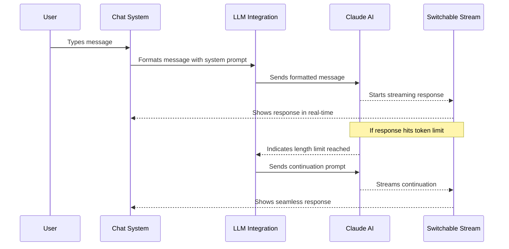

# Chapter 6: LLM Integration

In [Chapter 5: File System](05_file_system_.md), we explored how bolt.new manages your project files. Now, let's discover how bolt.new communicates with AI language models through the LLM Integration.

## What is LLM Integration?

Imagine you're trying to talk to someone who speaks a different language. You'd need a translator who not only understands both languages but also knows the right way to phrase your questions and interpret the answers.

In bolt.new, the LLM Integration acts as this translator, but between you and Claude (the AI language model). It handles three main jobs:

1. **Formatting your messages** with special instructions for Claude
2. **Streaming Claude's responses** back to you in real-time
3. **Continuing long responses** when they exceed certain limits

Think of it like a diplomatic liaison that ensures smooth communication between you (the human) and the AI brain powering bolt.new.

## Why Do We Need LLM Integration?

Let's understand why this is important with a simple example:

When you ask bolt.new something like:

```
Can you build me a simple to-do app?
```

A lot needs to happen behind the scenes:

1. Your simple request needs to be combined with detailed instructions for Claude
2. Claude needs to know it should create files in the [WebContainer](04_webcontainer_.md)
3. The response needs to come back piece by piece (streaming) so you don't wait too long
4. If Claude's response is very long, it needs to be continued seamlessly

The LLM Integration handles all of this complexity automatically, making it seem like you're just having a natural conversation!

## Key Components of LLM Integration

Let's break down the main parts that make up the LLM Integration:

### 1. System Prompts

The system prompt is like a detailed job description for Claude. It tells the AI:

- What role it should play ("You are Bolt, an expert AI assistant...")
- What constraints it has (WebContainer limitations, available commands)
- How to format its responses (using HTML tags, Markdown)
- How to create artifacts (code, files, commands)

Here's a simplified version of what a system prompt looks like:

```javascript
const getSystemPrompt = () => `
You are Bolt, an expert AI assistant and software developer.
<system_constraints>
  // Details about WebContainer limitations
</system_constraints>
// More instructions...
`;
```

This prompt is invisible to you but guides Claude in how to respond appropriately to your requests.

### 2. Message Formatting

When you send a message, the LLM Integration formats it properly for Claude:

```javascript
// Your message gets transformed into this structure
const messages = [
  { role: 'user', content: 'Can you build me a to-do app?' }
];
```

If the AI has already responded and you're continuing the conversation, the Integration keeps track of the whole conversation history so Claude has context.

### 3. Response Streaming

Instead of waiting for the entire response to be generated, the LLM Integration streams the response in real-time:

```javascript
const result = await streamText(messages, context.cloudflare.env, options);
stream.switchSource(result.toAIStream());
```

This makes the experience feel more like a natural conversation where responses appear gradually rather than all at once.

### 4. Response Continuation

AI models like Claude have limits on how much they can generate in a single response (token limits). The LLM Integration handles this elegantly:

```javascript
onFinish: async ({ text: content, finishReason }) => {
  if (finishReason !== 'length') {
    return stream.close();
  }
  
  // Continue the response if it hit the length limit
  messages.push({ role: 'assistant', content });
  messages.push({ role: 'user', content: CONTINUE_PROMPT });
  
  const result = await streamText(messages, context.cloudflare.env, options);
  return stream.switchSource(result.toAIStream());
}
```

This code detects when a response hits the token limit and automatically requests a continuation, making it seem like one seamless response to you.

## LLM Integration in Action

Let's walk through how the LLM Integration works when you ask bolt.new to create a simple weather app:

### Step 1: You Type Your Request

```
Create a simple weather app that shows the current temperature for a city
```

### Step 2: The Message is Formatted

Your message is combined with the system prompt and sent to Claude:

```javascript
const messages = [
  // System prompt (invisible to you)
  { role: 'system', content: getSystemPrompt() },
  // Your visible message
  { role: 'user', content: 'Create a simple weather app...' }
];
```

### Step 3: Claude Generates a Response

Claude processes your request according to the system prompt guidelines and starts generating a response.

### Step 4: The Response is Streamed Back

Instead of waiting for the entire response, bolt.new starts showing you Claude's response as it's being generated:

```
Creating a simple weather app. Let's start by setting up the basic files:

<boltArtifact id="weather-app" title="Simple Weather App">
<boltAction type="file" filePath="index.html">
<!DOCTYPE html>
<html lang="en">
<head>
...
```

### Step 5: Handling Response Continuation

If Claude's response is very long, the LLM Integration handles the continuation:

1. It detects when the response hits the token limit
2. It saves the partial response
3. It sends a special "continue" message to Claude
4. It switches to the new response stream
5. It makes this entire process invisible to you

The result is a seamless experience where you see one continuous response, even though it might have required multiple requests behind the scenes.

## Under the Hood: How LLM Integration Works

Let's look at what happens step by step when you send a message to bolt.new:



This diagram shows how the LLM Integration sits between the [Chat System](02_chat_system_.md) and Claude, handling all the complexity of communication.

## Implementation Details

Now let's look at some of the key implementation details:

### Setting Up the Claude Model

The LLM Integration initializes the connection to Claude:

```javascript
// From app/lib/.server/llm/model.ts
export function getAnthropicModel(apiKey: string) {
  const anthropic = createAnthropic({
    apiKey,
  });
  
  return anthropic('claude-3-5-sonnet-20240620');
}
```

This code creates a connection to a specific version of Claude with your API key.

### Streaming Responses

The streaming functionality is implemented using a custom class called `SwitchableStream`:

```javascript
// From app/lib/.server/llm/switchable-stream.ts
export default class SwitchableStream extends TransformStream {
  // ... implementation details
  
  async switchSource(newStream: ReadableStream) {
    if (this._currentReader) {
      await this._currentReader.cancel();
    }
    
    this._currentReader = newStream.getReader();
    this._pumpStream();
    this._switches++;
  }
}
```

This class allows bolt.new to switch between different response streams seamlessly, which is essential for continuing responses that exceed token limits.

### Continuation Logic

When a response hits the token limit, the continuation logic kicks in:

```javascript
// From app/routes/api.chat.ts
onFinish: async ({ text: content, finishReason }) => {
  if (finishReason !== 'length') {
    return stream.close();
  }
  
  // Continue if we hit the length limit
  messages.push({ role: 'assistant', content });
  messages.push({ role: 'user', content: CONTINUE_PROMPT });
  
  const result = await streamText(messages, context.cloudflare.env, options);
  return stream.switchSource(result.toAIStream());
}
```

This code:
1. Checks if the response ended because it hit the length limit
2. Adds the partial response to the message history
3. Adds a special "continue" prompt as if it came from the user
4. Gets a new response stream and switches to it

### The Continuation Prompt

The special prompt used for continuation is very simple:

```javascript
// From app/lib/.server/llm/prompts.ts
export const CONTINUE_PROMPT = `
  Continue your prior response. IMPORTANT: Immediately begin from where 
  you left off without any interruptions.
  Do not repeat any content, including artifact and action tags.
`;
```

This tells Claude to pick up exactly where it left off, without repeating anything or adding unnecessary text.

## Real-World Example: Building a Web Application

Let's see how the LLM Integration helps when you're building a web application:

1. You ask bolt.new to "Create a weather app using React"
2. The LLM Integration formats your request with the system prompt
3. Claude receives detailed instructions on how to create files and run commands
4. Claude generates a response with code for a React weather app
5. The response is streamed back to you in real-time
6. If the response is very long, it's continued seamlessly
7. The [Chat System](02_chat_system_.md) displays the response, and the [Artifact System](07_artifact_system_.md) processes any code or commands

All of this happens behind the scenes, giving you a smooth experience where you simply ask for what you want, and bolt.new makes it happen!

## LLM Integration and Other Components

The LLM Integration works closely with other bolt.new components:

- The [Chat System](02_chat_system_.md) provides the user interface for communication
- The [Artifact System](07_artifact_system_.md) processes the code and commands in Claude's responses
- The [File System](05_file_system_.md) tracks changes to files that might be relevant to the conversation
- The [WebContainer](04_webcontainer_.md) executes the code and commands generated by Claude

This integration creates a seamless experience where your conversations directly lead to working code.

## Conclusion

The LLM Integration is the bridge that connects you to the AI brain powering bolt.new. It handles all the complex details of communicating with Claude, from formatting messages with system prompts to streaming responses and handling continuations.

By understanding how the LLM Integration works, you now have insight into how bolt.new translates your simple requests into detailed instructions for Claude, and how Claude's responses are delivered back to you in a seamless way.

In the next chapter, we'll explore the [Artifact System](07_artifact_system_.md), which processes the code and commands in Claude's responses to create actual files and run commands in the [WebContainer](04_webcontainer_.md).

---

