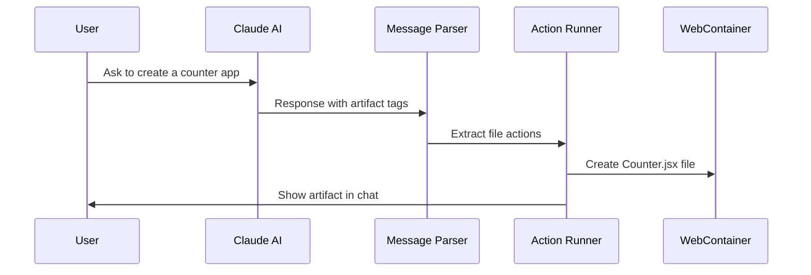
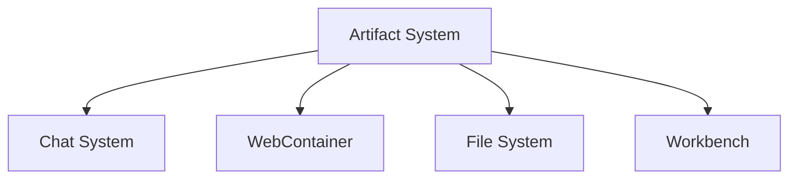

# Chapter 7: Artifact System

In [Chapter 6: LLM Integration](06_llm_integration_.md), we explored how bolt.new communicates with AI language models. Now, let's discover the system that turns the AI's words into actual working code: the Artifact System.

## What is the Artifact System?

Imagine you're working with a skilled architect who's designing your dream house. The architect doesn't just describe your house in words—they create actual blueprints, material lists, and construction plans that builders can use to build your house.

In bolt.new, the Artifact System works like those builders who take the AI's "blueprints" and construct them in real-time. When the AI assistant suggests code or commands in the [Chat System](02_chat_system_.md), the Artifact System:

1. Identifies special tags in the AI's response
2. Extracts the code snippets and commands
3. Turns them into actual files and actions in your project
4. Shows you the results as interactive elements called "artifacts"

This means you don't just get descriptions of solutions—you get real, working code that's immediately ready to use!

## Why Do We Need an Artifact System?

Let's consider what happens when you ask the AI to "create a simple button component":

Without the Artifact System:
```
To create a button component, you would need to create a file called Button.jsx with this code:

function Button({ text }) {
  return <button className="btn">{text}</button>;
}

export default Button;
```

With this response, you'd have to manually create the file and copy-paste the code yourself.

With the Artifact System:
```
I'll create a button component for you.
```

And while you watch, a new file called `Button.jsx` appears in your [File System](05_file_system_.md) with the complete code already written. The Artifact System made this happen automatically!

## Key Components of the Artifact System

The Artifact System has two main parts that work together:

### 1. Message Parser

The Message Parser scans through the AI's responses looking for special tags that indicate code or commands:

```javascript
// Special tags the parser looks for
const ARTIFACT_TAG_OPEN = '<boltArtifact';
const ARTIFACT_ACTION_TAG_OPEN = '<boltAction';
```

These tags are invisible to you in the chat, but they contain instructions that the parser can understand. It's like secret code embedded in the AI's message.

### 2. Action Runner

Once the Message Parser finds these tags, the Action Runner takes over:

```javascript
// Running a file action to create a new file
async #runFileAction(action) {
  // Get the folder path and create it if needed
  let folder = nodePath.dirname(action.filePath);
  await webcontainer.fs.mkdir(folder, { recursive: true });
  
  // Write the file content
  await webcontainer.fs.writeFile(action.filePath, action.content);
}
```

The Action Runner handles two main types of actions:
- **File Actions**: Create or modify files in your project
- **Shell Actions**: Run commands in the terminal

## The Artifact System in Action

Let's walk through a simple example of how the Artifact System works when you ask bolt.new to create a counter app:

### Step 1: You Ask for a Counter App

```
Can you create a simple counter app with React?
```

### Step 2: The AI Generates a Response

The AI's response includes both visible text for you and invisible tags for the Artifact System:

```
I'll create a simple counter app for you using React.

<boltArtifact id="counter-app" title="React Counter App">
<boltAction type="file" filePath="Counter.jsx">
import { useState } from 'react';

function Counter() {
  const [count, setCount] = useState(0);
  
  return (
    <div>
      <h1>Count: {count}</h1>
      <button onClick={() => setCount(count + 1)}>
        Increment
      </button>
    </div>
  );
}

export default Counter;
</boltAction>
</boltArtifact>
```

### Step 3: The Message Parser Identifies the Tags

The Message Parser scans the response and recognizes:
- A `boltArtifact` tag defining a new artifact called "React Counter App"
- A `boltAction` tag specifying a file to create called "Counter.jsx"

### Step 4: The Action Runner Creates the File

The Action Runner:
1. Creates any necessary folders
2. Creates a new file called `Counter.jsx`
3. Writes the React component code into the file

### Step 5: The UI Shows the Artifact

You see a box in the chat that shows:
- The title "React Counter App"
- An option to view the created file
- A status indicator showing the action completed successfully

You can click on this artifact to open the [Workbench](01_workbench_.md) and see your new counter component!

## Under the Hood: How the Artifact System Works

Let's look at what happens step by step when the AI suggests a solution:



When you ask for a counter app:

1. The AI generates a response with special `boltArtifact` and `boltAction` tags
2. The Message Parser identifies these tags and extracts the actions to perform
3. The Action Runner executes these actions in the [WebContainer](04_webcontainer_.md)
4. The UI shows you the artifact with information about what was created

## Implementation Details

Now let's look at some key parts of the implementation:

### The Message Parser

The Message Parser scans through the AI's response character by character, looking for special tags:

```javascript
// From app/lib/runtime/message-parser.ts
parse(messageId: string, input: string) {
  // Look for artifact tags
  if (input[i] === '<' && input.substring(i).startsWith(ARTIFACT_TAG_OPEN)) {
    // Extract artifact information
    const artifactId = this.#extractAttribute(tag, 'id');
    const artifactTitle = this.#extractAttribute(tag, 'title');
    
    // Notify that an artifact was found
    this._options.callbacks?.onArtifactOpen?.({ 
      messageId, 
      id: artifactId, 
      title: artifactTitle 
    });
  }
}
```

This code scans each character of the AI's response, looking for the start of an artifact tag. When it finds one, it extracts the ID and title, then calls the `onArtifactOpen` callback to let other parts of the system know.

### The Action Runner

The Action Runner takes the actions extracted by the Message Parser and executes them:

```javascript
// From app/lib/runtime/action-runner.ts
async #runFileAction(action) {
  // Get the WebContainer instance
  const webcontainer = await this.#webcontainer;
  
  // Create folders if needed
  let folder = nodePath.dirname(action.filePath);
  await webcontainer.fs.mkdir(folder, { recursive: true });
  
  // Write the file
  await webcontainer.fs.writeFile(action.filePath, action.content);
}
```

This code creates a new file in the [WebContainer](04_webcontainer_.md). It first makes sure any necessary folders exist, then writes the file content provided by the AI.

### The Artifact UI Component

When artifacts are created, they appear in the chat interface:

```javascript
// From app/components/chat/Artifact.tsx
export const Artifact = memo(({ messageId }: ArtifactProps) => {
  // Get the artifact data from the store
  const artifacts = useStore(workbenchStore.artifacts);
  const artifact = artifacts[messageId];
  
  return (
    <div className="artifact border rounded-lg">
      <button onClick={() => {
        // Open the workbench when clicked
        workbenchStore.showWorkbench.set(true);
      }}>
        <div className="text-sm">{artifact?.title}</div>
        <div className="text-xs">Click to open Workbench</div>
      </button>
      {/* Action list would go here */}
    </div>
  );
});
```

This component shows the artifact in the chat, with the title and a button to open the [Workbench](01_workbench_.md). It also has a list of actions (like files created) that you can expand to see more details.

## How Artifacts Connect to Other Components

The Artifact System works closely with several other components:



- The [Chat System](02_chat_system_.md) provides the AI responses that contain artifact tags
- The [WebContainer](04_webcontainer_.md) executes the actions (creating files, running commands)
- The [File System](05_file_system_.md) gets updated when new files are created
- The [Workbench](01_workbench_.md) displays the results so you can interact with them

## Real-World Example: Building a Todo App

Let's see how the Artifact System helps when building a more complex application:

1. You ask bolt.new to "Create a todo app with React"

2. The AI responds with an explanation and embedded artifact tags:
   ```
   I'll create a simple todo app for you using React.
   ```

3. Behind the scenes, the Message Parser finds tags for:
   - A `TodoApp.jsx` file with the main component
   - A `TodoItem.jsx` file for individual todo items
   - A `styles.css` file for styling
   - A shell command to install React

4. The Action Runner creates all these files and runs the installation command

5. You see an artifact box in the chat showing all the created files and the command's status

6. You can click on the artifact to open the [Workbench](01_workbench_.md) and see your new todo app

All of this happens automatically, turning the AI's natural language response into a working application right before your eyes!

## Conclusion

The Artifact System is what makes bolt.new truly magical. It bridges the gap between the AI's suggestions and actual working code, allowing you to go from an idea to a running application in seconds. By automatically translating the AI's responses into files and commands, it eliminates the tedious work of manually implementing suggestions.

Understanding how the Artifact System works helps you appreciate what's happening behind the scenes when you see files appearing in your project. It's not just describing solutions—it's building them for you!

In the next chapter, we'll explore the [Store System](08_store_system_.md), which manages the state of your bolt.new application and keeps all the different components in sync.

---

