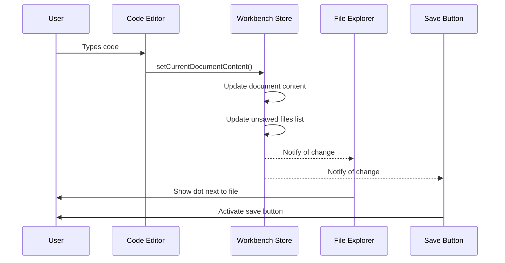
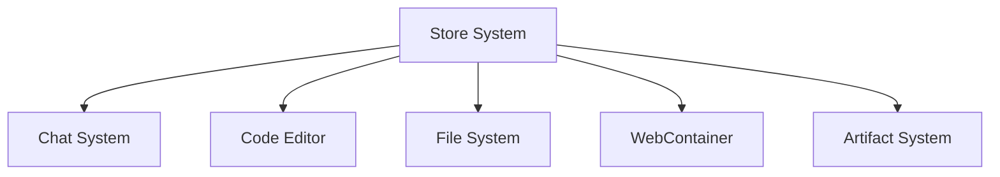

# Chapter 8: Store System

In [Chapter 7: Artifact System](07_artifact_system_.md), we explored how AI responses get turned into actual code. Now, let's explore the system that keeps all parts of bolt.new synchronized: the Store System.

## What is the Store System?

Imagine you're building a model car with friends. You need to make sure everyone knows what's happening: "I'm painting the hood red," "I've attached the wheels," or "The engine doesn't fit." Without communication, your team would be confused and the car wouldn't come together properly.

The Store System in bolt.new works like that communication network. It's a central place where all the different parts of the application can share information and stay in sync. When one part makes a change (like editing a file), other parts that need to know (like the preview panel) get notified automatically.

Think of the Store System as a collection of smart containers. Each container holds a specific piece of information, and when that information changes, anyone who's interested gets notified right away.

## Why Do We Need a Store System?

Let's look at a simple example to understand why this is important:

Imagine you're editing a file in the [Code Editor](03_code_editor_.md) and you make a change:

```javascript
// You change this line in the editor
const greeting = "Hello, World!";
```

Several things need to happen:
1. The [File System](05_file_system_.md) needs to know the file has unsaved changes
2. The File Explorer needs to show a dot next to the file name
3. The Save button needs to become active
4. If auto-preview is on, the [Preview Panel](01_workbench_.md) needs to update

Without a Store System, each of these components would need to directly communicate with each other in a tangled web of connections. With the Store System, they all just connect to the appropriate store, making the code much simpler and less error-prone.

## Key Concepts of the Store System

Let's break down the most important concepts in the Store System:

### 1. Stores

A store is a container that holds a piece of information (or "state"). In bolt.new, different stores hold different types of information:

```javascript
// A simple store that tracks whether the chat is visible
export const chatStore = map({
  showChat: true,
});
```

This code creates a store that keeps track of whether the chat panel should be visible. The `map()` function creates a store that holds an object with properties we can update.

### 2. Atoms

For simpler pieces of state, bolt.new uses "atoms":

```javascript
// A store that just holds the current theme (dark or light)
export const themeStore = atom('light');
```

An atom is like a tiny store that holds just a single value. This one keeps track of whether the app is in light or dark mode.

### 3. Subscribing to Changes

Components can "subscribe" to stores to get notified when they change:

```javascript
// React component that displays the current theme
function ThemeDisplay() {
  // This subscribes to changes in the themeStore
  const currentTheme = useStore(themeStore);
  
  return <div>Current theme: {currentTheme}</div>;
}
```

This code creates a component that displays the current theme. The `useStore` hook "subscribes" the component to the themeStore, so whenever the theme changes, this component automatically updates.

### 4. Updating Stores

Components can also update the stores:

```javascript
// Function to toggle between light and dark theme
function toggleTheme() {
  const currentTheme = themeStore.get();
  themeStore.set(currentTheme === 'dark' ? 'light' : 'dark');
}
```

This function gets the current theme from the store, then sets it to the opposite value. When the store changes, all components that subscribe to it will automatically update.

## The Store System in Action

Let's walk through a simple example to see how the Store System works in practice:

### Example: Editing a File

When you edit a file in the [Code Editor](03_code_editor_.md), here's what happens:

1. You type some code, changing the content of the file.
2. The editor calls a function to update the store:

```javascript
// When you type in the editor
workbenchStore.setCurrentDocumentContent(newContent);
```

3. Inside this function, several things happen:

```javascript
setCurrentDocumentContent(newContent) {
  // Update the editor document
  this.#editorStore.updateFile(filePath, newContent);
  
  // Track whether there are unsaved changes
  const unsavedChanges = originalContent !== newContent;
  
  // Update the list of unsaved files
  if (unsavedChanges) {
    newUnsavedFiles.add(filePath);
  } else {
    newUnsavedFiles.delete(filePath);
  }
}
```

4. The File Explorer, which subscribes to the list of unsaved files, automatically updates to show a dot next to the file.

5. The Save button, which also subscribes to this list, becomes active when there are unsaved files.

All of this happens automatically through the Store System. Components don't need to directly tell each other about changes - they just update the store, and subscribers get notified.

## Store System Architecture

bolt.new uses several main stores to manage different aspects of the application:

### 1. Workbench Store

The workbench store is the most complex. It manages the overall state of the [Workbench](01_workbench_.md):

```javascript
export class WorkbenchStore {
  showWorkbench = atom(false);         // Is the workbench visible?
  currentView = atom('code');          // 'code' or 'preview'
  unsavedFiles = atom(new Set());      // Which files have changes?
  artifacts = map({});                 // AI-generated artifacts
}
```

This store keeps track of whether the workbench is visible, which view is active, which files have unsaved changes, and the artifacts generated by the AI.

### 2. Files Store

The files store keeps track of all the files in your project:

```javascript
export class FilesStore {
  files = map({});                     // Map of all files
  #modifiedFiles = new Map();          // Files modified since last AI message
}
```

This store maintains a map of all files in your project and tracks which ones have been modified since your last conversation with the AI.

### 3. Chat Store

The chat store manages the state of the [Chat System](02_chat_system_.md):

```javascript
export const chatStore = map({
  started: false,                      // Has the conversation started?
  aborted: false,                      // Was the last response stopped?
  showChat: true,                      // Is the chat interface visible?
});
```

This store keeps track of the chat conversation state and visibility.

### 4. Theme Store

The theme store handles the UI theme preference:

```javascript
export const themeStore = atom('light');  // 'light' or 'dark'
```

This simple store just keeps track of whether the user prefers light or dark mode.

## Under the Hood: How the Store System Works

Let's look at what happens behind the scenes when you use the Store System:



When you type in the editor:

1. The Code Editor calls `workbenchStore.setCurrentDocumentContent()` with the new content
2. The workbench store updates the document content in the editor store
3. It checks if there are unsaved changes by comparing with the original content
4. It updates the list of unsaved files
5. Any components that subscribe to the relevant parts of the store get notified
6. These components re-render to reflect the new state (like showing a dot next to the file)

All of this happens automatically because of the reactive nature of the Store System.

## Implementation Details

Now let's look at some of the implementation details of the Store System:

### The nanostores Library

bolt.new uses a lightweight library called "nanostores" for state management:

```javascript
import { atom, map, computed } from 'nanostores';
```

This library provides three main types of stores:
- `atom`: For single values (like a boolean or string)
- `map`: For objects with properties
- `computed`: For derived values that depend on other stores

### Store Classes

Many stores in bolt.new are implemented as classes:

```javascript
export class EditorStore {
  selectedFile = atom(undefined);
  documents = map({});
  
  currentDocument = computed(
    [this.documents, this.selectedFile], 
    (documents, selectedFile) => {
      if (!selectedFile) return undefined;
      return documents[selectedFile];
    }
  );
}
```

This `EditorStore` class has:
- An atom for the currently selected file
- A map for all open documents
- A computed store that gives the current document based on the selected file

The computed store automatically updates whenever either the documents map or the selectedFile atom changes.

### Store Updates

Stores provide methods to update their state:

```javascript
updateFile(filePath, newContent) {
  const documents = this.documents.get();
  const documentState = documents[filePath];
  
  if (!documentState) {
    return;
  }
  
  this.documents.setKey(filePath, {
    ...documentState,
    value: newContent,
  });
}
```

This method updates a specific document in the documents store. It:
1. Gets the current state of all documents
2. Finds the specific document to update
3. Creates a new document state with the updated content
4. Updates just that one document in the store

When this happens, any components that subscribe to this document will automatically update.

## Connecting Components to Stores

React components connect to stores using the `useStore` hook:

```javascript
import { useStore } from '@nanostores/react';

function SaveButton() {
  // Get the current set of unsaved files
  const unsavedFiles = useStore(workbenchStore.unsavedFiles);
  
  // Button is enabled if there are unsaved files
  const hasUnsavedChanges = unsavedFiles.size > 0;
  
  return (
    <button 
      disabled={!hasUnsavedChanges}
      onClick={() => workbenchStore.saveAllFiles()}
    >
      Save All
    </button>
  );
}
```

This component:
1. Subscribes to the `unsavedFiles` atom in the workbench store
2. Enables or disables the button based on whether there are unsaved files
3. Calls `workbenchStore.saveAllFiles()` when clicked

The component will automatically re-render whenever the set of unsaved files changes.

## How Stores Connect to Other Systems

The Store System connects to many other parts of bolt.new:



- The [Chat System](02_chat_system_.md) uses stores to track conversation state
- The [Code Editor](03_code_editor_.md) uses stores to manage open documents and their content
- The [File System](05_file_system_.md) uses stores to keep track of files and their modifications
- The [WebContainer](04_webcontainer_.md) triggers updates to stores when files change
- The [Artifact System](07_artifact_system_.md) uses stores to manage artifacts generated by the AI

This creates a unified system where all parts of the application stay in sync through the Store System.

## Real-World Example: Building a Counter App

Let's see how the Store System helps when you're building a simple counter application:

1. You ask the AI to "Create a counter app"
2. The AI generates code and creates files through the [Artifact System](07_artifact_system_.md)
3. The [File System](05_file_system_.md) store updates to include these new files
4. The File Explorer updates to show the new files
5. You select one of the files
6. The workbench store updates its `selectedFile` atom
7. The [Code Editor](03_code_editor_.md) subscribes to this atom and displays the file
8. You make changes to the counter code
9. The editor updates the document content in the store
10. The store marks the file as having unsaved changes
11. The File Explorer shows a dot next to the file
12. You save the file
13. The store updates the [File System](05_file_system_.md) and removes the file from the unsaved list
14. The File Explorer removes the dot

All of these updates happen automatically through the Store System, creating a seamless experience where everything stays in sync.

## Conclusion

The Store System is the central nervous system of bolt.new, connecting all the different components and ensuring they stay synchronized. By using a reactive store system, bolt.new can automatically update components when the data they depend on changes, without requiring complex communication between components.

Understanding the Store System helps you see how all the pieces of bolt.new work together. Each component can focus on its specific job, while the Store System handles the communication between them.

In the next chapter, we'll explore the [Persistence System](09_persistence_system_.md), which ensures your work isn't lost when you close your browser or refresh the page.

---

