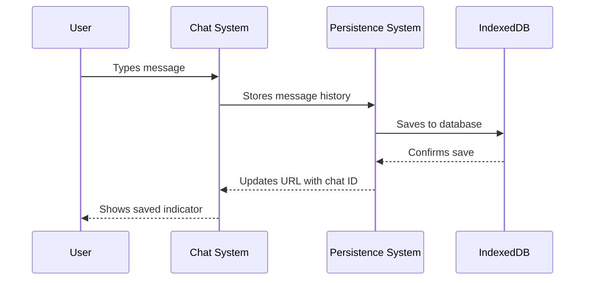
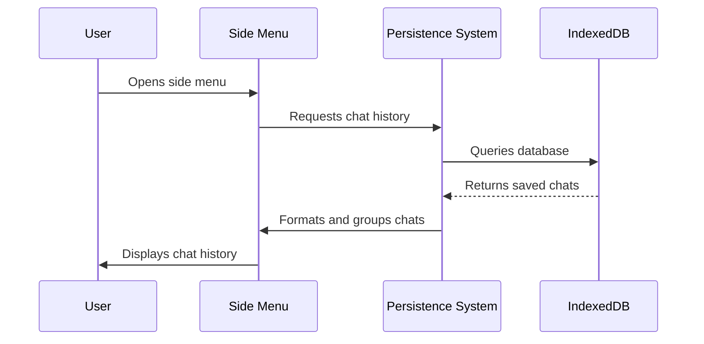
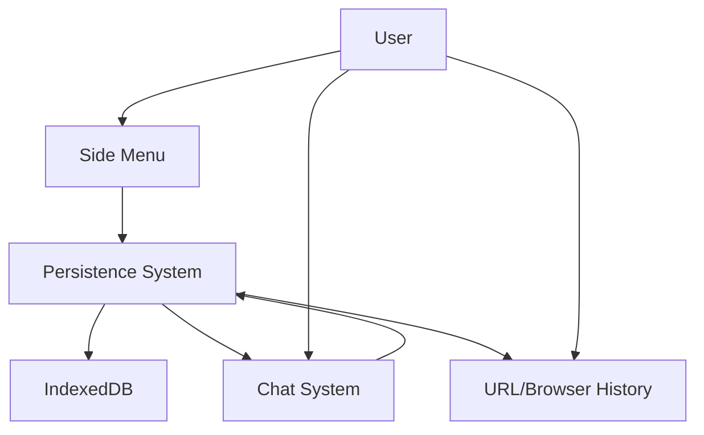

# Chapter 9: Persistence System

In [Chapter 8: Store System](08_store_system_.md), we explored how bolt.new keeps all its components synchronized. Now, let's discover how your conversations and work are saved across browser sessions with the Persistence System.

## What is the Persistence System?

Imagine your favorite notebook where you write down important ideas. When you close the notebook and come back later, your notes are still there—you don't have to rewrite everything from scratch. The Persistence System in bolt.new works just like that notebook.

The Persistence System is like your app's memory. It remembers your conversations with the AI, the code you've written together, and the projects you've worked on. When you close your browser and come back later, you can pick up right where you left off.

This is all made possible using IndexedDB, a powerful database that lives right in your browser. Think of IndexedDB as a filing cabinet built into your browser where bolt.new can store and organize your work.

## Why Do We Need a Persistence System?

Let's consider a common scenario:

1. You spend an hour working with bolt.new to build a complex to-do app
2. You get the perfect solution with the AI's help
3. You close your browser and go to lunch
4. When you return, you want to continue working on the app

Without the Persistence System:
- Your entire conversation would be lost
- The code you worked on would disappear
- You'd have to start from scratch explaining what you want

With the Persistence System:
- Your conversation history is saved
- You can pick up the discussion where you left off
- You can easily find and revisit past projects

It's like having a time machine that lets you jump back to any of your previous coding sessions!

## Key Components of the Persistence System

Let's break down the main parts of the Persistence System:

### 1. IndexedDB Database

The foundation of the Persistence System is a browser database called IndexedDB:

```javascript
// Opening the database
export async function openDatabase(): Promise<IDBDatabase | undefined> {
  return new Promise((resolve) => {
    const request = indexedDB.open('boltHistory', 1);
    
    request.onupgradeneeded = (event) => {
      const db = (event.target as IDBOpenDBRequest).result;
      // Create the database structure
      // ...
    };
    // Success and error handlers
  });
}
```

This code opens a database called 'boltHistory' where all your conversations will be stored. The database is created the first time you use bolt.new.

### 2. Chat History Items

Each conversation is stored as a "Chat History Item" with several pieces of information:

```javascript
export interface ChatHistoryItem {
  id: string;            // Unique identifier
  urlId?: string;        // ID used in the URL
  description?: string;  // A title for the conversation
  messages: Message[];   // The actual messages
  timestamp: string;     // When it was last updated
}
```

This structure keeps all the important details about your conversations organized. Each conversation has a unique ID, a description (usually based on what you were building), and a timestamp so you can see when you last worked on it.

### 3. Message Storage

When you have a conversation with the AI, the Persistence System saves it:

```javascript
// Saving messages to the database
export async function setMessages(
  db: IDBDatabase,
  id: string,
  messages: Message[],
  urlId?: string,
  description?: string,
): Promise<void> {
  // Create a transaction
  const transaction = db.transaction('chats', 'readwrite');
  const store = transaction.objectStore('chats');
  
  // Save the chat data
  const request = store.put({
    id, messages, urlId, description,
    timestamp: new Date().toISOString(),
  });
  // Success and error handlers
}
```

This function saves your conversation to the database. It updates the timestamp each time, so you always know when you last worked on a project.

### 4. Chat History Retrieval

When you return to bolt.new, the system can load your previous conversations:

```javascript
// Getting all saved chats
export async function getAll(db: IDBDatabase): Promise<ChatHistoryItem[]> {
  return new Promise((resolve, reject) => {
    const transaction = db.transaction('chats', 'readonly');
    const store = transaction.objectStore('chats');
    const request = store.getAll();
    
    // Return all chat history items when ready
    request.onsuccess = () => resolve(request.result);
    request.onerror = () => reject(request.error);
  });
}
```

This function retrieves all your saved conversations so they can be displayed in the sidebar.

## The Persistence System in Action

Let's walk through how the Persistence System works in a typical workflow:

### Saving a Conversation

When you chat with the AI and build something interesting, here's what happens:



1. You have a conversation with the AI about building a weather app
2. As you chat, the Persistence System automatically saves your messages
3. The system generates a unique ID for your conversation
4. The URL in your browser updates to include this ID (like `bolt.new/chat/123`)
5. Your conversation is now saved and can be accessed later

### Retrieving Past Conversations

When you return to bolt.new later, here's how you access your past work:



1. You hover your mouse near the left edge of the screen
2. The side menu appears, showing your chat history
3. Conversations are grouped by date (Today, Yesterday, Last Week, etc.)
4. You click on the "Weather App" conversation
5. The Persistence System loads that conversation from the database
6. The chat history and any code you created together reappear

## Under the Hood: How the Persistence System Works

Let's look at what happens behind the scenes when you use bolt.new:

### Database Setup

When you first use bolt.new, it sets up the IndexedDB database:

```javascript
request.onupgradeneeded = (event) => {
  const db = (event.target as IDBOpenDBRequest).result;
  
  if (!db.objectStoreNames.contains('chats')) {
    const store = db.createObjectStore('chats', { keyPath: 'id' });
    store.createIndex('id', 'id', { unique: true });
    store.createIndex('urlId', 'urlId', { unique: true });
  }
};
```

This code creates a storage container called 'chats' in the database. It sets up two indexes to help find conversations quickly - one by ID and one by URL ID.

### Saving Chat History

The `useChatHistory` hook manages the process of saving conversations:

```javascript
storeMessageHistory: async (messages) => {
  if (!db || messages.length === 0) {
    return;
  }
  
  // Get the first artifact (usually what you built)
  const { firstArtifact } = workbenchStore;
  
  // Use the artifact title as the chat description
  if (!description.get() && firstArtifact?.title) {
    description.set(firstArtifact?.title);
  }
  
  // Save the messages to the database
  await setMessages(db, chatId.get(), messages, urlId, description.get());
}
```

This function is called whenever your chat updates. It saves your messages along with a description (usually based on what you're building) and updates the URL so you can bookmark or share your conversation.

### Organizing Conversations by Date

The system organizes your past conversations by date to make them easier to find:

```javascript
function dateCategory(date: Date) {
  if (isToday(date)) {
    return 'Today';
  }
  
  if (isYesterday(date)) {
    return 'Yesterday';
  }
  
  if (isThisWeek(date)) {
    return format(date, 'eeee'); // e.g., "Monday"
  }
  
  // More date categories...
}
```

This function categorizes conversations based on when you last worked on them. Recent conversations appear at the top under "Today" or "Yesterday," while older ones are grouped by week or month.

### Displaying Chat History

The side menu component displays your conversation history:

```javascript
{binDates(list).map(({ category, items }) => (
  <div key={category} className="mt-4 first:mt-0 space-y-1">
    <div className="text-bolt-elements-textTertiary sticky top-0 z-1 bg-bolt-elements-background-depth-2 pl-2 pt-2 pb-1">
      {category}
    </div>
    {items.map((item) => (
      <HistoryItem 
        key={item.id} 
        item={item} 
        onDelete={() => setDialogContent({ type: 'delete', item })} 
      />
    ))}
  </div>
))}
```

This code takes your conversation history, organizes it into date categories, and displays each conversation with its title. You can click on any conversation to reload it, or delete conversations you no longer need.

## The Persistence System Workflow

Let's see how the Persistence System interacts with other components:



- The [Chat System](02_chat_system_.md) sends messages to the Persistence System for storage
- The Persistence System saves data to the IndexedDB database
- The Side Menu retrieves conversation history from the Persistence System
- The URL is updated to include the conversation ID for bookmarking and sharing

## Real-World Example: Building a Portfolio Website

Let's see how the Persistence System helps in a real scenario:

1. **Day 1**: You start building a portfolio website with bolt.new
   - You describe what you want to the AI
   - Together you create HTML, CSS, and JavaScript files
   - The Persistence System automatically saves your conversation
   - You close your browser when you're done for the day

2. **Day 3**: You come back to continue working
   - You open bolt.new and see the side menu
   - You find your "Portfolio Website" conversation under "2 days ago"
   - You click on it, and all your previous work loads automatically
   - You continue the conversation with the AI to add new features
   - The Persistence System updates your saved conversation with the new messages

3. **Day 7**: You want to show a friend your project
   - You copy the URL (like `bolt.new/chat/portfolio-website`)
   - You send it to your friend
   - When they open the link, they see exactly the same conversation and code
   - They can see how you built the website step by step

This entire workflow is made possible by the Persistence System working quietly in the background!

## Conclusion

The Persistence System is what makes bolt.new feel like a reliable workspace rather than a temporary chat tool. By automatically saving your conversations and code, it ensures that your work is never lost and that you can always pick up where you left off.

This system works hand-in-hand with the [Store System](08_store_system_.md) to maintain the state of your application, but extends it across browser sessions using IndexedDB. The combination of these systems creates a seamless experience where your projects persist over time, just like they would in a traditional development environment.

Understanding the Persistence System helps you make the most of bolt.new by knowing that your work is automatically saved and how to find your past projects when you need them.

Now that we've explored all the core systems of bolt.new, you have a complete understanding of how this powerful browser-based development environment works. You can confidently use it to build, experiment, and learn with the help of AI, knowing that your work will be there whenever you return.

---

