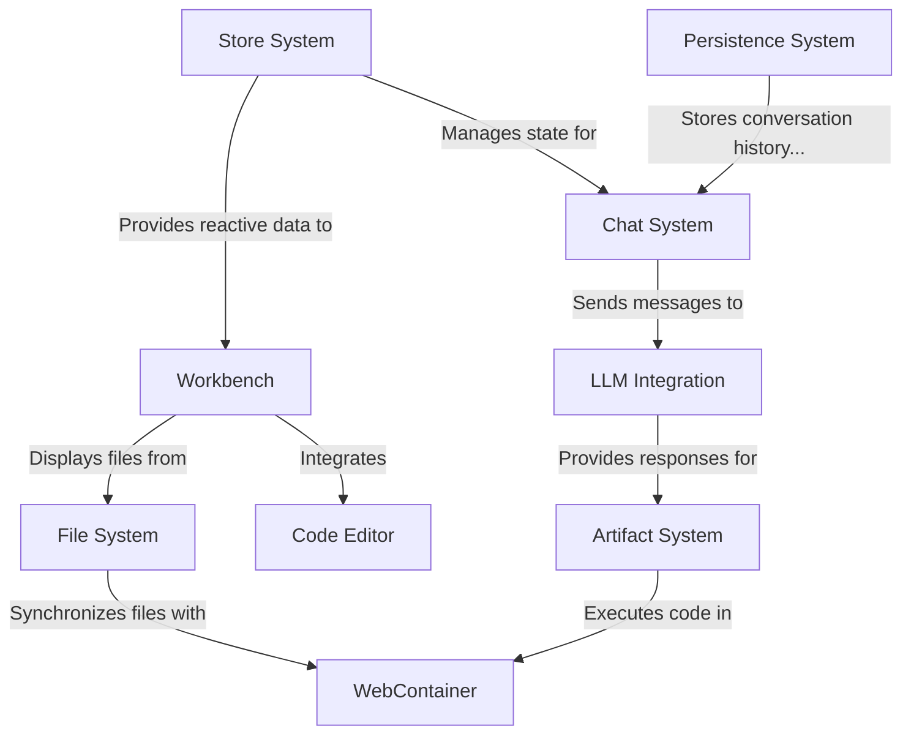

# Tutorial: bolt.new

**Bolt.new** is an AI-powered web development environment that runs *entirely in your browser*. It combines a **chat interface** for communicating with an AI assistant (Claude), a **code editor** for writing and modifying code, a **file system** for managing project files, and a **terminal** for running commands. Users can describe programming needs to the AI, which then generates working code solutions that are automatically transformed into executable components in the **workbench**. No remote servers are needed as everything runs locally in the browser using **WebContainer** technology.

**Source Repository:** [https://github.com/stackblitz/bolt.new](https://github.com/stackblitz/bolt.new)

## Chapters

1. [Workbench
](01_workbench_.md)
2. [Chat System
](02_chat_system_.md)
3. [Code Editor
](03_code_editor_.md)
4. [WebContainer
](04_webcontainer_.md)
5. [File System
](05_file_system_.md)
6. [LLM Integration
](06_llm_integration_.md)
7. [Artifact System
](07_artifact_system_.md)
8. [Store System
](08_store_system_.md)
9. [Persistence System
](09_persistence_system_.md)

---

