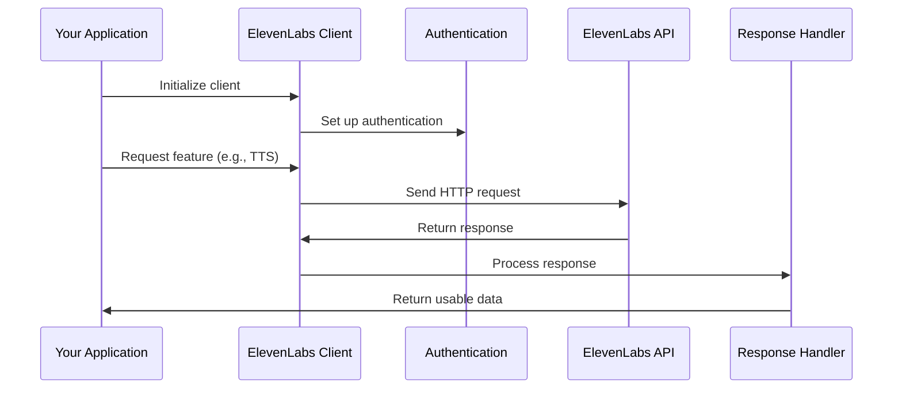

# Chapter 1: ElevenLabs Client

Welcome to the first chapter of our ElevenLabs Python tutorial! In this chapter, we'll introduce you to the ElevenLabs Client - your gateway to creating lifelike AI voices with just a few lines of code.

## What is the ElevenLabs Client?

Imagine you have a universal remote control that can operate your TV, sound system, and smart lights - all from one device. The ElevenLabs Client works in a similar way. It's a single entry point that gives you access to all of ElevenLabs' amazing voice AI features without having to worry about the complex details underneath.

With the ElevenLabs Client, you can:
- Convert text to natural-sounding speech
- Manage and create custom voices
- Work with different voice models
- Process audio files
- And much more!

## Getting Started

Before we dive in, make sure you have the `elevenlabs` package installed:

```bash
pip install elevenlabs
```

### Creating Your First Client

Let's create our first ElevenLabs Client:

```python
from elevenlabs.client import ElevenLabs

# Create a client with default settings
client = ElevenLabs()

# Or with your API key
client = ElevenLabs(api_key="YOUR_API_KEY")
```

That's it! This simple client is now your command center for all ElevenLabs features. If you don't provide an API key, the client will look for it in the `ELEVEN_API_KEY` environment variable or use a limited demo mode.

> **Note**: You can get your API key by signing up at [elevenlabs.io](https://elevenlabs.io) and navigating to your profile settings.

## A Simple Use Case: Text-to-Speech

Let's see the client in action with a simple example - converting text to speech:

```python
from elevenlabs.client import ElevenLabs
from elevenlabs import play

client = ElevenLabs()

# Convert text to speech
audio = client.text_to_speech.convert(
    text="Hello! This is my first AI voice.",
    voice_id="JBFqnCBsd6RMkjVDRZzb",  # Rachel voice
    model_id="eleven_multilingual_v2"
)

# Play the audio
play(audio)
```

This code creates an ElevenLabs Client, uses it to convert text to speech with a specific voice and model, and then plays the resulting audio. The client handles all the communication with the ElevenLabs API for you!

## Exploring Client Components

The ElevenLabs Client provides access to several specialized components:

1. **Text-to-Speech**: Convert written text into spoken audio
2. **Voices**: Manage and create AI voices
3. **Models**: Access different voice generation models
4. **Speech-to-Speech**: Convert one voice to another
5. **And more!**

Each of these components is accessed as a property of the client:

```python
# Access the voices component
voices = client.voices.search()
print(f"You have access to {len(voices.voices)} voices")

# Access the models component
models = client.models.list()
print(f"Available models: {[model.model_id for model in models.models]}")
```

We'll explore each of these components in detail in the upcoming chapters.

## Using Async Client

For applications that need to handle multiple requests efficiently, ElevenLabs provides an async client:

```python
import asyncio
from elevenlabs.client import AsyncElevenLabs

async def generate_speech():
    async_client = AsyncElevenLabs()
    audio = await async_client.text_to_speech.convert(
        text="This is async speech generation",
        voice_id="JBFqnCBsd6RMkjVDRZzb"
    )
    return audio

# Run the async function
audio = asyncio.run(generate_speech())
```

This is particularly useful for web applications or when processing multiple voice generations in parallel.

## How the Client Works Under the Hood

When you use the ElevenLabs Client, here's what happens behind the scenes:



1. **Initialization**: When you create the client, it sets up the authentication and prepares connections to the API.
2. **Request**: When you call a method like `text_to_speech.convert()`, the client formats your request.
3. **API Communication**: The client sends the request to the appropriate ElevenLabs API endpoint.
4. **Response Processing**: The client processes the response (like audio data) and returns it in a usable format.

This entire process is handled for you, so you can focus on creating amazing voice applications rather than managing API details.

## Conclusion

The ElevenLabs Client is your Swiss Army knife for accessing ElevenLabs' voice AI technology. In this chapter, we've learned:

- What the ElevenLabs Client is and why it's useful
- How to initialize the client with or without an API key
- How to use the client for basic text-to-speech conversion
- How the client works behind the scenes

With this foundation, you're ready to explore more specific features in the following chapters. In the next chapter, we'll dive into [Voice Management](02_voice_management_.md) - where you'll learn how to work with existing voices and create your own custom voices.

---

