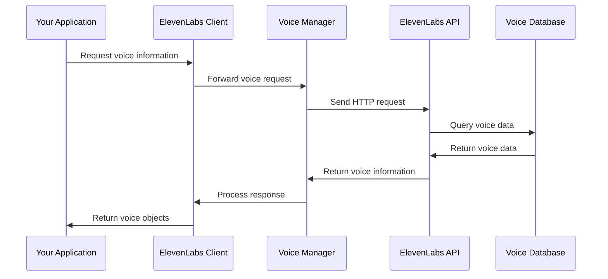
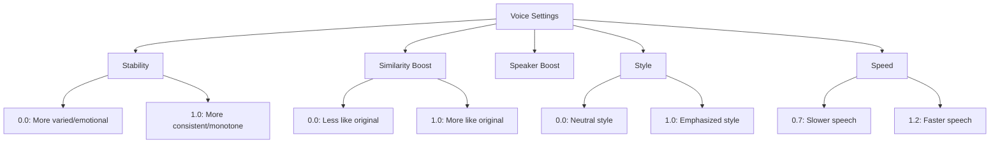

# Chapter 2: Voice Management

In [Chapter 1: ElevenLabs Client](01_elevenlabs_client_.md), we learned how to set up the ElevenLabs client and make our first text-to-speech conversion. Now, let's explore the Voice Management system, which gives you control over the different voices you can use in your projects.

## What is Voice Management?

Imagine you're a movie director casting actors for different roles. Each actor has a unique voice that fits certain characters better than others. ElevenLabs' Voice Management is like your casting director, helping you select, customize, and even create new voices for your audio projects.

With Voice Management, you can:
- Browse available pre-made voices
- Get detailed information about specific voices
- Adjust voice settings like stability and similarity
- Create custom voices by cloning existing ones
- Organize and manage your voice collection

## Getting Started with Voices

Let's start with a simple example: listing all the available voices you can use.

```python
from elevenlabs import ElevenLabs

# Initialize the client
client = ElevenLabs()

# Get all available voices
voices = client.voices.search()

# Print the names of available voices
for voice in voices.voices:
    print(f"Voice: {voice.name} (ID: {voice.voice_id})")
```

This code fetches all voices available to your account and prints their names and IDs. These voices include both the pre-made ones from ElevenLabs and any custom voices you've created.

## Understanding Voice Properties

Each voice in ElevenLabs has several important properties:

1. **Voice ID**: A unique identifier for the voice
2. **Name**: A human-readable name
3. **Description**: Information about the voice's characteristics
4. **Settings**: Customizable parameters that affect how the voice sounds
5. **Samples**: Audio samples showcasing the voice

Let's look at a specific voice's details:

```python
# Get details about a specific voice
voice_id = "21m00Tcm4TlvDq8ikWAM"  # Example voice ID
voice = client.voices.get(voice_id)

# Print voice details
print(f"Name: {voice.name}")
print(f"Description: {voice.description}")
print(f"Category: {voice.category}")
```

This code retrieves detailed information about a specific voice using its ID. The response includes all the properties that define this voice.

## Customizing Voice Settings

One powerful feature of ElevenLabs is the ability to adjust voice settings to get exactly the sound you want. Think of these settings as knobs on a mixing board that control different aspects of the voice.

The main voice settings are:

- **Stability**: Controls how consistent the voice sounds (0.0-1.0)
- **Similarity Boost**: Determines how closely it resembles the original voice (0.0-1.0)
- **Style**: Controls the expressiveness of the voice (0.0-1.0)
- **Speaker Boost**: Enhances the clarity of the voice (True/False)
- **Speed**: Adjusts how quickly the voice speaks (0.7-1.2)

Let's see how to get and update these settings:

```python
# Get current voice settings
voice_id = "21m00Tcm4TlvDq8ikWAM"
settings = client.voices.settings.get(voice_id)
print(f"Current stability: {settings.stability}")

# Update voice settings
from elevenlabs import VoiceSettings

new_settings = VoiceSettings(
    stability=0.8,
    similarity_boost=0.7,
    style=0.5,
    use_speaker_boost=True
)
```

After creating new settings, you can apply them to a voice:

```python
# Apply new settings to the voice
response = client.voices.settings.update(
    voice_id=voice_id,
    request=new_settings
)
print("Voice settings updated successfully!")
```

These settings affect how the voice sounds when generating speech. Let's understand what each setting does:

- Higher **stability** values (closer to 1.0) make the voice more consistent but less expressive
- Higher **similarity_boost** values make the voice sound more like the original
- Higher **style** values enhance the unique style characteristics of the voice
- **Speaker_boost** improves clarity but may increase processing time
- **Speed** controls how fast or slow the speech is generated

## Creating a Custom Voice

Want a voice that's uniquely yours? You can create custom voices by cloning an existing voice and providing samples.

```python
import os
from elevenlabs import Voice, VoiceDesign

# Create a new voice design
voice_design = VoiceDesign(
    name="My Custom Voice",
    text="Hello, this is my custom voice created with ElevenLabs!"
)

# Add sample audio files for cloning
sample_paths = ["sample1.mp3", "sample2.mp3"]
with open(sample_paths[0], "rb") as f:
    sample1 = f.read()
with open(sample_paths[1], "rb") as f:
    sample2 = f.read()
```

Now let's create the voice:

```python
# Create the voice
new_voice = client.voices.create(
    voice_design=voice_design,
    samples=[sample1, sample2]
)

print(f"Created new voice: {new_voice.name} ({new_voice.voice_id})")
```

This code creates a new voice based on the audio samples you provide. ElevenLabs' AI analyzes these samples to create a voice that sounds similar to them. The more high-quality samples you provide, the better the resulting voice will be.

## Managing Your Voice Library

As your collection of voices grows, you'll need to manage them effectively:

```python
# List all your voices
voices = client.voices.search()
my_voices = [v for v in voices.voices if v.category == "cloned"]

# Delete a voice you no longer need
voice_to_delete = "custom_voice_id_here"
client.voices.delete(voice_to_delete)
print(f"Deleted voice: {voice_to_delete}")
```

This code helps you list all your custom voices and delete ones you no longer need. Think of it as cleaning up your voice cast after a project is complete.

## How Voice Management Works Behind the Scenes

When you interact with the Voice Management system, here's what happens:



1. Your application requests voice information from the ElevenLabs client
2. The client forwards the request to the Voice Manager component
3. The Voice Manager sends an HTTP request to the ElevenLabs API
4. The API retrieves voice data from its database
5. The data flows back through the system to your application

The internal code that handles voice operations is organized in several files:

```python
# src/elevenlabs/voices/client.py (simplified)
class VoicesClient:
    def __init__(self, client_wrapper):
        self._raw_client = RawVoicesClient(client_wrapper=client_wrapper)
        self.settings = SettingsClient(client_wrapper=client_wrapper)
    
    def search(self):
        # Get list of all voices
        return self._raw_client.search().data
    
    def get(self, voice_id):
        # Get specific voice details
        return self._raw_client.get(voice_id).data
```

The voice settings component is also structured clearly:

```python
# src/elevenlabs/voices/settings/client.py (simplified)
class SettingsClient:
    def get(self, voice_id):
        # Get voice settings
        return self._raw_client.get(voice_id).data
    
    def update(self, voice_id, request):
        # Update voice settings
        return self._raw_client.update(voice_id, request=request).data
```

These components work together to provide a smooth voice management experience, handling all the complex API interactions for you.

## Voice Settings in Detail

Let's look at the VoiceSettings structure to understand what parameters we can adjust:

```python
# From src/elevenlabs/types/voice_settings.py
class VoiceSettings:
    stability: Optional[float]  # Controls consistency
    similarity_boost: Optional[float]  # Resemblance to original
    use_speaker_boost: Optional[bool]  # Enhances clarity
    style: Optional[float]  # Controls expressiveness 
    speed: Optional[float]  # Controls speaking rate
```

Each of these parameters affects the voice generation in different ways:



Adjusting these settings lets you fine-tune voices for different use cases, like audiobooks, virtual assistants, or character voices for games.

## Practical Examples

Let's look at some practical examples of voice management:

### Example 1: Finding a voice with specific characteristics

```python
# Search for voices with certain criteria
voices = client.voices.search()

# Find a male voice
male_voices = [v for v in voices.voices if "male" in v.labels.get("gender", "")]

# Find a voice with specific accent
british_voices = [v for v in voices.voices 
                 if "british" in v.labels.get("accent", "").lower()]
```

### Example 2: Creating a voice with specific settings

```python
# Create a voice design for an audiobook narrator
audiobook_design = VoiceDesign(
    name="Audiobook Narrator",
    text="Welcome to this audiobook. Let me tell you a story..."
)

# Create the voice and then update its settings
new_voice = client.voices.create(voice_design=audiobook_design, samples=[sample_audio])

# Update to settings ideal for audiobooks
client.voices.settings.update(
    new_voice.voice_id,
    request=VoiceSettings(stability=0.8, similarity_boost=0.7, speed=0.9)
)
```

## Conclusion

In this chapter, we've explored the Voice Management system in ElevenLabs, which allows you to browse, customize, and create AI voices for your projects. We've learned how to:

- List available voices
- Get details about specific voices
- Customize voice settings
- Create new voices by cloning
- Manage your voice library

Voice Management is like having a casting director and sound engineer at your fingertips, giving you the power to find or create the perfect voice for any project.

In the next chapter, [Models Management](03_models_management_.md), we'll explore the different AI models available in ElevenLabs and how to select the right one for your needs.

---

