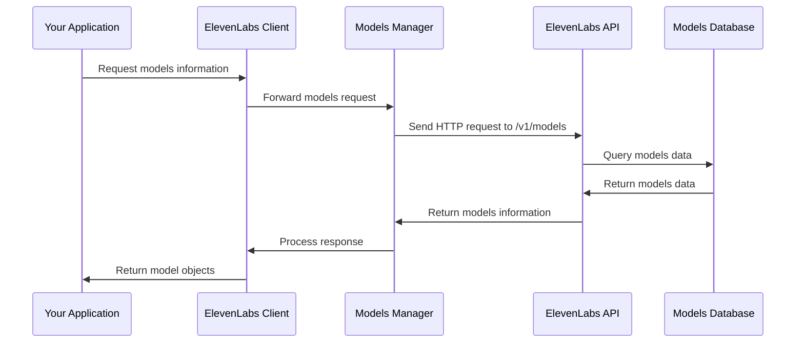

# Chapter 3: Models Management

In [Chapter 2: Voice Management](02_voice_management_.md), we learned how to work with voices in ElevenLabs. Now, let's explore Models Management - the system that lets you choose the right AI engine for your voice generation needs.

## What are Models in ElevenLabs?

Think of voice models like different types of musical instruments. While they all make music, a piano sounds different from a guitar, and each is better suited for certain types of music. Similarly, ElevenLabs offers different AI models that all generate speech, but each has unique characteristics that make it better for specific tasks.

Models in ElevenLabs are the AI engines that power voice generation. Each model has been trained for different purposes and offers different capabilities, quality levels, and language support.

## Why Model Selection Matters

Choosing the right model is crucial because it directly affects:

1. **Voice quality** - Some models produce more natural-sounding voices
2. **Speed** - Certain models generate audio faster than others
3. **Language support** - Different models support different languages
4. **Character limits** - Models have different restrictions on text length
5. **Cost** - More advanced models may use more credits

Let's start exploring models with a simple example:

```python
from elevenlabs import ElevenLabs

# Initialize the client
client = ElevenLabs()

# List all available models
models = client.models.list()

# Print basic information about each model
for model in models:
    print(f"Model: {model.name} (ID: {model.model_id})")
```

This code retrieves all available models and prints their names and IDs. Running this will show you the various models you can use for voice generation.

## Understanding Model Properties

Each model has several important properties that help you understand its capabilities:

```python
# Get the list of models
models = client.models.list()

# Examine the first model in detail
model = models[0]
print(f"Model: {model.name}")
print(f"Description: {model.description}")
print(f"Supports TTS: {model.can_do_text_to_speech}")
print(f"Supports voice conversion: {model.can_do_voice_conversion}")
```

This code examines the details of a specific model. Key properties include:

- **model_id**: The unique identifier for the model
- **name**: The human-readable name
- **description**: Information about what the model does best
- **can_do_text_to_speech**: Whether it can convert text to speech
- **can_do_voice_conversion**: Whether it can convert one voice to another
- **languages**: What languages the model supports

## Choosing the Right Model for Your Needs

Let's look at a simple decision-making process for selecting a model:

```python
# List all models
models = client.models.list()

# Find models that support text-to-speech
tts_models = [m for m in models if m.can_do_text_to_speech]

# Find multilingual models (a common pattern in model names)
multilingual_models = [m for m in tts_models 
                      if "multilingual" in m.model_id.lower()]

# Print the multilingual models
for model in multilingual_models:
    print(f"{model.name}: {model.description}")
```

This code filters the available models to find those that support text-to-speech and are multilingual. This is useful when you need to generate speech in multiple languages.

## Using a Model for Text-to-Speech

Once you've chosen a model, you can use it with the text-to-speech functionality:

```python
# Choose a model ID (replace with an actual model ID from your list)
model_id = "eleven_multilingual_v2"

# Generate speech using the selected model
audio = client.text_to_speech.convert(
    text="Hello, I'm using a specific AI model to speak!",
    voice_id="21m00Tcm4TlvDq8ikWAM",  # Adam voice
    model_id=model_id
)

# Play the audio
from elevenlabs import play
play(audio)
```

This code generates speech using a specific model. By selecting different models, you can get different qualities of speech generation.

## Common Models and Their Use Cases

Here's a quick overview of some common model types you might encounter:

1. **Monolingual models**: Optimized for a single language (usually English)
2. **Multilingual models**: Support multiple languages
3. **Standard models**: Good balance of quality and speed
4. **Enhanced models**: Higher quality but potentially slower or more expensive

Let's create a function to help us find the right model for a given task:

```python
def find_model_for_task(client, multilingual=False, voice_conversion=False):
    """Find an appropriate model based on requirements."""
    models = client.models.list()
    
    # Filter based on requirements
    suitable_models = [m for m in models 
                      if m.can_do_text_to_speech]
    
    if multilingual:
        suitable_models = [m for m in suitable_models 
                          if "multilingual" in m.model_id.lower()]
    
    if voice_conversion:
        suitable_models = [m for m in suitable_models 
                          if m.can_do_voice_conversion]
    
    return suitable_models
```

This helper function allows you to find models that match specific requirements, such as multilingual support or voice conversion capabilities.

## Model Languages and Limits

Different models support different languages and have different character limits:

```python
# Get a specific model (replace with actual model ID)
models = client.models.list()
model = next((m for m in models if m.model_id == "eleven_multilingual_v2"), None)

if model and model.languages:
    print(f"Languages supported by {model.name}:")
    for language in model.languages:
        print(f"- {language.name}")
    
    print(f"\nCharacter limits:")
    print(f"Free users: {model.max_characters_request_free_user}")
    print(f"Subscribed users: {model.max_characters_request_subscribed_user}")
```

This code shows what languages a model supports and what character limits it has for different user types.

## How Models Management Works Behind the Scenes

When you interact with the Models Management system, here's what happens:



1. Your application requests model information from the ElevenLabs client
2. The client forwards the request to the Models Manager component
3. The Models Manager sends an HTTP request to the ElevenLabs API
4. The API retrieves model data from its database
5. The data flows back through the system to your application

The internal code that handles model operations is organized in a simple structure:

```python
# From src/elevenlabs/models/client.py (simplified)
class ModelsClient:
    def __init__(self, *, client_wrapper):
        self._raw_client = RawModelsClient(client_wrapper=client_wrapper)
    
    def list(self, *, request_options=None):
        """Gets a list of available models."""
        _response = self._raw_client.list(request_options=request_options)
        return _response.data
```

The actual model definition is also structured clearly:

```python
# From src/elevenlabs/types/model.py (simplified)
class Model:
    model_id: str  # The unique identifier of the model
    name: Optional[str]  # The name of the model
    can_do_text_to_speech: Optional[bool]  # TTS capability
    can_do_voice_conversion: Optional[bool]  # Voice conversion capability
    languages: Optional[List[LanguageResponse]]  # Supported languages
    # ... other properties
```

These components work together to provide access to the different AI models available in ElevenLabs.

## Advanced Model Selection

As you become more familiar with ElevenLabs, you may want to select models based on more specific criteria:

```python
def find_best_model(client, is_multilingual=False, needs_high_quality=False):
    """Find the best model based on specific needs."""
    models = client.models.list()
    
    # Start with models that can do TTS
    candidates = [m for m in models if m.can_do_text_to_speech]
    
    # Filter by multilingual requirement
    if is_multilingual:
        candidates = [m for m in candidates 
                     if any(hasattr(m, 'languages') and m.languages)]
    
    # If high quality is needed, look for newer or premium models
    # (this is a simplified example - actual criteria would depend on
    # ElevenLabs' specific model naming/versioning)
    if needs_high_quality and candidates:
        # Look for v2 models or those with "enhanced" in the name
        premium = [m for m in candidates 
                  if "v2" in m.model_id or "enhanced" in m.model_id.lower()]
        if premium:
            return premium[0]
    
    # Return the first candidate, or None if no matches
    return candidates[0] if candidates else None
```

This function demonstrates a more sophisticated approach to model selection based on specific quality and language requirements.

## Model Compatibility with Voice Features

Different models support different voice features:

```python
# Check if a model supports style and speaker boost
def check_feature_support(client, model_id):
    models = client.models.list()
    model = next((m for m in models if m.model_id == model_id), None)
    
    if model:
        print(f"Model: {model.name}")
        print(f"Supports style adjustments: {model.can_use_style}")
        print(f"Supports speaker boost: {model.can_use_speaker_boost}")
    else:
        print(f"Model with ID {model_id} not found")
```

This function helps you check if a specific model supports features like style adjustments or speaker boost, which are important for controlling the voice output.

## Practical Example: Selecting a Model for a Multilingual Podcast

Let's say you're creating a podcast that needs to speak in multiple languages:

```python
def setup_multilingual_podcast(client, languages=["English", "Spanish"]):
    """Set up a model suitable for a multilingual podcast."""
    # Get all models
    models = client.models.list()
    
    # Find multilingual models
    multilingual_models = [m for m in models 
                          if hasattr(m, 'languages') and m.languages]
    
    # Check which models support our required languages
    suitable_models = []
    for model in multilingual_models:
        supported_langs = [l.name for l in model.languages]
        if all(lang in supported_langs for lang in languages):
            suitable_models.append(model)
    
    return suitable_models
```

This function helps you find models that support all the languages needed for your multilingual podcast.

## Conclusion

In this chapter, we've explored Models Management in ElevenLabs, which allows you to select the right AI model for your voice generation needs. We've learned how to:

- List available models
- Understand model properties and capabilities
- Select models based on specific requirements
- Use models for text-to-speech generation
- Check model compatibility with different features

Models Management is like having a collection of different instruments at your disposal - each with its own sound and capabilities. By understanding the differences, you can choose the perfect model for each voice generation task.

In the next chapter, [Text-to-Speech Conversion](04_text_to_speech_conversion_.md), we'll explore how to actually generate speech from text using your selected voices and models.

---

