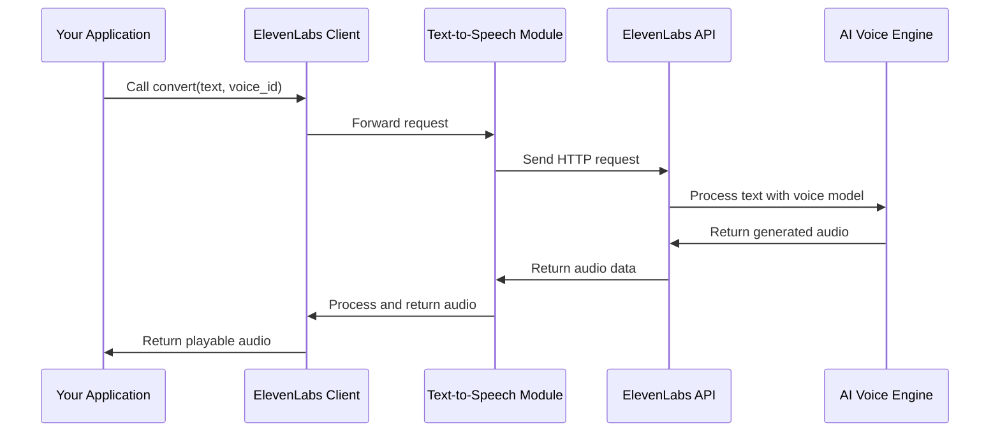

# Chapter 4: Text-to-Speech Conversion

In [Chapter 3: Models Management](03_models_management_.md), we explored the different AI models available in ElevenLabs. Now, let's dive into the core functionality that makes ElevenLabs truly powerful: Text-to-Speech Conversion.

## What is Text-to-Speech Conversion?

Imagine having a friend who can read any text aloud with a natural, human-like voice. That's essentially what text-to-speech (TTS) conversion does. It takes written words and transforms them into spoken language that sounds remarkably human.

Text-to-Speech is like a translator between the written and spoken word. You give it text, and it gives you back audio that speaks that text aloud.

## Getting Started with Basic Text-to-Speech

Let's start with the simplest example of converting text to speech:

```python
from elevenlabs import ElevenLabs, play

# Initialize the client
client = ElevenLabs()

# Convert text to speech
audio = client.text_to_speech.convert(
    text="Hello world! This is my first AI-generated voice.",
    voice_id="21m00Tcm4TlvDq8ikWAM",  # Adam voice
    model_id="eleven_monolingual_v1"
)

# Play the audio
play(audio)
```

In this code, we're using the client's `text_to_speech.convert` method to transform our text into speech. We specify:
- The text we want to convert
- Which voice to use (by its ID)
- Which model to use for the conversion

The result is an audio file that we can play directly using the `play` function.

## Saving Your Audio

Often, you'll want to save your generated speech rather than just play it:

```python
# Convert text to speech
audio = client.text_to_speech.convert(
    text="This audio will be saved to a file.",
    voice_id="21m00Tcm4TlvDq8ikWAM"
)

# Save the audio to a file
with open("my_speech.mp3", "wb") as file:
    file.write(audio)
```

This code saves the generated audio to a file named "my_speech.mp3" that you can share, upload, or use in other applications.

## Customizing Voice Settings

Remember those voice settings we learned about in [Chapter 2: Voice Management](02_voice_management_.md)? We can apply them directly in our text-to-speech conversion:

```python
from elevenlabs import VoiceSettings

# Create custom voice settings
settings = VoiceSettings(
    stability=0.7,           # How consistent the voice sounds
    similarity_boost=0.5,    # How similar to the original voice
    style=0.0,               # Style factor of the voice
    use_speaker_boost=True   # Enhance clarity
)

# Convert text with custom settings
audio = client.text_to_speech.convert(
    text="This voice has custom settings applied.",
    voice_id="21m00Tcm4TlvDq8ikWAM",
    voice_settings=settings
)
```

By adjusting these settings, you can fine-tune how the voice sounds. It's like adjusting the tone and style of a singer to match exactly what you need for your project.

## Working with Longer Text

For longer text, you might notice that the output comes as a generator:

```python
# Convert a longer piece of text
long_text = """This is a longer piece of text that might be 
               broken into chunks during processing. ElevenLabs 
               handles this automatically for you."""

audio_generator = client.text_to_speech.convert(
    text=long_text,
    voice_id="21m00Tcm4TlvDq8ikWAM"
)

# Combine all chunks into one audio file
complete_audio = b"".join(audio_generator)

# Now you can play or save the complete audio
play(complete_audio)
```

The `convert` method returns a generator for longer texts, which allows ElevenLabs to process the text in chunks. We join these chunks together to get our complete audio.

## Streaming Audio for Real-time Applications

Sometimes, you want to start playing audio before the entire conversion is complete – like when creating a virtual assistant that responds immediately. This is where streaming comes in:

```python
import asyncio
from elevenlabs import AsyncElevenLabs

async def stream_speech():
    async_client = AsyncElevenLabs()
    
    # Stream the audio as it's being generated
    audio_stream = async_client.text_to_speech.stream(
        text="This audio will stream piece by piece as it's generated.",
        voice_id="21m00Tcm4TlvDq8ikWAM"
    )
    
    # Process each chunk as it arrives
    audio_data = b""
    async for chunk in audio_stream:
        # In a real app, you might send this chunk to speakers immediately
        audio_data += chunk
        
    return audio_data

# Run the async function
audio = asyncio.run(stream_speech())
```

Streaming is perfect for applications that need to start speaking immediately, like chatbots or virtual assistants.

## Advanced Feature: Timestamps

What if you need to know exactly when each word or character is spoken? ElevenLabs provides timestamps:

```python
# Get speech with precise timing information
result = client.text_to_speech.convert_with_timestamps(
    text="Each word in this sentence has timing information.",
    voice_id="21m00Tcm4TlvDq8ikWAM"
)

# The audio is base64 encoded
import base64
audio_bytes = base64.b64decode(result.audio_base_64)

# Check the timing of the first few characters
for i in range(5):
    start = result.alignment.character_start_times_seconds[i]
    end = result.alignment.character_end_times_seconds[i]
    char = result.text[i]
    print(f"Character '{char}' is spoken from {start:.2f}s to {end:.2f}s")
```

Timestamps are useful for creating animations that sync with speech, highlighting words as they're spoken, or building karaoke-style applications.

## How Text-to-Speech Works Under the Hood

When you call the text-to-speech conversion function, here's what happens behind the scenes:



1. Your application calls the convert method with text and voice ID
2. The client prepares and forwards the request to the Text-to-Speech module
3. The module sends an HTTP request to ElevenLabs' API
4. The API processes your text using the specified voice and model
5. The generated audio is returned through the system to your application

The internal implementation is organized in a clean structure:

```python
# src/elevenlabs/text_to_speech/client.py (simplified)
class TextToSpeechClient:
    def __init__(self, client_wrapper):
        self._raw_client = RawTextToSpeechClient(client_wrapper=client_wrapper)
    
    def convert(self, text, voice_id, model_id=None, voice_settings=None):
        """Converts text to speech using the specified voice."""
        return self._raw_client.convert(
            voice_id=voice_id,
            text=text,
            model_id=model_id,
            voice_settings=voice_settings
        ).data
```

This organized structure makes the code easy to use while hiding the complexity of the API communication.

## Practical Examples

### Example 1: Creating a Simple Audiobook Reader

```python
def create_audiobook_chapter(client, text, filename, voice_id):
    """Convert a chapter of text to an audio file."""
    print(f"Converting chapter to speech...")
    
    # Generate the audio
    audio = client.text_to_speech.convert(
        text=text,
        voice_id=voice_id
    )
    
    # Save to file
    with open(filename, "wb") as f:
        f.write(audio)
    
    print(f"Saved audiobook chapter to {filename}")
```

This function takes a chapter of text and converts it to an audio file, creating a simple audiobook generator.

### Example 2: Interactive Voice Response System

```python
async def respond_to_user(client, user_input, voice_id):
    """Generate a voice response to user input."""
    # Generate response text (in a real app, this might use an AI)
    response_text = f"You said: {user_input}. How can I help you?"
    
    # Stream the response audio
    audio_stream = client.text_to_speech.stream(
        text=response_text,
        voice_id=voice_id
    )
    
    # In a real app, you would stream this to the user's speakers
    print("Speaking response...")
    return audio_stream
```

This example shows how you might build an interactive voice response system that generates audio replies to user input.

## Working with Different Languages

ElevenLabs supports multiple languages through its multilingual models:

```python
# Convert text in different languages
spanish_text = "Hola, ¿cómo estás? Espero que tengas un buen día."
french_text = "Bonjour, comment allez-vous? J'espère que vous passez une bonne journée."

# Use a multilingual model
multilingual_model = "eleven_multilingual_v2"

# Generate Spanish audio
spanish_audio = client.text_to_speech.convert(
    text=spanish_text,
    voice_id="21m00Tcm4TlvDq8ikWAM",
    model_id=multilingual_model
)
```

Make sure to use a multilingual model like "eleven_multilingual_v2" when working with non-English text.

## Optimizing for Your Use Case

Different applications have different needs. Here are some tips:

1. **For real-time applications** (chatbots, assistants): Use streaming with `stream()` method
2. **For pre-recorded content** (audiobooks, videos): Use `convert()` and save the files
3. **For synchronized visuals** (animations, karaoke): Use `convert_with_timestamps()`
4. **For high-quality production**: Use premium models with higher stability settings
5. **For quick prototyping**: Use faster models with default settings

## Conclusion

In this chapter, we've explored Text-to-Speech Conversion - the core functionality that transforms written text into natural-sounding speech. We've learned how to:

- Convert basic text to speech
- Customize voice settings for different sounds
- Stream audio for real-time applications
- Work with timestamps for synchronized applications
- Handle different languages

Text-to-Speech is like a skilled voice actor at your command, ready to speak any text you provide in a variety of voices and styles.

In the next chapter, [Audio Processing](05_audio_processing_.md), we'll learn how to manipulate and enhance the audio files we've generated, exploring features like changing audio formats, adjusting volume, and more.

---

