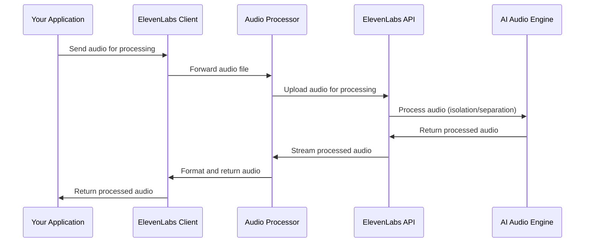

# Chapter 5: Audio Processing

In [Chapter 4: Text-to-Speech Conversion](04_text_to_speech_conversion_.md), we learned how to transform written text into spoken words. Now, let's explore how to work with that audio after it's been generated. Audio Processing in ElevenLabs gives you tools to manipulate, clean up, and analyze audio data - similar to what a sound engineer might do in a recording studio.

## Why Audio Processing Matters

Imagine you've recorded a podcast interview in a noisy café. There's background chatter, clinking cups, and maybe even music playing. Or perhaps you have a recording with multiple speakers and want to isolate each person's voice. This is where audio processing comes in.

With ElevenLabs' audio processing tools, you can:
- Clean up noisy audio recordings
- Separate different speakers in a conversation
- Align text with precise audio timestamps
- Convert audio to different formats

Let's explore these capabilities through practical examples.

## Audio Isolation: Cleaning Up Recordings

One of the most useful audio processing features is audio isolation - removing background noise and enhancing speech. Think of it like noise-canceling headphones, but for your recordings.

Here's how to use it:

```python
from elevenlabs import ElevenLabs, play

# Initialize the client
client = ElevenLabs()

# Open an audio file
with open("noisy_recording.mp3", "rb") as audio_file:
    # Process the audio to isolate speech
    audio_stream = client.audio_isolation.convert(audio=audio_file)
    
    # Combine the chunks into a single audio file
    clean_audio = b"".join(chunk for chunk in audio_stream)

# Now you can play or save the cleaned audio
play(clean_audio)
```

This code takes a noisy audio file, sends it to ElevenLabs' audio isolation service, and gets back a cleaner version where the speech is more prominent and background noise is reduced. It's perfect for improving the quality of recordings made in less-than-ideal environments.

## Streaming Audio Isolation

If you're working with long recordings or want to process audio in real-time, you can use streaming:

```python
# Open an audio file
with open("long_recording.mp3", "rb") as audio_file:
    # Stream the audio processing
    audio_stream = client.audio_isolation.stream(audio=audio_file)
    
    # Process each chunk as it comes
    for chunk in audio_stream:
        # In a real app, you might process each chunk as it arrives
        # For example, playing it immediately or sending it to another service
        pass
```

Streaming is ideal for applications where you want to start processing the audio before the entire file is ready, similar to how streaming video services let you start watching before the whole file downloads.

## Speaker Separation: Who Said What

Another powerful feature is speaker separation - identifying and isolating different speakers in a recording. It's like having the ability to mute or solo different instruments in a song, but for voices in a conversation.

Here's a basic example:

```python
# Start the speaker separation process
response = client.speaker_separation.start(
    voice_id="your_voice_id",
    sample_id="your_sample_id"
)

# Check the status of the separation
status = client.speaker_separation.get(
    voice_id="your_voice_id",
    sample_id="your_sample_id"
)

# Extract speakers once processing is complete
if status.status == "done":
    speakers = status.speakers
```

This code initiates speaker separation on an audio sample, checks its processing status, and then accesses the separated speakers once complete. Each speaker is identified and their speech is isolated, making it easier to transcribe conversations or focus on specific participants.

## Working with Different Audio Formats

Sometimes you need your audio in a specific format for compatibility with other systems. ElevenLabs allows you to convert between different audio formats:

```python
# Generate speech
audio = client.text_to_speech.convert(
    text="This is a test of different audio formats.",
    voice_id="21m00Tcm4TlvDq8ikWAM",
    output_format="mp3"  # Specify the desired format
)

# Or convert existing audio to a different format
with open("audio.wav", "rb") as audio_file:
    mp3_audio = client.audio_converter.convert(
        audio=audio_file,
        output_format="mp3"
    )
```

This ability to switch between formats is like having a universal adapter for different audio systems, ensuring your content works wherever you need it.

## Synchronizing Text with Audio: Timestamps

For applications like captioning videos or creating interactive transcripts, you need to know exactly when each word is spoken. ElevenLabs provides timestamp functionality:

```python
# Generate speech with timestamps
result = client.text_to_speech.convert_with_timestamps(
    text="Each word in this sentence has timing information.",
    voice_id="21m00Tcm4TlvDq8ikWAM"
)

# Access the timing information
for i, word in enumerate(result.alignment.words):
    start = word.start_time
    end = word.end_time
    text = word.text
    print(f"Word '{text}' is spoken from {start:.2f}s to {end:.2f}s")
```

This feature is like having a detailed map of your audio, showing exactly where each word is located in time. It's invaluable for creating synchronized visuals or interactive transcripts.

## How Audio Processing Works Behind the Scenes

When you use ElevenLabs' audio processing features, here's what happens:



1. Your application sends audio data to the ElevenLabs client
2. The client prepares and forwards the request to the appropriate audio processor
3. The processor sends the audio to ElevenLabs' API
4. The API uses AI models to process the audio (cleaning, separating speakers, etc.)
5. The processed audio is returned through the system to your application

The internal implementation is structured in a modular way:

```python
# From src/elevenlabs/audio_isolation/client.py (simplified)
class AudioIsolationClient:
    def __init__(self, client_wrapper):
        self._raw_client = RawAudioIsolationClient(client_wrapper=client_wrapper)
    
    def convert(self, audio, request_options=None):
        """Isolates speech in audio by removing background noise."""
        return self._raw_client.convert(audio=audio, request_options=request_options).data
        
    def stream(self, audio, request_options=None):
        """Streams the isolation process for real-time processing."""
        return self._raw_client.stream(audio=audio, request_options=request_options).data
```

This structure makes it easy to use different audio processing features while hiding the complexity of the API communication.

## Speaker Separation in Detail

Let's look at how speaker separation works in more depth:

```python
# Check the status of a speaker separation job
status = client.speaker_separation.get(
    voice_id="your_voice_id",
    sample_id="your_sample_id"
)

# The response contains information about each speaker
if status.status == "done" and status.speakers:
    # Process each identified speaker
    for speaker_id, speaker in status.speakers.items():
        print(f"Speaker {speaker_id}: {speaker.name if speaker.name else 'Unnamed'}")
        
        # The speaker object contains details like gender, audio samples, etc.
        if speaker.is_selected:
            print("This speaker is selected for the voice")
```

The speaker separation system identifies distinct speakers in an audio recording and provides information about each one, such as their estimated gender, speaking time, and sample audio. This is like having an assistant who can tell you who was speaking when in a meeting recording.

## Practical Example: Creating Subtitles with Timestamps

Let's put everything together in a practical example - creating subtitles for a video:

```python
def create_subtitles(client, script, voice_id, output_file):
    """Generate audio with timestamps and create subtitle file."""
    # Generate speech with timestamps
    result = client.text_to_speech.convert_with_timestamps(
        text=script,
        voice_id=voice_id
    )
    
    # Create subtitle file (SRT format)
    with open(output_file, "w") as f:
        for i, word in enumerate(result.alignment.words):
            f.write(f"{i+1}\n")
            # Format: 00:00:01,500 --> 00:00:02,000
            start = format_time(word.start_time)
            end = format_time(word.end_time)
            f.write(f"{start} --> {end}\n")
            f.write(f"{word.text}\n\n")
```

This function generates speech from a script, gets the timestamp for each word, and creates a subtitle file that can be used with video players. It's like having an automatic captioning service for your videos.

## Audio Processing Best Practices

Here are some tips for getting the best results:

1. **For audio isolation**: Start with the highest quality recording you can make
2. **For speaker separation**: Use recordings where speakers don't talk over each other
3. **For timestamps**: Break long text into logical sentences or paragraphs
4. **For format conversion**: Consider the platform where your audio will be used

## Conclusion

In this chapter, we've explored Audio Processing in ElevenLabs - a set of tools that help you manipulate and analyze audio data. We've learned how to:

- Clean up noisy audio recordings with audio isolation
- Separate different speakers in a conversation
- Work with different audio formats
- Synchronize text with audio using timestamps

These tools give you the power of a sound engineering studio right in your code, making it possible to create professional-quality audio content for a variety of applications.

In the next chapter, [Speech-to-Speech Conversion](06_speech_to_speech_conversion_.md), we'll learn how to transform one voice into another - a powerful capability that opens up even more creative possibilities.

---

