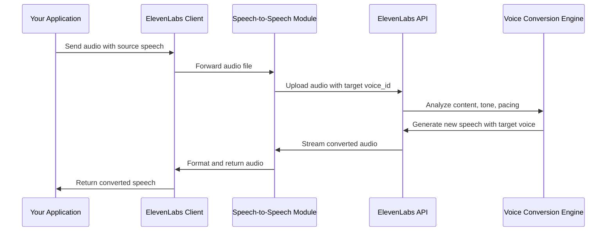

# Chapter 6: Speech-to-Speech Conversion

In [Chapter 5: Audio Processing](05_audio_processing_.md), we learned how to clean up and analyze audio data. Now, let's explore one of the most fascinating features of ElevenLabs: Speech-to-Speech Conversion.

## What is Speech-to-Speech Conversion?

Imagine you have a recording of yourself reading a story, but you want it to sound like it was narrated by a professional voice actor with a British accent. Or perhaps you have an old interview recording and want to preserve the exact words and emotions, but with a clearer, more polished voice. That's exactly what Speech-to-Speech conversion does!

Speech-to-Speech is like a voice transformer that takes existing speech recordings and changes *who* is speaking without changing *what* is being said. It preserves the original content, tone, pacing, and emotional inflections while applying a new voice identity.

## Getting Started with Basic Speech-to-Speech

Let's start with a simple example of converting speech from one voice to another:

```python
from elevenlabs import ElevenLabs, play

# Initialize the client
client = ElevenLabs()

# Open an audio file containing speech
with open("my_recording.mp3", "rb") as audio_file:
    # Convert the speech to a different voice
    audio_stream = client.speech_to_speech.convert(
        audio=audio_file,
        voice_id="21m00Tcm4TlvDq8ikWAM"  # Adam voice
    )
    
    # Combine all chunks into one audio file
    converted_audio = b"".join(chunk for chunk in audio_stream)

# Play the converted audio
play(converted_audio)
```

In this code, we're using the client's `speech_to_speech.convert` method to transform speech in our audio file. We specify which voice we want to convert to using the `voice_id` parameter. The result is an audio stream that we combine into a single audio file and can then play.

## Saving Your Converted Speech

Often, you'll want to save your converted speech rather than just play it:

```python
# Convert speech from one voice to another
with open("original_speech.mp3", "rb") as audio_file:
    audio_stream = client.speech_to_speech.convert(
        audio=audio_file,
        voice_id="AZnzlk1XvdvUeBnXmlld"  # Bella voice
    )
    
    # Combine and save to a file
    converted_audio = b"".join(chunk for chunk in audio_stream)
    
    with open("converted_speech.mp3", "wb") as output_file:
        output_file.write(converted_audio)
```

This code takes our original speech recording, converts it to the "Bella" voice, and saves the result to a new file called "converted_speech.mp3".

## Streaming for Real-time Applications

For longer recordings or real-time applications, you can use streaming to process the audio as it becomes available:

```python
# Stream the conversion process
with open("long_speech.mp3", "rb") as audio_file:
    audio_stream = client.speech_to_speech.stream(
        audio=audio_file,
        voice_id="21m00Tcm4TlvDq8ikWAM"
    )
    
    # Process each chunk as it arrives
    for chunk in audio_stream:
        # In a real app, you might send each chunk to speakers
        # or process it further as it arrives
        pass
```

Streaming is perfect for applications like live presentations or interactive voice changers where you want to start converting and playing the audio before the entire file has been processed.

## Practical Use Case: Converting an Audiobook Narrator

Let's look at a practical example - converting an audiobook from one narrator to another:

```python
def convert_audiobook(client, input_file, output_file, target_voice_id):
    """Convert an audiobook from one voice to another."""
    print(f"Converting audiobook narrator...")
    
    # Open the original audiobook file
    with open(input_file, "rb") as audio_file:
        # Convert to the target voice
        audio_stream = client.speech_to_speech.convert(
            audio=audio_file,
            voice_id=target_voice_id
        )
        
        # Save the converted audiobook
        with open(output_file, "wb") as output_file:
            for chunk in audio_stream:
                output_file.write(chunk)
    
    print(f"Conversion complete! Saved to {output_file}")
```

This function takes an audiobook recording and converts it to a different narrator's voice, preserving all the original pacing, emphasis, and emotional delivery. It's like having a voice actor re-record the entire book without actually needing to do a new recording session.

## How Speech-to-Speech Works Under the Hood

When you use the Speech-to-Speech conversion feature, here's what happens behind the scenes:



1. Your application sends the original speech audio to the ElevenLabs client
2. The client prepares and forwards the request to the Speech-to-Speech module
3. The module sends the audio and target voice ID to ElevenLabs' API
4. The API uses AI to analyze the content, tone, and pacing of the original speech
5. A new version is generated with the target voice, maintaining the original characteristics
6. The converted speech is returned through the system to your application

The internal implementation is organized in a clean structure:

```python
# From src/elevenlabs/speech_to_speech/client.py (simplified)
class SpeechToSpeechClient:
    def __init__(self, client_wrapper):
        self._raw_client = RawSpeechToSpeechClient(client_wrapper=client_wrapper)
    
    def convert(self, voice_id, audio, model_id=None):
        """Converts speech in audio to a different voice."""
        return self._raw_client.convert(
            voice_id=voice_id,
            audio=audio,
            model_id=model_id
        ).data
        
    def stream(self, voice_id, audio, model_id=None):
        """Streams the conversion process for real-time processing."""
        return self._raw_client.stream(
            voice_id=voice_id, 
            audio=audio,
            model_id=model_id
        ).data
```

This structure makes it easy to use the speech-to-speech conversion while hiding the complexity of the API communication.

## Working with Different Models

Just like with [Text-to-Speech Conversion](04_text_to_speech_conversion_.md), you can specify which AI model to use for speech-to-speech conversion:

```python
# Convert speech using a specific model
with open("my_speech.mp3", "rb") as audio_file:
    audio_stream = client.speech_to_speech.convert(
        audio=audio_file,
        voice_id="21m00Tcm4TlvDq8ikWAM",
        model_id="eleven_monolingual_v1"  # Specify model
    )
```

Different models may offer different quality levels, language support, or processing speeds. You can learn more about available models in [Chapter 3: Models Management](03_models_management_.md).

## Advanced Example: Voice Morphing App

Here's how you might create a simple voice morphing application:

```python
def voice_morpher(client, input_file, voices):
    """Convert a speech sample to multiple different voices."""
    results = {}
    
    # Open the original recording
    with open(input_file, "rb") as audio_file:
        audio_data = audio_file.read()
        
        # Convert to each target voice
        for voice_name, voice_id in voices.items():
            print(f"Converting to {voice_name}...")
            
            # Convert to this voice
            with open(input_file, "rb") as audio_file:
                audio_stream = client.speech_to_speech.convert(
                    audio=audio_file,
                    voice_id=voice_id
                )
                
                # Save the result
                converted = b"".join(chunk for chunk in audio_stream)
                results[voice_name] = converted
                
                # Save to file
                with open(f"{voice_name}_version.mp3", "wb") as f:
                    f.write(converted)
    
    return results
```

This function takes a speech recording and converts it to multiple different voices, saving each version to a separate file. It's like having a team of voice actors all record the same lines.

## Tips for Best Results

Here are some tips for getting the best results with Speech-to-Speech conversion:

1. **Start with clear audio**: Higher quality input generally leads to higher quality output
2. **Avoid background noise**: Clean recordings work best (use [Audio Processing](05_audio_processing_.md) if needed)
3. **Choose appropriate voices**: Some voices may work better for certain types of content
4. **Consider the language**: Make sure your target voice supports the language in your recording
5. **Test with short samples**: Before processing long recordings, test with a short clip

## Use Cases for Speech-to-Speech

Speech-to-Speech conversion opens up many creative possibilities:

1. **Content localization**: Convert content to voices that sound natural in different regions
2. **Voice acting**: Create consistent character voices across multiple projects
3. **Accessibility**: Make content available in voices that are easier for certain audiences to understand
4. **Content repurposing**: Update old recordings with new, higher-quality voices
5. **Privacy**: Anonymize a speaker's identity while preserving their message

## Conclusion

In this chapter, we've explored Speech-to-Speech Conversion - a powerful feature that allows you to transform existing speech from one voice to another while preserving the original content, tone, and pacing. We've learned how to:

- Convert speech from one voice to another
- Stream the conversion process for real-time applications
- Apply the technology to practical use cases like audiobooks
- Understand how the conversion works behind the scenes

Speech-to-Speech is like having a voice transformation studio at your fingertips, allowing you to reimagine and repurpose spoken content in creative new ways.

In the next chapter, [Speech-to-Text Conversion](07_speech_to_text_conversion_.md), we'll explore how to turn spoken words into written text - completing the circle of voice technology by enabling the conversion of speech back into text format.

---

