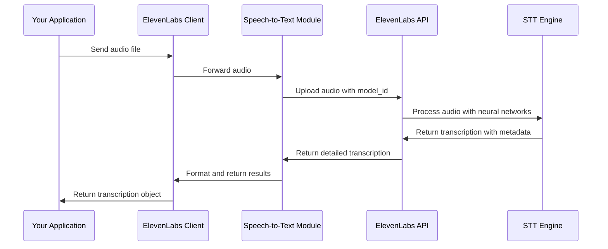

# Chapter 7: Speech-to-Text Conversion

In [Chapter 6: Speech-to-Speech Conversion](06_speech_to_speech_conversion_.md), we learned how to transform speech from one voice to another. Now, let's explore another powerful capability: Speech-to-Text Conversion, which allows us to turn spoken words into written text.

## What is Speech-to-Text Conversion?

Imagine you're in a meeting and want to capture everything being said without frantically typing notes. Or perhaps you have hours of podcast recordings that you need to convert into searchable text. This is where Speech-to-Text (STT) conversion becomes invaluable.

Speech-to-Text is like having a highly skilled transcriptionist who can listen to audio and produce accurate written transcripts, complete with timestamps and speaker identification. It forms the "listening" component of conversational AI systems, allowing computers to understand human speech.

## Getting Started with Basic Speech-to-Text

Let's start with a simple example of converting speech to text:

```python
from elevenlabs import ElevenLabs, play

# Initialize the client
client = ElevenLabs()

# Open an audio file containing speech
with open("my_recording.mp3", "rb") as audio_file:
    # Convert the speech to text
    transcription = client.speech_to_text.convert(
        file=audio_file,
        model_id="scribe_v1"
    )

# Print the transcribed text
print(transcription.text)
```

This code takes an audio file, sends it to ElevenLabs' Speech-to-Text service, and gets back a transcription. The `convert` method handles all the complexity of audio processing and speech recognition, delivering the text content of your recording.

## Understanding the Transcription Result

The transcription result contains more than just the text. It provides detailed information about each word, including when it was spoken:

```python
# Get the first few words with timing information
for word in transcription.words[:5]:
    print(f"Word: '{word.text}'")
    print(f"  Starts at: {word.start} seconds")
    print(f"  Ends at: {word.end} seconds")
    print(f"  Confidence: {word.logprob}")
```

This code shows the timing information for each word. The `start` and `end` values tell you exactly when each word appears in the audio, which is incredibly useful for creating synchronized captions or searching within audio files.

## Working with Multiple Speakers

If your recording has multiple people speaking, ElevenLabs can identify different speakers:

```python
# Group text by speaker
speakers = {}
for word in transcription.words:
    if word.speaker_id not in speakers:
        speakers[word.speaker_id] = []
    speakers[word.speaker_id].append(word.text)

# Print what each speaker said
for speaker_id, words in speakers.items():
    print(f"Speaker {speaker_id}: {' '.join(words)}")
```

This code organizes the transcribed words by speaker, allowing you to see who said what. It's like having a script from a conversation, with each person's lines clearly labeled.

## Processing Different Audio Formats

ElevenLabs' Speech-to-Text works with various audio formats:

```python
# Convert from a URL
transcription = client.speech_to_text.convert(
    url="https://example.com/audio-sample.mp3",
    model_id="scribe_v1"
)

# Or convert from an audio stream
import requests
response = requests.get("https://example.com/audio-stream", stream=True)
transcription = client.speech_to_text.convert(
    file=response.raw,
    model_id="scribe_v1"
)
```

This flexibility means you can work with audio from many different sources - whether it's a local file, a URL, or a streaming audio source.

## Creating a Simple Transcript File

Let's create a practical example - a function that generates a readable transcript from an audio recording:

```python
def create_transcript(client, audio_file_path, output_file_path):
    """Generate a transcript from an audio file."""
    # Convert speech to text
    with open(audio_file_path, "rb") as audio_file:
        transcription = client.speech_to_text.convert(
            file=audio_file,
            model_id="scribe_v1"
        )
    
    # Write the transcript to a file
    with open(output_file_path, "w") as f:
        f.write(transcription.text)
```

This simple function takes an audio file, transcribes it, and saves the text to a file. It's like turning a recorded interview into a written article with just a few lines of code.

## Adding Timestamps for Enhanced Transcripts

For more detailed transcripts, we can include timestamps:

```python
def create_timestamped_transcript(client, audio_file_path, output_file_path):
    """Generate a transcript with timestamps."""
    # Convert speech to text
    with open(audio_file_path, "rb") as audio_file:
        transcription = client.speech_to_text.convert(
            file=audio_file,
            model_id="scribe_v1"
        )
    
    # Write timestamped transcript
    with open(output_file_path, "w") as f:
        for word in transcription.words:
            # Format: [00:00:01.500] Word
            time_str = format_time(word.start)
            f.write(f"[{time_str}] {word.text} ")
```

This enhanced function creates a transcript where each word is preceded by its timestamp. This is particularly useful for finding specific moments in long recordings.

## Building a Simple Dictation Tool

Here's how you could create a basic dictation tool:

```python
def dictation_tool(client, recording_device, duration=10):
    """Record speech and convert to text."""
    # Record audio (simplified example)
    print(f"Recording for {duration} seconds...")
    audio_data = recording_device.record(duration)
    
    # Convert to text
    transcription = client.speech_to_text.convert(
        file=audio_data,
        model_id="scribe_v1"
    )
    
    return transcription.text
```

This function records audio for a specified duration and then converts it to text. It's like having a digital assistant that takes dictation for you.

## How Speech-to-Text Works Under the Hood

When you use the Speech-to-Text conversion feature, here's what happens behind the scenes:



1. Your application sends the audio to the ElevenLabs client
2. The client prepares and forwards the request to the Speech-to-Text module
3. The module sends the audio and model ID to ElevenLabs' API
4. The API uses AI models to process the audio and recognize speech
5. The AI engine generates a detailed transcription with timing and speaker information
6. The transcription is returned through the system to your application

The internal implementation is organized in a clean structure:

```python
# From src/elevenlabs/speech_to_text/client.py (simplified)
class SpeechToTextClient:
    def __init__(self, client_wrapper):
        self._raw_client = RawSpeechToTextClient(client_wrapper=client_wrapper)
    
    def convert(self, file=None, url=None, model_id="scribe_v1"):
        """Converts speech in audio to text."""
        return self._raw_client.convert(
            file=file,
            url=url,
            model_id=model_id
        ).data
```

The transcription result is structured with several levels of detail:

```python
# Simplified structure of transcription response
class Transcription:
    text: str  # The full transcript text
    
    words: List[Word]  # List of words with timing
    
    class Word:
        text: str  # The word text
        start: float  # Start time in seconds
        end: float  # End time in seconds
        speaker_id: str  # ID of the speaker
        characters: List[Character]  # Character-level detail
```

This structured response gives you access to every level of detail you might need, from the full transcript down to individual characters and their timing.

## Practical Applications of Speech-to-Text

Speech-to-Text opens up many possibilities:

1. **Content Creation**: Quickly draft articles or blog posts by speaking instead of typing
2. **Accessibility**: Create captions for videos or transcripts for podcasts
3. **Meeting Documentation**: Automatically generate meeting minutes or transcripts
4. **Voice Search**: Allow users to search through audio content by keywords
5. **Language Learning**: Create text versions of spoken lessons for study

## Working with Different Languages

ElevenLabs' Speech-to-Text can detect and transcribe different languages:

```python
# Transcribe audio in different languages
with open("spanish_audio.mp3", "rb") as audio_file:
    transcription = client.speech_to_text.convert(
        file=audio_file,
        model_id="scribe_v1"  # This model supports multiple languages
    )

# Get the detected language
print(f"Detected language: {transcription.language_code}")
print(f"Confidence: {transcription.language_probability}")
```

The system automatically detects the language being spoken and provides the appropriate transcription, along with a confidence score for the language detection.

## Tips for Best Results

Here are some tips for getting the best results with Speech-to-Text conversion:

1. **Use clear audio**: Higher quality recordings produce more accurate transcriptions
2. **Reduce background noise**: Clean audio leads to better results
3. **Speak clearly**: Well-articulated speech is easier to transcribe
4. **Use appropriate models**: Some models are better suited for certain languages or accents

## Conclusion

In this chapter, we've explored Speech-to-Text Conversion - a powerful feature that turns spoken words into written text with detailed timing and speaker information. We've learned how to:

- Convert audio files to text
- Work with detailed transcription data, including timestamps
- Identify different speakers in a conversation
- Create practical applications like transcripts and dictation tools
- Understand how the transcription process works behind the scenes

Speech-to-Text is like having a tireless assistant who can listen to any amount of audio and produce perfect transcripts, making it easier to work with spoken content in text-based applications.

In the next chapter, [Conversational AI](08_conversational_ai_.md), we'll explore how to combine Speech-to-Text and Text-to-Speech to create interactive conversational experiences - bringing us one step closer to natural human-computer interaction.

---

